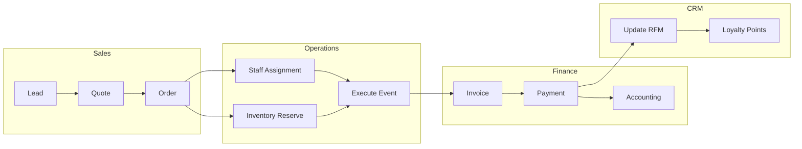
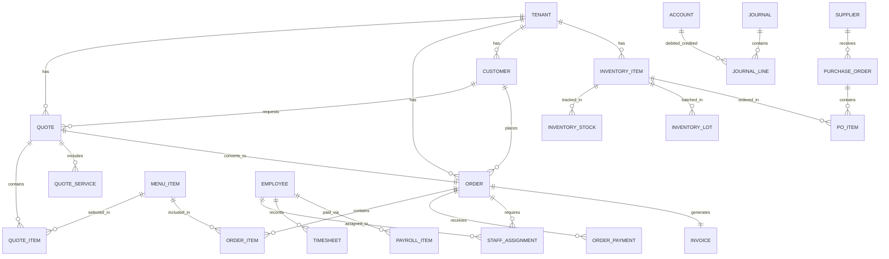
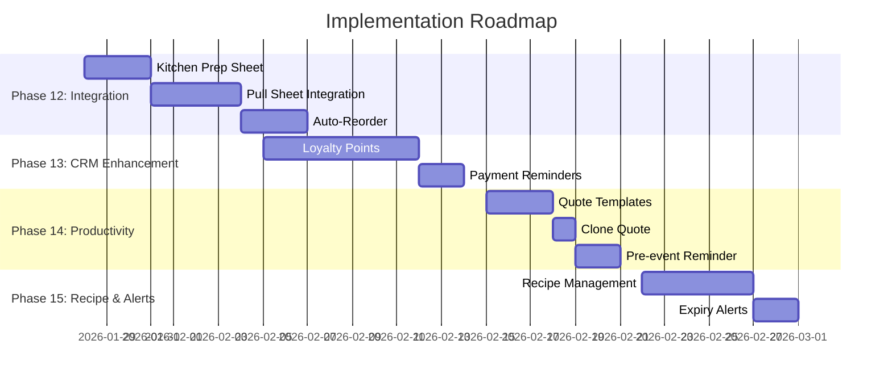

# 📋 MASTER PRD - ẨM THỰC GIÁO TUYẾT

> **Hệ thống Quản lý Dịch vụ Catering cho Tiệc Tại Nhà**
> **Version:** 4.0
> **Updated:** 2026-01-27
> **Author:** AI Business Analyst

---

## 1. EXECUTIVE SUMMARY

### 1.1 Tổng Quan Dự Án

**Ẩm Thực Giáo Tuyết** là hệ thống quản lý catering toàn diện, bao gồm từ báo giá (Quote) → đơn hàng (Order) → thực hiện tiệc → thanh toán (Finance) → chăm sóc khách hàng (CRM).

### 1.2 Tech Stack

| Component | Technology | Version |
|:----------|:-----------|:--------|
| Backend | Python FastAPI | 3.12+ |
| Frontend | Angular | 18+ (Standalone) |
| Database | PostgreSQL | 16+ |
| ORM | SQLAlchemy | 2.0+ (Async) |
| UI Grid | AG Grid Angular | Latest |
| State | RxJS BehaviorSubject | Latest |

### 1.3 Architecture Pattern
- **Modular Monolith** với Clean Architecture
- **Multi-tenant** với Row-Level Security (RLS)
- **Domain-Driven Design** (modules, domain, infrastructure)

---

## 2. MODULE INVENTORY

### 2.1 Core Modules (16 Backend | 17 Frontend)

| # | Module | Backend | Frontend | Entities | Status |
|:-:|:-------|:-------:|:--------:|:--------:|:------:|
| 1 | **Quote** | ✅ | ✅ | 4 | ✅ Production |
| 2 | **Order** | ✅ | ✅ | 4 | ✅ Production |
| 3 | **Menu** | ✅ | ✅ | 3 | ✅ Production |
| 4 | **CRM** | ✅ | ✅ | 2 | ✅ Production |
| 5 | **Inventory** | ✅ | ✅ | 6 | ✅ Production |
| 6 | **Procurement** | ✅ | ✅ | 3 | ✅ Production |
| 7 | **HR** | ✅ | ✅ | 11 | ✅ Production |
| 8 | **Finance** | ✅ | ✅ | 4 | ✅ Production |
| 9 | **Invoice** | ✅ | ✅ | 2 | ✅ Production |
| 10 | **Calendar** | ✅ | ✅ | - | ✅ Production |
| 11 | **Dashboard** | ✅ | ✅ | - | ✅ Production |
| 12 | **Analytics** | ✅ | ✅ | - | ✅ Production |
| 13 | **Settings** | ✅ | ✅ | 1 | ✅ Production |
| 14 | **User** | ✅ | ✅ | 3 | ✅ Production |
| 15 | **Notification** | ✅ | ❌ | - | 🔧 Partial |
| 16 | **Mobile** | ✅ | ❌ | - | 🔧 Partial |

**Total Entities:** 45+

---

## 3. BUSINESS FLOWS

### 3.1 Core Business Flow: Quote-to-Cash



### 3.2 Module Status Flows

#### Quote Status Flow
```
DRAFT → PENDING → APPROVED → CONVERTED (to Order)
                ↘ REJECTED
```

#### Order Status Flow
```
PENDING → CONFIRMED → IN_PROGRESS → COMPLETED → PAID
                                              ↘ CANCELLED
```

#### Purchase Order Status Flow
```
DRAFT → SENT → RECEIVED → PAID
```

#### Invoice Status Flow
```
DRAFT → ISSUED → PAID
              ↘ CANCELLED
```

#### Inventory Lot Status Flow
```
ACTIVE → DEPLETED | EXPIRED | DAMAGED → DISPOSED
```

---

## 4. DATA MODEL

### 4.1 Entity Relationship Overview



### 4.2 Key Entities by Module

| Module | Entities |
|:-------|:---------|
| **Quote** | QuoteModel, QuoteItemModel, QuoteServiceModel, QuoteNotePresetModel |
| **Order** | OrderModel, OrderItemModel, OrderPaymentModel, OrderStaffAssignmentModel |
| **Menu** | Tenant, CategoryModel, MenuItemModel |
| **CRM** | CustomerModel, InteractionLogModel |
| **Inventory** | WarehouseModel, InventoryItemModel, InventoryStockModel, InventoryTransactionModel, InventoryLotModel |
| **Procurement** | SupplierModel, PurchaseOrderModel, PurchaseOrderItemModel |
| **HR** | EmployeeModel, StaffAssignmentModel, TimesheetModel, PayrollPeriodModel, PayrollItemModel, SalaryAdvanceModel, VietnamHolidayModel, LeaveTypeModel, LeaveBalanceModel, LeaveRequestModel |
| **Finance** | AccountModel, JournalModel, JournalLineModel, FinanceTransactionModel |
| **Invoice** | InvoiceModel, InvoiceItemModel |
| **Settings** | TenantSettingModel |

---

## 5. INTEGRATION FLOWS

### 5.1 Quote → Order Integration
```yaml
trigger: Quote.status = APPROVED
action: 
  - Create Order from Quote
  - Copy Quote.items → Order.items
  - Copy Quote.services → Order attributes
  - Set Quote.status = CONVERTED
  - Set Quote.converted_by, converted_at
```

### 5.2 Order → Inventory Integration
```yaml
trigger: Order.status = CONFIRMED
action:
  - For each Order.item:
    - Lookup Recipe (if exists)
    - Calculate ingredients needed
    - Check stock availability
    - Reserve inventory (FIFO from lots)
    - If insufficient: Create Purchase Requisition
```

### 5.3 Order → HR Integration
```yaml
trigger: Order.status = CONFIRMED
action:
  - Calculate staff requirement based on guest_count
  - Create StaffAssignment records
  - Notify assigned staff
  - Track confirmation status
```

### 5.4 Order → Invoice Integration
```yaml
trigger: Order.status = COMPLETED
action:
  - Create Invoice from Order
  - Copy Order.items → Invoice.items
  - Set customer tax info
  - Calculate VAT
```

### 5.5 Payment → Finance Integration
```yaml
trigger: OrderPayment created
action:
  - Update Order.paid_amount
  - Create FinanceTransaction (RECEIPT)
  - Create Journal Entry:
    - Debit: Cash/Bank
    - Credit: Accounts Receivable
  - Update Customer RFM metrics
  - Calculate Loyalty points (if enabled)
```

### 5.6 Procurement → Inventory Integration
```yaml
trigger: PurchaseOrder.status = RECEIVED
action:
  - Create InventoryTransaction (IMPORT)
  - Create InventoryLot with expiry
  - Update stock quantity
  - Update Supplier balance (AP)
```

### 5.7 Payroll → Finance Integration
```yaml
trigger: PayrollPeriod.status = APPROVED
action:
  - Create FinanceTransaction (PAYMENT) for each employee
  - Create Journal Entry:
    - Debit: Salary Expense
    - Credit: Cash/Bank
```

---

## 6. GAP ANALYSIS & ROADMAP

### 6.1 Current Gaps (vs Best Practices)

#### 🔴 HIGH Priority

| ID | Module | Gap | Impact | Effort |
|:---|:-------|:----|:------:|:------:|
| G01 | Order | Kitchen Prep Sheet Generation | High | 2-3 days |
| G02 | Order | Inventory Pull Sheet Integration | High | 3-4 days |
| G03 | Inventory | Auto-Reorder from Low Stock | Medium | 2-3 days |
| G04 | Finance | Payment Reminder System | High | 2 days |
| G05 | CRM | Loyalty Points Module | High | 5-7 days |
| G06 | Quote | Quote Templates | Medium | 2-3 days |

#### 🟡 MEDIUM Priority

| ID | Module | Gap | Impact | Effort |
|:---|:-------|:----|:------:|:------:|
| G07 | Menu | Recipe Management + Ingredients | Medium | 4-5 days |
| G08 | Order | Pre-event Confirmation Reminder | Medium | 1-2 days |
| G09 | Inventory | Expiry Alert System | Medium | 1-2 days |
| G10 | HR | Shift Swap Requests | Low | 2-3 days |
| G11 | Quote | Clone Quote | Low | 1 day |

#### 🟢 LOW Priority (Future)

| ID | Module | Gap |
|:---|:-------|:----|
| G12 | All | Mobile App |
| G13 | Quote | E-signature |
| G14 | Inventory | Barcode Scanning |
| G15 | Finance | Bank Reconciliation |
| G16 | Invoice | E-invoice Integration (VN) |

### 6.2 Implementation Roadmap



---

## 7. USER PERSONAS & STORIES

### 7.1 User Personas

| Persona | Role | Primary Needs |
|:--------|:-----|:--------------|
| **Sales Rep** | Tạo báo giá, follow-up KH | Quote, CRM, Calendar |
| **Operations Manager** | Quản lý đơn hàng, phân công | Order, HR, Inventory |
| **Kitchen Staff** | Chuẩn bị món ăn | Prep Sheets, Menu |
| **Accountant** | Quản lý tài chính | Finance, Invoice, Payments |
| **Owner** | Tổng quan kinh doanh | Dashboard, Analytics, Reports |

### 7.2 Key User Stories

#### Epic: Order-to-Kitchen Integration

**US-OK01: Kitchen Prep Sheet**
```gherkin
AS A Kitchen Manager
I WANT TO generate a prep sheet from confirmed orders
SO THAT kitchen staff knows exactly what to prepare

GIVEN Order DH-2026001 is CONFIRMED
WHEN I click "Generate Prep Sheet"
THEN System creates a document with:
  - All menu items grouped by category
  - Quantities scaled by guest count
  - Special dietary requirements highlighted
  - Prep timeline (T-3h, T-2h, T-1h)
```

**US-OK02: Inventory Pull Sheet**
```gherkin
AS AN Inventory Manager
I WANT TO see what ingredients to pull for an order
SO THAT I can prepare materials before the event

GIVEN Order DH-2026001 is CONFIRMED
WHEN System generates pull sheet
THEN I see:
  - List of ingredients needed
  - Quantities with UoM
  - Lot numbers to pull from (FIFO)
  - Any shortfalls flagged with PO suggestion
```

#### Epic: CRM Loyalty Program

**US-CL01: Points Earning**
```gherkin
AS A Customer
I WANT TO earn loyalty points from my orders
SO THAT I can redeem rewards later

GIVEN I complete an order worth 10,000,000 VND
WHEN Order status = PAID
THEN I receive 1,000 points (1 point per 10,000 VND)
AND My total points balance is updated
```

**US-CL02: Tier Benefits**
```gherkin
AS A Customer
I WANT TO see my loyalty tier and benefits
SO THAT I know what discounts I'm entitled to

GIVEN I have accumulated 2,500 points
WHEN I view my profile
THEN I see:
  - Current Tier: Gold
  - Benefits: 15% discount, Priority booking, Free delivery
  - Points to next tier (Platinum): 500
```

---

## 8. API CONTRACTS SUMMARY

### 8.1 Core Endpoints

| Module | Endpoint | Methods |
|:-------|:---------|:--------|
| Quote | `/api/v1/quotes` | GET, POST, PUT, DELETE |
| Order | `/api/v1/orders` | GET, POST, PUT |
| Order | `/api/v1/orders/{id}/confirm` | POST |
| Order | `/api/v1/orders/{id}/complete` | POST |
| Order | `/api/v1/orders/{id}/payments` | GET, POST, DELETE |
| CRM | `/api/v1/customers` | GET, POST, PUT |
| Inventory | `/api/v1/inventory` | GET, POST, PUT |
| Inventory | `/api/v1/inventory/transactions` | GET, POST |
| Procurement | `/api/v1/suppliers` | GET, POST, PUT |
| Procurement | `/api/v1/purchase-orders` | GET, POST, PUT |
| HR | `/api/v1/employees` | GET, POST, PUT |
| HR | `/api/v1/timesheets` | GET, POST |
| HR | `/api/v1/payroll` | GET, POST |
| Finance | `/api/v1/accounts` | GET, POST |
| Finance | `/api/v1/transactions` | GET, POST |
| Invoice | `/api/v1/invoices` | GET, POST, PUT |

### 8.2 Future Endpoints (Gaps)

| Feature | Endpoint | Description |
|:--------|:---------|:------------|
| Prep Sheet | `/api/v1/orders/{id}/prep-sheet` | Generate kitchen prep sheet |
| Pull Sheet | `/api/v1/orders/{id}/pull-sheet` | Generate inventory pull sheet |
| Loyalty | `/api/v1/loyalty/points` | Get/Add loyalty points |
| Loyalty | `/api/v1/loyalty/tiers` | Get tier information |
| Templates | `/api/v1/quote-templates` | CRUD quote templates |

---

## 9. NON-FUNCTIONAL REQUIREMENTS

### 9.1 Security
- **Multi-tenant RLS**: Every table has `tenant_id`
- **Authentication**: JWT tokens
- **Permission Matrix**: Role-based access control

### 9.2 Performance
- Page load < 2 seconds
- API response < 500ms
- Support 100+ concurrent users

### 9.3 Scalability
- Horizontal scaling via Docker
- Database connection pooling
- Async operations where applicable

### 9.4 Compliance
- **Vietnam Date Format**: dd/MM/yyyy
- **Vietnam Timezone**: Asia/Ho_Chi_Minh (UTC+7)
- **VAT Calculation**: Support inclusive/exclusive VAT

---

## 10. APPENDIX

### 10.1 Related Documents

| Document | Path |
|:---------|:-----|
| Business Flows - Module Inventory | `.agent/business-flows/01-module-inventory.md` |
| Business Flows - Best Practices | `.agent/business-flows/02-best-practices-summary.md` |
| Business Flows - Deep Dive | `.agent/business-flows/03-per-module-deep-dive.md` |
| Business Flows - Integration | `.agent/business-flows/04-integration-flows.md` |
| Permission Matrix | `.agent/permission-matrix.md` |
| API Contracts | `.agent/api-contracts.md` |
| ROADMAP | `.agent/ROADMAP.md` |

### 10.2 Changelog

| Date | Version | Changes |
|:-----|:--------|:--------|
| 2026-01-27 | 4.0 | Added Business Flows, Gap Analysis, Integration Flows |
| 2026-01-18 | 3.0 | Full module analysis, ROADMAP v3.0 |
| 2026-01-17 | 2.0 | AI Workforce System complete |

---

*Generated by AI Business Analyst on 2026-01-27*
