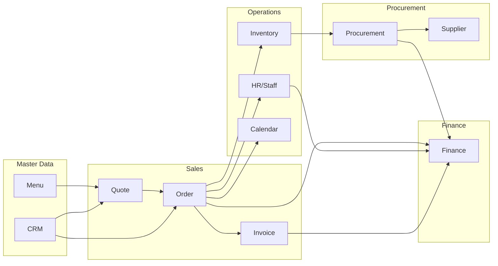

# Phase 1: Module Inventory - Ẩm Thực Giáo Tuyết

> **Generated:** 2026-01-27
> **Total Modules:** 16 Backend | 17 Frontend
> **Total Entities:** 45+

---

## 📊 Module Summary Table

| # | Module | Backend | Frontend | Entities | Status | Description |
|:-:|:-------|:-------:|:--------:|:--------:|:------:|:------------|
| 1 | **Quote** | ✅ | ✅ | 4 | ✅ Production | Báo giá catering |
| 2 | **Order** | ✅ | ✅ | 4 | ✅ Production | Đơn hàng/tiệc |
| 3 | **Menu** | ✅ | ✅ | 3 | ✅ Production | Thực đơn + Categories |
| 4 | **CRM** | ✅ | ✅ | 2 | ✅ Production | Khách hàng + Interaction |
| 5 | **Inventory** | ✅ | ✅ | 6 | ✅ Production | Kho hàng + Lots |
| 6 | **Procurement** | ✅ | ✅ | 3 | ✅ Production | NCC + PO |
| 7 | **HR** | ✅ | ✅ | 11 | ✅ Production | Nhân sự + Payroll + Leave |
| 8 | **Finance** | ✅ | ✅ | 4 | ✅ Production | Kế toán + Thu/Chi |
| 9 | **Invoice** | ✅ | ✅ | 2 | ✅ Production | Hóa đơn VAT |
| 10 | **Calendar** | ✅ | ✅ | - | ✅ Production | Lịch tiệc |
| 11 | **Dashboard** | ✅ | ✅ | - | ✅ Production | Tổng quan |
| 12 | **Analytics** | ✅ | ✅ | - | ✅ Production | Báo cáo phân tích |
| 13 | **Settings** | ✅ | ✅ | 1 | ✅ Production | Cài đặt tenant |
| 14 | **User** | ✅ | ✅ | 3 | ✅ Production | Users + Roles |
| 15 | **Notification** | ✅ | ❌ | - | 🔧 Partial | Thông báo |
| 16 | **Mobile** | ✅ | ❌ | - | 🔧 Partial | Mobile APIs |

---

## 📋 Detailed Module Documentation

---

### 1. QUOTE MODULE (Báo Giá)
**Path:** `backend/modules/quote` | `frontend/src/app/quote`

#### Entities
| Entity | Table | Key Fields | Relationships |
|:-------|:------|:-----------|:--------------|
| **QuoteModel** | `quotes` | code, customer_*, event_*, status, total_amount | → QuoteItem, QuoteService |
| **QuoteItemModel** | `quote_items` | menu_item_id, item_name, quantity, unit_price | → Quote, MenuItem |
| **QuoteServiceModel** | `quote_services` | service_type (FURNITURE, STAFF), quantity | → Quote |
| **QuoteNotePresetModel** | `quote_note_presets` | content | - |

#### Status Flow
```
DRAFT → PENDING → APPROVED → CONVERTED (to Order)
                ↘ REJECTED
```

#### Key Features
- Auto-generate code: `BG-2026XXXX`
- Support VAT calculation (inclusive/exclusive)
- Multiple discount types (furniture, staff, total %)
- Convert to Order with audit trail

---

### 2. ORDER MODULE (Đơn Hàng)
**Path:** `backend/modules/order` | `frontend/src/app/order`

#### Entities
| Entity | Table | Key Fields | Relationships |
|:-------|:------|:-----------|:--------------|
| **OrderModel** | `orders` | code, quote_id, event_*, status, payment tracking | → OrderItem, OrderPayment, StaffAssignment |
| **OrderItemModel** | `order_items` | item_name, category, quantity, price | → Order |
| **OrderPaymentModel** | `order_payments` | amount, payment_method, reference_no | → Order |
| **OrderStaffAssignmentModel** | `order_staff_assignments` | staff_id, role, confirmed | → Order, User |

#### Status Flow
```
PENDING → CONFIRMED → IN_PROGRESS → COMPLETED → PAID
                                              ↘ CANCELLED
```

#### Key Features
- Created from Quote or standalone
- Payment tracking (partial payments)
- Staff assignment with roles (LEAD, SERVER, KITCHEN, DRIVER)
- Status timestamps (confirmed_at, completed_at)

---

### 3. MENU MODULE (Thực Đơn)
**Path:** `backend/modules/menu` | `frontend/src/app/menu`

#### Entities
| Entity | Table | Key Fields | Relationships |
|:-------|:------|:-----------|:--------------|
| **Tenant** | `tenants` | name, code, is_active | → Categories, MenuItems |
| **CategoryModel** | `categories` | name, code, description | → Tenant, MenuItems |
| **MenuItemModel** | `menu_items` | name, description, cost_price, selling_price | → Tenant, Category |

#### Key Features
- Multi-tenant support
- Cost vs Selling price tracking
- Category-based organization
- Image URL support

---

### 4. CRM MODULE (Khách Hàng)
**Path:** `backend/modules/crm` | `frontend/src/app/crm`

#### Entities
| Entity | Table | Key Fields | Relationships |
|:-------|:------|:-----------|:--------------|
| **CustomerModel** | `customers` | full_name, phone, customer_type, RFM stats | → InteractionLogs |
| **InteractionLogModel** | `interaction_logs` | type (CALL, ZALO, MEETING), content, sentiment | → Customer |

#### Key Features
- Customer types: REGULAR, VIP
- RFM metrics (total_spent, order_count, last_order_at)
- Preferences storage (JSONB)
- Interaction history tracking

---

### 5. INVENTORY MODULE (Kho Hàng)
**Path:** `backend/modules/inventory` | `frontend/src/app/inventory`

#### Entities
| Entity | Table | Key Fields | Relationships |
|:-------|:------|:-----------|:--------------|
| **WarehouseModel** | `warehouses` | name, location, is_active | - |
| **InventoryItemModel** | `inventory_items` | sku, name, category, uom, min_stock | → Stock |
| **InventoryStockModel** | `inventory_stock` | item_id, warehouse_id, quantity | → Item |
| **InventoryTransactionModel** | `inventory_transactions` | type, quantity, reference, reversal tracking | - |
| **InventoryLotModel** | `inventory_lots` | lot_number, expiry_date, remaining_quantity | - |

#### Transaction Types
```
IMPORT | EXPORT | ADJUST | REVERSAL
```

#### Key Features
- Multi-warehouse support
- Lot/Batch tracking with expiry
- Transaction reversal capability
- Min stock alerts
- FIFO/LIFO lot consumption

---

### 6. PROCUREMENT MODULE (Mua Hàng)
**Path:** `backend/modules/procurement` | `frontend/src/app/procurement`

#### Entities
| Entity | Table | Key Fields | Relationships |
|:-------|:------|:-----------|:--------------|
| **SupplierModel** | `suppliers` | name, contact_person, phone, balance | → PurchaseOrders |
| **PurchaseOrderModel** | `purchase_orders` | code, supplier_id, status, payment_terms | → Supplier, POItems |
| **PurchaseOrderItemModel** | `purchase_order_items` | item_id, quantity, unit_price | → PO, InventoryItem |

#### Status Flow
```
DRAFT → SENT → RECEIVED → PAID
```

#### Payment Terms
```
IMMEDIATE | NET15 | NET30 | NET60 | NET90
```

#### Key Features
- Supplier balance tracking
- Payment terms management
- Link to inventory items
- Event-based PO (for specific catering events)

---

### 7. HR MODULE (Nhân Sự)
**Path:** `backend/modules/hr` | `frontend/src/app/hr`

#### Entities
| Entity | Table | Key Fields | Relationships |
|:-------|:------|:-----------|:--------------|
| **EmployeeModel** | `employees` | employee_code, full_name, employment_type, salary | → Assignments, Timesheets |
| **StaffAssignmentModel** | `staff_assignments` | employee_id, event_date, role, status | → Employee, Timesheets |
| **TimesheetModel** | `timesheets` | date, check_in, check_out, hours_worked | → Employee, Assignment |
| **PayrollPeriodModel** | `payroll_periods` | month, year, status, totals | → PayrollItems |
| **PayrollItemModel** | `payroll_items` | base_salary, allowances, deductions, net_pay | → Period, Employee |
| **SalaryAdvanceModel** | `salary_advances` | amount, request_date, status | → Employee |
| **VietnamHolidayModel** | `vietnam_holidays` | holiday_date, holiday_name, is_lunar | - |
| **LeaveTypeModel** | `leave_types` | name, max_days_per_year, is_paid | - |
| **LeaveBalanceModel** | `leave_balances` | year, entitled, used, remaining | → Employee, LeaveType |
| **LeaveRequestModel** | `leave_requests` | start_date, end_date, status | → Employee, LeaveType |

#### Employment Types
```
FULL_TIME | PART_TIME | CASUAL
```

#### Role Types
```
LEAD | SERVER | KITCHEN | DRIVER | COORDINATOR
```

#### Key Features
- Staff assignment for events
- Timesheet tracking with overtime
- Payroll calculation (VN tax rules)
- Salary advance management
- Vietnam holidays (lunar calendar support)
- Leave management (annual, sick, personal)

---

### 8. FINANCE MODULE (Tài Chính)
**Path:** `backend/modules/finance` | `frontend/src/app/finance`

#### Entities
| Entity | Table | Key Fields | Relationships |
|:-------|:------|:-----------|:--------------|
| **AccountModel** | `accounts` | code, name, type | → JournalLines |
| **JournalModel** | `journals` | code, date, reference_id/type | → JournalLines |
| **JournalLineModel** | `journal_lines` | account_id, debit, credit | → Journal, Account |
| **FinanceTransactionModel** | `finance_transactions` | type (RECEIPT/PAYMENT), category, amount | → Journal |

#### Account Types
```
ASSET | LIABILITY | EQUITY | REVENUE | EXPENSE
```

#### Transaction Categories
```
ORDER | PROCUREMENT | SALARY | OPERATING
```

#### Key Features
- Double-entry accounting
- Chart of accounts (VN standard)
- Journal entries with references
- Cash receipts & payments
- Link to orders, POs, salaries
- Financial reports (Cashflow, P&L)

---

### 9. INVOICE MODULE (Hóa Đơn)
**Path:** `backend/modules/invoice` | `frontend/src/app/invoice`

#### Entities
| Entity | Table | Key Fields | Relationships |
|:-------|:------|:-----------|:--------------|
| **InvoiceModel** | `invoices` | code, order_id, customer_*, VAT fields | → InvoiceItems |
| **InvoiceItemModel** | `invoice_items` | item_name, quantity, unit_price, vat_rate | → Invoice |

#### Status Flow
```
DRAFT → ISSUED → (CANCELLED)
```

#### Payment Status
```
UNPAID → PARTIAL → PAID
```

#### Key Features
- Generate from Order
- VAT invoice format (VN compliance)
- Customer tax code support
- Payment tracking

---

### 10-16. SUPPORTING MODULES

| Module | Purpose | Key Components |
|:-------|:--------|:---------------|
| **Calendar** | Event calendar view | FullCalendar integration, event aggregation |
| **Dashboard** | KPI overview | Order stats, revenue charts, upcoming events |
| **Analytics** | Business intelligence | Sales reports, customer analytics, trends |
| **Settings** | Configuration | Tenant settings (key-value store) |
| **User** | Authentication | Users, Roles, Permissions |
| **Notification** | Alerts | Real-time notifications |
| **Mobile** | Mobile APIs | Optimized endpoints for mobile |

---

## 🔗 Module Relationships



---

## 📈 Implementation Status

| Phase | Modules | Status |
|:------|:--------|:------:|
| **Phase 1** | Menu, Quote | ✅ Complete |
| **Phase 2** | Order, Calendar | ✅ Complete |
| **Phase 3** | CRM, Inventory | ✅ Complete |
| **Phase 4** | Procurement, Suppliers | ✅ Complete |
| **Phase 5** | HR (Payroll, Leave) | ✅ Complete |
| **Phase 6** | Finance (Accounting) | ✅ Complete |
| **Phase 7** | Invoice | ✅ Complete |
| **Phase 8** | Analytics, Dashboard | ✅ Complete |
| **Future** | Loyalty, Delivery Tracking | 📋 Planned |

---

## 🔜 Next Steps

1. **Phase 2: Batch Research** - Research best practices cho từng domain
2. **Phase 3: Per-Module Deep Dive** - Phân tích chi tiết flows
3. **Phase 4: Integration Flows** - End-to-end business processes
