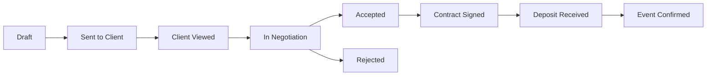
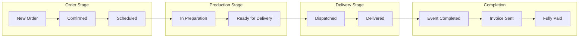
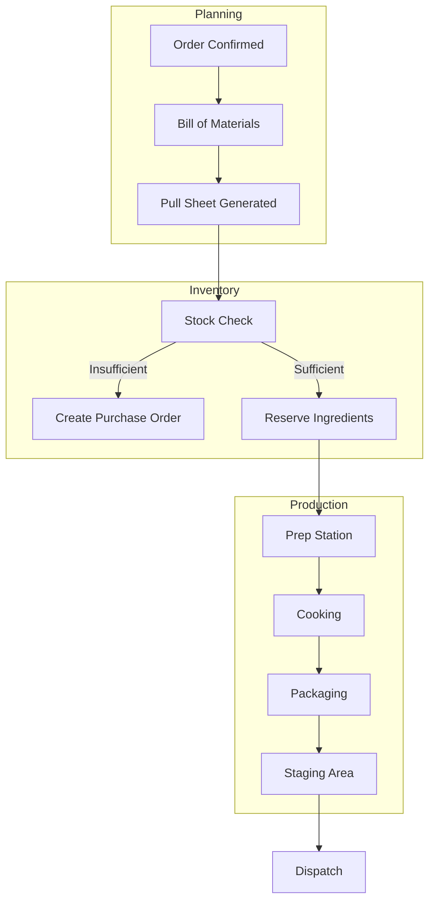
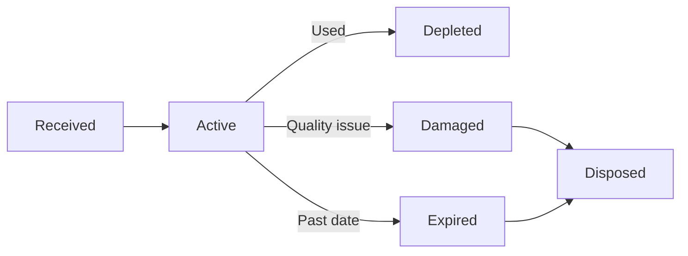
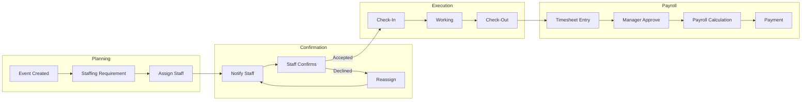
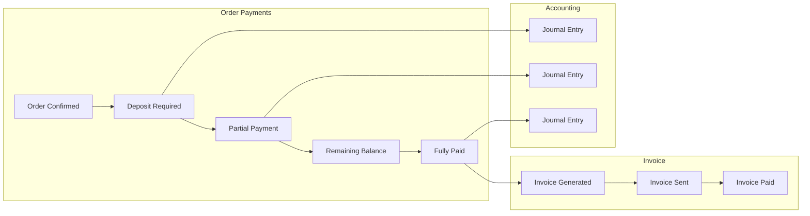
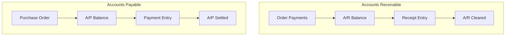
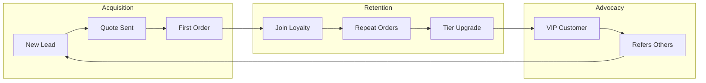

# Phase 2: Best Practices Summary - Catering Industry

> **Generated:** 2026-01-27
> **Sources Analyzed:** 100+ từ 6 search queries
> **Domains Covered:** 7 (Quote, Order, Kitchen, Inventory, HR, Finance, CRM)

---

## 📋 Table of Contents

1. [Quote/Proposal Management](#1-quoteproposal-management)
2. [Order Processing & Fulfillment](#2-order-processing--fulfillment)
3. [Kitchen Production Planning](#3-kitchen-production-planning)
4. [Inventory Management](#4-inventory-management)
5. [HR & Staff Scheduling](#5-hr--staff-scheduling)
6. [Finance & Accounting](#6-finance--accounting)
7. [CRM & Customer Loyalty](#7-crm--customer-loyalty)

---

## 1. Quote/Proposal Management

### Best Practices

| Category | Practice | Priority |
|:---------|:---------|:--------:|
| **Client Discovery** | Thoroughly understand event type, guests, dietary, budget before quoting | ⭐⭐⭐ |
| **Templates** | Use robust templates for different event types (wedding, corporate, etc.) | ⭐⭐⭐ |
| **Standardized Pricing** | Pre-calculate costs for common items, services, packages | ⭐⭐⭐ |
| **Transparent Pricing** | Itemized breakdown with optional add-ons | ⭐⭐⭐ |
| **Personalization** | Tailor proposals to specific client preferences and budget | ⭐⭐ |
| **Visual Appeal** | High-quality images, clean layout, brand colors | ⭐⭐ |
| **Approval Workflow** | Internal review before sending to client | ⭐⭐ |
| **Follow-up** | Prompt follow-up after sending proposal | ⭐⭐⭐ |
| **Guest Count Impact** | Calculate staffing, rentals, food based on guest count | ⭐⭐⭐ |

### Typical Status Flow (Industry Standard)

### Gap Identification (vs Ẩm Thực Giáo Tuyết)
| Best Practice | Current Status | Gap |
|:--------------|:--------------:|:---:|
| Template system | ⚠️ Partial | Add quote templates |
| Proposal tracking (viewed, opened) | ❌ Missing | Add tracking |
| Interactive proposals | ❌ Missing | Not critical |
| Client portal | ❌ Missing | Future phase |
| E-signature | ❌ Missing | Future phase |

---

## 2. Order Processing & Fulfillment

### Best Practices

| Category | Practice | Priority |
|:---------|:---------|:--------:|
| **Standardization** | Standardize menu to simplify prep and reduce errors | ⭐⭐⭐ |
| **Workflow Mapping** | Map entire delivery process to identify bottlenecks | ⭐⭐⭐ |
| **Double-Check System** | Verify orders before finalization | ⭐⭐⭐ |
| **Order Management System** | Digitize order flow from placement to delivery | ⭐⭐⭐ |
| **Production Planning** | Create schedules based on volume, prep time, capacity | ⭐⭐⭐ |
| **Automation** | Auto-send confirmation emails, generate invoices | ⭐⭐ |
| **Route Optimization** | Calculate efficient delivery routes | ⭐⭐ |
| **Real-time Tracking** | Provide customers with delivery updates | ⭐⭐ |
| **Team Training** | Train staff in customer service, food safety | ⭐⭐⭐ |
| **Clear Roles** | Define responsibilities for all event staff | ⭐⭐⭐ |

### Typical Status Flow (Industry Standard)

### Gap Identification
| Best Practice | Current Status | Gap |
|:--------------|:--------------:|:---:|
| Production planning integration | ⚠️ Partial | Add kitchen prep sheets |
| Route optimization | ❌ Missing | Future phase |
| Real-time tracking | ❌ Missing | Future phase |
| BEO generation | ⚠️ Partial | Enhance order detail view |
| Pre-event confirmation | ❌ Missing | Add reminder system |

---

## 3. Kitchen Production Planning

### Best Practices

| Category | Practice | Priority |
|:---------|:---------|:--------:|
| **Recipe Management** | Centralized recipe database with auto-scaling | ⭐⭐⭐ |
| **Inventory Integration** | Cross-check stock vs required ingredients | ⭐⭐⭐ |
| **Batch Production** | Consolidate orders into workplans | ⭐⭐⭐ |
| **Food Costing** | Track ingredient costs and margins | ⭐⭐⭐ |
| **Kitchen Workflow** | Separate zones for prep, cooking, packing, staging | ⭐⭐ |
| **Prep Sheets** | Detailed guides for kitchen staff | ⭐⭐⭐ |
| **Pull Sheets** | List of items to pull from inventory | ⭐⭐⭐ |

### Typical Kitchen Flow

### Gap Identification
| Best Practice | Current Status | Gap |
|:--------------|:--------------:|:---:|
| Recipe scaling | ❌ Missing | Add Recipe module |
| Kitchen prep sheets | ⚠️ Manual | Auto-generate from orders |
| Pull sheets | ❌ Missing | Integration Order → Inventory |
| Production scheduling | ❌ Missing | Add production calendar |
| Food costing | ⚠️ Partial | Enhance with order costing |

---

## 4. Inventory Management

### Best Practices

| Category | Practice | Priority |
|:---------|:---------|:--------:|
| **FIFO Method** | First-In, First-Out for perishables | ⭐⭐⭐ |
| **Lot Tracking** | Unique identifiers for batches | ⭐⭐⭐ |
| **Expiry Management** | Track manufacture/expiry dates | ⭐⭐⭐ |
| **Multi-warehouse** | Manage stock across locations | ⭐⭐ |
| **Reorder Points** | Set minimum stock alerts | ⭐⭐⭐ |
| **Barcode/QR** | Scan-based inventory management | ⭐⭐ |
| **Transaction History** | Full audit trail of movements | ⭐⭐⭐ |
| **Reversal Capability** | Ability to reverse erroneous transactions | ⭐⭐ |
| **Regular Audits** | Weekly/monthly stock counts | ⭐⭐⭐ |

### Lot Status Flow

### Gap Identification
| Best Practice | Current Status | Gap |
|:--------------|:--------------:|:---:|
| FIFO consumption | ✅ Implemented | - |
| Lot tracking | ✅ Implemented | - |
| Expiry alerts | ⚠️ Partial | Add notification system |
| Barcode scanning | ❌ Missing | Future phase |
| Auto-reorder | ❌ Missing | Integration with Procurement |
| Waste tracking | ❌ Missing | Add waste reason codes |

---

## 5. HR & Staff Scheduling

### Best Practices

| Category | Practice | Priority |
|:---------|:---------|:--------:|
| **Real-time Availability** | Staff update availability dynamically | ⭐⭐⭐ |
| **Advance Planning** | Create schedules well ahead for known events | ⭐⭐⭐ |
| **Cross-training** | Train staff in multiple roles | ⭐⭐ |
| **Event-based Scheduling** | Link staffing to specific events | ⭐⭐⭐ |
| **Shift Swaps** | Allow manager-approved swaps | ⭐⭐ |
| **Mobile Access** | Staff view schedules on mobile | ⭐⭐⭐ |
| **Labor Cost Tracking** | Track costs per event | ⭐⭐⭐ |
| **Payroll Compliance** | Adhere to labor laws, overtime rules | ⭐⭐⭐ |
| **Automated Wage Calculation** | Include overtime, deductions | ⭐⭐⭐ |
| **Timesheet Integration** | Link timesheets to payroll | ⭐⭐⭐ |

### Staff Assignment Flow

### Gap Identification
| Best Practice | Current Status | Gap |
|:--------------|:--------------:|:---:|
| Event-based scheduling | ✅ Implemented | - |
| Staff confirmation | ✅ Implemented | - |
| Timesheet tracking | ✅ Implemented | - |
| Payroll calculation | ✅ Implemented | - |
| Mobile app | ❌ Missing | Future phase |
| Shift swap requests | ❌ Missing | Add feature |
| Real-time availability | ⚠️ Partial | Enhance UI |

---

## 6. Finance & Accounting

### Best Practices

| Category | Practice | Priority |
|:---------|:---------|:--------:|
| **Cash Flow Monitoring** | Track all money in/out | ⭐⭐⭐ |
| **Professional Invoices** | Clear, detailed, timely invoices | ⭐⭐⭐ |
| **Automated Reminders** | Send payment reminders before/after due date | ⭐⭐⭐ |
| **Flexible Payment Options** | Offer multiple payment methods | ⭐⭐ |
| **Deposits** | Require 30-50% deposit before events | ⭐⭐⭐ |
| **AR Aging Reports** | Track overdue accounts | ⭐⭐⭐ |
| **Double-entry Accounting** | Proper debit/credit entries | ⭐⭐⭐ |
| **Payment Tracking** | Track partial payments | ⭐⭐⭐ |
| **Financial Reports** | Cash flow, P&L, Balance Sheet | ⭐⭐⭐ |

### Payment Tracking Flow

### AP/AR Flow

### Gap Identification
| Best Practice | Current Status | Gap |
|:--------------|:--------------:|:---:|
| Double-entry accounting | ✅ Implemented | - |
| Payment tracking | ✅ Implemented | - |
| Invoice generation | ✅ Implemented | - |
| AR aging | ✅ Implemented | - |
| AP (supplier payables) | ✅ Implemented | - |
| Payment reminders | ❌ Missing | Add notification system |
| Cash flow forecast | ⚠️ Partial | Enhance reports |
| Bank reconciliation | ❌ Missing | Future phase |

---

## 7. CRM & Customer Loyalty

### Best Practices

| Category | Practice | Priority |
|:---------|:---------|:--------:|
| **Customer Profiles** | Comprehensive profile with preferences | ⭐⭐⭐ |
| **Interaction History** | Track all touchpoints | ⭐⭐⭐ |
| **RFM Analytics** | Recency, Frequency, Monetary analysis | ⭐⭐⭐ |
| **Segmentation** | Segment by value, behavior | ⭐⭐⭐ |
| **Points System** | Points per spend, redeemable rewards | ⭐⭐⭐ |
| **Tiered Rewards** | Bronze → Silver → Gold → VIP | ⭐⭐ |
| **Personalized Offers** | Based on order history | ⭐⭐⭐ |
| **Order Placer Recognition** | Reward the person who places orders | ⭐⭐⭐ |
| **First-Order Bonus** | Free item instead of discount | ⭐⭐ |
| **Referral Program** | Reward referrals | ⭐⭐ |

### Customer Journey Flow

### Gap Identification
| Best Practice | Current Status | Gap |
|:--------------|:--------------:|:---:|
| Customer profiles | ✅ Implemented | - |
| Interaction history | ✅ Implemented | - |
| RFM metrics | ✅ Implemented | - |
| Loyalty points | ❌ Missing | Add Loyalty module |
| Tiered rewards | ❌ Missing | Add Loyalty module |
| Referral program | ❌ Missing | Future phase |
| Personalized offers | ❌ Missing | Integration with marketing |

---

## 📊 Gap Analysis Summary

### High Priority Gaps (⭐⭐⭐)

| Domain | Gap | Impact | Effort |
|:-------|:----|:------:|:------:|
| **Quote** | Quote templates | Medium | Low |
| **Kitchen** | Prep sheets from orders | High | Medium |
| **Kitchen** | Pull sheets integration | High | Medium |
| **Inventory** | Expiry notifications | Medium | Low |
| **Finance** | Payment reminders | High | Low |
| **CRM** | Loyalty program | High | High |

### Medium Priority Gaps (⭐⭐)

| Domain | Gap | Impact | Effort |
|:-------|:----|:------:|:------:|
| **Quote** | Proposal tracking (viewed) | Low | Medium |
| **Order** | Pre-event confirmation | Medium | Low |
| **HR** | Shift swap requests | Low | Medium |
| **Finance** | Cash flow forecast | Medium | Medium |

### Low Priority/Future (⭐)

| Domain | Gap | Notes |
|:-------|:----|:------|
| All | Mobile app | Phase 3+ |
| Quote | E-signature | Phase 3+ |
| Order | Route optimization | Phase 3+ |
| Inventory | Barcode scanning | Hardware required |
| Finance | Bank reconciliation | Phase 3+ |

---

## 🔜 Next Steps

1. **Phase 3: Per-Module Deep Dive** - Phân tích chi tiết từng module
2. **Phase 4: Integration Flows** - End-to-end business processes
3. **Gap Prioritization** - Lập roadmap để close gaps
