# Phase 3: Per-Module Deep Dive - Business Flows

> **Generated:** 2026-01-27
> **Project:** Ẩm Thực Giáo Tuyết - Catering Management System
> **Methodology:** As-Is Analysis → Gap → To-Be Design → User Stories

---

## 📋 Table of Contents

1. [Quote Module](#1-quote-module-báo-giá)
2. [Order Module](#2-order-module-đơn-hàng)
3. [Menu Module](#3-menu-module-thực-đơn)
4. [CRM Module](#4-crm-module-khách-hàng)
5. [Inventory Module](#5-inventory-module-kho-hàng)
6. [Procurement Module](#6-procurement-module-mua-hàng)
7. [HR Module](#7-hr-module-nhân-sự)
8. [Finance Module](#8-finance-module-tài-chính)
9. [Invoice Module](#9-invoice-module-hóa-đơn)

---

## 1. Quote Module (Báo Giá)

### 1.1 Current Flow (As-Is)

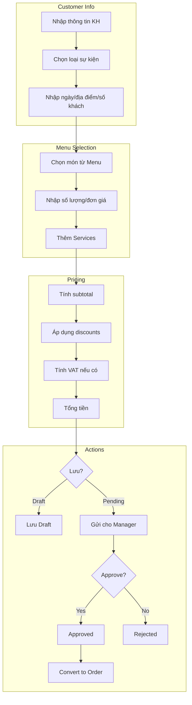

### 1.2 Entities & Fields Analysis

| Entity | Key Fields | Status |
|:-------|:-----------|:------:|
| **QuoteModel** | code, customer_*, event_*, items[], services[], discounts, VAT, status | ✅ |
| **QuoteItemModel** | menu_item_id, item_name, quantity, unit_price, total_price | ✅ |
| **QuoteServiceModel** | service_type, service_name, quantity, unit_price | ✅ |
| **QuoteNotePresetModel** | content (ghi chú mẫu) | ✅ |

### 1.3 Status Transitions (Current)

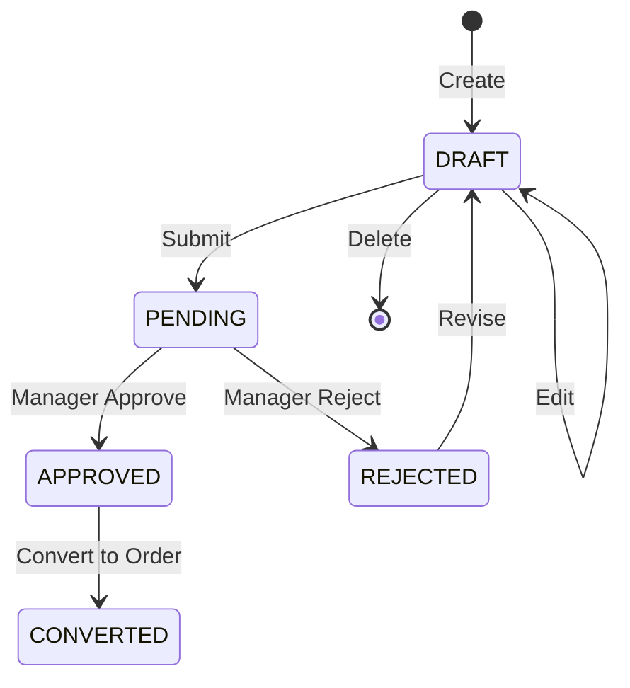

### 1.4 Gap Analysis

| Best Practice | Current | Gap | Priority |
|:--------------|:-------:|:---:|:--------:|
| Quote Templates | ❌ | Cần templates cho các loại event | 🔴 HIGH |
| Proposal Tracking (viewed/opened) | ❌ | Không track khi KH xem | 🟡 MED |
| Expiring Quote Alerts | ✅ | Có valid_until + notification | ✅ |
| Clone Quote | ❌ | Không thể clone báo giá cũ | 🟡 MED |
| Version History | ❌ | Không lưu version history | 🟢 LOW |
| E-signature | ❌ | Chưa có | 🟢 LOW |
| PDF Export | ✅ | Có print/PDF view | ✅ |

### 1.5 Enhanced Flow (To-Be)

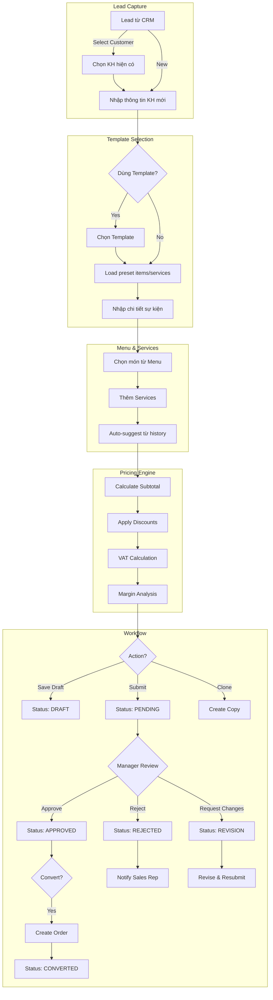

### 1.6 User Stories

#### US-Q01: Quote Templates
```gherkin
GIVEN Tôi là Sales
WHEN Tôi tạo báo giá mới cho sự kiện "Tiệc cưới"
THEN Hệ thống gợi ý template "Wedding Standard" với:
  - Preset menu items (Khai vị, Món chính, Tráng miệng)
  - Preset services (Bàn ghế 10 bàn, Nhân viên 5 người)
  - Suggested pricing
```

#### US-Q02: Clone Quote
```gherkin
GIVEN Tôi có báo giá BG-2026001 đã approved
WHEN Tôi click "Clone"
THEN Hệ thống tạo báo giá mới với:
  - Tất cả items/services copy từ báo giá gốc
  - Status = DRAFT
  - New code
  - Customer info cleared
```

#### US-Q03: Quote Expiry Alert
```gherkin
GIVEN Báo giá BG-2026001 có valid_until = 3 ngày nữa
WHEN Mỗi ngày hệ thống check
THEN Hiển thị notification cho Sales về báo giá sắp hết hạn
```

---

## 2. Order Module (Đơn Hàng)

### 2.1 Current Flow (As-Is)

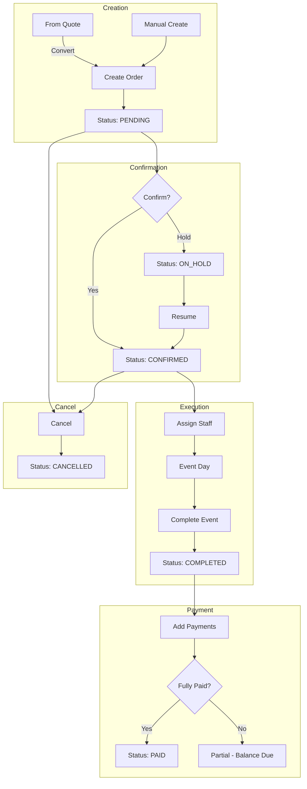

### 2.2 Status Transitions (Current)

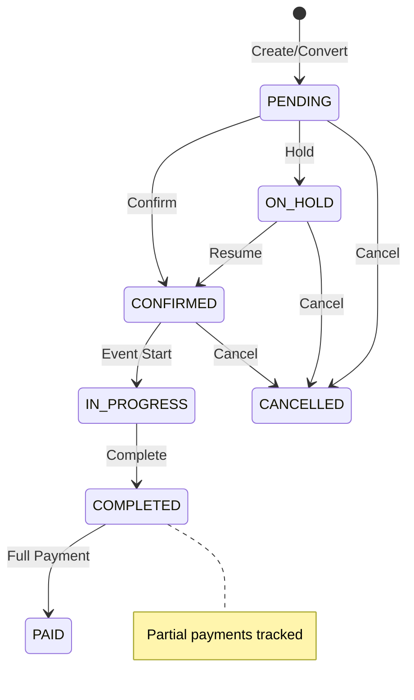

### 2.3 Gap Analysis

| Best Practice | Current | Gap | Priority |
|:--------------|:-------:|:---:|:--------:|
| Production Planning Integration | ❌ | Không link với kitchen | 🔴 HIGH |
| Prep Sheets Generation | ❌ | Không auto-gen | 🔴 HIGH |
| Pull Sheets (Inventory) | ❌ | Không link với inventory | 🔴 HIGH |
| Staff Assignment | ✅ | Có phân công nhân viên | ✅ |
| Payment Tracking | ✅ | Có track partial payments | ✅ |
| Pre-event Confirmation | ❌ | Không có reminder | 🟡 MED |
| BEO (Banquet Event Order) | ⚠️ | Order detail view, chưa format | 🟡 MED |
| Route/Delivery | ❌ | Chưa có | 🟢 LOW |

### 2.4 Enhanced Flow (To-Be)

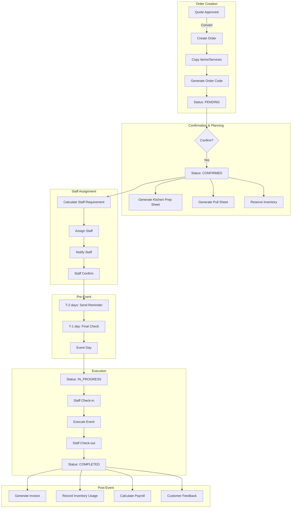

### 2.5 User Stories

#### US-O01: Kitchen Prep Sheet
```gherkin
GIVEN Order DH-2026001 được confirmed
WHEN Manager click "Generate Prep Sheet"
THEN Hệ thống tạo document bao gồm:
  - List tất cả món cần chuẩn bị
  - Số lượng theo số khách
  - Thời gian event
  - Special requests/dietary notes
```

#### US-O02: Inventory Pull Sheet
```gherkin
GIVEN Order DH-2026001 được confirmed
WHEN Hệ thống generate pull sheet
THEN Tạo list nguyên liệu cần lấy từ kho:
  - Item name + quantity needed
  - Warehouse location
  - Lot number (FIFO order)
  - Check if sufficient stock
```

#### US-O03: Pre-Event Reminder
```gherkin
GIVEN Order DH-2026001 có event_date = 2 ngày nữa
WHEN Hệ thống chạy daily job
THEN Gửi notification cho:
  - Customer: Confirm sự kiện
  - Assigned staff: Reminder về ca làm
  - Kitchen: Reminder về prep schedule
```

---

## 3. Menu Module (Thực Đơn)

### 3.1 Current Flow (As-Is)

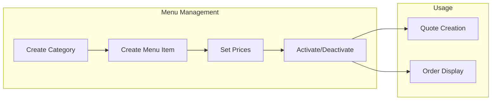

### 3.2 Gap Analysis

| Best Practice | Current | Gap | Priority |
|:--------------|:-------:|:---:|:--------:|
| Recipe Management | ❌ | Không có công thức | 🔴 HIGH |
| Ingredient Linking | ❌ | Không link với inventory | 🔴 HIGH |
| Cost Calculation | ⚠️ | Có cost_price nhưng manual | 🟡 MED |
| Portion Scaling | ❌ | Không auto-scale | 🟡 MED |
| Allergen Tracking | ❌ | Không track | 🟡 MED |
| Photo Gallery | ⚠️ | Có image_url, 1 ảnh | 🟢 LOW |

### 3.3 Enhanced Flow (To-Be)

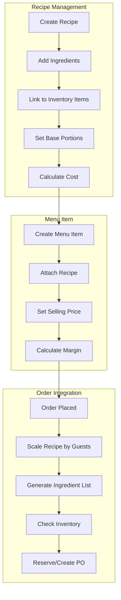

### 3.4 User Stories

#### US-M01: Recipe with Ingredients
```gherkin
GIVEN Tôi tạo món "Gỏi cuốn"
WHEN Tôi thêm công thức
THEN Có thể nhập:
  - Nguyên liệu: Bánh tráng (100g), Tôm (200g), Rau (50g)
  - Link mỗi nguyên liệu với Inventory Item
  - Tự động tính cost từ giá nguyên liệu
```

---

## 4. CRM Module (Khách Hàng)

### 4.1 Current Flow (As-Is)

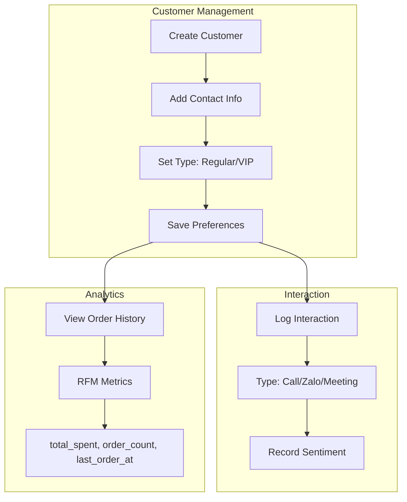

### 4.2 Gap Analysis

| Best Practice | Current | Gap | Priority |
|:--------------|:-------:|:---:|:--------:|
| Customer Profiles | ✅ | Có full profile | ✅ |
| Interaction History | ✅ | Có logging | ✅ |
| RFM Analytics | ✅ | Có metrics | ✅ |
| Loyalty Points | ❌ | Chưa có | 🔴 HIGH |
| Tiered Rewards | ❌ | Chưa có | 🔴 HIGH |
| Referral Program | ❌ | Chưa có | 🟡 MED |
| Birthday Alerts | ❌ | Không có | 🟡 MED |
| Retention Campaigns | ⚠️ | Có retention page | 🟡 MED |

### 4.3 Enhanced Flow (To-Be) - Loyalty Integration

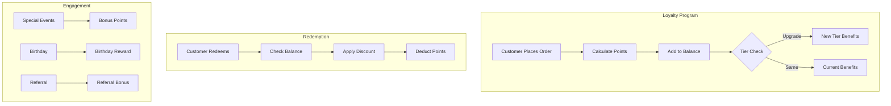

### 4.4 User Stories

#### US-C01: Loyalty Points Earning
```gherkin
GIVEN Customer "Anh Minh" hoàn thành đơn hàng 10,000,000 VND
WHEN Order status = PAID
THEN Hệ thống:
  - Tính points: 10,000,000 / 10,000 = 1,000 points
  - Cộng vào balance của customer
  - Check tier upgrade
```

#### US-C02: Tier Upgrade
```gherkin
GIVEN Customer "Anh Minh" có 2,500 points
WHEN Total points >= 2,000 (Gold threshold)
THEN Hệ thống:
  - Upgrade tier từ Silver → Gold
  - Notify customer về benefits mới
  - Apply Gold discount (15%) cho orders sau
```

---

## 5. Inventory Module (Kho Hàng)

### 5.1 Current Flow (As-Is)

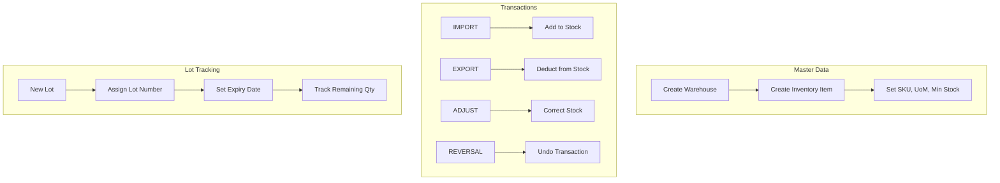

### 5.2 Status Transitions (Lot)

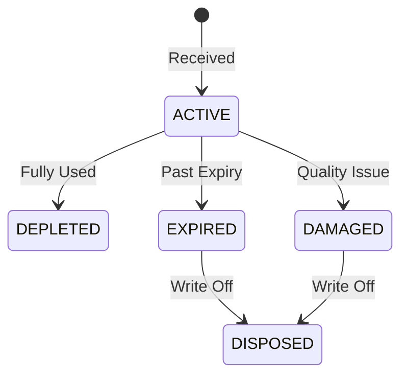

### 5.3 Gap Analysis

| Best Practice | Current | Gap | Priority |
|:--------------|:-------:|:---:|:--------:|
| FIFO Consumption | ✅ | Có lot tracking | ✅ |
| Lot/Batch Tracking | ✅ | Có | ✅ |
| Expiry Management | ⚠️ | Có date, không alert | 🟡 MED |
| Multi-warehouse | ✅ | Có | ✅ |
| Transaction Reversal | ✅ | Có | ✅ |
| Auto Reorder | ❌ | Chưa có | 🔴 HIGH |
| Recipe Integration | ❌ | Không link menu | 🔴 HIGH |
| Barcode/QR | ❌ | Chưa có | 🟢 LOW |
| Waste Tracking | ❌ | Không có reason codes | 🟡 MED |

### 5.4 Enhanced Flow (To-Be)

```mermaid
flowchart TD
    subgraph Order → Inventory Link
        A[Order Confirmed] --> B[Get Menu Items]
        B --> C[Lookup Recipes]
        C --> D[Calculate Ingredients Needed]
        D --> E{Stock Check}
        E -->|Sufficient| F[Reserve Stock]
        E -->|Insufficient| G[Create Purchase Requisition]
    end
    
    subgraph FIFO Consumption
        F --> H[Get Lots by Expiry ASC]
        H --> I[Consume from Oldest]
        I --> J[Update Lot Remaining]
        J --> K{Lot Depleted?}
        K -->|Yes| L[Status: DEPLETED]
        K -->|No| M[Continue]
    end
    
    subgraph Auto Reorder
        N[Daily Job] --> O[Check Stock vs Min]
        O -->|Below Min| P[Create PR]
        P --> Q[Notify Procurement]
    end
    
    subgraph Expiry Alerts
        R[Daily Job] --> S[Check Expiry Dates]
        S -->|Within 7 days| T[Alert: Expiring Soon]
        S -->|Past Expiry| U[Alert: Expired - Action Required]
    end
```

### 5.5 User Stories

#### US-I01: Order-Based Inventory Reservation
```gherkin
GIVEN Order DH-2026001 confirmed với 10 bàn khách
WHEN Hệ thống process order
THEN Với mỗi món trong order:
  - Lookup recipe ingredients
  - Scale by number of guests
  - Reserve inventory từ oldest lots (FIFO)
  - Mark reserved qty on lots
```

#### US-I02: Expiry Alert
```gherkin
GIVEN Lot LOT-001 có expiry_date = 5 ngày nữa
WHEN Daily job chạy lúc 8:00 sáng
THEN Gửi alert cho Inventory Manager:
  - "5 lots sắp hết hạn trong 7 ngày"
  - List items + remaining qty
  - Suggested actions: Use/Transfer/Write-off
```

---

## 6. Procurement Module (Mua Hàng)

### 6.1 Current Flow (As-Is)

```mermaid
flowchart TD
    subgraph Supplier Management
        A[Create Supplier] --> B[Add Contact Info]
        B --> C[Track Balance]
    end
    
    subgraph Purchase Order
        D[Create PO] --> E[Add Items from Inventory]
        E --> F[Set Quantities & Prices]
        F --> G[Status: DRAFT]
        G --> H[Send to Supplier]
        H --> I[Status: SENT]
        I --> J[Receive Goods]
        J --> K[Status: RECEIVED]
        K --> L[Payment]
        L --> M[Status: PAID]
    end
```

### 6.2 Gap Analysis

| Best Practice | Current | Gap | Priority |
|:--------------|:-------:|:---:|:--------:|
| Supplier Management | ✅ | Có | ✅ |
| PO Creation | ✅ | Có | ✅ |
| Payment Terms | ✅ | Có NET30, etc. | ✅ |
| Inventory Link | ✅ | Có item_id FK | ✅ |
| Auto PO từ Low Stock | ❌ | Chưa có | 🔴 HIGH |
| PO từ Order (Pull Sheet) | ❌ | Chưa có | 🔴 HIGH |
| Supplier Performance | ❌ | Không track | 🟡 MED |
| Price Comparison | ❌ | Không có | 🟢 LOW |

### 6.3 Enhanced Flow (To-Be)

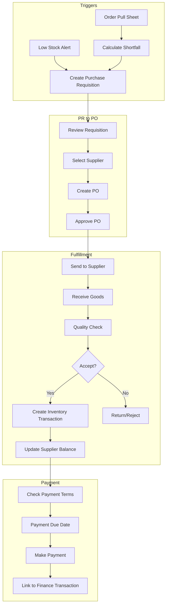

---

## 7. HR Module (Nhân Sự)

### 7.1 Current Flow (As-Is)

```mermaid
flowchart TD
    subgraph Employee Management
        A[Create Employee] --> B[Set Type: Full/Part/Casual]
        B --> C[Set Salary Info]
    end
    
    subgraph Staff Assignment
        D[Order Confirmed] --> E[Create Assignment]
        E --> F[Assign Role: Lead/Server/Kitchen/Driver]
        F --> G[Staff Confirms]
    end
    
    subgraph Timesheet
        H[Staff Check-in] --> I[Record Start Time]
        I --> J[Staff Check-out]
        J --> K[Calculate Hours]
        K --> L[Manager Approve]
    end
    
    subgraph Payroll
        M[Create Payroll Period] --> N[Add Employees]
        N --> O[Calculate from Timesheets]
        O --> P[Add Allowances/Deductions]
        P --> Q[Approve Payroll]
        Q --> R[Process Payment]
    end
    
    subgraph Leave
        S[Employee Request Leave] --> T[Manager Review]
        T --> U{Approve?}
        U -->|Yes| V[Update Balance]
        U -->|No| W[Reject]
    end
```

### 7.2 Gap Analysis

| Best Practice | Current | Gap | Priority |
|:--------------|:-------:|:---:|:--------:|
| Employee Management | ✅ | Có | ✅ |
| Event-based Assignment | ✅ | Có | ✅ |
| Staff Confirmation | ✅ | Có | ✅ |
| Timesheet Tracking | ✅ | Có | ✅ |
| Payroll Calculation | ✅ | Có | ✅ |
| Leave Management | ✅ | Có | ✅ |
| Vietnam Holidays | ✅ | Có | ✅ |
| Mobile Check-in | ❌ | Chưa có | 🟡 MED |
| Shift Swap | ❌ | Chưa có | 🟡 MED |
| Skill/Certification | ❌ | Không track | 🟢 LOW |

### 7.3 User Stories

#### US-H01: Auto Staff Suggestion
```gherkin
GIVEN Order DH-2026001 cần 5 servers cho ngày 28/01/2026
WHEN Manager mở staff assignment
THEN Hệ thống suggest:
  - Staff available (không có assignment khác)
  - Sorted by: Performance rating → Experience → Proximity
```

---

## 8. Finance Module (Tài Chính)

### 8.1 Current Flow (As-Is)

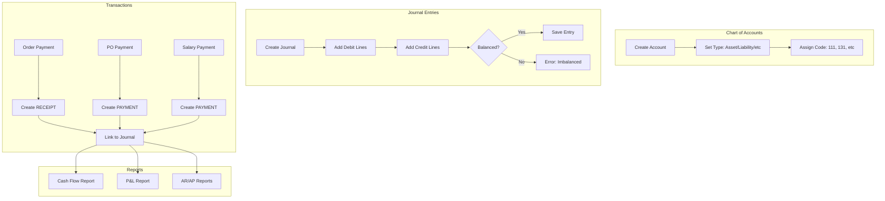

### 8.2 Gap Analysis

| Best Practice | Current | Gap | Priority |
|:--------------|:-------:|:---:|:--------:|
| Double-entry Accounting | ✅ | Có | ✅ |
| Chart of Accounts | ✅ | Có | ✅ |
| Journal Entries | ✅ | Có | ✅ |
| Receipt/Payment | ✅ | Có | ✅ |
| AR/AP Tracking | ✅ | Có | ✅ |
| Financial Reports | ✅ | Có | ✅ |
| Payment Reminders | ❌ | Chưa có | 🔴 HIGH |
| Cash Flow Forecast | ⚠️ | Có report, không forecast | 🟡 MED |
| Bank Reconciliation | ❌ | Chưa có | 🟢 LOW |
| Budget vs Actual | ❌ | Chưa có | 🟢 LOW |

### 8.3 User Stories

#### US-F01: Payment Reminder
```gherkin
GIVEN Order DH-2026001 có balance_due = 5,000,000 VND
AND event_date = 3 ngày trước (đã hoàn thành)
WHEN Daily job chạy
THEN Gửi reminder:
  - Email/SMS cho customer
  - Notification cho Sales rep
  - Add to "Overdue" list trong dashboard
```

---

## 9. Invoice Module (Hóa Đơn)

### 9.1 Current Flow (As-Is)

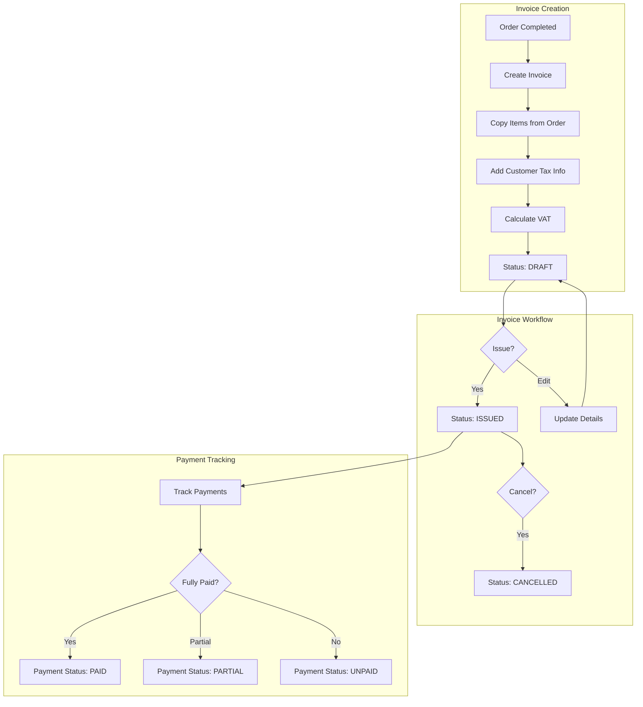

### 9.2 Gap Analysis

| Best Practice | Current | Gap | Priority |
|:--------------|:-------:|:---:|:--------:|
| Invoice Generation | ✅ | Có | ✅ |
| VAT Calculation | ✅ | Có | ✅ |
| Payment Tracking | ✅ | Có | ✅ |
| PDF Export | ⚠️ | Cần verify | 🟡 MED |
| E-invoice (VN) | ❌ | Chưa integrate | 🟢 LOW |
| Recurring Invoice | ❌ | Chưa có | 🟢 LOW |

---

## 📊 Summary: Priority Implementation Matrix

### 🔴 HIGH Priority (Implement Next)

| Module | Feature | Estimated Effort |
|:-------|:--------|:----------------:|
| **Order** | Kitchen Prep Sheet Generation | 2-3 days |
| **Order** | Inventory Pull Sheet Integration | 3-4 days |
| **Inventory** | Auto-Reorder from Low Stock | 2-3 days |
| **Finance** | Payment Reminder System | 2 days |
| **CRM** | Loyalty Points Module | 5-7 days |
| **Quote** | Quote Templates | 2-3 days |

### 🟡 MEDIUM Priority (Phase 2)

| Module | Feature | Estimated Effort |
|:-------|:--------|:----------------:|
| Menu | Recipe Management + Ingredients | 4-5 days |
| Order | Pre-event Confirmation | 1-2 days |
| Inventory | Expiry Alert System | 1-2 days |
| HR | Shift Swap Requests | 2-3 days |
| Quote | Clone Quote | 1 day |

### 🟢 LOW Priority (Future)

| Module | Feature |
|:-------|:--------|
| All | Mobile App |
| Quote | E-signature |
| Inventory | Barcode Scanning |
| Finance | Bank Reconciliation |
| Invoice | E-invoice Integration |

---

## 🔜 Next Steps

1. **Phase 4: Integration Flows** - End-to-end business processes
2. **Implementation Roadmap** - Sprint planning cho gaps
3. **PRD Creation** - Detailed PRDs cho từng feature
