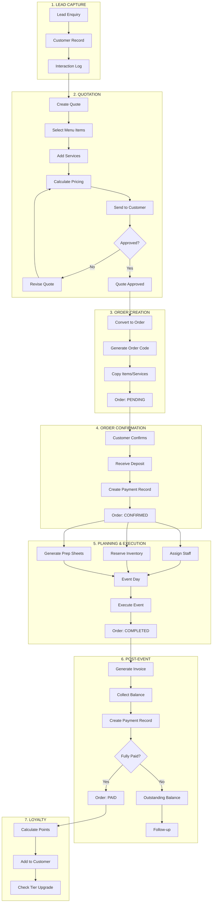
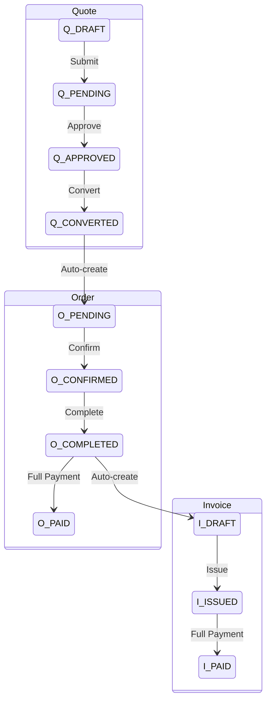
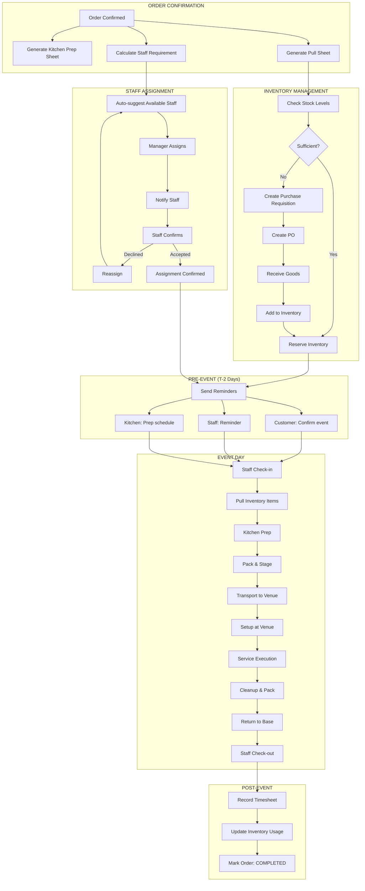
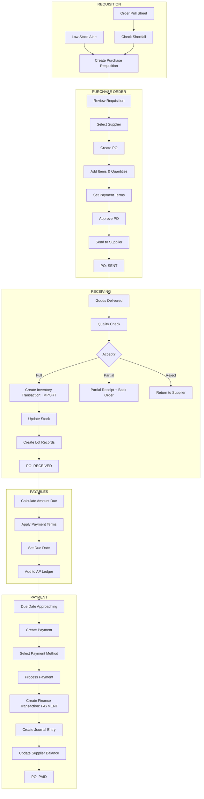
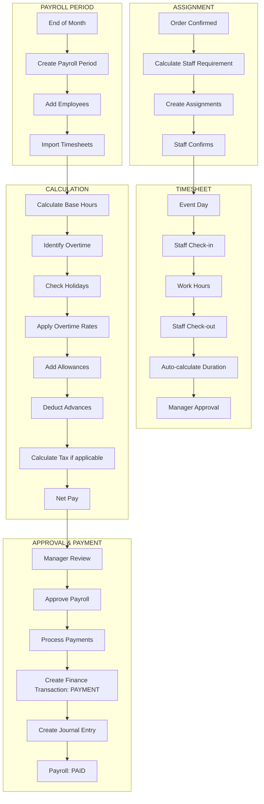
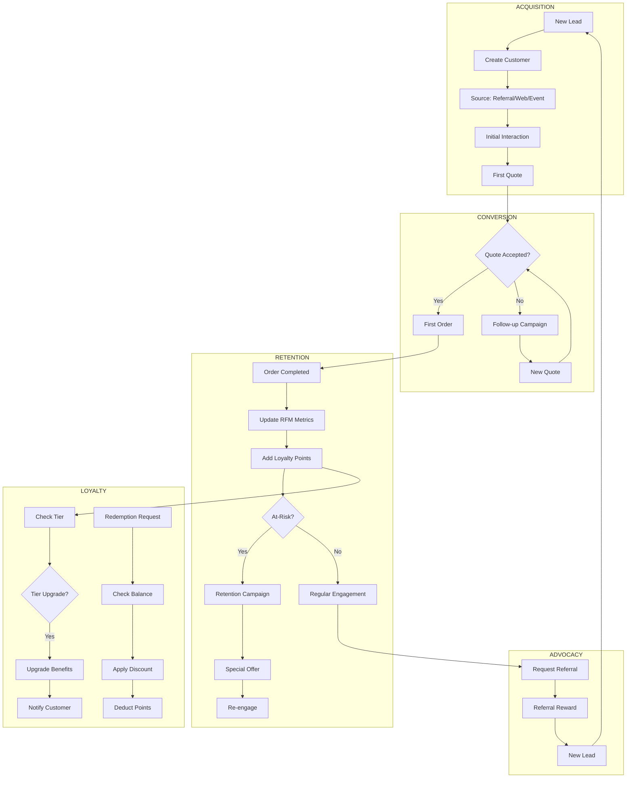
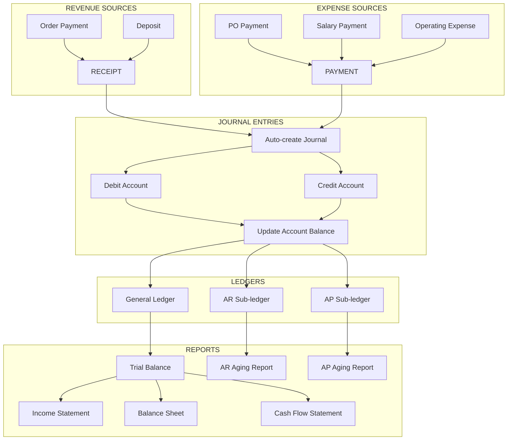

# Phase 4: Integration Flows - End-to-End Business Processes

> **Generated:** 2026-01-27
> **Project:** Ẩm Thực Giáo Tuyết - Catering Management System
> **Purpose:** Document cross-module integration flows cho catering business

---

## 📋 Table of Contents

1. [Quote-to-Cash Flow](#1-quote-to-cash-flow)
2. [Order-to-Kitchen-to-Delivery Flow](#2-order-to-kitchen-to-delivery-flow)
3. [Procurement-to-Payment Flow](#3-procurement-to-payment-flow)
4. [Staff-to-Payroll Flow](#4-staff-to-payroll-flow)
5. [Customer Lifecycle Flow](#5-customer-lifecycle-flow)
6. [Financial Integration Flow](#6-financial-integration-flow)

---

## 1. Quote-to-Cash Flow

### Overview
Luồng hoàn chỉnh từ khi nhận lead đến khi thu tiền xong.



### Data Flow Matrix

| Step | Source Module | Target Module | Data Transferred |
|:-----|:--------------|:--------------|:-----------------|
| Lead → Quote | CRM | Quote | customer_id, contact info |
| Quote → Order | Quote | Order | items[], services[], pricing |
| Order → Staff | Order | HR | order_id, staff_assignments[] |
| Order → Inventory | Order | Inventory | items[] for reservation |
| Order → Payment | Order | Finance | payment records |
| Order → Invoice | Order | Invoice | items[], amounts |
| Payment → Customer | Finance | CRM | update RFM metrics |
| Payment → Loyalty | Finance | CRM | calculate points |

### Status Synchronization



---

## 2. Order-to-Kitchen-to-Delivery Flow

### Overview
Luồng từ order confirmed đến hoàn thành sự kiện.



### Kitchen Prep Sheet Content

```yaml
# Kitchen Prep Sheet - DH-2026001
order_code: DH-2026001
event_date: 2026-01-28
event_time: "18:00"
venue: "Khách sạn ABC, Q1, HCM"
guest_count: 100
table_count: 10

menu_items:
  - category: "Khai vị"
    items:
      - name: "Gỏi cuốn tôm thịt"
        portions_per_table: 10
        total_portions: 100
        prep_time: "T-3h"
        notes: "Giữ lạnh, cuốn trước 1h"
        
      - name: "Chả giò"
        portions_per_table: 10
        total_portions: 100
        prep_time: "T-2h"
        notes: "Chiên ngay trước khi serve"

  - category: "Món chính"
    items:
      - name: "Cá lóc nướng trui"
        portions_per_table: 1
        total_portions: 10
        prep_time: "T-1h"
        
special_requests:
  - "2 bàn vegetarian - thay thịt bằng đậu hũ"
  - "1 khách dị ứng hải sản - bàn số 5"
```

### Pull Sheet Content

```yaml
# Pull Sheet - DH-2026001
order_code: DH-2026001
generated_at: 2026-01-26T08:00:00
pickup_deadline: 2026-01-27T16:00:00

items:
  - inventory_item: "Tôm sú size 30"
    quantity_needed: 5.0
    unit: "kg"
    warehouse: "Kho chính"
    lots:
      - lot_number: "LOT-2026-001"
        expiry_date: "2026-02-15"
        available: 10.0
        to_pick: 5.0
    status: "SUFFICIENT"
    
  - inventory_item: "Thịt ba chỉ"
    quantity_needed: 8.0
    unit: "kg"
    warehouse: "Kho chính"
    lots:
      - lot_number: "LOT-2026-002"
        expiry_date: "2026-01-30"
        available: 5.0
        to_pick: 5.0
      - lot_number: "LOT-2026-003"
        expiry_date: "2026-02-05"
        available: 10.0
        to_pick: 3.0
    status: "SUFFICIENT"
    
  - inventory_item: "Bánh tráng"
    quantity_needed: 200
    unit: "tấm"
    warehouse: "Kho chính"
    lots:
      - lot_number: "LOT-2026-004"
        expiry_date: "2026-03-01"
        available: 100
        to_pick: 100
    status: "INSUFFICIENT"
    shortfall: 100
    action: "CREATE_PO"
```

---

## 3. Procurement-to-Payment Flow

### Overview
Luồng từ yêu cầu mua hàng đến thanh toán NCC.



### Journal Entry Examples

**Khi nhận hàng (Goods Received):**
```
Debit:  152 - Hàng mua đang đi đường      10,000,000
Credit: 331 - Phải trả người bán                      10,000,000
```

**Khi thanh toán (Payment):**
```
Debit:  331 - Phải trả người bán          10,000,000
Credit: 111 - Tiền mặt                                10,000,000
```
hoặc
```
Credit: 112 - Tiền gửi ngân hàng                      10,000,000
```

---

## 4. Staff-to-Payroll Flow

### Overview
Luồng từ phân công nhân viên đến thanh toán lương.



### Payroll Calculation Example

```yaml
employee: "Nguyễn Văn A"
period: "01/2026"

timesheets:
  - date: 2026-01-05
    order: DH-2026001
    hours: 8
    type: regular
    
  - date: 2026-01-10
    order: DH-2026002
    hours: 10
    type: weekend_ot
    
  - date: 2026-01-25
    order: DH-2026010
    hours: 8
    type: holiday # Tết Dương lịch

calculation:
  regular_hours: 80
  regular_rate: 50,000
  regular_pay: 4,000,000
  
  overtime_hours: 10
  overtime_rate: 75,000  # 1.5x
  overtime_pay: 750,000
  
  holiday_hours: 8
  holiday_rate: 150,000  # 3x
  holiday_pay: 1,200,000
  
  gross_pay: 5,950,000
  
  deductions:
    advance: 1,000,000
    insurance: 0
    tax: 0
  
  net_pay: 4,950,000
```

---

## 5. Customer Lifecycle Flow

### Overview
Luồng quản lý khách hàng từ lead đến loyal customer.



### RFM Scoring

```yaml
customer: "Công ty ABC"

rfm_metrics:
  recency:
    last_order: 2026-01-15
    days_since: 12
    score: 5  # Very Recent
    
  frequency:
    total_orders: 8
    orders_per_year: 8
    score: 4  # High Frequency
    
  monetary:
    total_spent: 85,000,000
    avg_order_value: 10,625,000
    score: 5  # High Value
    
  combined_score: 14  # Max 15
  segment: "Champions"
  
recommended_actions:
  - "Offer VIP benefits"
  - "Request referral"
  - "Priority service"
```

### Loyalty Tiers

| Tier | Points Required | Benefits |
|:-----|:---------------:|:---------|
| **Bronze** | 0 | 5% discount on services |
| **Silver** | 500 | 10% discount, Priority booking |
| **Gold** | 1,000 | 15% discount, Priority + Free delivery |
| **Platinum** | 2,500 | 20% discount, Dedicated account manager |

---

## 6. Financial Integration Flow

### Overview
Luồng kế toán tích hợp từ các modules.



### Chart of Accounts Mapping

| Account | Code | Type | Integrated From |
|:--------|:----:|:----:|:----------------|
| Cash | 111 | Asset | All Payments |
| Bank | 112 | Asset | Bank Transfers |
| Accounts Receivable | 131 | Asset | Order Balances |
| Inventory | 152 | Asset | Inventory Transactions |
| Accounts Payable | 331 | Liability | PO Balances |
| Revenue - Catering | 511 | Revenue | Order Completions |
| COGS | 632 | Expense | Inventory Usage |
| Salary Expense | 642 | Expense | Payroll |

### Sample Journal Entries

**Order Completed (Revenue Recognition):**
```
Debit:  131 - Phải thu khách hàng        15,000,000
Credit: 511 - Doanh thu dịch vụ                      13,636,364
Credit: 33311 - Thuế GTGT phải nộp                    1,363,636
```

**Inventory Usage (COGS):**
```
Debit:  632 - Giá vốn hàng bán            5,000,000
Credit: 152 - Nguyên vật liệu                         5,000,000
```

**Customer Payment Received:**
```
Debit:  111 - Tiền mặt                   15,000,000
Credit: 131 - Phải thu khách hàng                    15,000,000
```

---

## 📊 Integration Points Summary

### Event-Driven Triggers

| Event | Source | Target(s) | Action |
|:------|:-------|:----------|:-------|
| Quote Approved | Quote | CRM | Update customer activity |
| Quote Converted | Quote | Order | Create order with items |
| Order Confirmed | Order | Inventory, HR | Reserve stock, Create assignments |
| Order Completed | Order | Invoice, Finance | Create invoice, Record revenue |
| Payment Received | Finance | Order, CRM | Update balances, Update RFM |
| PO Received | Procurement | Inventory | Create IMPORT transaction |
| Payroll Approved | HR | Finance | Create payment entries |

### Data Consistency Rules

1. **Order Balance = Total - Sum(Payments)**
2. **Inventory Stock = Sum(IMPORT) - Sum(EXPORT) + Sum(ADJUST)**
3. **Customer RFM auto-updated on Order COMPLETED/PAID**
4. **Journal always balanced: Sum(Debit) = Sum(Credit)**
5. **Lot Remaining = Initial - Consumed**

---

## 🔜 Next Steps

1. **Task.md Update** - Thêm implementation tasks
2. **API Design** - Define integration endpoints
3. **Event Bus** - Design event-driven architecture
4. **PRD Creation** - Detailed specs cho từng integration
