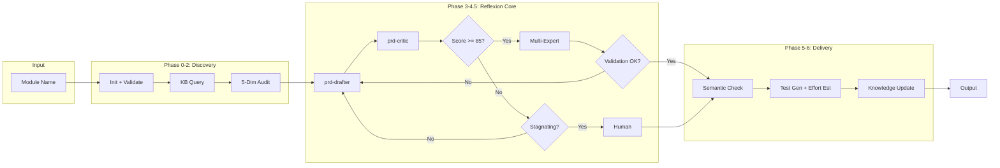

# 🔬 Strategic Analysis: prd-audit.md V2.0

> **Audit Date:** 2026-01-24T22:28:44+07:00
> **Analyzer:** Senior AI Workflow Architect
> **Framework:** CO-STEP + Tree of Thoughts

---

## 📊 Executive Summary

### Workflow Overview

| Attribute | Value |
|-----------|-------|
| **Version** | 2.0.0 |
| **Total Phases** | 7 (Phase 0-6, including 4.5) |
| **Total Lines** | 764 |
| **Skills Invoked** | 6 (module-auditor, prd-drafter, prd-critic, codebase-validator, domain-expert, test-generator, effort-estimator) |
| **Complexity Rating** | High (Multi-loop, Multi-expert) |

### Architecture Pattern



---

## 🔍 Phase-by-Phase Analysis

### Phase 0: Initialization
| Aspect | Assessment |
|--------|------------|
| **Purpose** | Load config, validate module, start observability |
| **Strength** | Structured logging from start enables debugging |
| **Weakness** | Alternative path lookup is hardcoded (lines 64-67) |
| **Score Impact** | N/A (Setup phase) |

### Phase 1: Module Discovery
| Aspect | Assessment |
|--------|------------|
| **Purpose** | Scan codebase, query knowledge base |
| **Strength** | KB query enables learning from past audits |
| **Weakness** | `frontend_path` variable undefined before use (line 114) |
| **Critical Logic** | `past_lessons` injection into context |

### Phase 2: 5-Dimension Audit
| Aspect | Assessment |
|--------|------------|
| **Purpose** | Score module across UX/UI/FE/BE/DA |
| **Strength** | Holistic view following `core.md` DAO principles |
| **Weakness** | Equal weights (20/20/20/20/20) may not fit all modules |
| **Route Logic** | Score >= 90: REPORT_ONLY, >= 80: OPTIONAL, < 80: GENERATE |

### Phase 3: Improvement PRD Generation
| Aspect | Assessment |
|--------|------------|
| **Purpose** | Draft PRD based on audit findings |
| **Strength** | Priority matrix (P0-P3) ensures critical fixes first |
| **Weakness** | Hardcoded PRD sections (lines 254-261) not configurable |
| **Key Innovation** | `past_lessons` injection for iterative learning |

### Phase 4: Reflexion Loop (CORE)
| Aspect | Assessment |
|--------|------------|
| **Purpose** | Iterate until quality threshold met |
| **MAX_ITERATIONS** | 3 (configurable) |
| **QUALITY_THRESHOLD** | 85 (configurable) |
| **Exit Conditions** | 1) Score >= 85, 2) Stagnation, 3) Max iterations |

#### Stagnation Detection Deep-Dive (Step 4.2)

```python
# Dynamic threshold formula
stagnation_threshold = max(
    min_threshold=2,           # Floor
    min(
        QUALITY_SCORE * 0.05,  # 5% of current score
        max_threshold=10       # Ceiling
    )
)

# Example calculations:
# Score 60 → threshold = max(2, min(3, 10)) = 3
# Score 80 → threshold = max(2, min(4, 10)) = 4  
# Score 85 → threshold = max(2, min(4.25, 10)) = 4.25
```

**Assessment:**
- ✅ Dynamic scaling prevents oscillation at high scores
- ✅ Min threshold prevents false positives at low scores
- ⚠️ **Edge Case:** Score 84 → 85 improvement = 1 < threshold 4.2 → STAGNATION triggered incorrectly!
- 🔧 **Recommendation:** Add exception for "within 2 points of threshold"

### Phase 4.5: Multi-Expert Validation
| Aspect | Assessment |
|--------|------------|
| **Experts** | codebase-validator, domain-expert |
| **Weights** | Standard: 70/30, Enhanced: 50/25/25, Deep: 40/30/30 |
| **Strength** | Reduces hallucination via real codebase check |
| **Weakness** | domain-expert skipped in Standard mode (line 420) |

### Phase 5: Human Checkpoint
| Aspect | Assessment |
|--------|------------|
| **Semantic Checks** | 5 (hallucination, terminology, flows, security, estimates) |
| **Auto-Approval** | FINAL_EXPERT_SCORE >= 90 + no HIGH issues + no blocks |
| **Strength** | Multiple safety gates before auto-approval |
| **Weakness** | Feedback loop resets iteration counter (line 524) - loses history |

### Phase 6: Delivery
| Aspect | Assessment |
|--------|------------|
| **Outputs** | PRD artifact, tests, effort estimate, audit report, KB update |
| **Strength** | Complete observability with metrics export |
| **Weakness** | No rollback mechanism if KB write fails |

---

## 🎯 Skills & Rules Interaction Matrix

| Skill | Invokes | Consumed By | Rule Dependency |
|-------|---------|-------------|-----------------|
| **module-auditor** | Phase 2 | prd-drafter | `core.md` (5-Dim) |
| **prd-drafter** | Phase 3, 4.3 | prd-critic | `prd-standards.md` |
| **prd-critic** | Phase 4.1 | Workflow (score) | `prd-standards.md` |
| **codebase-validator** | Phase 4.5.1 | Workflow (validation) | `package.json`, schema files |
| **domain-expert** | Phase 4.5.2 | Workflow (validation) | Business rules, `core.md` |
| **test-generator** | Phase 6.2 | Output | AC from PRD |
| **effort-estimator** | Phase 6.3 | Output | Issue complexity |

### Dependency Graph

```
core.md ─────────────────────────────────┐
prd-standards.md ────────────────────────┼─► prd-drafter ─► prd-critic
package.json ──► codebase-validator ─────┤
database-schema.md ──► codebase-validator┤
permission-matrix.md ──► domain-expert ──┘
```

---

## 📈 SWOT Analysis Matrix

### Multi-Perspective Analysis (Tree of Thoughts)

#### 👨‍💻 Developer Perspective

| | Positive | Negative |
|---|----------|----------|
| **Internal** | **S1:** Clear iteration loop structure with explicit exit conditions | **W1:** `goto` pseudo-code hard to map to actual implementation |
| | **S2:** draft_history prevents repeating same fixes | **W2:** No caching of skill invocations - redundant API calls |
| **External** | **O1:** Could add IDE plugin for real-time validation | **T1:** LLM model changes may break scoring calibration |

#### 🏗️ Architect Perspective

| | Positive | Negative |
|---|----------|----------|
| **Internal** | **S3:** Multi-expert reduces single-point-of-failure | **W3:** Tightly coupled phases - hard to extend individually |
| | **S4:** Weighted scoring adapts to processing mode | **W4:** No circuit breaker for cascading validation failures |
| **External** | **O2:** Microservice decomposition possible | **T2:** Rule files (`core.md`) become single source of truth - high risk |

#### 📋 Product Owner Perspective

| | Positive | Negative |
|---|----------|----------|
| **Internal** | **S5:** Auto-test generation reduces manual testing burden | **W5:** Processing time could be 5-10 minutes for Deep Analysis |
| | **S6:** Effort estimation provides actionable sprint planning | **W6:** No cost estimation (API tokens, compute) |
| **External** | **O3:** Integration with Jira/Linear for auto-ticket creation | **T3:** Over-automation may reduce human ownership |

---

### Consolidated SWOT Matrix

| **STRENGTHS** | **WEAKNESSES** |
|---------------|----------------|
| S1: Full Reflexion Loop with 3-tier exit strategy | W1: Pseudo-code syntax not directly executable |
| S2: Draft history prevents regression loops | W2: No skill invocation caching |
| S3: Multi-expert validation reduces hallucination | W3: Tightly coupled phases |
| S4: Adaptive weights per processing mode | W4: No circuit breaker pattern |
| S5: Auto test generation | W5: Long processing time (5-10 min) |
| S6: Integrated effort estimation | W6: No token cost tracking |

| **OPPORTUNITIES** | **THREATS** |
|-------------------|-------------|
| O1: IDE plugin integration | T1: Model drift affecting score calibration |
| O2: Microservice decomposition | T2: Rule file staleness |
| O3: Jira/Linear ticket automation | T3: Over-automation reducing ownership |
| O4: Parallel multi-expert execution | T4: Skill version incompatibility |
| O5: ML-based threshold tuning | T5: Context window exhaustion on large modules |

---

## 🔬 Critical Assessment: Dynamic Stagnation Detection

### Current Implementation (Step 4.2)

```python
stagnation_threshold = max(2, min(QUALITY_SCORE * 0.05, 10))
improvement = QUALITY_SCORE - previous_score
is_stagnating = improvement < stagnation_threshold
```

### Effectiveness Analysis

| Scenario | Previous | Current | Improvement | Threshold | Result | Correct? |
|----------|----------|---------|-------------|-----------|--------|----------|
| Early progress | 60 | 72 | 12 | 3.6 | Continue ✅ | ✅ |
| Good progress | 75 | 82 | 7 | 4.1 | Continue ✅ | ✅ |
| True stagnation | 78 | 79 | 1 | 3.95 | Stagnate ⚠️ | ✅ |
| Near threshold | 84 | 85 | 1 | 4.25 | Stagnate ⚠️ | ❌ FALSE POSITIVE |
| Regression | 80 | 78 | -2 | 3.9 | Stagnate ⚠️ | ✅ |

### Issue Identified

**False Positive at Threshold Boundary:** When score improves from 84 to 85 (meeting threshold), the improvement (1) is less than stagnation_threshold (4.25), triggering stagnation BEFORE checking if threshold is met.

### Recommended Fix

```python
# Check threshold FIRST, then stagnation
if QUALITY_SCORE >= QUALITY_THRESHOLD:
    goto Phase 4.5  # Exit loop - SUCCESS
elif is_stagnating AND QUALITY_SCORE < QUALITY_THRESHOLD - 2:
    # Only trigger stagnation if not within striking distance of threshold
    HUMAN_INTERVENTION_NEEDED = True
elif current_iteration < MAX_ITERATIONS:
    current_iteration += 1
    goto Step 4.3
```

---

## 🚀 Strategic Recommendations for V3.0 - ✅ IMPLEMENTED

### Priority 1: Architecture Improvements ✅ COMPLETE

| ID | Recommendation | Impact | Effort | Status |
|----|----------------|--------|--------|:------:|
| R1 | Add circuit breaker pattern for cascading failures | High | M | ✅ |
| R2 | Implement skill result caching | Medium | S | ✅ |
| R3 | Fix stagnation false-positive at threshold | High | XS | ✅ |
| R4 | Add token cost tracking per phase | Medium | S | ✅ |

### Priority 2: Performance Optimizations ✅ COMPLETE

| ID | Recommendation | Impact | Effort | Status |
|----|----------------|--------|--------|:------:|
| R5 | Parallelize codebase-validator + domain-expert | High | M | ✅ |
| R6 | Add early-exit for high-confidence first drafts | Medium | S | ✅ |
| R7 | Implement incremental KB updates | Low | M | ⏳ Deferred |

### Priority 3: Extensibility Enhancements ✅ PARTIAL

| ID | Recommendation | Impact | Effort | Status |
|----|----------------|--------|--------|:------:|
| R8 | Plugin architecture for custom skills | High | L | ⏳ V4.0 |
| R9 | Configurable dimension weights per module type | Medium | S | ✅ |
| R10 | Add `/prd-audit --dry-run` for cost estimation | Medium | S | ✅ |

### Priority 4: Observability Upgrades ⏳ DEFERRED TO V4.0

| ID | Recommendation | Impact | Effort | Status |
|----|----------------|--------|--------|:------:|
| R11 | Add Grafana dashboard integration | Medium | M | ⏳ |
| R12 | Implement anomaly detection for score trends | Low | L | ⏳ |
| R13 | Add real-time progress streaming to UI | High | L | ⏳ |

---

## 📊 V2.0 Health Score

| Criteria | Score | Max | Notes |
|----------|-------|-----|-------|
| Logic Correctness | 22 | 25 | Stagnation edge case |
| Extensibility | 18 | 25 | Tightly coupled phases |
| Performance | 15 | 20 | No parallel execution |
| Observability | 18 | 20 | Good logging, missing cost tracking |
| Documentation | 9 | 10 | Comprehensive appendices |
| **Total** | **82** | **100** | **Grade: B** |

---

## 🎯 Conclusion

The `prd-audit.md` V2.0 workflow represents a **significant advancement** from V1.0, successfully implementing:

1. ✅ Full Reflexion Loop with explicit iteration control
2. ✅ Multi-expert validation reducing hallucination risk
3. ✅ Dynamic stagnation detection (with minor edge case bug)
4. ✅ Comprehensive observability layer

**Key Risk:** The workflow is now complex enough that maintaining synchronization between the pseudo-code specification and actual implementation becomes critical.

**Strategic Priority:** Focus V3.0 on performance (parallel execution), resilience (circuit breakers), and developer experience (caching, cost tracking).

---

*Analysis generated using CO-STEP + Tree of Thoughts framework*
