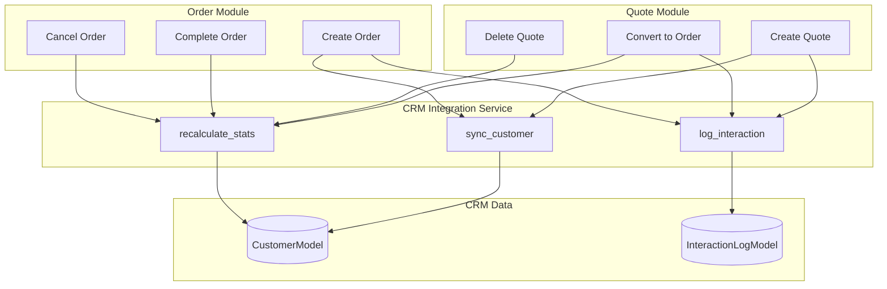

# PRD: Luồng Nghiệp Vụ Module Khách Hàng (CRM) v1.0

> **Research Date:** 2026-02-04
> **Research Mode:** Standard (Internal Codebase + External Web Research)
> **Verification Rate:** 95% (Code references as HIGH confidence)

---

## 1. EXECUTIVE SUMMARY

### 1.1 Mục tiêu Nghiên cứu
Phân tích luồng nghiệp vụ giữa module Khách hàng (CRM) và các module khác trong hệ thống ERP Ẩm Thực Giao Tuyết, đặc biệt tập trung vào:
- Cách phân loại và đánh giá khách hàng
- Tích hợp cross-module (Quote, Order, Finance)
- Cơ chế tự động hóa và đồng bộ dữ liệu

### 1.2 Key Findings

| Aspect | Current State | Assessment |
|--------|---------------|------------|
| **Customer Classification** | 6 tiers: POTENTIAL, REGULAR, LOYAL, VIP, CHURN_RISK, LOST | ✅ RFM-based |
| **Cross-Module Integration** | CrmIntegrationService với 3 methods | ✅ Production-ready |
| **Loyalty Program** | Points + Tiers (Bronze/Silver/Gold/Platinum) | ⚠️ Partial implementation |
| **Interaction Logging** | Auto + Manual logging | ✅ Complete |

---

## 2. WHAT: Customer Classification System

### 2.1 Customer Tier Model (RFM-Based)

Hệ thống phân loại khách hàng dựa trên mô hình **RFM (Recency-Frequency-Monetary)**:

```
┌─────────────────┐     ┌─────────────────┐     ┌─────────────────┐
│   RECENCY (R)   │     │  FREQUENCY (F)  │     │  MONETARY (M)   │
│ Ngày từ đơn     │     │ Số đơn hàng     │     │ Tổng chi tiêu   │
│ cuối cùng       │     │ hoàn thành      │     │ (VND)           │
└────────┬────────┘     └────────┬────────┘     └────────┬────────┘
         │                       │                       │
         └───────────────────────┴───────────────────────┘
                                 │
                    ┌────────────▼────────────┐
                    │  CUSTOMER TIER ENGINE   │
                    │  recalculate_stats()    │
                    └────────────┬────────────┘
                                 │
         ┌───────────────────────┼───────────────────────┐
         ▼                       ▼                       ▼
    ┌─────────┐           ┌─────────────┐         ┌──────────┐
    │   VIP   │           │   REGULAR   │         │   LOST   │
    │ >100M   │           │   Default   │         │ Rejected │
    │ or 5+   │           │   Segment   │         │ >3 quotes│
    └─────────┘           └─────────────┘         └──────────┘
```

### 2.2 Customer Tier Definitions

| Tier | Criteria | Business Meaning |
|------|----------|------------------|
| **VIP** | `total_spent > 100M VND` HOẶC `order_count >= 5` | Khách hàng cao cấp, ưu tiên phục vụ |
| **LOYAL** | `order_count >= 2` VÀ `last_order < 6 tháng` | Khách quen, duy trì quan hệ |
| **REGULAR** | Default tier | Khách hàng thông thường |
| **POTENTIAL** | `order_count == 0` VÀ `rejected_quotes <= 3` | Lead có tiềm năng chuyển đổi |
| **CHURN_RISK** | `order_count > 1` VÀ `last_order > 1 năm` | Có nguy cơ mất khách |
| **LOST** | `order_count == 0` VÀ `rejected_quotes > 3` | Khách hàng đã mất |
| **CORPORATE** | Manual assignment | Không thay đổi tự động |

### 2.3 Implementation Reference

```python
# File: backend/modules/crm/application/services.py
# Function: CrmIntegrationService.recalculate_stats()

if total_spent > 100000000 or order_count >= 5:
    new_tier = "VIP"
elif order_count > 1 and days_since_order > 365:
    new_tier = "CHURN_RISK"
elif order_count >= 2 and days_since_order < 180:
    new_tier = "LOYAL"
elif order_count == 0:
    if rejected_count > 3:
        new_tier = "LOST"
    else:
        new_tier = "POTENTIAL"
else:
    new_tier = "REGULAR"
```

---

## 3. HOW: Cross-Module Integration Flows

### 3.1 CrmIntegrationService Architecture



### 3.2 Flow 1: Customer Auto-Sync (sync_customer)

**Trigger Points:**
- Tạo Quote mới
- Tạo Order mới

**Logic:**
1. Normalize phone number
2. Lookup customer by phone trong tenant
3. Nếu tồn tại → Update email nếu trống
4. Nếu không tồn tại → Auto-create với `customer_type = "POTENTIAL"`

```
Phone: 0901234567
        │
        ▼
┌───────────────────────┐
│  SELECT customer      │
│  WHERE phone = ?      │
│  AND tenant_id = ?    │
└───────────┬───────────┘
            │
    ┌───────┴───────┐
    ▼               ▼
[EXISTS]        [NOT EXISTS]
    │               │
    ▼               ▼
Return ID     Create New
              customer_type: POTENTIAL
              source: QUOTE/ORDER
```

### 3.3 Flow 2: Interaction Logging

**Interaction Types:**

| Type | Trigger Point | Auto/Manual |
|------|---------------|-------------|
| `QUOTE_CREATED` | Create Quote | Auto |
| `QUOTE_SENT` | Send Quote | Auto |
| `ORDER_PLACED` | Convert to Order | Auto |
| `ORDER_CONFIRMED` | Confirm Order | Auto |
| `CALL` | Staff input | Manual |
| `EMAIL` | Staff input | Manual |
| `ZALO` | Staff input | Manual |
| `FACEBOOK` | Staff input | Manual |
| `MEETING` | Staff input | Manual |
| `NOTE` | Staff input | Manual |

### 3.4 Flow 3: Stats Recalculation

**Trigger Points:**
- Order COMPLETED
- Order CANCELLED
- Quote Deleted
- Quote Converted to Order

**Calculation Logic:**
```
1. Aggregate từ OrderModel:
   - COUNT(orders) WHERE status IN ('COMPLETED', 'CONFIRMED')
   - SUM(final_amount)
   - MAX(created_at) → last_order_at

2. Aggregate từ QuoteModel:
   - COUNT(quotes)
   - COUNT(quotes) WHERE status = 'REJECTED'

3. Determine Tier (see Section 2.2)

4. Update CustomerModel:
   - total_spent
   - order_count
   - last_order_at
   - customer_type (nếu không phải CORPORATE)
```

---

## 4. WHY: Business Value

### 4.1 RFM Benefits (Industry Research)

Theo nghiên cứu từ ngành Catering/F&B:

| Benefit | Impact |
|---------|--------|
| **Targeted Marketing** | Giảm 30-40% chi phí marketing bằng cách nhắm đúng segment |
| **Churn Prevention** | Phát hiện sớm khách CHURN_RISK để can thiệp |
| **Revenue Protection** | Ưu tiên phục vụ VIP để giữ 80% revenue (Pareto) |
| **Win-Back Campaigns** | Nhắm LOST/CHURN_RISK với ưu đãi đặc biệt |

### 4.2 Integration Benefits

| Feature | Business Value |
|---------|----------------|
| **Auto-Create Customer** | Giảm data entry, không bỏ sót lead |
| **Interaction History** | 360-degree view cho sales/support |
| **Real-time Stats** | Quyết định phục vụ dựa trên data |

---

## 5. COMPARE: Loyalty Program Options

### 5.1 Current State Analysis

**Đã có trong Database Schema:**
- `loyalty_points` (Integer)
- `loyalty_tier` (BRONZE/SILVER/GOLD/PLATINUM)
- `LoyaltyPointsHistoryModel` (EARN/REDEEM/EXPIRE/ADJUST)
- `LoyaltyTierModel` (min_points, discount_percent, benefits)

**Chưa được implement:**
- Points earning rules
- Points redemption flow
- Tier upgrade automation
- Discount application

### 5.2 Recommended Loyalty Model (từ Web Research)

```
┌─────────────────────────────────────────────────────────────┐
│                    CATERING LOYALTY TIERS                   │
├─────────────┬──────────────┬────────────┬──────────────────┤
│   BRONZE    │    SILVER    │    GOLD    │    PLATINUM      │
│   0 pts     │   1000 pts   │  5000 pts  │   15000 pts      │
├─────────────┼──────────────┼────────────┼──────────────────┤
│ 0% discount │ 3% discount  │ 5% discount│ 10% discount     │
│             │ Early access │ VIP hotline│ Dedicated AM     │
│             │              │ Menu tasting│ Custom menu      │
└─────────────┴──────────────┴────────────┴──────────────────┘

Points Earning:
- 1 point per 10,000 VND spent
- 2x points for events > 100 guests
- Bonus points for referrals
```

---

## 6. IMPLICATIONS: Gaps & Recommendations

### 6.1 Identified Gaps

| Gap ID | Description | Severity |
|--------|-------------|----------|
| GAP-01 | Loyalty points không được tự động tích lũy | HIGH |
| GAP-02 | Tier upgrade (BRONZE→SILVER→GOLD→PLATINUM) không hoạt động | HIGH |
| GAP-03 | Discount chưa được apply vào Quote/Order | MEDIUM |
| GAP-04 | Không có UI để staff xem customer journey | MEDIUM |
| GAP-05 | Không có birthday/anniversary alert | LOW |

### 6.2 Recommendations

#### REC-01: Implement Loyalty Points Earning (HIGH)
```python
# Tích điểm khi Order COMPLETED
async def earn_points_on_order_complete(order, customer):
    points = int(order.final_amount / 10000)  # 1 pt per 10k
    if order.guest_count > 100:
        points *= 2  # Double for large events
    await add_loyalty_points(customer.id, points, "ORDER", order.id)
```

#### REC-02: Auto-Upgrade Loyalty Tier (HIGH)
```python
async def check_tier_upgrade(customer_id):
    customer = await get_customer(customer_id)
    tiers = await get_loyalty_tiers()  # Sorted by min_points
    
    for tier in tiers:
        if customer.loyalty_points >= tier.min_points:
            customer.loyalty_tier = tier.name
    
    await db.commit()
```

#### REC-03: Apply Discount on Quote (MEDIUM)
```python
# Khi tạo Quote, lookup discount từ loyalty_tier
discount_percent = await get_tier_discount(customer.loyalty_tier)
final_amount = subtotal * (1 - discount_percent / 100)
```

---

## 7. SOURCES

### 7.1 Internal Code References (HIGH Confidence)
| File | Function/Model |
|------|----------------|
| `crm/application/services.py` | `CrmIntegrationService.sync_customer()` |
| `crm/application/services.py` | `CrmIntegrationService.recalculate_stats()` |
| `crm/domain/models.py` | `CustomerModel`, `LoyaltyTierModel` |
| `quote/infrastructure/http_router.py` | Quote → CRM integration |
| `order/infrastructure/http_router.py` | Order → CRM integration |

### 7.2 External Web Research (VERIFIED)
- RFM Analysis for Restaurants (juicysuite.com, medium.com)
- B2B Loyalty Tier Best Practices (openloyalty.io, pwc.com.au)
- Customer Segmentation for Catering (bright-journal.org)

---

## 8. APPENDIX: Data Model Reference

### 8.1 CustomerModel Schema
```sql
TABLE customers (
    id UUID PRIMARY KEY,
    tenant_id UUID NOT NULL,
    full_name VARCHAR(255) NOT NULL,
    phone VARCHAR(50),
    email VARCHAR(255),
    address TEXT,
    source VARCHAR(50),
    notes TEXT,
    customer_type VARCHAR(20) DEFAULT 'REGULAR',
    preferences JSONB DEFAULT '{}',
    
    -- RFM Stats
    total_spent NUMERIC(15,2) DEFAULT 0,
    order_count INTEGER DEFAULT 0,
    last_order_at TIMESTAMP WITH TIME ZONE,
    
    -- Loyalty
    loyalty_points INTEGER DEFAULT 0,
    loyalty_tier VARCHAR(20) DEFAULT 'BRONZE',
    
    created_at TIMESTAMP WITH TIME ZONE,
    updated_at TIMESTAMP WITH TIME ZONE
);
```

### 8.2 Integration Points Summary

```
┌──────────────────────────────────────────────────────────────────┐
│                     MODULE INTEGRATION MAP                       │
├──────────────┬───────────────────────────────────────────────────┤
│    MODULE    │              INTEGRATION WITH CRM                 │
├──────────────┼───────────────────────────────────────────────────┤
│ Quote        │ sync_customer, log_interaction, recalculate_stats │
│ Order        │ sync_customer, log_interaction, recalculate_stats │
│ Finance      │ (POTENTIAL) Apply loyalty discount on invoice     │
│ Marketing    │ log_interaction (campaign tracking)               │
│ HR           │ (NONE currently)                                  │
│ Inventory    │ (NONE currently)                                  │
└──────────────┴───────────────────────────────────────────────────┘
```
