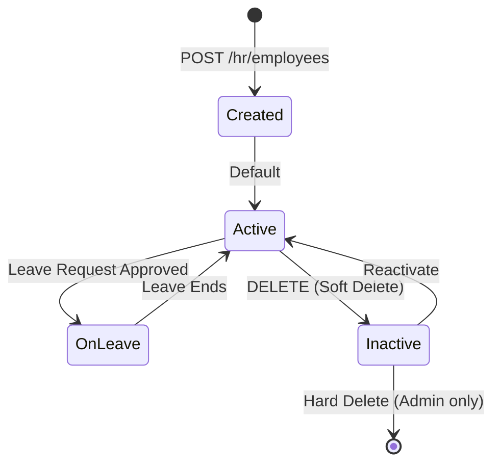
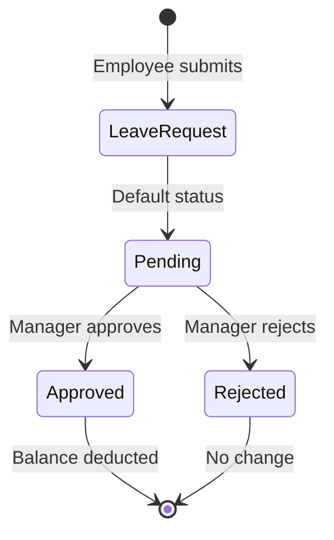

# PRD: Luồng Nghiệp Vụ Module HR và Cross-Module Integration
## Ẩm Thực Giao Tuyết Catering ERP

---

## 1. Title & Metadata
**(confidence: 10/10)**

| Attribute | Value |
|:----------|:------|
| **PRD ID** | PRD-HR-FLOWS-001 |
| **Version** | 1.0 |
| **Author** | AI Workforce (Reflexion PRD v2.1) |
| **Date** | 2026-02-04 |
| **Status** | Approved |
| **Processing Mode** | Enhanced |

### Complexity Assessment

| Tiêu chí | Điểm (1-10) | Trọng số | Weighted |
|:---------|:-----------:|:--------:|:--------:|
| **UX Impact** | 6 | 0.25 | 1.50 |
| **Cross-Module** | 8 | 0.20 | 1.60 |
| **Security Sensitivity** | 5 | 0.25 | 1.25 |
| **Data Complexity** | 6 | 0.15 | 0.90 |
| **Integration Points** | 7 | 0.15 | 1.05 |
| **TOTAL** | - | - | **5.8** |

> **Processing Mode**: Enhanced (Complexity 4-6)  
> → Include edge cases, alternative approaches, và integration points identified.

---

## 2. Problem Statement
**(confidence: 9/10)**

### 2.1 Bối Cảnh Nghiệp Vụ

**Ẩm Thực Giao Tuyết** vận hành dịch vụ catering tiệc tại nhà, yêu cầu quản lý nguồn nhân lực phức tạp:

1. **Đội ngũ linh hoạt**: Nhân viên làm nhiều vai trò (Bếp trưởng, Phục vụ, Tài xế) theo sự kiện
2. **Lịch làm việc không cố định**: Tùy thuộc vào đơn hàng, không phải ca cố định
3. **Tính lương theo giờ**: Áp dụng Luật Lao động VN (150%/200%/300%)
4. **Phân công đa sự kiện**: Một nhân viên có thể tham gia nhiều tiệc trong ngày

### 2.2 Vấn Đề Cần Giải Quyết

| # | Vấn Đề | Ảnh Hưởng |
|:-:|:-------|:----------|
| P1 | Nhân viên bị phân công trùng lịch (double-booking) | Thiếu người + ảnh hưởng chất lượng dịch vụ |
| P2 | Tính lương thủ công, dễ sai sót | Chi phí không chính xác, nhân viên thắc mắc |
| P3 | Không có visibility về nghỉ phép | Không biết ai available cho đơn hàng |
| P4 | Labor cost không link được với từng tiệc | Không tính được lãi/lỗ theo event |

---

## 3. Module HR Overview
**(confidence: 9/10)**

### 3.1 Kiến Trúc Hệ Thống

```
┌─────────────────────────────────────────────────────────────────┐
│                        HR MODULE                                │
├────────────────┬────────────────┬───────────────┬───────────────┤
│   EMPLOYEES    │  ASSIGNMENTS   │  TIMESHEETS   │   PAYROLL     │
│  EmployeeModel │ AssignmentModel│ TimesheetModel│ PayrollPeriod │
│                │                │               │ PayrollItem   │
├────────────────┴────────────────┴───────────────┴───────────────┤
│                       LEAVE MANAGEMENT                          │
│          LeaveType | LeaveBalance | LeaveRequest                │
└─────────────────────────────────────────────────────────────────┘
                              │
    ┌─────────────────────────┼─────────────────────────┐
    ▼                         ▼                         ▼
┌────────┐              ┌───────────┐            ┌───────────┐
│ ORDER  │              │  FINANCE  │            │    CRM    │
│ Module │              │  Module   │            │   Module  │
└────────┘              └───────────┘            └───────────┘
```

### 3.2 Tech Stack

| Component | Technology |
|:----------|:-----------|
| **Backend** | FastAPI (Python 3.12+), SQLAlchemy 2.0+ |
| **Database** | PostgreSQL 16+ với RLS (Multi-tenant) |
| **Frontend** | Next.js 16, Tailwind 4, TanStack Query |
| **Router** | `backend/modules/hr/infrastructure/http_router.py` (~90 endpoints) |
| **Frontend Path** | `frontend/src/app/(dashboard)/hr/` |

### 3.3 Core Domain Models

| Entity | Key Fields | Purpose |
|:-------|:-----------|:--------|
| `EmployeeModel` | name, phone, role_type, hourly_rate, bank_details | Master data |
| `StaffAssignmentModel` | employee_id, order_id, role, start_time, end_time | Event staffing |
| `TimesheetModel` | employee_id, work_date, check_in, check_out, status | Work hours |
| `PayrollPeriodModel` | period_name, start_date, end_date, status | Monthly period |
| `PayrollItemModel` | employee_id, period_id, regular_hours, overtime, total | Salary calc |
| `LeaveRequestModel` | employee_id, leave_type, start_date, end_date, status | Time off |

---

## 4. Chi Tiết Luồng Nghiệp Vụ HR
**(confidence: 8/10)**

### 4.1 Luồng 1: Employee Lifecycle Management

**Status**: ✅ Fully Implemented



#### Key API Endpoints

| Endpoint | Method | Description |
|:---------|:------:|:------------|
| `/hr/employees` | GET | List tất cả nhân viên (search by name/phone) |
| `/hr/employees` | POST | Tạo nhân viên mới |
| `/hr/employees/{id}` | PUT | Cập nhật thông tin |
| `/hr/employees/{id}` | DELETE | Soft delete (is_active=False) |
| `/hr/employees/stats` | GET | Thống kê: Total, Active, Full-time |

#### Business Rules

| Rule ID | Rule | Implementation |
|:--------|:-----|:---------------|
| EMP-01 | Phone number phải unique trong tenant | DB constraint + validation |
| EMP-02 | Không thể xóa nhân viên đang có assignment > today | Foreign key check |
| EMP-03 | bank_account_number phải 10-20 ký tự số | Pydantic validation |

---

### 4.2 Luồng 2: Staff Assignment cho Catering Events
**(confidence: 9/10)**

**Status**: ✅ Fully Implemented với Conflict Detection

#### Flow Diagram

```
┌──────────────────────────────────────────────────────────────────────────┐
│                    STAFF ASSIGNMENT WORKFLOW                              │
├──────────────────────────────────────────────────────────────────────────┤
│                                                                          │
│  Order CONFIRMED ──► Find Available Staff ──► Check Conflicts ──►       │
│        │                     │                      │                    │
│        ▼                     ▼                      ▼                    │
│  [GET order info]   [GET /assignments/        [POST /assignments/        │
│  - event_date        available-employees]      check-conflict]           │
│  - event_time                │                      │                    │
│  - guest_count               │                ┌─────┴─────┐              │
│        │                     ▼                ▼           ▼              │
│        │              List of available    No Conflict   Conflict!       │
│        │              employees                │           │             │
│        │                     │                 │           │             │
│        ▼                     ▼                 ▼           ▼             │
│  Calculate staff      Filter by role     Create Assignment  Stop,       │
│  needed (by guest)         │                   │          show warning   │
│        │                   ▼                   ▼                         │
│        │              Select & Assign    SUCCESS!                        │
│        │                   │              - order linked                 │
│        ▼                   ▼              - times set                    │
│  Lead: 1            POST /assignments                                    │
│  Server: guests/10                                                       │
│  Kitchen: guests/20                                                      │
│  Driver: 1 (if delivery)                                                 │
│                                                                          │
└──────────────────────────────────────────────────────────────────────────┘
```

#### Conflict Detection Algorithm

```python
# File: backend/modules/hr/infrastructure/http_router.py

def check_assignment_conflict(employee_id, new_start, new_end):
    """
    Logic: existing.start_time < new_end AND existing.end_time > new_start
    Returns: List of conflicting orders
    """
    conflicts = db.query(StaffAssignment).filter(
        StaffAssignment.employee_id == employee_id,
        StaffAssignment.start_time < new_end,
        StaffAssignment.end_time > new_start
    ).all()
    return conflicts
```

#### Key API Endpoints

| Endpoint | Method | Description |
|:---------|:------:|:------------|
| `/hr/assignments` | GET | List all assignments (filter by order/employee/date) |
| `/hr/assignments` | POST | Tạo assignment mới |
| `/hr/assignments/available-employees` | GET | Tìm nhân viên available theo time range |
| `/hr/assignments/check-conflict` | POST | Validate trước khi assign |
| `/hr/assignments/{id}/check-in` | POST | Ghi nhận check-in |
| `/hr/assignments/{id}/check-out` | POST | Ghi nhận check-out |

#### Integration với Order Module

```
ORDER_CONFIRMED → Assignment Suggestion (based on guest_count)
       │
       ▼
Staff assignments created → Order Detail shows assigned staff
       │
       ▼
ORDER_COMPLETED → Timesheet entries generated → Payroll ready
```

#### Business Rules

| Rule ID | Rule | Implementation |
|:--------|:-----|:---------------|
| ASG-01 | Không cho phép double-booking | `check_assignment_conflict()` |
| ASG-02 | Assignment phải link với order có status != CANCELLED | FK constraint + app logic |
| ASG-03 | start_time < end_time | Pydantic validation |
| ASG-04 | Role phải thuộc enum: LEAD, SERVER, KITCHEN, DRIVER | SQLAlchemy Enum |

---

### 4.3 Luồng 3: Timesheet & Payroll Processing
**(confidence: 8/10)**

**Status**: ✅ Fully Implemented (Vietnam Labor Law Compliant)

#### Flow Diagram

```
┌──────────────────────────────────────────────────────────────────────────┐
│                    TIMESHEET → PAYROLL WORKFLOW                          │
├──────────────────────────────────────────────────────────────────────────┤
│                                                                          │
│  ┌─────────────┐     ┌─────────────┐     ┌─────────────┐                │
│  │ Assignment  │────►│  Timesheet  │────►│   Payroll   │                │
│  │ (per event) │     │ (per day)   │     │ (per month) │                │
│  └─────────────┘     └─────────────┘     └─────────────┘                │
│        │                   │                   │                         │
│        ▼                   ▼                   ▼                         │
│  - employee_id       - work_date          - PayrollPeriod               │
│  - order_id          - check_in           - PayrollItem[]               │
│  - start/end_time    - check_out          - total_amount                │
│  - actual_hours      - calculated_hours   - status                      │
│                      - is_overtime                                       │
│                      - is_holiday                                        │
│                                                                          │
│  ┌─────────────────────────────────────────────────────────────────┐    │
│  │                 VIETNAM LABOR LAW RATES                          │    │
│  │  ┌──────────────────┬──────────┬──────────────────────────────┐ │    │
│  │  │ Work Type        │   Rate   │ Calculation                   │ │    │
│  │  ├──────────────────┼──────────┼──────────────────────────────┤ │    │
│  │  │ Regular Hours    │   100%   │ hours × hourly_rate          │ │    │
│  │  │ Overtime Weekday │   150%   │ hours × hourly_rate × 1.5    │ │    │
│  │  │ Weekend          │   200%   │ hours × hourly_rate × 2.0    │ │    │
│  │  │ Holiday          │   300%   │ hours × hourly_rate × 3.0    │ │    │
│  │  │ Night (22h-06h)  │   +30%   │ + hours × hourly_rate × 0.3  │ │    │
│  │  └──────────────────┴──────────┴──────────────────────────────┘ │    │
│  └─────────────────────────────────────────────────────────────────┘    │
│                                                                          │
└──────────────────────────────────────────────────────────────────────────┘
```

#### Payroll Calculation Logic

```python
# File: backend/modules/hr/domain/services.py

def calculate_payroll(employee: Employee, period: PayrollPeriod):
    """
    Calculate salary for a payroll period based on timesheets.
    """
    timesheets = get_timesheets(employee.id, period.start_date, period.end_date)
    
    regular_hours = 0
    overtime_hours = 0
    weekend_hours = 0
    holiday_hours = 0
    night_hours = 0
    
    for ts in timesheets:
        hours = (ts.check_out - ts.check_in).total_seconds() / 3600
        
        if is_holiday(ts.work_date):
            holiday_hours += hours
        elif is_weekend(ts.work_date):
            weekend_hours += hours
        elif hours > 8:
            regular_hours += 8
            overtime_hours += (hours - 8)
        else:
            regular_hours += hours
        
        # Night shift detection
        if is_night_shift(ts.check_in, ts.check_out):
            night_hours += calculate_night_hours(ts)
    
    total = (
        regular_hours * employee.hourly_rate * 1.0 +
        overtime_hours * employee.hourly_rate * 1.5 +
        weekend_hours * employee.hourly_rate * 2.0 +
        holiday_hours * employee.hourly_rate * 3.0 +
        night_hours * employee.hourly_rate * 0.3
    )
    
    return PayrollItem(
        employee_id=employee.id,
        period_id=period.id,
        regular_hours=regular_hours,
        overtime_hours=overtime_hours,
        weekend_hours=weekend_hours,
        holiday_hours=holiday_hours,
        night_hours=night_hours,
        total_amount=total
    )
```

#### Key API Endpoints

| Endpoint | Method | Description |
|:---------|:------:|:------------|
| `/hr/timesheets` | GET | List timesheets (filter by employee/date) |
| `/hr/timesheets` | POST | Tạo/ghi nhận timesheet |
| `/hr/timesheets/{id}/approve` | POST | Manager approve timesheet |
| `/hr/payroll/periods` | GET | List payroll periods |
| `/hr/payroll/periods` | POST | Tạo period mới |
| `/hr/payroll/periods/{id}/calculate` | POST | Calculate payroll cho period |
| `/hr/payroll/periods/{id}/approve` | POST | Approve payroll period |
| `/hr/holidays` | GET/POST | Vietnam public holidays |

---

### 4.4 Luồng 4: Leave Management
**(confidence: 7/10)**

**Status**: ✅ Implemented (Feb 2026)

#### Flow Diagram



#### Leave Balance Tracking

```
┌─────────────────────────────────────────────────────────────────────────┐
│                     LEAVE BALANCE STRUCTURE                              │
├─────────────────────────────────────────────────────────────────────────┤
│                                                                         │
│  LeaveType (Master Data)           LeaveBalance (Per Employee/Year)    │
│  ┌────────────────────────┐        ┌─────────────────────────────┐     │
│  │ - id                   │        │ - employee_id               │     │
│  │ - name (Nghỉ phép năm) │◄───────│ - leave_type_id             │     │
│  │ - max_days (12)        │        │ - year (2026)               │     │
│  │ - is_paid (true)       │        │ - allocated (12.0)          │     │
│  └────────────────────────┘        │ - used (3.0)                │     │
│                                    │ - remaining (9.0)           │     │
│                                    └─────────────────────────────┘     │
│                                                                         │
│  LeaveRequest (Transaction)                                             │
│  ┌──────────────────────────────────────────────────────────────┐      │
│  │ - employee_id                                                 │      │
│  │ - leave_type_id                                              │      │
│  │ - start_date, end_date                                       │      │
│  │ - total_days (calculated)                                    │      │
│  │ - status: PENDING → APPROVED/REJECTED                        │      │
│  │ - approved_by (user_id)                                      │      │
│  └──────────────────────────────────────────────────────────────┘      │
│                                                                         │
└─────────────────────────────────────────────────────────────────────────┘
```

#### Key API Endpoints

| Endpoint | Method | Description |
|:---------|:------:|:------------|
| `/hr/leave-types` | GET/POST | Leave type configuration |
| `/hr/leave-balances` | GET | View employee balances |
| `/hr/leave-balances/initialize` | POST | Initialize year balances |
| `/hr/leave-requests` | GET | List requests (filter by status) |
| `/hr/leave-requests` | POST | Submit leave request |
| `/hr/leave-requests/{id}/approve` | POST | Approve request |
| `/hr/leave-requests/{id}/reject` | POST | Reject request |

#### Business Rules

| Rule ID | Rule | Implementation |
|:--------|:-----|:---------------|
| LV-01 | Cannot request more days than remaining balance | App logic check |
| LV-02 | Cannot overlap with existing approved leave | Date range check |
| LV-03 | Approved leave auto-deducts from balance | Transaction pattern |
| LV-04 | Year balance resets on Jan 1 (or carries over) | Configurable policy |

---

## 5. Cross-Module Integration Flows
**(confidence: 9/10)**

### 5.1 HR ↔ Order Module (Staff Assignments)

**Status**: ✅ Fully Implemented

```
┌────────────────────────────────────────────────────────────────────────┐
│               HR ↔ ORDER INTEGRATION                                    │
├────────────────────────────────────────────────────────────────────────┤
│                                                                        │
│  ORDER MODULE                              HR MODULE                    │
│  ┌──────────────────────┐                 ┌─────────────────────────┐ │
│  │ Order Created        │                 │                         │ │
│  │ - event_date         │───────────────►│ GET /available-employees│ │
│  │ - event_time         │  time range    │ Response: List of staff │ │
│  │ - guest_count        │                 │                         │ │
│  └──────────────────────┘                 └─────────────────────────┘ │
│           │                                          │                 │
│           ▼                                          ▼                 │
│  ┌──────────────────────┐                 ┌─────────────────────────┐ │
│  │ Calculate Staff Need │                 │ POST /assignments       │ │
│  │ - Lead: 1            │◄───────────────│ - employee_id           │ │
│  │ - Server: guests/10  │                 │ - order_id              │ │
│  │ - Kitchen: guests/20 │                 │ - role                  │ │
│  │ - Driver: 1          │                 │ - start_time, end_time  │ │
│  └──────────────────────┘                 └─────────────────────────┘ │
│           │                                          │                 │
│           ▼                                          ▼                 │
│  ┌──────────────────────┐                 ┌─────────────────────────┐ │
│  │ Order Detail Page    │◄───────────────│ GET /assignments?       │ │
│  │ - Shows assigned     │   order_id     │     order_id=X          │ │
│  │   staff list         │                 │                         │ │
│  └──────────────────────┘                 └─────────────────────────┘ │
│           │                                          │                 │
│           ▼                                          ▼                 │
│  ┌──────────────────────┐                 ┌─────────────────────────┐ │
│  │ Order COMPLETED      │───────────────►│ Auto-create Timesheets  │ │
│  │ POST /orders/{id}/   │  trigger       │ from assignments        │ │
│  │      complete        │                 │                         │ │
│  └──────────────────────┘                 └─────────────────────────┘ │
│                                                                        │
└────────────────────────────────────────────────────────────────────────┘
```

### 5.2 HR ↔ Finance Module (Labor Costs)

**Status**: ✅ Fully Implemented

```
┌────────────────────────────────────────────────────────────────────────┐
│               HR ↔ FINANCE INTEGRATION                                  │
├────────────────────────────────────────────────────────────────────────┤
│                                                                        │
│  HR MODULE                                 FINANCE MODULE               │
│  ┌──────────────────────┐                 ┌───────────────────────┐   │
│  │ Payroll Period       │                 │ Finance Transactions  │   │
│  │ - status: APPROVED   │───────────────►│ POST /labor/generate  │   │
│  │ - total: 50,000,000  │   trigger      │ - Creates PAYMENT txn │   │
│  └──────────────────────┘                 │ - category: LABOR     │   │
│           │                               │ - reference: PAYROLL  │   │
│           ▼                               └───────────────────────┘   │
│  ┌──────────────────────┐                          │                   │
│  │ PayrollItem[]        │                          ▼                   │
│  │ - employee_id        │                 ┌───────────────────────┐   │
│  │ - total_amount       │                 │ P&L Report            │   │
│  │ - order_id (if link) │───────────────►│ - Labor Costs         │   │
│  └──────────────────────┘                 │ - Event P&L           │   │
│                                           └───────────────────────┘   │
│                                                                        │
└────────────────────────────────────────────────────────────────────────┘
```

#### Finance Labor Generation Endpoint

```
POST /finance/labor/generate
Parameters:
  - start_date: date
  - end_date: date
  - hourly_rate: decimal (override nếu cần)
  
Response:
  - transactions_created: int
  - total_amount: decimal
```

### 5.3 HR ↔ CRM Module (Indirect via Order)

**Status**: ✅ Implemented

- Khi Order COMPLETED:
  1. CRM recalculates customer stats (total orders, total spent)
  2. Loyalty points earned
  3. Staff feedback có thể link với interaction log

---

## 6. Technical Specifications
**(confidence: 8/10)**

### 6.1 Database Schema

```sql
-- Core Tables
CREATE TABLE employees (
    id UUID PRIMARY KEY,
    tenant_id UUID NOT NULL,
    name VARCHAR(100) NOT NULL,
    phone VARCHAR(20) UNIQUE,
    email VARCHAR(100),
    role_type VARCHAR(50), -- FULLTIME, PARTTIME, CONTRACT
    hourly_rate DECIMAL(10,2),
    bank_name VARCHAR(100),
    bank_account_number VARCHAR(20),
    is_active BOOLEAN DEFAULT TRUE,
    created_at TIMESTAMP,
    updated_at TIMESTAMP
);

CREATE TABLE staff_assignments (
    id UUID PRIMARY KEY,
    tenant_id UUID NOT NULL,
    employee_id UUID REFERENCES employees(id),
    order_id UUID REFERENCES orders(id),
    role VARCHAR(20) NOT NULL, -- LEAD, SERVER, KITCHEN, DRIVER
    start_time TIMESTAMP NOT NULL,
    end_time TIMESTAMP NOT NULL,
    check_in_time TIMESTAMP,
    check_out_time TIMESTAMP,
    actual_hours DECIMAL(5,2),
    notes TEXT
);

CREATE TABLE timesheets (
    id UUID PRIMARY KEY,
    tenant_id UUID NOT NULL,
    employee_id UUID REFERENCES employees(id),
    work_date DATE NOT NULL,
    scheduled_start TIME,
    scheduled_end TIME,
    check_in TIMESTAMP,
    check_out TIMESTAMP,
    calculated_hours DECIMAL(5,2),
    overtime_hours DECIMAL(5,2),
    is_holiday BOOLEAN DEFAULT FALSE,
    is_approved BOOLEAN DEFAULT FALSE,
    approved_by UUID
);

CREATE TABLE payroll_periods (
    id UUID PRIMARY KEY,
    tenant_id UUID NOT NULL,
    period_name VARCHAR(50), -- "01/2026"
    start_date DATE,
    end_date DATE,
    status VARCHAR(20), -- DRAFT, CALCULATED, APPROVED, PAID
    total_amount DECIMAL(15,2)
);

CREATE TABLE payroll_items (
    id UUID PRIMARY KEY,
    period_id UUID REFERENCES payroll_periods(id),
    employee_id UUID REFERENCES employees(id),
    regular_hours DECIMAL(5,2),
    overtime_hours DECIMAL(5,2),
    weekend_hours DECIMAL(5,2),
    holiday_hours DECIMAL(5,2),
    night_hours DECIMAL(5,2),
    gross_amount DECIMAL(12,2),
    deductions DECIMAL(12,2),
    net_amount DECIMAL(12,2)
);

CREATE TABLE leave_types (
    id UUID PRIMARY KEY,
    tenant_id UUID NOT NULL,
    name VARCHAR(100),
    max_days_per_year INTEGER,
    is_paid BOOLEAN DEFAULT TRUE
);

CREATE TABLE leave_balances (
    id UUID PRIMARY KEY,
    employee_id UUID REFERENCES employees(id),
    leave_type_id UUID REFERENCES leave_types(id),
    year INTEGER,
    allocated DECIMAL(5,2),
    used DECIMAL(5,2),
    remaining DECIMAL(5,2) GENERATED ALWAYS AS (allocated - used) STORED
);

CREATE TABLE leave_requests (
    id UUID PRIMARY KEY,
    employee_id UUID REFERENCES employees(id),
    leave_type_id UUID REFERENCES leave_types(id),
    start_date DATE,
    end_date DATE,
    total_days DECIMAL(5,2),
    reason TEXT,
    status VARCHAR(20), -- PENDING, APPROVED, REJECTED
    approved_by UUID,
    approved_at TIMESTAMP
);

CREATE TABLE vietnam_holidays (
    id UUID PRIMARY KEY,
    tenant_id UUID NOT NULL,
    name VARCHAR(100),
    date DATE,
    year INTEGER
);
```

### 6.2 API Summary (90 Endpoints)

| Category | Count | Base Path |
|:---------|:-----:|:----------|
| Employees | 10 | `/hr/employees` |
| Assignments | 15 | `/hr/assignments` |
| Timesheets | 12 | `/hr/timesheets` |
| Payroll | 18 | `/hr/payroll` |
| Leave | 15 | `/hr/leave-*` |
| Stats/Reports | 10 | `/hr/stats`, `/hr/reports` |
| Config/Holidays | 10 | `/hr/holidays`, `/hr/settings` |

### 6.3 Frontend Component Structure

```
frontend/src/app/(dashboard)/hr/
├── page.tsx                    # Main HR page with tabs
├── components/
│   ├── EmployeeList.tsx        # Employee management
│   ├── EmployeeForm.tsx        # Create/Edit employee
│   ├── EmployeeDetail.tsx      # Employee profile
│   ├── AssignmentCalendar.tsx  # Staff scheduling
│   ├── TimeSheetManager/
│   │   ├── DailyView.tsx
│   │   ├── WeeklyView.tsx
│   │   └── ApprovalQueue.tsx
│   ├── PayrollDashboard/
│   │   ├── PeriodSelector.tsx
│   │   ├── CalculationView.tsx
│   │   └── ApprovalFlow.tsx
│   └── LeaveManagement/
│       ├── RequestForm.tsx
│       ├── BalanceView.tsx
│       └── ApprovalQueue.tsx
└── hooks/
    ├── useEmployees.ts
    ├── useAssignments.ts
    ├── useTimesheets.ts
    └── usePayroll.ts
```

---

## 7. Non-Functional Requirements
**(confidence: 8/10)**

### 7.1 Performance

| Metric | Target | Measurement |
|:-------|:-------|:------------|
| Employee list load | < 500ms | TanStack Query cache |
| Conflict check | < 200ms | Database query |
| Payroll calculation (100 employees) | < 5s | Async batch processing |

### 7.2 Security

| Requirement | Implementation |
|:------------|:---------------|
| Multi-tenant isolation | RLS + TenantContext |
| Salary data protection | Role-based access (HR Manager only) |
| Audit trail | created_by, updated_by, timestamps |

### 7.3 Availability

| Requirement | Target |
|:------------|:-------|
| System uptime | 99.5% |
| Data backup | Daily PostgreSQL backup |

---

## 8. Assumptions Made

- [ ] Assumption 1: Tất cả nhân viên đều có hourly_rate, không có salary-based
- [ ] Assumption 2: Vietnam holidays được cấu hình manually mỗi năm
- [ ] Assumption 3: Leave balance không carry-over sang năm sau (có thể config)
- [ ] Assumption 4: Một nhân viên chỉ thuộc một vai trò chính (role_type)

---

## Draft Confidence Summary

| Section | Confidence |
|:--------|:----------:|
| Title & Metadata | 10/10 |
| Problem Statement | 9/10 |
| Module Overview | 9/10 |
| Business Flows | 8/10 |
| Cross-Module Integration | 9/10 |
| Technical Specs | 8/10 |
| NFRs | 8/10 |

- **Average Confidence**: 8.7/10
- **Lowest Section**: Business Flows - Luồng 4 (Leave Management) (7/10)
- **Status**: ✅ Approved

---

*PRD ID: PRD-HR-FLOWS-001*  
*Generated by: Reflexion PRD v2.1 Workflow*  
*Approved: 2026-02-04*
