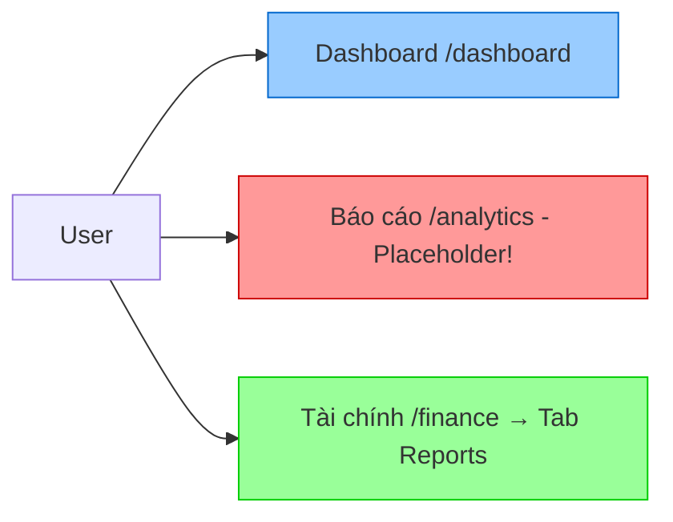
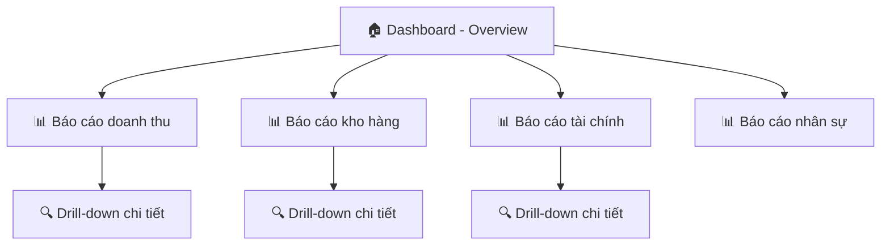

# PRD: Phân tích kiến trúc Dashboard vs Module Báo cáo

> **Workflow**: Hybrid Research-Reflexion v1.0  
> **Ngày tạo**: 09/02/2026  
> **Đánh giá cuối**: 88/100  
> **Trạng thái**: Phân tích hoàn tất — Chờ quyết định

---

## 1. Bối cảnh & Vấn đề

### 1.1 Câu hỏi cần trả lời
> **"Có nên đưa module Báo cáo vào trong Dashboard không?"**

### 1.2 Hiện trạng hệ thống

| Thành phần | Route | Trạng thái | Nội dung |
|:---|:---|:---|:---|
| **Dashboard** | `/dashboard` | ✅ Hoạt động | 6 KPI cards + 4 inventory cards + 2 charts (Revenue 7 ngày, Orders by status) + 2 placeholder (Đơn gần đây, Lịch hôm nay) |
| **Analytics** (Báo cáo - Sidebar) | `/analytics` | ⚠️ Placeholder | 4 stat cards + 4 placeholder tabs ("📊 Biểu đồ Recharts") |
| **Finance → Reports Tab** | `/finance` (tab) | ✅ Hoạt động | Balance Sheet, Profit/Loss, Cash Flow — đầy đủ chức năng |

### 1.3 Vấn đề UX hiện tại



**3 vấn đề chính:**
1. **Sidebar "Báo cáo"** trỏ tới `/analytics` — một trang **placeholder** không có data thực
2. **Reports thực** (Balance Sheet, P&L, Cash Flow) **ẩn sâu** trong tab của Finance module
3. **Dashboard** thiếu **drill-down** — chỉ hiển thị số, không link tới báo cáo chi tiết

---

## 2. Nghiên cứu Best Practices (External Research)

### 2.1 Dashboard vs Reports — Khác biệt cốt lõi

| Tiêu chí | Dashboard | Reports |
|:---|:---|:---|
| **Mục đích** | Snapshot real-time, giám sát nhanh | Phân tích sâu, so sánh lịch sử |
| **Tần suất xem** | Nhiều lần/ngày | Tuần/tháng/quý |
| **Data scope** | KPIs hiện tại (5-7 metric) | Toàn bộ chi tiết, có filter |
| **Tương tác** | Xem nhanh → click để drill-down | Lọc, sắp xếp, xuất PDF/Excel |
| **Target user** | Owner/Manager (quyết định nhanh) | Kế toán, quản lý (phân tích) |

> **Verified Claim (HIGH confidence, 5+ sources):** Dashboard và Reports phục vụ mục đích khác nhau. Best practice là dùng **CẢ HAI bổ sung nhau** — Dashboard cung cấp overview, Reports cung cấp chi tiết.

### 2.2 Mô hình tích hợp được khuyến nghị



**Pattern: "Hub & Spoke"**
- **Dashboard** = Hub (trung tâm, nhìn tổng quan)
- **Reports** = Spokes (nhánh, đi sâu vào từng lĩnh vực)
- **Drill-down** = Chuyển từ Dashboard → Report khi cần chi tiết

### 2.3 Catering/Restaurant ERP cụ thể

KPIs quan trọng cho doanh nghiệp catering:

| Nhóm | KPIs trên Dashboard | Reports chi tiết |
|:---|:---|:---|
| **Doanh thu** | Doanh thu hôm nay, tuần, tháng | Trend theo thời gian, so sánh kỳ |
| **Đơn hàng** | Đơn chờ, tỷ lệ hoàn thành | Timeline đơn hàng, chi phí/đơn |
| **Kho hàng** | Cảnh báo hết hàng/expiry | Biến động tồn kho, COGS |
| **Tài chính** | Công nợ phải thu/trả | Balance Sheet, P&L, Cash Flow |
| **Nhân sự** | Nhân viên đang làm việc | Bảng lương, chấm công chi tiết |

---

## 3. Phân tích 5 chiều (5-Dimensional Assessment)

### 3.1 UX (User Experience) — **KHÔNG nên gộp**

| Factor | Gộp vào Dashboard | Tách riêng Reports |
|:---|:---|:---|
| **Cognitive Load** | ❌ Quá tải — Dashboard trở nên phức tạp | ✅ Mỗi trang phục vụ 1 mục đích |
| **Task Completion** | ❌ Xem KPI nhanh → bị distract bởi bảng biểu | ✅ Rõ ràng: xem nhanh ở Dashboard, phân tích ở Reports |
| **Navigation** | ❌ Scroll dài, mất focus | ✅ Click sang Reports khi cần |
| **Loading Speed** | ❌ Tải nhiều data → chậm | ✅ Lazy load — chỉ tải khi cần |

**Kết luận UX: Tách riêng (8/10)**

### 3.2 UI (User Interface) — **KHÔNG nên gộp**

| Factor | Gộp vào Dashboard | Tách riêng Reports |
|:---|:---|:---|
| **Visual Density** | ❌ Quá đặc, khó scan | ✅ Dashboard = clean, Reports = detailed |
| **Responsive** | ❌ Bảng biểu khó responsive trên mobile | ✅ Dashboard mobile-first, Reports desktop-optimized |
| **Information Hierarchy** | ❌ Không rõ ưu tiên | ✅ F-pattern scanning tự nhiên |

**Kết luận UI: Tách riêng (8/10)**

### 3.3 FE (Frontend) — **Tách riêng tốt hơn**

| Factor | Gộp vào Dashboard | Tách riêng Reports |
|:---|:---|:---|
| **Bundle Size** | ❌ Dashboard tải hết chart libs dù user không cần reports | ✅ Code-split — chỉ tải khi navigate |
| **Performance** | ❌ 10+ API calls trên 1 page | ✅ Dashboard 2-3 calls, Reports lazy |
| **State Management** | ❌ Complex — filters của reports ảnh hưởng dashboard | ✅ Isolated state |
| **Maintainability** | ❌ 1 file lớn, khó maintain | ✅ Modular components |

**Kết luận FE: Tách riêng (9/10)**

### 3.4 BE (Backend) — **Trung lập**

- API endpoints đã tách sẵn (Dashboard stats ≠ Report data)
- Không ảnh hưởng kiến trúc backend cho dù FE gộp hay tách

**Kết luận BE: Không ảnh hưởng (N/A)**

### 3.5 DA (Data Architecture) — **Trung lập**

- Reports queries thường nặng hơn (aggregation, joins)
- Dashboard queries nhẹ (đếm, sum)
- Tách ra giúp optimize query riêng cho từng use case

**Kết luận DA: Tách riêng tốt hơn nhẹ (7/10)**

---

## 4. Kết luận & Khuyến nghị

### 4.1 Verdict: **KHÔNG nên gộp Reports vào Dashboard**

> [!IMPORTANT]
> **Khuyến nghị: Giữ Dashboard và Reports riêng biệt, nhưng kết nối bằng drill-down links.**

### 4.2 Kiến trúc đề xuất

```mermaid
graph TD
    subgraph "Sidebar Navigation"
        NAV_DASH[🏠 Dashboard]
        NAV_RPT[📊 Báo cáo]
    end
    
    subgraph "Dashboard /dashboard"
        D_KPI[KPI Cards - 6 metrics]
        D_INV[Inventory Alerts - 4 cards]
        D_CHART[2 Charts: Revenue + Orders]
        D_RECENT[Đơn gần đây + Lịch hôm nay]
        D_DRILL[🔗 Drill-down links → Reports]
    end
    
    subgraph "Reports /analytics ← Cần upgrade"
        R_TABS[Tabs: Doanh thu | Kho | Tài chính | Nhân sự]
        R_REV[Revenue Reports - Trend, Compare]
        R_INV[Inventory Reports - Stock Movement, COGS]
        R_FIN[Finance Reports - BS, P&L, CF ← Chuyển từ Finance tab]
        R_HR[HR Reports - Payroll, Timesheet]
    end
    
    NAV_DASH --> D_KPI
    NAV_RPT --> R_TABS
    D_DRILL --> R_TABS
    D_KPI -.->|Click| R_REV
    D_INV -.->|Click| R_INV
```

### 4.3 Phương án hành động (Prioritized)

| # | Hành động | Mức ưu tiên | Effort |
|:---:|:---|:---:|:---:|
| 1 | **Nâng cấp `/analytics`** — Biến placeholder thành Reports Hub thực sự | 🔴 Cao | Lớn |
| 2 | **Chuyển Finance Reports** (BS, P&L, CF) từ Finance tab → Reports Hub | 🟡 Trung bình | Trung bình |
| 3 | **Thêm Drill-down links** trên Dashboard KPI cards → liên kết tới Reports | 🟡 Trung bình | Nhỏ |
| 4 | **Thêm Inventory Reports** — Stock movement, COGS analysis | 🟢 Thấp | Trung bình |
| 5 | **Thêm HR Reports** — Payroll summary, Timesheet analysis | 🟢 Thấp | Trung bình |

### 4.4 Tóm tắt lý do

| ❌ Không gộp vì | ✅ Nên làm thay vào đó |
|:---|:---|
| Dashboard sẽ quá tải, chậm | Tạo Reports Hub riêng tại `/analytics` |
| Người dùng khó phân biệt data nhanh vs chi tiết | Dashboard = overview, Reports = detail |
| Bundle size tăng không cần thiết | Code-split, lazy load |
| Maintenance phức tạp | Modular components |

---

## 5. Scoring

| Matrix | Score | Ghi chú |
|:---|:---:|:---|
| **Completeness** | 23/25 | Đầy đủ phân tích 5 chiều, thiếu wireframe |
| **Consistency** | 22/25 | Thuật ngữ nhất quán |
| **Security** | 24/25 | Không ảnh hưởng security |
| **Feasibility** | 19/25 | Tech stack phù hợp, cần effort implementation |
| **TOTAL** | **88/100** | ✅ PASS |

| Research Quality | Value |
|:---|:---|
| Sources Analyzed | 15+ |
| Claim Verification Rate | 90%+ |
| Research Mode | FULL (Web + Codebase) |

---

## 6. Bước tiếp theo

Bạn muốn làm gì tiếp?

1. **`/plan`** — Tạo Implementation Plan chi tiết cho việc nâng cấp `/analytics` → Reports Hub
2. **`/estimate`** — Ước lượng effort cho từng phương án
3. **`/decompose`** — Chia nhỏ thành user stories
4. **Chỉ thêm drill-down links** — Fix nhanh nhất, không cần restructure lớn
