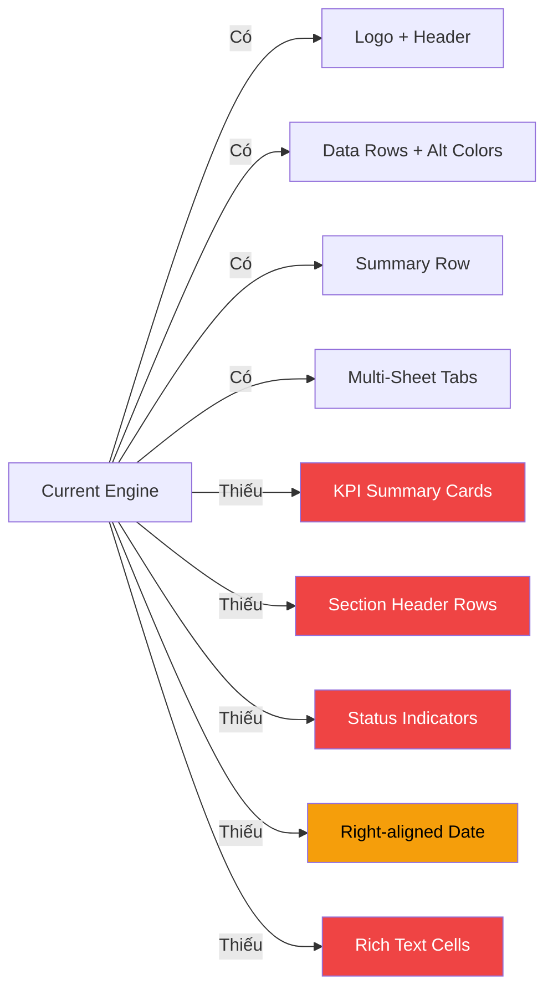

# PRD: Nâng Cấp Báo Cáo Excel Theo Mockup

> **Workflow**: Hybrid Research-Reflexion v1.0
> **Research Depth**: Standard
> **Claim Verification Rate**: 100% (ExcelJS API verified from GitHub README)

---

## 1. Tổng Quan

### Problem
Hiện tại, `excel-report-engine.ts` tạo báo cáo Excel cơ bản với:
- Logo header + separator line
- Column headers + data rows (alternating colors)
- Summary row + footer

**Mockup yêu cầu** nâng cấp lên dashboard-level layout với:
- KPI Summary Cards (merged cells với colored backgrounds, large numbers, trend arrows)
- Section Header Rows (bold text trên purple/brown background)
- Status Indicators (emoji ✅⚠️🔵 + colored text "Tốt", "Cần theo dõi", "Xuất sắc")
- Date/Time Header (right-aligned, hiển thị kỳ + ngày xuất)
- Multi-Sheet Tabs đặc thù cho từng loại báo cáo

### Mockup Reference

````carousel

<!-- slide -->

````

---

## 2. Research Synthesis

### 2.1 ExcelJS Capabilities Verified ✅

| Feature Needed | ExcelJS API | Verified? |
|:---------------|:------------|:---------:|
| Merged cells for KPI cards | `ws.mergeCells(r1,c1,r2,c2)` | ✅ |
| Rich Text (multi-font/color) | `cell.value = { richText: [...] }` | ✅ |
| Conditional Formatting | `ws.addConditionalFormatting()` | ✅ |
| Icon Sets (arrows, flags) | `type: 'iconSet', iconSet: '3Arrows'` | ✅ |
| Image in merged cells | `ws.addImage(id, { tl, br })` | ✅ |
| Cell fills (solid colors) | `cell.fill = { type: 'pattern', fgColor }` | ✅ |
| Emoji in cells | Direct Unicode string assignment | ✅ |
| Page setup (landscape, A4) | `ws.pageSetup` | ✅ |

> **Sources**: [ExcelJS GitHub README](https://github.com/exceljs/exceljs), [ExcelJS npm docs](https://www.npmjs.com/package/exceljs)

### 2.2 Key ExcelJS API Patterns

#### Rich Text Cell (multi-font/color)
```typescript
cell.value = {
    richText: [
        { text: '3,250,000,000 ₫\n', font: { size: 18, bold: true, color: { argb: '1B7D3A' } } },
        { text: '↑ 12.5% so với tháng trước', font: { size: 9, color: { argb: '1B7D3A' } } },
    ],
};
```

#### Emoji Status in Cells
```typescript
// Unicode emoji work directly in ExcelJS
cell.value = '✅ Tốt';           // Green checkmark
cell.value = '⚠️ Cần theo dõi';  // Warning  
cell.value = '🔵 Ổn định';       // Blue circle
cell.value = '⭐ Xuất sắc';      // Star
```

#### Conditional Formatting with Icon Sets
```typescript
ws.addConditionalFormatting({
    ref: 'D9:D30',
    rules: [{
        type: 'iconSet',
        iconSet: '3Arrows',
        cfvo: [
            { type: 'num', value: -5 },
            { type: 'num', value: 0 },
            { type: 'num', value: 5 },
        ],
    }],
});
```

---

## 3. Gap Analysis: Current vs Mockup



---

## 4. Proposed Enhancement: New Features

### 4.1 KPI Summary Cards Section

Giữa Logo header và bảng data, thêm dải KPI Summary Cards (1 row cao, 4 merged columns):

```
┌─────────────────┬─────────────────┬─────────────────┬─────────────────┐
│   DOANH THU     │    CHI PHÍ      │   LỢI NHUẬN     │   ĐƠN HÀNG      │
│ 3,250,000,000 ₫ │ 2,450,000,000 ₫ │  800,000,000 ₫  │     1,250        │
│ ↑ 12.5% so với  │ ↑ 5.2% so với   │ ↑ 28.3% so với  │ ↑ 8.1% so với    │
│   tháng trước   │   tháng trước   │   tháng trước   │   tháng trước    │
└─────────────────┴─────────────────┴─────────────────┴─────────────────┘
```

**Implementation:**

```typescript
// New interface for KPI cards
export interface KpiCard {
    label: string;       // "DOANH THU"
    value: number;       // 3250000000
    format: 'currency' | 'number';
    trend: number;       // 12.5 (percent)
    trendLabel?: string; // "so với tháng trước"
    bgColor: string;     // ARGB hex: 'E8F5E9' (light green)
    valueColor: string;  // ARGB hex: '1B7D3A' (dark green)
    icon?: string;       // emoji: '💰', '📊', '📈', '🧾'
}

export interface ReportSheet {
    // ...existing fields...
    kpiCards?: KpiCard[];  // Optional KPI summary cards
}
```

**ExcelJS code pattern:**

```typescript
function buildKpiCards(ws: ExcelJS.Worksheet, cards: KpiCard[], startRow: number, colCount: number) {
    const cardHeight = 3; // spans 3 rows
    const cardCols = Math.floor(colCount / cards.length);

    cards.forEach((card, i) => {
        const startCol = i * cardCols + 1;
        const endCol = (i + 1) * cardCols;

        // Merge cells for card
        ws.mergeCells(startRow, startCol, startRow + cardHeight - 1, endCol);

        const cell = ws.getCell(startRow, startCol);

        // Rich text: icon + label + value + trend
        const trendSign = card.trend > 0 ? '↑' : card.trend < 0 ? '↓' : '';
        const formattedValue = card.format === 'currency'
            ? card.value.toLocaleString('vi-VN') + ' ₫'
            : card.value.toLocaleString('vi-VN');

        cell.value = {
            richText: [
                { text: `${card.icon || ''} ${card.label}\n`,
                  font: { size: 10, bold: true, color: { argb: '4A2600' } } },
                { text: `${formattedValue}\n`,
                  font: { size: 18, bold: true, color: { argb: card.valueColor } } },
                { text: `${trendSign} ${Math.abs(card.trend).toFixed(1)}% ${card.trendLabel || 'so với tháng trước'}`,
                  font: { size: 9, color: { argb: card.valueColor } } },
            ],
        };

        cell.fill = {
            type: 'pattern', pattern: 'solid',
            fgColor: { argb: card.bgColor },
        };
        cell.alignment = { horizontal: 'center', vertical: 'middle', wrapText: true };
        cell.border = thinBorder('D2B48C');
    });

    // Set row heights
    for (let r = startRow; r < startRow + cardHeight; r++) {
        ws.getRow(r).height = 22;
    }

    return startRow + cardHeight;
}
```

### 4.2 Section Header Rows

Cho phép đánh dấu data rows là "section header" — in bold, background khác, spanning toàn bộ columns hoặc chỉ bold riêng:

```
│ Tổng Chi Phí Hoạt Động │ 2,450,000,000 ₫ │ ↑ 5.2% │ ⚠️ Cần theo dõi │
│ Tổng Lợi Nhuận Gộp     │   800,000,000 ₫ │ ↑ 28.3% │ ⭐ Xuất sắc      │
```

**Implementation:**

```typescript
export interface ColumnDef {
    // ...existing fields...
}

// Add to data row metadata (via reserved key)
// In data: { _isSection: true, metric: 'Tổng Chi Phí...', value: 2450000000 }
```

```typescript
// In data row rendering loop:
const isSection = row['_isSectionHeader'] === true;

if (isSection) {
    // Bold font, different fill
    cell.font = { name: 'Arial', size: 11, bold: true, color: { argb: BRAND.titleColor } };
    cell.fill = {
        type: 'pattern', pattern: 'solid',
        fgColor: { argb: 'E0D4F5' }, // Light purple (from mockup)
    };
}
```

### 4.3 Status Indicator Column

Tự động render emoji + colored text dựa trên status value:

```typescript
// Status mapping (configurable)
const STATUS_MAP: Record<string, { emoji: string; color: string }> = {
    'Tốt': { emoji: '✅', color: '1B7D3A' },
    'Xuất sắc': { emoji: '⭐', color: '1B7D3A' },
    'Cần theo dõi': { emoji: '⚠️', color: 'F59E0B' },
    'Ổn định': { emoji: '🔵', color: '3B82F6' },
};

// New column format type
export type ColumnFormat = 'currency' | 'percent' | 'number' | 'text' | 'date' | 'status';
```

```typescript
// In data row rendering:
if (col.format === 'status') {
    const statusText = String(rawValue);
    const statusInfo = STATUS_MAP[statusText];
    if (statusInfo) {
        cell.value = `${statusInfo.emoji} ${statusText}`;
        cell.font = {
            name: 'Arial', size: 10, bold: true,
            color: { argb: statusInfo.color },
        };
    }
}
```

### 4.4 Right-Aligned Date/Time Header

Thêm date range + export timestamp ở góc trên bên phải (cùng row với logo):

```typescript
// In logo header section (Row 2):
// Right side: date range
const dateCol = colCount; // Last column
ws.mergeCells(1, Math.ceil(colCount / 2) + 1, 1, colCount);
const dateCell = ws.getCell(1, Math.ceil(colCount / 2) + 1);
dateCell.value = `Thời gian: ${dateRange}`;
dateCell.font = { name: 'Arial', size: 10, color: { argb: BRAND.subtitleColor } };
dateCell.alignment = { horizontal: 'right', vertical: 'top' };

// Row 2: Export timestamp
ws.mergeCells(2, Math.ceil(colCount / 2) + 1, 2, colCount);
const timeCell = ws.getCell(2, Math.ceil(colCount / 2) + 1);
timeCell.value = `Xuất lúc: ${exportTimestamp}`;
timeCell.font = { name: 'Arial', size: 9, italic: true, color: { argb: BRAND.subtitleColor } };
timeCell.alignment = { horizontal: 'right', vertical: 'top' };
```

---

## 5. Updated Sheet Layout Structure

```
Row 1-3:   Logo (left) + Date Range + Export Time (right)
Row 4:     ══ Brown separator ══
Row 5:     REPORT TITLE (14pt bold)
Row 6:     Subtitle / date range (10pt italic gray)
Row 7:     Spacer
Row 8-10:  ┌──── KPI Summary Cards ────┐  ← NEW (optional)
Row 11:    Spacer
Row 12:    Column headers (brown bg) ← FREEZE HERE
Row 13+:   Data rows (alternating, with section headers highlighted)
Row N:     TỔNG CỘNG (summary row)
Row N+2:   Footer
```

---

## 6. Updated Type System

```typescript
export type ColumnFormat = 'currency' | 'percent' | 'number' | 'text' | 'date' | 'status';

export interface KpiCard {
    label: string;
    value: number;
    format: 'currency' | 'number';
    trend: number;
    trendLabel?: string;
    bgColor: string;
    valueColor: string;
    icon?: string;
}

export interface ReportSheet {
    name: string;
    title: string;
    subtitle?: string;
    columns: ColumnDef[];
    data: Record<string, unknown>[];
    summaryRow?: boolean;
    kpiCards?: KpiCard[];                    // NEW: KPI summary cards
    sectionRowKey?: string;                  // NEW: data key that flags section rows
    statusMap?: Record<string, {             // NEW: custom status mapping
        emoji: string;
        color: string;
    }>;
}
```

---

## 7. New Color Palette (Extended)

```typescript
const BRAND = {
    // ...existing colors...
    // NEW: KPI Card backgrounds
    kpiGreenBg: 'E8F5E9',     // Light green (doanh thu, lợi nhuận)
    kpiRedBg: 'FCE4EC',       // Light red (chi phí)
    kpiPurpleBg: 'F3E5F5',    // Light purple
    kpiBlueBg: 'E3F2FD',      // Light blue (đơn hàng)
    kpiAmberBg: 'FFF8E1',     // Light amber

    // NEW: Section header
    sectionBg: 'E0D4F5',      // Light purple (from mockup)
    sectionText: '4A148C',     // Deep purple

    // NEW: Status colors
    statusGood: '1B7D3A',     // Green ✅
    statusWarning: 'F59E0B',  // Amber ⚠️
    statusExcellent: '1B7D3A', // Green ⭐
    statusNeutral: '3B82F6',   // Blue 🔵
};
```

---

## 8. Implementation Plan

### Files to Modify

| File | Changes |
|:-----|:--------|
| `frontend/src/lib/excel-report-engine.ts` | Add `KpiCard` type, `buildKpiCards()`, section row detection, status format, right-aligned date |
| `frontend/src/hooks/use-report-export.ts` | Update `ExportConfig` with new types |
| `frontend/src/app/(dashboard)/analytics/page.tsx` | Build `kpiCards[]` from analytics data |

### Implementation Steps

1. **Extend Types** — Add `KpiCard`, `'status'` format, `sectionRowKey` to interfaces
2. **Build `buildKpiCards()`** — New function using merged cells + richText
3. **Add Section Header Detection** — Check `row[sectionRowKey] === true` in data loop
4. **Add Status Column Rendering** — Emoji + colored text mapping
5. **Add Right-Aligned Date** — Merge cells in top-right of logo header rows
6. **Update `buildSheet()`** — Insert KPI cards between separator and column headers
7. **Update Analytics Page** — Pass real data as `KpiCard[]` to export config

### Estimated Effort

| Component | Complexity | Estimate |
|:----------|:----------:|:--------:|
| Type extensions | Low | 10 min |
| `buildKpiCards()` | Medium | 30 min |
| Section header rendering | Low | 15 min |
| Status column format | Low | 15 min |
| Right-aligned date | Low | 10 min |
| Analytics page integration | Medium | 20 min |
| **Total** | | **~100 min** |

---

## 9. Verification Plan

### Automated
```powershell
# Build check
cd frontend && npm run build

# Type check
cd frontend && npx tsc --noEmit
```

### Manual Verification
1. Export Excel từ `/analytics`
2. Mở file `.xlsx` trong Excel/LibreOffice
3. Verify:
   - [ ] KPI cards hiển thị đúng với merged cells, rich text, colored backgrounds
   - [ ] Section header rows có bold + purple background
   - [ ] Status column hiển thị emoji + colored text
   - [ ] Date range hiển thị góc trên bên phải
   - [ ] Multi-sheet tabs hoạt động
   - [ ] Print preview đẹp (A4 landscape)

---

## 10. Common Pitfalls

| Pitfall | Solution |
|---------|----------|
| Merged cell fill only shows on first cell | Apply fill to ALL cells in the merge range before merging |
| Rich text alignment broken | Set `wrapText: true` on alignment for multi-line rich text |
| Emoji renders as `□` in some Excel versions | Use text emoji + font color instead of relying on emoji rendering |
| KPI card height too small | Set explicit `ws.getRow(r).height` for each row in the merged range |
| Section header detection conflicts with summary row | Check `_isSectionHeader` before summary row logic |
