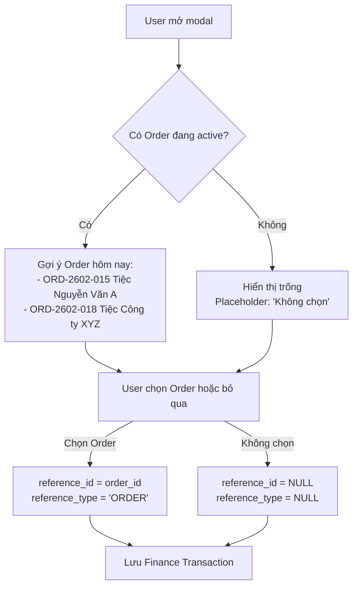
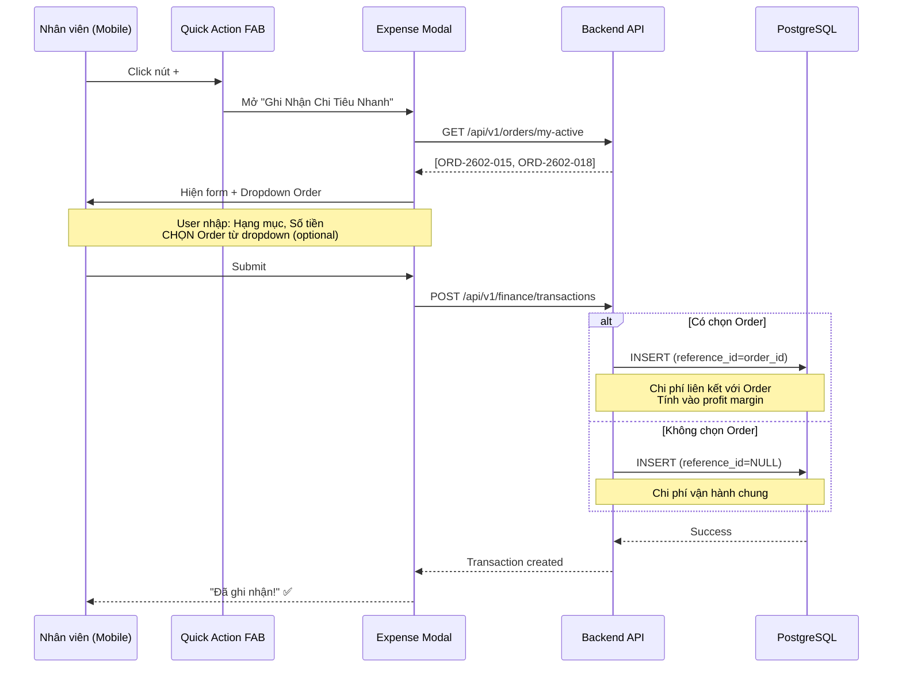
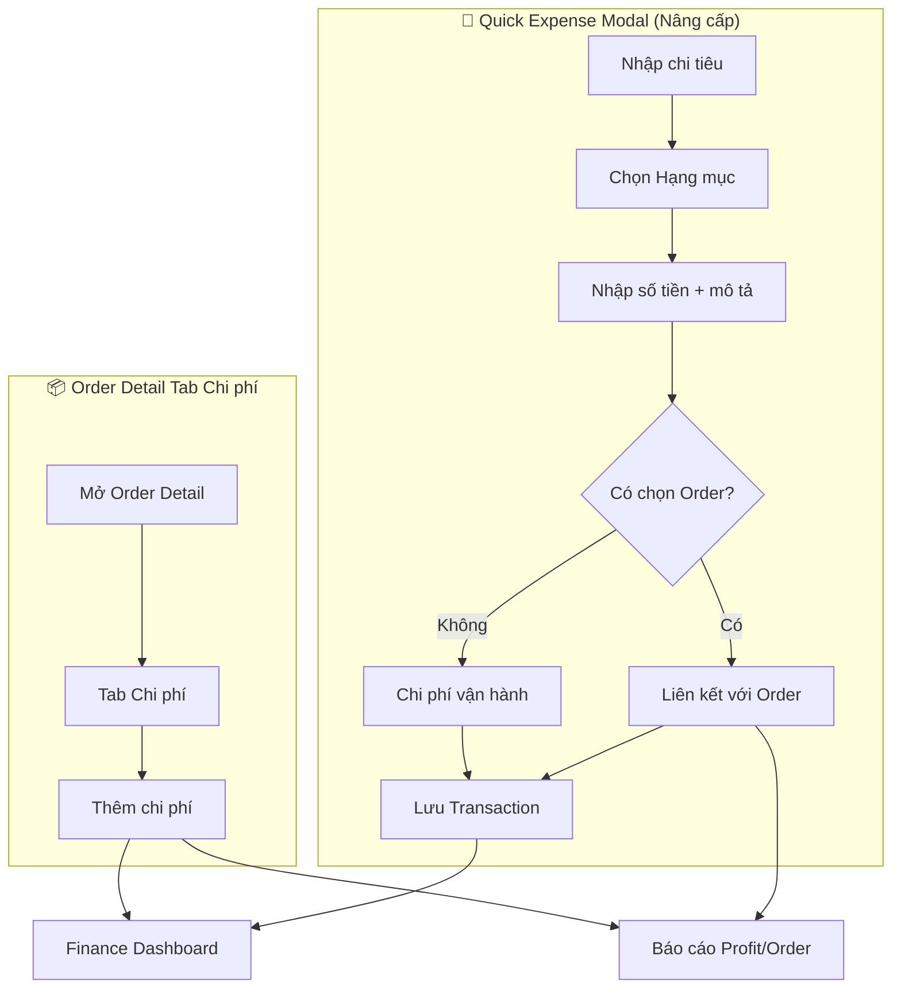

# Báo Cáo Nghiên Cứu Bổ Sung: Chi Tiêu Tại Hiện Trường (Field Expense)

> **Ngày:** 03/02/2026  
> **Loại:** Addendum cho PRD-quick-expense-research.md  
> **Use Case:** Nhân viên đang phục vụ event cần ghi chi tiêu nhanh cho sự kiện đó

---

## TL;DR - Khuyến Nghị

> [!IMPORTANT]
> **KHUYẾN NGHỊ: Thêm field "Đơn hàng" (TÙY CHỌN) vào modal Quick Expense hiện tại.**
> 
> Đây là cách nhanh nhất để giải quyết vấn đề mà KHÔNG phức tạp hóa UX.

---

## 1. Use Case Mới: Field Expense

```
User Story: Nhân viên phục vụ tại event cần mua thêm đồ khẩn cấp
            và muốn ghi nhận CHO ĐƠN HÀNG cụ thể đang phục vụ.

Persona: Anh Tuấn - Trưởng nhóm phục vụ
Context: 10:00 AM, đang tại địa điểm event, khách yêu cầu thêm đá
         Dùng điện thoại, cần ghi nhanh trong 30 giây
Priority: TỐC ĐỘ + Liên kết đúng Order
```

**Điểm khác biệt so với 2 use case trước:**

| Tiêu chí | Quick Expense (Bà Lan) | Order Cost (Chị Mai) | Field Expense (Anh Tuấn) |
|:---------|:----------------------:|:--------------------:|:------------------------:|
| Vị trí | Văn phòng/Chợ | Văn phòng | **Hiện trường event** |
| Thiết bị | Desktop/Mobile | Desktop | **Mobile only** |
| Cần Order? | ❌ Không | ✅ Bắt buộc | ⚡ **Tùy chọn** |
| Độ gấp | Bình thường | Bình thường | **Rất gấp** |

---

## 2. Giải Pháp Đề Xuất

### 2.1 Sửa đổi Modal "Ghi Nhận Chi Tiêu Nhanh"

**Thêm 1 field TÙY CHỌN: "Cho đơn hàng" (optional)**

```
┌─────────────────────────────────────────┐
│  Ghi Nhận Chi Tiêu Nhanh               │
├─────────────────────────────────────────┤
│  Hạng mục *        [Nguyên liệu ▼]     │
│                                         │
│  Số tiền *         [150.000        ] đ  │
│                                         │
│  Mô tả *           [Mua thêm 2 bao đá] │
│                                         │
│  ┌──────────────────────────────────┐  │
│  │ 📦 Cho đơn hàng (tùy chọn)       │  │
│  │ [ORD-2602-015 - Tiệc Nguyễn V...▼] │  │
│  └──────────────────────────────────┘  │
│                                         │
│  Hình hóa đơn      [📷 Chụp]           │
│                                         │
│        [Hủy]     [💾 Ghi nhận]         │
└─────────────────────────────────────────┘
```

### 2.2 Logic Dropdown "Cho đơn hàng"



---

## 3. Smart Order Suggestion

Để tối ưu UX, hệ thống sẽ **tự động gợi ý** các Order phù hợp:

### 3.1 Tiêu chí gợi ý Order

```python
suggested_orders = get_orders_for_suggestion(
    user_id=current_user.id,
    filters={
        "status": ["CONFIRMED", "IN_PROGRESS"],  # Đang thực hiện
        "event_date": today(),                    # Diễn ra hôm nay
        "assigned_staff": current_user.id         # User được assign vào
    },
    sort="event_date ASC",
    limit=5
)
```

### 3.2 API Endpoint mới

```
GET /api/v1/orders/my-active

Response:
{
  "orders": [
    {
      "id": "uuid-...",
      "code": "ORD-2602-015",
      "customer_name": "Tiệc Nguyễn Văn A",
      "event_date": "2026-02-03",
      "event_location": "123 Nguyễn Huệ, Q1"
    }
  ]
}
```

---

## 4. Luồng Nghiệp Vụ Updated



---

## 5. So Sánh 3 Phương Án

| Phương án | Mô tả | Pro | Con |
|:----------|:------|:----|:----|
| **A: Giữ nguyên** | Không thay đổi | Zero effort | ❌ Không giải quyết use case |
| **B: Thêm field optional** | Thêm dropdown "Cho đơn hàng" vào modal hiện tại | ✅ Giải quyết mọi use case<br/>✅ Backward compatible<br/>✅ Nhanh | Thêm 1 field |
| **C: Tạo modal riêng** | "Field Expense" modal mới | Tách biệt hoàn toàn | ❌ Duplicate code<br/>❌ Training lại user |

> [!TIP]
> **Khuyến nghị: Phương án B** - Thêm field optional

---

## 6. Implementation Effort

| Task | Effort | Priority |
|:-----|:------:|:--------:|
| API `GET /orders/my-active` | 2h | High |
| Thêm dropdown vào Modal | 4h | High |
| Smart suggestion logic | 2h | Medium |
| Mobile UX optimization | 2h | Medium |
| **Total** | **10h (~1.5 ngày)** | |

---

## 7. Kết Luận

### Trả lời câu hỏi của bạn:

> **Q: Khi nhân viên đang phục vụ event cần mua đồ và muốn nhập nhanh cho sự kiện đó thì phải làm sao?**

**A: Thêm field "Cho đơn hàng" (TÙY CHỌN) vào modal Quick Expense hiện tại.**

- Field này sẽ có dropdown với các Order đang thực hiện hôm nay
- Nếu user chọn Order → chi tiêu liên kết với Order đó
- Nếu user bỏ qua → chi tiêu vẫn lưu như chi phí vận hành chung
- **UX vẫn nhanh** vì field là optional, không bắt buộc

---

## 8. Cập Nhật Diagram Tổng Quan



---

## Câu Hỏi Tiếp Theo

Bạn có đồng ý với phương án **thêm field "Cho đơn hàng" (optional)** vào modal hiện tại không?

Nếu đồng ý, tôi sẽ tạo Implementation Plan chi tiết.
