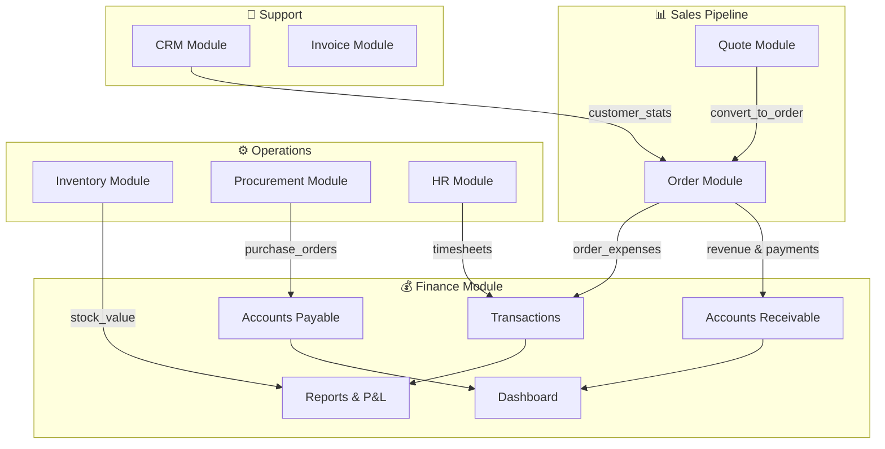

# PRD: Finance Module Business Flows
## Ẩm Thực Giao Tuyết Catering ERP

**Version**: 1.0  
**Date**: 2026-02-04  
**Status**: Research Complete

---

## 1. Executive Summary

Tài liệu này mô tả chi tiết luồng nghiệp vụ của module Tài Chính (Finance) với tất cả các module khác trong hệ thống Catering ERP. Dựa trên phân tích codebase hiện tại và nghiên cứu best practices ngành Catering.

### Key Findings
- Finance module có **62 API endpoints** tích hợp với 7 modules khác
- **4 luồng chính**: Revenue (Order), Payables (Procurement), Labor (HR), Event P&L
- **Receivables**: Tính toán real-time từ Order balance
- **Payables**: Tích hợp Purchase Order từ Procurement

---

## 2. Module Architecture Overview



---

## 3. Detailed Integration Flows

### 3.1 Finance ↔ Order Module (Revenue & Receivables)

**Status**: ✅ Implemented

| Integration Point | Direction | Description |
|:------------------|:----------|:------------|
| Revenue Tracking | Order → Finance | `final_amount` from Orders feeds Dashboard revenue |
| Payment Recording | Order → Finance | `OrderPaymentModel` tracks deposits and payments |
| Receivables Calculation | Finance ← Order | Real-time balance = `final_amount - paid_amount` |
| Overdue Alerts | Finance ← Order | Alert on `balance > 0` and `event_date < today - threshold` |
| Event P&L | Finance ← Order | Per-order profitability analysis |
| Direct Expenses | Finance ↔ Order | `add_order_expense()` links costs to orders |

**Key API Endpoints**:
```
GET  /finance/dashboard/stats       → Aggregates revenue from orders
GET  /finance/receivables           → Lists unpaid order amounts  
GET  /finance/receivables/alerts    → Overdue payment alerts (R2)
GET  /finance/orders/{id}/pnl       → Event-based P&L breakdown
POST /orders/{id}/expenses          → Add direct expense to order
```

**Data Flow**:
```
Order Created → Order Confirmed → [Payments Recorded] → Event Complete
       ↓              ↓                  ↓                    ↓
   Revenue++    Receivable++       Receivable--         P&L Calculated
```

---

### 3.2 Finance ↔ Quote Module (Indirect via Order)

**Status**: ✅ Implemented (via Order conversion)

| Integration Point | Direction | Description |
|:------------------|:----------|:------------|
| Quote-to-Order Conversion | Quote → Order | `convert_quote_to_order()` creates Order with items |
| Deposit Transfer | Quote → Order | Deposits received on Quote transfer to Order |
| Revenue Forecast | Quote → Finance | Approved quotes = potential revenue |

**Data Flow**:
```
Quote DRAFT → Quote APPROVED → Convert to Order → Order CONFIRMED
                                      ↓
                            Quote.deposit_amount → Order.paid_amount
```

---

### 3.3 Finance ↔ Procurement Module (Payables)

**Status**: ✅ Implemented

| Integration Point | Direction | Description |
|:------------------|:----------|:------------|
| Payables Listing | Finance ← Procurement | Unpaid Purchase Orders = Accounts Payable |
| Payment Schedule | Finance ← Procurement | Due dates based on payment terms |
| Vendor Payments | Finance ← Procurement | Record payments against POs |
| COGS Tracking | Finance ← Procurement | Cost of goods for P&L reports |

**Key API Endpoints**:
```
GET  /finance/payables              → Lists unpaid purchase orders
GET  /finance/payables/summary      → Total outstanding to suppliers
GET  /finance/payment-schedule      → POs sorted by due date
PUT  /finance/payment-schedule/{id}/terms → Update payment terms
```

---

### 3.4 Finance ↔ HR Module (Labor Costs)

**Status**: ✅ Implemented

| Integration Point | Direction | Description |
|:------------------|:----------|:------------|
| Timesheet to Finance | HR → Finance | Auto-create PAYMENT transactions from timesheets |
| Labor Cost Tracking | Finance ← HR | Aggregate labor costs for P&L |
| Per-Event Labor | Finance ← HR | Allocate labor cost to specific orders |

**Key API Endpoints**:
```
POST /finance/labor/generate        → Create transactions from timesheets
     Parameters: start_date, end_date, hourly_rate
```

---

### 3.5 Finance ↔ Inventory Module (COGS & Stock Value)

**Status**: 🔶 Partial

| Integration Point | Direction | Description |
|:------------------|:----------|:------------|
| Stock Value | Finance ← Inventory | Current stock × unit cost |
| COGS Calculation | Finance ← Inventory | Cost of items used in orders |
| Lot Tracking | Finance ← Inventory | FIFO costing for accurate P&L |

**Current Gap**: COGS calculation uses `estimated_cogs`, không có link trực tiếp đến Inventory transactions.

---

### 3.6 Finance ↔ CRM Module (Customer Stats)

**Status**: ✅ Implemented (via Order)

| Integration Point | Direction | Description |
|:------------------|:----------|:------------|
| Customer Revenue | CRM ← Finance | Total spent calculated from orders |
| Payment History | CRM ← Finance | Customer payment reliability |
| Interaction Logging | CRM ← Order | Auto-log ORDER_PLACED, QUOTE_SENT |

---

### 3.7 Finance ↔ Invoice Module

**Status**: 🔴 Not Integrated

| Integration Point | Direction | Description |
|:------------------|:----------|:------------|
| Invoice Generation | Finance → Invoice | Generate invoice from Order |
| Invoice Payment | Invoice → Finance | Link payment to transaction |

**Gap**: Invoice module exists but not connected to Finance workflow.

---

## 4. Business Rules Summary

### 4.1 Receivables Rules
- `Receivable = Order.final_amount - Order.paid_amount`
- Alert trigger: `balance > 0 AND event_date < today - 7 days`
- Priority: HIGH if >15 days overdue

### 4.2 Payables Rules
- `Payable = PO.total_amount` where status in [APPROVED, SENT, RECEIVED]
- Due date = `PO.created_at + payment_terms_days`
- Status: OVERDUE if `due_date < today`

### 4.3 Event P&L Rules
```
Gross Profit = final_amount - (estimated_cogs + actual_cogs)
Net Profit = Gross Profit - (labor_cost + overhead)
Gross Margin = Gross Profit / final_amount × 100
Net Margin = Net Profit / final_amount × 100
Overhead = 5% of final_amount (configurable)
```

---

## 5. Identified Gaps & Recommendations

### 5.1 Critical Gaps

| # | Gap | Impact | Recommendation |
|:-:|:----|:-------|:---------------|
| G1 | Invoice-Finance disconnect | Cannot track invoice status | Connect Invoice.paid → Transaction |
| G2 | COGS from Inventory | Inaccurate cost tracking | Link Order Items to Inventory Lots |
| G3 | No Chart of Accounts usage | Limited accounting reports | Implement double-entry bookkeeping |

### 5.2 Enhancement Opportunities

| # | Enhancement | Value | Effort |
|:-:|:------------|:------|:-------|
| E1 | Auto-invoice on Order Confirm | Streamlined billing | Medium |
| E2 | Vendor Payment Automation | Faster AP processing | High |
| E3 | Budget vs Actual Reports | Better planning | Medium |
| E4 | Customer Credit Limit | Risk management | Low |

---

## 6. Technical Implementation Status

### 6.1 Module Endpoint Count

| Module | Endpoints | Finance Integration |
|:-------|:---------:|:-------------------:|
| Finance | 62 | N/A |
| Order | 60 | ✅ Full |
| Quote | 25 | ✅ Via Order |
| Procurement | 21 | ✅ Full |
| Inventory | 30 | 🔶 Partial |
| CRM | 12 | ✅ Via Order |
| HR | ~15 | ✅ Labor Costs |
| Invoice | ~10 | 🔴 Not Connected |

---

*Generated by: RESEARCH-PRD v2.3 Workflow*  
*Sources: Internal codebase analysis + ERP Finance best practices research*
