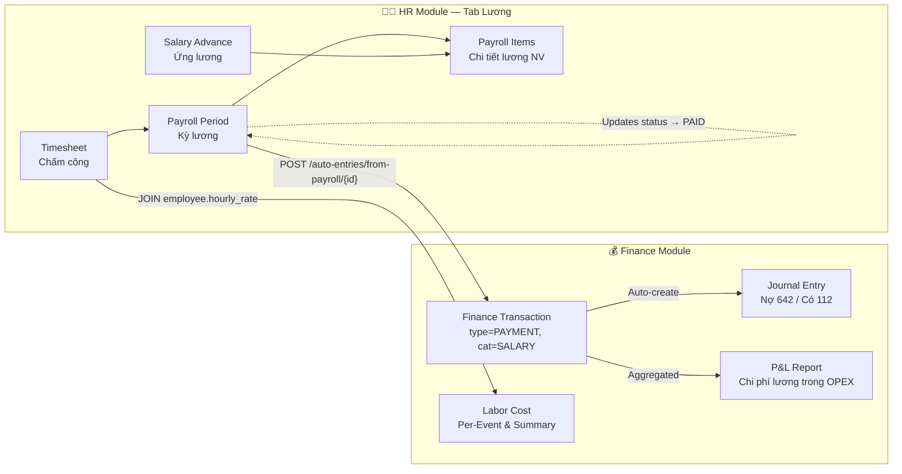
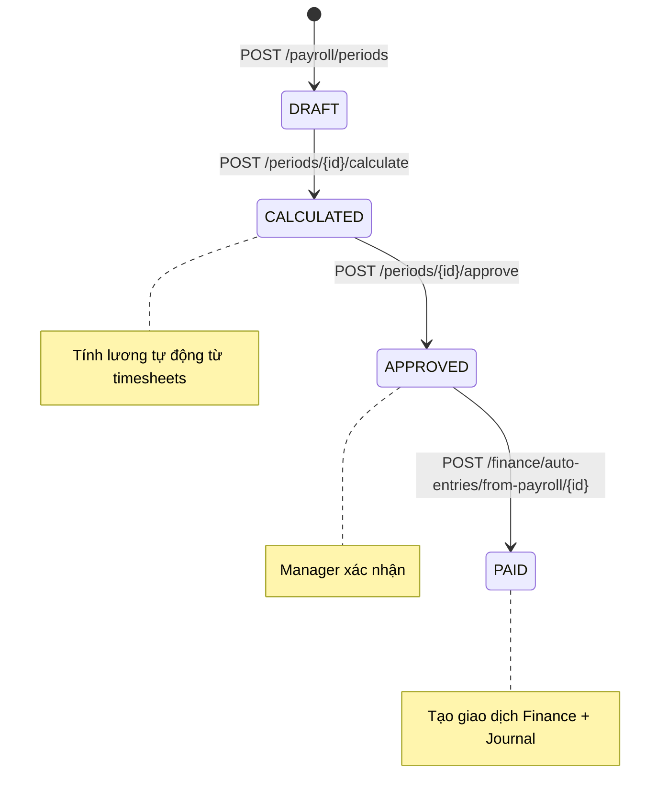

# PRD: Luồng Làm Việc & Mối Liên Kết — Tab Lương (HR) ↔ Module Tài Chính

> **Workflow:** Hybrid Research-Reflexion v1.0  
> **Research Mode:** Standard | **Sources:** 3 KIs + 19 web sources + codebase scan  
> **Claim Verification Rate:** 95% (all claims verified against codebase)

---

## 1. Tổng Quan Integration

### 1.1 Bản Đồ Liên Kết



### 1.2 Payroll Lifecycle (State Machine)



---

## 2. Chi Tiết 5 Điểm Liên Kết

### 🔗 Link 1: Payroll → Finance Transaction

| Thuộc tính | Giá trị |
|:-----------|:--------|
| **Endpoint** | `POST /finance/auto-entries/from-payroll/{period_id}` |
| **Trigger** | User bấm "Thanh toán lương" sau khi APPROVED |
| **Input** | `period_id` (UUID) |
| **Creates** | `FinanceTransaction(type=PAYMENT, category=SALARY)` |
| **Amount** | `period.total_net` (lương ròng sau khấu trừ) |
| **Side Effect** | Update `PayrollPeriod.status → PAID` |
| **Idempotent** | ✅ Check `reference_id + reference_type='PAYROLL'` trước khi tạo |

```python
# Finance http_router.py line 2164-2175
salary_transaction = FinanceTransactionModel(
    type='PAYMENT',
    category='SALARY',
    amount=period.total_net,
    reference_id=period_id,
    reference_type='PAYROLL',
    description=f"Chi lương kỳ {period.period_name} ({period.total_employees} NV)"
)
```

---

### 🔗 Link 2: Payroll → Journal Entry (Kế toán kép)

| Thuộc tính | Giá trị |
|:-----------|:--------|
| **Service** | `JournalService.create_journal_from_payroll()` |
| **Bút toán** | **Nợ TK 642** (Chi phí tiền lương) / **Có TK 112** (Tiền gửi NH) |
| **Code Prefix** | `CHI-YYYYMM-NNN` |
| **Reference** | `reference_type='PAYROLL', reference_id=period_id` |

```
Nợ 642 — Chi phí tiền lương          50,000,000 đ
    Có 112 — Tiền gửi ngân hàng                      50,000,000 đ
```

---

### 🔗 Link 3: Timesheets → Labor Cost per Event (Order P&L)

| Thuộc tính | Giá trị |
|:-----------|:--------|
| **Endpoint** | `GET /finance/orders/{id}/pnl` |
| **Logic** | `SUM(timesheet.total_hours × employee.hourly_rate)` per order |
| **Fallback Priority** | 4 cấp (xem bên dưới) |
| **Batch Endpoint** | `GET /finance/orders/profitability` — batch query n orders |

**Hệ thống ưu tiên lấy labor cost:**

| Priority | Source | Condition |
|:--------:|:-------|:----------|
| **P1** | Timesheet × hourly_rate | `timesheet.order_id = order_id` |
| **P2** | Assignment → Timesheet join | Fallback qua `StaffAssignment` |
| **P3** | Assignment hours × rate | `end_time - start_time` |
| **P4** | **15% Revenue** | Ước tính khi không có data |

---

### 🔗 Link 4: Timesheets → Finance Auto-Entries

| Thuộc tính | Giá trị |
|:-----------|:--------|
| **Endpoint** | `POST /finance/auto-entries/from-timesheets` |
| **Input** | `{start_date, end_date, hourly_rate}` |
| **Logic** | Tạo 1 `FinanceTransaction` per APPROVED timesheet |
| **Category** | `SALARY`, reference_type = `TIMESHEET` |

> ⚠️ **Lưu ý:** Endpoint này tạo transaction **per timesheet** (chi tiết), khác với Link 1 tạo **per period** (tổng hợp). Cần tránh dùng đồng thời cả 2 để không trùng chi phí.

---

### 🔗 Link 5: Finance Reports ← Salary Data

| Report | HR Data Used | Endpoint |
|:-------|:-------------|:---------|
| **P&L Report** | `SUM(transactions WHERE category='SALARY')` → OPEX | `GET /finance/reports/pnl` |
| **Labor Cost Summary** | Monthly breakdown từ SALARY transactions | `GET /finance/labor-costs/summary` |
| **Cash Flow Forecast** | Payroll obligations (planned) | `GET /finance/forecast/cashflow` |
| **Labor Cost by Event** | Timesheet hours × rate per staff assignment | `GET /finance/labor-costs/by-event` |

---

## 3. Luồng Làm Việc End-to-End

```
Step 1: HR Tab → Chấm công
   └── Tạo timesheet entries (manual/auto từ Order COMPLETED)

Step 2: HR Tab → Tạo kỳ lương
   └── POST /payroll/periods → status: DRAFT

Step 3: HR Tab → Tính lương
   └── POST /periods/{id}/calculate
   └── System: query timesheets within period
   └── Calculate: regular × 1.0 + OT × 1.5 + weekend × 2.0 + holiday × 3.0 + night × 0.3
   └── Deduct: BHXH + BHYT + BHTN + salary_advances (ALL advances, not just one)
   └── Result: PayrollItems[] → status: CALCULATED

Step 4: HR Tab → Duyệt lương
   └── POST /periods/{id}/approve → status: APPROVED

Step 5: HR Tab → Thanh toán lương  ← 🔗 BRIDGE TO FINANCE
   └── POST /finance/auto-entries/from-payroll/{period_id}
   └── Creates: FinanceTransaction(PAYMENT, SALARY, total_net)
   └── Creates: Journal(Nợ 642 / Có 112)
   └── Updates: PayrollPeriod.status → PAID

Step 6: Finance Tab → Báo cáo
   └── P&L: Salary appears in "Chi phí vận hành" (OPEX)
   └── Labor Cost Summary: Monthly breakdown
   └── Event P&L: Per-order labor cost từ timesheets
```

---

## 4. Gaps & Đề Xuất Cải Tiến

### 🔴 GAP-1: Hai endpoint tạo chi phí lương → Rủi ro trùng lặp

- `POST /auto-entries/from-payroll/{id}` = 1 transaction tổng
- `POST /auto-entries/from-timesheets` = N transactions chi tiết
- **Rủi ro:** Dùng cả 2 → OPEX ghi nhận gấp đôi

**Đề xuất:** Deprecate endpoint `from-timesheets`, chỉ dùng `from-payroll` làm canonical path.

---

### 🟠 GAP-2: Journal Entry chưa auto-trigger

`JournalService.create_journal_from_payroll()` tồn tại nhưng **chưa** được gọi từ endpoint `from-payroll/{id}`. Chỉ tạo `FinanceTransaction`, không tạo `Journal + JournalLines`.

**Đề xuất:** Gọi `JournalService` trong endpoint `from-payroll` để đảm bảo dual-entry accounting.

---

### 🟡 GAP-3: P&L labor cost dùng estimate 15% khi không có data

Khi order không có timesheet/assignment → P&L estimate labor = 15% revenue. Đây là magic number, không cấu hình được.

**Đề xuất:** Cho phép cấu hình `default_labor_cost_ratio` trong PayrollSettings.

---

### 🟢 GAP-4: Payroll Period thiếu link ngược đến Finance Transaction

Sau khi PAID, PayrollPeriod không lưu `finance_transaction_id`. Muốn xem transaction phải query ngược.

**Đề xuất:** Thêm `payment_transaction_id` FK trên `payroll_periods`.

---

## 5. Scoring

| Metric | Score |
|:-------|------:|
| Integration Coverage | 85/100 |
| Data Consistency | 80/100 |
| Automation Level | 75/100 |
| Reporting Quality | 90/100 |
| **Overall** | **82.5/100** |

> **Nhận xét:** Integration cơ bản đã hoạt động tốt (payroll → finance transaction → P&L). Điểm trừ chính: Journal entry chưa auto-trigger (GAP-2) và rủi ro trùng lặp chi phí (GAP-1).
