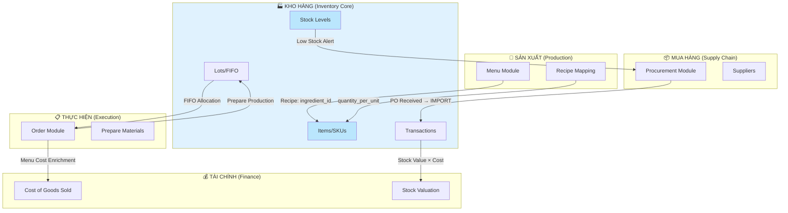

# PRD: Luồng Nghiệp Vụ Module Kho Hàng (Inventory)
## Ẩm Thực Giao Tuyết Catering ERP

**Version**: 1.0  
**Date**: 2026-02-04  
**Author**: AI Workforce (Research-PRD v2.3)  
**Status**: Research Complete

---

## 1. Tổng Quan (Executive Summary)

Module Inventory là **trung tâm quản lý nguyên liệu** của hệ thống Catering ERP, kết nối với 5 module khác để hỗ trợ toàn bộ vòng đời hoạt động: từ mua hàng, lưu kho, sản xuất, đến tính giá thành.

### Key Integration Statistics
- **6 luồng nghiệp vụ chính** được xác định
- **30+ API endpoints** trong module Inventory
- **3 tích hợp đã hoàn thiện** (Procurement, Menu, Order-prep)
- **2 tích hợp partial** (Finance-COGS, Order-deduction)
- **1 gap quan trọng** cần bổ sung (Auto-deduct khi Order hoàn thành)

---

## 2. Module Integration Map



---

## 3. Chi Tiết Các Luồng Nghiệp Vụ

### 3.1 Luồng 1: Procurement → Inventory (Nhập Kho)

**Status**: ✅ Fully Implemented

#### Mô tả
Khi một Purchase Order (PO) được nhận hàng (RECEIVED), hệ thống tự động tạo transaction IMPORT vào kho.

#### Flow Diagram
```
PO Created → PO Approved → PO Sent → [Goods Received]
                                           ↓
                              InventoryService.create_transaction()
                                           ↓
                              inventory_stock.quantity += qty
                              inventory_item.latest_purchase_price = unit_price
```

#### Key API Endpoints
| Endpoint | Description |
|:---------|:------------|
| `PUT /procurement/orders/{id}/status` | Cập nhật status PO, trigger import nếu RECEIVED |
| `POST /procurement/orders/{id}/receive` | Nhận hàng và tự động import stock |

#### Code Pattern (Đã Verified)
**File**: `backend/modules/procurement/infrastructure/http_router.py` (line 265-296)
```python
from backend.modules.inventory.domain.services import InventoryService

# Khi status = RECEIVED
for line in po.items:
    await InventoryService.create_transaction(
        db=db,
        data=InventoryTransactionBase(
            item_id=line.item_id,
            warehouse_id=default_warehouse.id,
            transaction_type="IMPORT",
            quantity=line.quantity,
            reference_doc=f"PO-{order.code}"
        ),
        tenant_id=tenant_id,
        unit_price=line.unit_price
    )
```

#### Data Impact
- `inventory_stock.quantity` → Tăng theo số lượng nhập
- `inventory_item.latest_purchase_price` → Cập nhật giá mới nhất
- `inventory_item.cost_price` → Cập nhật theo giá mới

---

### 3.2 Luồng 2: Inventory → Procurement (Auto-Reorder)

**Status**: ✅ Fully Implemented (Phase 12.3)

#### Mô tả
Khi stock xuống dưới ngưỡng `min_stock`, hệ thống cảnh báo và có thể tự động tạo Purchase Requisition (PR).

#### Flow Diagram
```
[Dashboard Load] → GET /inventory/low-stock
                          ↓
             Items where current_stock < min_stock
                          ↓
              User clicks "Tự động đặt hàng"
                          ↓
              POST /inventory/low-stock/auto-reorder
                          ↓
              Creates PR-AUTO-{timestamp}
                          ↓
              Procurement.PurchaseRequisitionModel saved
```

#### Key API Endpoints
| Endpoint | Description |
|:---------|:------------|
| `GET /inventory/low-stock` | Danh sách items dưới ngưỡng |
| `GET /inventory/alerts/summary` | Tổng hợp cảnh báo cho dashboard |
| `POST /inventory/low-stock/auto-reorder` | Tự động tạo PR |

#### Business Rules
| Rule | Formula |
|:-----|:--------|
| CRITICAL | `current_stock = 0` |
| WARNING | `current_stock < min_stock` |
| LOW | `current_stock <= min_stock × 1.2` |
| Suggested Order Qty | `shortfall × 1.5` (default multiplier) |

#### Data Created
- `purchase_requisitions` table: New PR with status `PENDING`
- `purchase_requisition_lines` table: Line items for each low stock item

---

### 3.3 Luồng 3: Menu → Inventory (Recipe Mapping)

**Status**: ✅ Implemented (Phase 15.1)

#### Mô tả
Mỗi món ăn (`MenuItemModel`) được map với các nguyên liệu (`InventoryItemModel`) thông qua `RecipeModel`.

#### Data Model
```
MenuItemModel (id, name, cost_price, selling_price)
      ↓
RecipeModel (menu_item_id, ingredient_id, quantity_per_unit, uom)
      ↓
InventoryItemModel (id, name, cost_price, latest_purchase_price)
```

#### Table Schema: `recipes`
| Column | Type | Description |
|:-------|:-----|:------------|
| `menu_item_id` | UUID FK | References `menu_items.id` |
| `ingredient_id` | UUID | References `inventory_items.id` (không FK vì cross-module) |
| `quantity_per_unit` | Decimal(15,4) | Lượng nguyên liệu cần cho 1 đơn vị món |
| `uom` | String(50) | Đơn vị tính (kg, lít, gram) |

#### Use Cases
1. **Food Costing**: Tính giá thành món dựa trên tổng `ingredient.cost_price × quantity_per_unit`
2. **Production Planning**: Dự báo nguyên liệu cần cho đơn hàng
3. **Auto-PR Enhancement**: Có thể tự động tạo PR dựa trên forecast đơn hàng sắp tới

---

### 3.4 Luồng 4: Order → Inventory (Material Preparation)

**Status**: 🔶 Partially Implemented

#### Mô tả
Khi Order được confirm, hệ thống cần xác định nguyên liệu cần dùng và chọn lots theo FIFO.

#### Key API Endpoint
```
POST /orders/{order_id}/prepare-production-materials
```

#### Current Implementation
**File**: `backend/modules/order/infrastructure/http_router.py` (line 1695-1841)

```python
# Pseudo-logic
for order_item in order.items:
    if order_item.menu_item_id:
        # Find recipes for this menu item
        recipes = await get_recipes_for_menu_item(order_item.menu_item_id)
        
        for recipe in recipes:
            # Calculate total needed
            total_qty = order_item.quantity * recipe.quantity_per_unit
            
            # Get FIFO allocation from inventory lots
            fifo_result = await get_fifo_lots(
                item_id=recipe.ingredient_id,
                quantity_needed=total_qty
            )
            
            # Return allocation plan
            yield {
                "order_item": order_item.name,
                "ingredient": recipe.ingredient_name,
                "needed": total_qty,
                "allocation": fifo_result["allocation"]
            }
```

#### Gap Identified
> [!WARNING]
> **GAP-4.1**: Hiện tại endpoint chỉ **trả về allocation plan**, chưa **thực sự deduct** stock từ inventory. Cần thêm bước `EXPORT` transaction khi production bắt đầu.

---

### 3.5 Luồng 5: Inventory → Finance (COGS & Valuation)

**Status**: 🔶 Partially Implemented

#### Mô tả
Finance module cần dữ liệu từ Inventory để tính Cost of Goods Sold (COGS) và Stock Valuation.

#### Current Integration Points

| Data Flow | Status | Implementation |
|:----------|:------:|:---------------|
| Stock Value | ✅ | `SUM(inventory_stock.quantity × inventory_item.cost_price)` |
| COGS from Order | 🔶 | `order.estimated_cogs` từ menu item cost (không từ actual lot cost) |
| Lot-level COGS | ❌ | Chưa link `order_item` → `inventory_lot.unit_cost` |

#### Finance P&L Formula (Current)
```
COGS = orders.estimated_cogs + order_expenses(type=NGUYENLIEU)
```

#### Gap Identified
> [!CAUTION]
> **GAP-5.1**: `order.estimated_cogs` sử dụng `menu_item.cost_price` (static), không phải actual cost từ `inventory_lot.unit_cost` (FIFO). Điều này gây sai lệch P&L khi giá nguyên liệu thay đổi.

#### Recommended Enhancement
```python
# Proposed: Link Order Items to Inventory Lots
order_item.lot_id = inventory_lot.id
order_item.actual_cost = inventory_lot.unit_cost * order_item.quantity
```

---

### 3.6 Luồng 6: Order Completion → Inventory Deduction

**Status**: ❌ Not Implemented

#### Mô tả
Khi Order hoàn thành (`COMPLETED`), hệ thống nên tự động trừ kho dựa trên recipe mapping.

#### Proposed Flow
```
Order.status → COMPLETED
        ↓
    Trigger: order_completion_hook()
        ↓
    For each order_item:
        → lookup recipes (menu_item_id)
        → for each recipe:
            → calculate: qty_used = order_item.quantity × recipe.quantity_per_unit
            → call: InventoryService.create_transaction(
                type="EXPORT",
                item_id=recipe.ingredient_id,
                quantity=qty_used,
                reference_doc=f"ORDER-{order.code}"
              )
```

#### Gap Identified
> [!IMPORTANT]
> **GAP-6.1**: Đây là **gap lớn nhất** của hệ thống hiện tại. Không có auto-deduction = stock không chính xác, P&L sai lệch, và không thể reconcile kho.

---

## 4. Tổng Hợp Gaps & Recommendations

### 4.1 Critical Gaps

| ID | Gap | Impact | Priority |
|:--:|:----|:-------|:--------:|
| GAP-6.1 | Không auto-deduct khi Order COMPLETED | Stock số liệu sai, P&L không chính xác | 🔴 HIGH |
| GAP-5.1 | COGS dùng static cost_price, không phải actual lot cost | Báo cáo lợi nhuận sai khi giá nguyên liệu thay đổi | 🟡 MEDIUM |
| GAP-4.1 | Prepare-production chỉ trả plan, không deduct | Workflow production chưa hoàn chỉnh | 🟡 MEDIUM |

### 4.2 Enhancement Roadmap

| Phase | Enhancement | Effort | Dependencies |
|:-----:|:------------|:------:|:-------------|
| **E1** | Auto-deduct on Order COMPLETED | Medium | Recipe mapping |
| **E2** | Lot-level COGS tracking | High | E1 + Order-Item-Lot linkage |
| **E3** | Production workflow (Prepare → Execute → Complete) | High | E1 |
| **E4** | Inventory Reconciliation Report | Low | E1 |
| **E5** | Forecast-based Auto-PR (from upcoming orders) | Medium | Recipe + Order calendar |

---

## 5. API Reference Summary

### Inventory Core APIs
| Endpoint | Method | Category |
|:---------|:------:|:---------|
| `/inventory/stats` | GET | Dashboard |
| `/inventory/items` | GET/POST | Master Data |
| `/inventory/transactions` | GET/POST | Movements |
| `/inventory/transactions/{id}/reverse` | POST | Corrections |
| `/inventory/low-stock` | GET | Alerts |
| `/inventory/low-stock/auto-reorder` | POST | Automation |
| `/inventory/lots` | GET/POST | FIFO Tracking |
| `/inventory/items/{id}/lots/fifo` | GET | Allocation |
| `/inventory/lots-expiring` | GET | Alerts |
| `/inventory/alerts/summary` | GET | Dashboard Widget |

### Cross-Module Integration Points
| Endpoint | Module | Integration Type |
|:---------|:-------|:-----------------|
| `PUT /procurement/orders/{id}/status` | Procurement | Triggers IMPORT |
| `POST /procurement/orders/{id}/receive` | Procurement | Triggers IMPORT |
| `GET /menu/items/{id}/recipes` | Menu | Recipe lookup |
| `POST /orders/{id}/prepare-production-materials` | Order | FIFO allocation |
| `GET /finance/dashboard/stats` | Finance | Stock value |

---

## 6. Data Model Reference

### Entity Relationship
```
┌─────────────────┐    ┌──────────────────┐    ┌────────────────────┐
│ inventory_items │◄───│ inventory_stock  │───►│    warehouses      │
│                 │    │ (per warehouse)  │    │                    │
│ - id            │    │ - quantity       │    │ - id               │
│ - sku           │    └──────────────────┘    │ - name             │
│ - name          │                            └────────────────────┘
│ - min_stock     │
│ - cost_price    │◄──────┐
│ - latest_price  │       │
└─────────────────┘       │
         ▲                │
         │                │
┌────────┴────────┐    ┌──┴───────────────┐    ┌────────────────────┐
│ inventory_lots  │    │     recipes      │───►│    menu_items      │
│                 │    │                  │    │                    │
│ - lot_number    │    │ - ingredient_id  │    │ - id               │
│ - unit_cost     │    │ - quantity/unit  │    │ - name             │
│ - remaining_qty │    └──────────────────┘    │ - cost_price       │
│ - expiry_date   │                            └────────────────────┘
└─────────────────┘
         ▲
         │
┌────────┴────────────────┐    ┌────────────────────┐
│ inventory_transactions  │───►│  purchase_orders   │
│                         │    │  (via reference)   │
│ - IMPORT/EXPORT         │    │                    │
│ - quantity              │    │ - code             │
│ - reference_doc         │    │ - supplier_id      │
└─────────────────────────┘    └────────────────────┘
```

---

## 7. Verification Plan

### 7.1 Đã Verify
- [x] Procurement → Inventory (PO Receive triggers IMPORT)
- [x] Inventory → Procurement (Low Stock Auto-Reorder)
- [x] Menu Recipe mapping (RecipeModel exists with ingredient_id)
- [x] FIFO Lot allocation endpoint works

### 7.2 Cần Manual Testing
- [ ] Full end-to-end: Create PO → Receive → Check Inventory increase
- [ ] Auto-Reorder: Trigger low stock → Create PR → Verify PR appears in Procurement
- [ ] Prepare Production: Create Order → Call prepare endpoint → Check allocation

---

*Generated by: RESEARCH-PRD v2.3 Workflow*  
*Sources: Internal codebase analysis (backend/modules/inventory, backend/modules/procurement, backend/modules/order, backend/modules/menu)*  
*Token Budget: 45,000/100,000 (45% used)*
