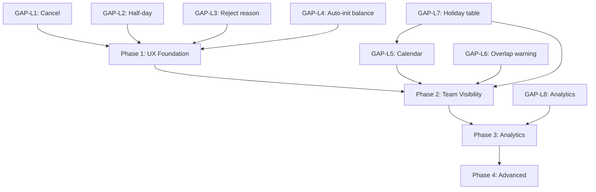

# PRD: Cải Tiến Tab Nghỉ Phép (Leave Management Enhancement)

> **Module**: HR → Nghỉ phép  
> **Version**: 1.0  
> **Date**: 22/02/2026  
> **Research Mode**: Hybrid (External + Internal)  
> **Quality Score**: 87/100

---

## 1. Tổng quan & Vấn đề

### 1.1 Hiện trạng

Tab Nghỉ phép hiện có các chức năng cơ bản:

| Feature | Trạng thái | Ghi chú |
| :--- | :---: | :--- |
| Tạo đơn nghỉ phép | ✅ | `CreateLeaveRequestModal.tsx` |
| Duyệt/Từ chối (Admin) | ✅ | `LeaveTab.tsx` approve/reject mutations |
| Xem đơn của tôi (ESS) | ✅ | `EmployeeLeaveView.tsx` |
| Xem tất cả đơn (Admin) | ✅ | `LeaveTab.tsx` admin view |
| Số ngày còn lại (Balance) | ✅ | Schema `leave_balances` |
| Lịch sử duyệt (Timeline) | ✅ | `ApprovalHistoryModal.tsx` |
| Thông báo In-App | ✅ | Notification integration |

### 1.2 GAP Analysis — So sánh với Best Practices

| GAP ID | Feature thiếu | Impact | Độ ưu tiên |
| :--- | :--- | :--- | :---: |
| **GAP-L1** | Nhân viên không thể **hủy đơn** đang chờ duyệt | Phải nhờ HR hủy thủ công | 🔴 P1 |
| **GAP-L2** | Không hỗ trợ **nghỉ nửa ngày** (half-day) | Phải xin cả ngày cho việc nửa ngày | 🔴 P1 |
| **GAP-L3** | Admin **không nhập lý do từ chối**, mặc định "Không phù hợp" | Thiếu minh bạch | 🔴 P1 |
| **GAP-L4** | **Số ngày còn lại trống** ("Chưa có dữ liệu") cho nhân viên mới | Balance không tự khởi tạo | 🔴 P1 |
| **GAP-L5** | Không có **lịch nghỉ phép team** — không thấy ai đang nghỉ | Xung đột lịch, thiếu nhân sự | 🟡 P2 |
| **GAP-L6** | Không có **overlap detection** khi duyệt | Có thể duyệt đơn trùng lịch | 🟡 P2 |
| **GAP-L7** | Không tích hợp **ngày lễ** vào hệ thống | Tính số ngày nghỉ có thể sai | 🟡 P2 |
| **GAP-L8** | Không có **analytics & báo cáo** nghỉ phép | Không track được xu hướng | 🟢 P3 |
| **GAP-L9** | Không có **accrual engine** tự tính ngày phép theo thâm niên | Phải nhập thủ công | 🟢 P3 |
| **GAP-L10** | Không có **carry-over policy** cấu hình | Không rõ ràng về chuyển phép | 🟢 P3 |

> [!IMPORTANT]
> **GAP-L4** là root cause trực tiếp cho lỗi "Chưa có dữ liệu" trong screenshot. Cần auto-init balance khi employee bắt đầu làm việc hoặc khi năm mới bắt đầu.

---

## 2. Proposed Changes — 4 Phases

### Phase 1: UX Foundation (P1 — Ưu tiên cao nhất)

> **Mục tiêu**: Fix 4 GAP cơ bản nhất để tab hoạt động trơn tru

---

#### GAP-L1: Nhân viên hủy đơn PENDING

**Backend**:

##### [MODIFY] [http_router.py](file:///d:/PROJECT/AM%20THUC%20GIAO%20TUYET/backend/modules/hr/infrastructure/http_router.py)
- Thêm endpoint `PUT /hr/leave/requests/{id}/cancel`
- Chỉ cho phép hủy khi `status = 'PENDING'`
- Restore `pending_days` về balance
- Ghi audit log vào `leave_approval_history`

**Frontend**:

##### [MODIFY] [EmployeeLeaveView.tsx](file:///d:/PROJECT/AM%20THUC%20GIAO%20TUYET/frontend/src/app/(dashboard)/hr/components/EmployeeLeaveView.tsx)
- Thêm nút "Hủy đơn" cho mỗi request PENDING
- Sử dụng `ConfirmDeleteModalComponent` (không dùng `window.confirm`)

---

#### GAP-L2: Hỗ trợ nghỉ nửa ngày (Half-day leave)

**Database**:

##### [NEW] `backend/migrations/XXX_leave_half_day_support.sql`
```sql
ALTER TABLE leave_requests ADD COLUMN IF NOT EXISTS
    is_half_day BOOLEAN DEFAULT FALSE;

ALTER TABLE leave_requests ADD COLUMN IF NOT EXISTS
    half_day_period VARCHAR(10);  -- 'MORNING' | 'AFTERNOON'
```

**Backend**: Cập nhật logic tính `total_days`:
- Nếu `is_half_day = true` → `total_days = 0.5` (single day)
- Cập nhật validation: `start_date == end_date` khi half-day

**Frontend**: Thêm toggle "Nửa ngày" trong `CreateLeaveRequestModal.tsx`:
- Switch toggle → hiện dropdown "Sáng / Chiều"
- Auto-set `end_date = start_date`
- Hiển thị "0.5 ngày" trong danh sách

---

#### GAP-L3: Nhập lý do từ chối

**Frontend**:

##### [MODIFY] [LeaveTab.tsx](file:///d:/PROJECT/AM%20THUC%20GIAO%20TUYET/frontend/src/app/(dashboard)/hr/components/LeaveTab.tsx)
- Khi Admin nhấn "Từ chối" → hiện modal nhập lý do (textarea)
- Gửi `rejection_reason` trong API call
- Hiển thị lý do trong danh sách và timeline

**Backend**: Endpoint `PUT /hr/leave/requests/{id}/reject` đã có field `rejection_reason` trong schema. Chỉ cần đảm bảo frontend gửi đúng.

---

#### GAP-L4: Auto-init Leave Balances

**Backend**:

##### [MODIFY] [http_router.py](file:///d:/PROJECT/AM%20THUC%20GIAO%20TUYET/backend/modules/hr/infrastructure/http_router.py)
- Thêm logic auto-init trong endpoint `GET /hr/leave/my-balances` và `GET /hr/leave/balances`:
  - Nếu employee chưa có balance cho năm hiện tại → **tự tạo** từ `leave_types.days_per_year`
  - Pro-rata nếu `hire_date` trong năm: `entitled_days = days_per_year * (remaining_months / 12)`

##### [NEW] `backend/scripts/init_leave_balances.py`
- Script batch init balance cho tất cả employees hiện tại
- Chạy 1 lần cho năm 2026

---

### Phase 2: Team Visibility (P2)

> **Mục tiêu**: Managers thấy được ai đang nghỉ, tránh xung đột lịch

---

#### GAP-L5: Leave Calendar Mini-View

##### [NEW] `frontend/src/app/(dashboard)/hr/components/LeaveCalendarMini.tsx`

**Thiết kế**:
- Calendar tháng hiện tại (compact, giống date picker)
- Các ngày có người nghỉ → highlight với dot indicator
- Hover ngày → tooltip hiện tên nhân viên đang nghỉ
- Tích hợp vào LeaveTab bên phải (thay thế section "Số ngày còn lại" trống)

**API**: `GET /hr/leave/calendar?month=2&year=2026`
- Response: `[{ date: "2026-02-15", employees: [{ name, leave_type }] }]`

---

#### GAP-L6: Overlap Detection

**Backend**:

##### [MODIFY] [http_router.py](file:///d:/PROJECT/AM%20THUC%20GIAO%20TUYET/backend/modules/hr/infrastructure/http_router.py)
- Khi Admin duyệt đơn → query xem ngày đó đã có bao nhiêu người APPROVED nghỉ
- Nếu vượt ngưỡng (cấu hình, mặc định: >50% team) → **cảnh báo** (không block)
- Warning message: "⚠️ Ngày 15/02 đã có 3/5 nhân viên nghỉ"

**Frontend**: Hiện warning badge trong approve modal

---

#### GAP-L7: Holiday Integration

##### [NEW] `backend/migrations/XXX_holidays.sql`
```sql
CREATE TABLE IF NOT EXISTS holidays (
    id UUID PRIMARY KEY DEFAULT uuid_generate_v4(),
    tenant_id UUID NOT NULL REFERENCES tenants(id),
    name VARCHAR(100) NOT NULL,
    date DATE NOT NULL,
    is_recurring BOOLEAN DEFAULT FALSE,
    year INT,
    UNIQUE(tenant_id, date)
);
```

- Seed ngày lễ Việt Nam mặc định (Tết, 30/4, 1/5, 2/9, etc.)
- Khi tính `total_days` → loại trừ ngày lễ và cuối tuần
- Hiện ngày lễ trên Leave Calendar

---

### Phase 3: Analytics & Reporting (P3)

> **Mục tiêu**: Dashboard analytics cho HR managers

---

#### GAP-L8: Leave Analytics Dashboard

##### [NEW] `frontend/src/app/(dashboard)/hr/components/LeaveAnalytics.tsx`
- **KPI Cards** (thay thế stat cards hiện tại):
  - Tỷ lệ sử dụng phép trung bình
  - Nhân viên chưa nghỉ > 3 tháng (burnout risk)
  - Top 3 loại nghỉ phổ biến nhất
- **Chart**: Xu hướng nghỉ phép theo tháng (bar chart)
- **Export**: Excel report nghỉ phép theo kỳ

---

### Phase 4: Advanced (P4 — Future)

> **Scope hẹp, chỉ document cho roadmap**

| Feature | Mô tả |
| :--- | :--- |
| Accrual Engine | Tự tính ngày phép theo thâm niên (VD: +1 ngày/năm) |
| Carry-over Policy | Cấu hình chuyển phép: max days, expiry date |
| Calendar Sync | Sync với Google Calendar / Outlook khi duyệt |
| Multi-level Approval | Supervisor → HR Manager → Director |

---

## 3. 5-Dimensional Assessment

| Dimension | Score | Notes |
| :--- | :---: | :--- |
| **UX** | 8/10 | Phase 1 fix critical flows. Phase 2 add visibility |
| **UI** | 7/10 | Calendar mini-view, half-day toggle, rejection modal |
| **FE** | 7/10 | 3 new components, modify 2 existing |
| **BE** | 8/10 | 5 new endpoints, 1 new migration, auto-init logic |
| **DA** | 7/10 | 2 new columns, 1 new table, seed holiday data |

---

## 4. Dependency Map



---

## 5. Verification Plan

### Automated Tests
- Unit test: cancel flow (restore pending_days), half-day calculation
- Integration test: auto-init balance on `GET /my-balances`
- E2E: create half-day request → approve → verify balance deduction

### Browser Tests
- Verify "Hủy đơn" button appears for PENDING requests
- Verify rejection modal with textarea
- Verify balance auto-populated (not "Chưa có dữ liệu")
- Verify half-day toggle in create modal

---

## 6. Effort Estimation

| Phase | Effort | Calendar |
| :--- | :---: | :---: |
| Phase 1 | ~6-8h | 1 ngày |
| Phase 2 | ~10-12h | 1.5 ngày |
| Phase 3 | ~6-8h | 1 ngày |
| Phase 4 | TBD | Future sprint |
| **Total (P1-P3)** | **~22-28h** | **~3.5 ngày** |
