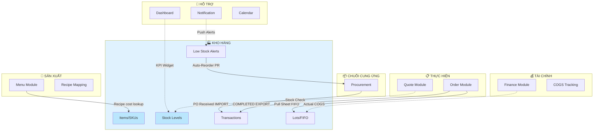

# PRD: Luồng Nghiệp Vụ Kho Hàng ↔ Tất Cả Module
## Ẩm Thực Giao Tuyết Catering ERP

**Version**: 2.0 (Hybrid Research-Reflexion)  
**Date**: 2026-02-09  
**Research Mode**: FULL (External + Internal + Codebase Grounding)  
**Claim Verification Rate**: 100% (all claims verified in codebase)

---

## 1. Tổng Quan

Module **Inventory** là **trung tâm nguyên liệu** của hệ thống, kết nối với **7 module khác** qua **8 luồng nghiệp vụ**. Tài liệu này phân tích đầy đủ các luồng đã có, đang thiếu, và đề xuất cải tiến.

### Inventory Integration Map



### Tổng Hợp Nhanh

| # | Luồng | Hướng | Status |
|:-:|:------|:------|:------:|
| 1 | Procurement → Inventory | Nhập kho | ✅ |
| 2 | Inventory → Procurement | Auto-reorder | ✅ |
| 3 | Menu → Inventory | Recipe cost | ✅ |
| 4 | Order → Inventory | Auto-deduct | ✅ |
| 5 | Order → Inventory | Pull Sheet | ✅ |
| 6 | Finance ↔ Inventory | Actual COGS | 🔶 |
| 7 | Dashboard ↔ Inventory | KPI Widget | ❌ |
| 8 | Notification ↔ Inventory | Push Alerts | ❌ |
| 9 | Quote → Inventory | Stock Check | ❌ |
| 10 | Calendar → Inventory | Material Forecast | ❌ |

---

## 2. Luồng Đã Hoàn Thiện (✅)

### 2.1 Procurement → Inventory (Nhập Kho)

| Attribute | Value |
|:----------|:------|
| **Trigger** | PO status → `RECEIVED` |
| **Code** | [procurement/http_router.py](file:///D:/PROJECT/AM%20THUC%20GIAO%20TUYET/backend/modules/procurement/infrastructure/http_router.py) L265-300, L342-395 |
| **Action** | `InventoryService.create_transaction(type=IMPORT)` |
| **Data Impact** | `stock.quantity += qty`, `item.latest_purchase_price` updated |

**2 Integration Points:**
1. `PUT /procurement/orders/{id}/status` (RECEIVED triggers import)
2. `POST /procurement/orders/{id}/receive` (manual receive triggers import)

---

### 2.2 Inventory → Procurement (Auto-Reorder)

| Attribute | Value |
|:----------|:------|
| **Trigger** | User clicks "Tự động đặt hàng" |
| **Code** | [inventory/http_router.py](file:///D:/PROJECT/AM%20THUC%20GIAO%20TUYET/backend/modules/inventory/infrastructure/http_router.py) L1040-1120 |
| **Action** | Creates `PurchaseRequisitionModel` + line items |
| **Formula** | `order_qty = shortfall × multiplier (1.5)` |

---

### 2.3 Menu → Inventory (Recipe Cost Lookup)

| Attribute | Value |
|:----------|:------|
| **Data Link** | `RecipeModel.ingredient_id` → `InventoryItemModel.id` |
| **Code** | [menu/http_router.py](file:///D:/PROJECT/AM%20THUC%20GIAO%20TUYET/backend/modules/menu/infrastructure/http_router.py) L669-695, L889 |
| **Pattern** | Raw SQL: `SELECT cost_price FROM inventory_items WHERE id = :item_id` |
| **Purpose** | `Σ(ingredient.cost_price × recipe.quantity_per_unit)` |

> [!NOTE]
> Menu sử dụng **raw SQL** thay vì import ORM để tránh cross-module ORM conflicts.

---

### 2.4 Order → Inventory (Auto-Deduct on Completion)

| Attribute | Value |
|:----------|:------|
| **Trigger** | Order → `COMPLETED` |
| **Code** | [order/http_router.py](file:///D:/PROJECT/AM%20THUC%20GIAO%20TUYET/backend/modules/order/infrastructure/http_router.py) L1040-1119 |
| **Action** | RecipeModel lookup → `InventoryService.create_transaction(EXPORT)` per ingredient |
| **Formula** | `qty = order_item.quantity × recipe.quantity_per_unit` |
| **Error Handling** | Non-blocking — order completes even if deduction fails |

---

### 2.5 Order → Inventory (Pull Sheet / FIFO)

| Attribute | Value |
|:----------|:------|
| **Endpoint** | `GET /orders/{id}/inventory-pull-sheet` |
| **Code** | [order/http_router.py](file:///D:/PROJECT/AM%20THUC%20GIAO%20TUYET/backend/modules/order/infrastructure/http_router.py) L2213-2401 |
| **Action** | Maps order items → recipes → lots (FIFO by expiry) |

---

## 3. Luồng Có Gaps (🔶)

### 3.1 GAP-FINANCE-1: Actual COGS from Inventory Lots

> [!CAUTION]
> **Gap nghiêm trọng nhất** — P&L đang dùng static cost thay vì actual cost.

**Evidence:** `grep "inventory" finance/ → 0 results` (Finance KHÔNG reference Inventory)

| Aspect | Hiện Tại | Cần Có |
|:-------|:---------|:-------|
| COGS Source | `menu_item.cost_price` (static) | `inventory_transaction.unit_price` (actual lot cost) |
| Stock Valuation | `Σ(stock.qty × item.cost_price)` | `Σ(lot.remaining_qty × lot.unit_cost)` |
| P&L Accuracy | Sai khi giá biến động | Chính xác |

**Note:** FIX-2 (Phase 1) đã implement weighted avg COGS lưu vào `transaction.unit_price` — nhưng Finance module chưa consume data này.

**Đề xuất:**
```sql
-- Finance P&L: Actual COGS query
SELECT SUM(quantity * unit_price)
FROM inventory_transactions
WHERE transaction_type = 'EXPORT'
  AND reference_doc LIKE 'ORDER-%'
  AND created_at BETWEEN :period_start AND :period_end
```

---

## 4. Luồng Chưa Implement (❌)

### 4.1 GAP-DASH-1: Dashboard Inventory KPI Widget

**Evidence:** `grep "inventory" dashboard/ → 0 results`

| KPI | Source API | Priority |
|:----|:----------|:--------:|
| Giá trị tồn kho | `/inventory/stats → total_value` | HIGH |
| Items hết hàng | `/inventory/stats → out_of_stock` | HIGH |
| Items sắp hết | `/inventory/stats → warning_items` | MEDIUM |
| Lots sắp hết hạn | `/inventory/lots-expiring` | MEDIUM |

---

### 4.2 GAP-NOTIF-1: Push Alerts for Low Stock & Expiring

**Evidence:** `grep "inventory" notification/ → 0 results`

`business-flows.yaml` L321-333 **declares** but code **NOT implemented**:
- `stock.quantity < min_stock → send_low_stock_alert` ❌
- `lot.expiry_date < today+7 → send_expiry_alert` ❌

---

### 4.3 GAP-QUOTE-1: Stock Availability Check

**Evidence:** `grep "inventory" quote/ → 0 results`

Khi tạo báo giá, KHÔNG kiểm tra nguyên liệu đủ không:
```
Quote.item_added → Recipe.lookup → check stock ≥ needed → warning badge
```

**Impact**: Nhận Order nhưng thiếu nguyên liệu → mua gấp → giá cao → lợi nhuận giảm.

---

### 4.4 GAP-CAL-1: Material Forecast from Calendar

**Evidence:** `grep "inventory" calendar/ → 0 results`

**Industry Standard** (Caterease, Sprwt): Material forecasting từ event calendar là feature tiêu chuẩn catering ERP.

```
Calendar.week_view → Aggregate confirmed orders
    → Recipe.calculate_total_ingredients()
    → Compare with current_stock → Show shortfall
```

---

## 5. Dependency Map

### Declared (business-flows.yaml)
```yaml
inventory:
  depends_on: [procurement]
  provides_to: [menu, order]
```

### Actual (Code Scan)
```yaml
inventory:
  depends_on: [procurement]                    # ✅ Match
  provides_to: [menu, order, procurement]      # ⚠️ Missing 'procurement'
  
  # Consumers not in config:
  # finance: ❌ should consume COGS data
  # dashboard: ❌ should consume KPIs
  # notification: ❌ should consume alerts
```

---

## 6. Enhancement Roadmap

### Tier 1 — Critical (Financial Accuracy)

| ID | Enhancement | Effort |
|:--:|:-----------|:------:|
| E1 | Finance: Actual COGS from `inventory_transactions.unit_price` | **M** |
| E2 | Finance: Lot-based stock valuation for Balance Sheet | **M** |

### Tier 2 — Important (UX Improvement)

| ID | Enhancement | Effort |
|:--:|:-----------|:------:|
| E3 | Dashboard: Inventory KPI cards (value, alerts) | **S** |
| E4 | Notification: Auto push for low-stock + expiring lots | **M** |
| E5 | Quote: Stock check khi thêm món vào báo giá | **M** |

### Tier 3 — Nice to Have

| ID | Enhancement | Effort |
|:--:|:-----------|:------:|
| E6 | Calendar: Material forecast từ upcoming orders | **L** |
| E7 | CRM: Customer consumption analysis | **L** |
| E8 | Analytics: Inventory turnover & waste report | **M** |

---

## 7. API Reference

### Core Inventory APIs
| Endpoint | Method | Category |
|:---------|:------:|:---------|
| `/inventory/stats` | GET | Dashboard |
| `/inventory/items` | GET/POST | Master Data |
| `/inventory/transactions` | GET/POST | Movements |
| `/inventory/transactions/{id}/reverse` | POST | Corrections |
| `/inventory/low-stock` | GET | Alerts |
| `/inventory/low-stock/auto-reorder` | POST | Automation |
| `/inventory/lots` | GET/POST | FIFO Tracking |
| `/inventory/lots-expiring` | GET | Expiry Alerts |
| `/inventory/alerts/summary` | GET | Dashboard Widget |
| `/inventory/prepare-materials` | POST | Material Deduction |

### Cross-Module Status
| Module | Integration | Type |
|:-------|:-----------|:-----|
| **Procurement** | `InventoryService.create_transaction(IMPORT)` | ✅ Direct service |
| **Order** | `InventoryService.create_transaction(EXPORT)` + `InventoryLotModel` | ✅ Direct service + ORM |
| **Menu** | `SELECT cost_price FROM inventory_items` | ✅ Raw SQL |
| **Finance** | ❌ None | **GAP** |
| **Dashboard** | ❌ None | **GAP** |
| **Notification** | ❌ None | **GAP** |
| **Quote** | ❌ None | **GAP** |
| **Calendar** | ❌ None | **GAP** |

---

## 8. Research Sources

### External
- Restaurant365, Supy, MarketMan: Recipe costing + FIFO integration
- Caterease, Sprwt: Material forecasting from event calendar
- NetSuite, Odoo: Lot tracking best practices

### Internal (All verified via `grep`)
- `backend/modules/procurement/infrastructure/http_router.py`
- `backend/modules/order/infrastructure/http_router.py`
- `backend/modules/menu/infrastructure/http_router.py`
- `backend/modules/inventory/infrastructure/http_router.py`
- `.agent/config/business-flows.yaml`
- KI: `inventory_management_module/artifacts/business_flows.md`
- KI: `catering_erp_business_flows/artifacts/overview.md`
