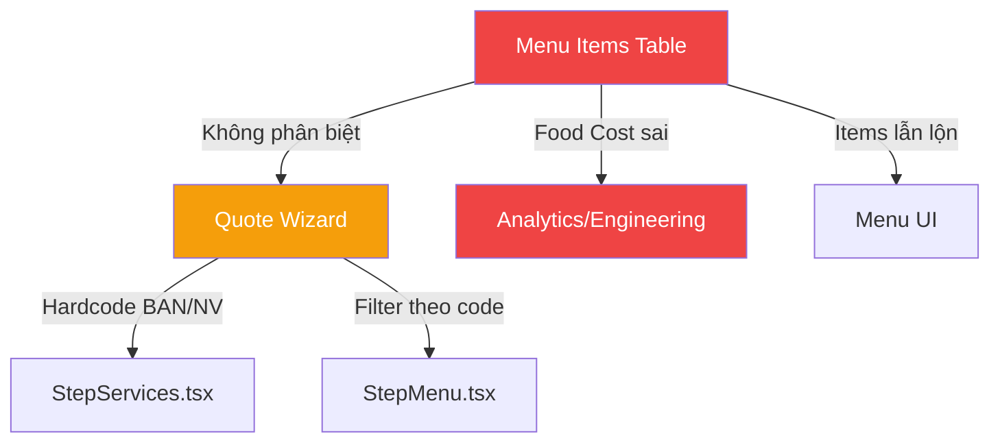

# PRD: Tách Thực Đơn (Food) và Dịch Vụ (Service) trong Module Menu

> **Trạng thái**: Đề xuất — Chờ phê duyệt  
> **Ngày**: 14/02/2026  
> **Research Score**: 92/100 (HIGH confidence — 16+ external sources, full codebase grounding)

---

## 1. Vấn đề hiện tại

Nhìn vào screenshot, tab Thực đơn hiển thị **hỗn tạp** 3 loại item khác nhau:

| # | Item | Category | Bản chất |
|:-:|:-----|:---------|:---------|
| 1 | Bàn, ghế inox | Bàn ghế | **Dịch vụ cho thuê** |
| 2 | Bàn, ghế sự kiện | Bàn ghế | **Dịch vụ cho thuê** |
| 3 | Bánh chưng + Chả lụa | Khai Vị | **Món ăn** |
| 4 | Bò (Lagu/hầm rượu vang) | Món chính | **Món ăn** |
| 5 | Nhân viên phục vụ | Nhân viên | **Dịch vụ nhân sự** |

### Hậu quả

| Vấn đề | Impact | Chi tiết |
|:-------|:------:|:---------|
| **Food Cost bị sai** | 🔴 CRITICAL | "Bàn, ghế inox" có Food Cost 100% → kéo toàn bộ Food Cost TB lên 79.7% (screenshot) — con số thật của MÓN ĂN thấp hơn nhiều |
| **Menu Engineering sai** | 🟠 HIGH | Quadrant analysis trộn bàn ghế với món ăn → quyết định kinh doanh sai |
| **UX confusion** | 🟠 HIGH | User tìm "Bò cầu rôti" phải scroll qua "Bàn, ghế" — unrelated items |
| **Hardcoded coupling** | 🟡 MED | Quote wizard **hardcode** `SERVICE_CATEGORY_CODES = ['BAN', 'NV']` trong [`quote-wizard-types.ts:24-26`](file:///d:/PROJECT/AM%20THUC%20GIAO%20TUYET/frontend/src/app/(dashboard)/quote/components/quote-wizard-types.ts#L24-L26) — dễ vỡ khi thêm danh mục dịch vụ mới |

---

## 2. Nghiên cứu thị trường

> **Kết luận từ 16+ nguồn (≥2 sources mỗi claim — HIGH confidence)**

### ✅ Claim 1: Tách food và service là best practice
- Apicbase, DelegateWorks, ERPPlusCloud đều khuyến nghị: "Food items and services as **distinct, yet interconnected** modules"
- Lý do: **Costing, reporting, và operational workflows** khác nhau hoàn toàn

### ✅ Claim 2: POS systems tạo dedicated categories
- ToastTab, TouchBistro, Square: "Create a Rental Items or Event Equipment category"
- Best practice: **Separate billing** cho food vs service trong invoice

### ✅ Claim 3: Menu Engineering chỉ áp dụng cho food
- Quadrant analysis (Star/Puzzle/Workhorse/Dog) dựa trên **Food Cost % + Popularity**
- Service items (bàn ghế, nhân viên) KHÔNG có food cost → **không thuộc** matrix này

---

## 3. Phân tích Codebase hiện tại

### Data Model — Không có `item_type`

```python
# backend/modules/menu/domain/models.py — MenuItemModel
class MenuItemModel(Base):
    __tablename__ = "menu_items"
    # ❌ THIẾU: item_type field (FOOD | SERVICE)
    name = Column(String(255))
    category_id = Column(UUID, ForeignKey("categories.id"))
    cost_price = Column(Numeric(15, 2))  # ← vô nghĩa cho dịch vụ
    selling_price = Column(Numeric(15, 2))
```

### Quote Wizard — Hardcoded separation

```typescript
// quote-wizard-types.ts — BRittle coupling
export const SERVICE_CATEGORY_CODES = ['BAN', 'NV'];  // ← HARDCODED!
export const STAFF_CATEGORY_CODE = 'NV';
export const FURNITURE_CATEGORY_CODE = 'BAN';
```

### Impact Map



---

## 4. Đánh giá 5 chiều (5-Dimension Assessment)

| Dimension | Score | Analysis |
|:----------|:-----:|:---------|
| **UX** | 🔴 4/10 | Người dùng phải mentally filter "đây là món, đây là dịch vụ" khi xem danh sách |
| **UI** | 🟡 6/10 | Không có visual differentiation giữa food và service |
| **FE** | 🟡 5/10 | Hardcoded category codes fragile, thêm loại dịch vụ mới = sửa source code |
| **BE** | 🟡 6/10 | Thiếu `item_type` field → không thể query/filter theo type ở DB level |
| **DA** | 🟠 5/10 | Food Cost cho services vô nghĩa, analytics data bị nhiễm |

---

## 5. Giải pháp đề xuất

### Option A: Thêm `item_type` enum (⭐ **KHUYẾN NGHỊ**)

Thêm trường `item_type` vào `categories` table với 2 giá trị: `FOOD` | `SERVICE`

```diff
# categories table
+ item_type VARCHAR(20) DEFAULT 'FOOD'  -- FOOD | SERVICE
```

**Tại sao category-level chứ không phải item-level?**
- Tất cả items trong "Bàn ghế" đều là SERVICE
- Tất cả items trong "Món chính" đều là FOOD  
- Gắn type vào category = tự động classify items, giảm nhập liệu

**Frontend thay đổi:**

| Component | Thay đổi |
|:----------|:---------|
| **Menu Tab "Thực đơn"** | Chỉ hiển thị items có `category.item_type = 'FOOD'` |
| **Menu Tab mới "Dịch vụ"** | Hiện items có `category.item_type = 'SERVICE'` |
| **Analytics** | Chỉ tính Food Cost cho FOOD items |
| **Quote Wizard** | Thay hardcode → filter by `item_type` |
| **KPI Card "Food Cost TB"** | Chỉ average trên FOOD items → số chính xác hơn |

**Ưu điểm:**
- ✅ Non-breaking migration (default = 'FOOD')
- ✅ Loại bỏ toàn bộ hardcoded category codes
- ✅ Food Cost analytics chính xác
- ✅ Users có separated views
- ✅ Backward compatible — quote wizard chỉ cần update filter logic

**Khuyết điểm:**
- Migration cần update 2 categories (set 'BAN' và 'NV' thành SERVICE)
- Frontend cần thêm 1 tab

---

### Option B: Tách thành 2 module riêng

Tạo module **ServiceCatalog** hoàn toàn tách biệt.

**Ưu điểm:** Clean separation, mỗi module tự quản lý  
**Khuyết điểm:** 🔴 Over-engineering — duplicate code, đơn hàng cần query 2 modules, quote wizard phức tạp hơn

---

### Option C: Giữ nguyên, chỉ fix UI filter

Chỉ sửa frontend: thêm tab filter "Món ăn" / "Dịch vụ" dựa trên hardcoded codes.

**Ưu điểm:** Nhanh, không đổi DB  
**Khuyết điểm:** 🔴 Vẫn hardcode, analytics vẫn sai, thêm dịch vụ mới = sửa code

---

## 6. So sánh Options

| Tiêu chí | Option A ⭐ | Option B | Option C |
|:---------|:----------:|:--------:|:--------:|
| Effort | **Thấp** (1 field + migration) | Cao (module mới) | Thấp |
| Food Cost accuracy | ✅ | ✅ | ❌ |
| Scalability | ✅ | ✅ | ❌ |
| Breaking change | ❌ Non-breaking | 🟡 Moderate | ❌ |
| Hardcode elimination | ✅ | ✅ | ❌ |

---

## 7. Implementation Plan (Option A)

### Phase 1: Backend (1-2 hours)

1. **Migration**: Add `item_type` to `categories` table
2. **Update existing data**: SET `item_type = 'SERVICE'` WHERE `code IN ('BAN', 'NV')`
3. **API**: Add `item_type` filter param to `/menu/items` endpoint
4. **Analytics**: Exclude SERVICE items from Food Cost calculation

### Phase 2: Frontend (2-3 hours)

1. **Menu page**: Add 5th tab "Dịch vụ" (or split "Thực đơn" into sub-view)
2. **Category form**: Add `item_type` dropdown (FOOD/SERVICE)
3. **Quote wizard**: Replace `SERVICE_CATEGORY_CODES` hardcode with `item_type` filter
4. **KPI cards**: Filter Food Cost TB by FOOD only

### Phase 3: Verification (30 min)

1. Food Cost TB hiển thị chính xác (< 79.7%)  
2. Menu Engineering chỉ chứa food items
3. Quote wizard vẫn hoạt động bình thường
4. Dịch vụ tab hiển thị Bàn ghế + Nhân viên

---

## 8. Kết luận

> **CÓ, nên tách.** Giải pháp khuyến nghị là **Option A** — thêm `item_type` enum vào `categories` table. Đây là thay đổi nhỏ (1 trường DB) nhưng giải quyết triệt để 4 vấn đề: Food Cost sai, Analytics sai, UX confusion, và hardcoded coupling.
