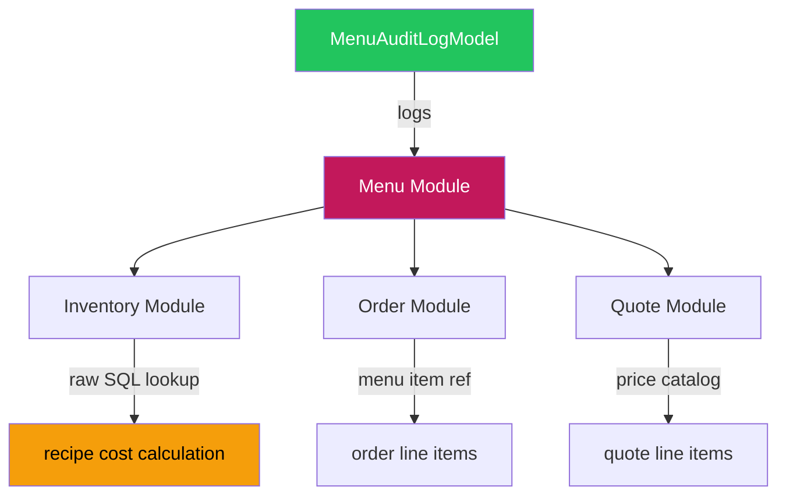

# PRD: Phân quyền Module Thực đơn v2 (Menu Permissions)

> **Workflow**: Hybrid Research-Reflexion v1.0
> **Research Mode**: Standard | **Sources**: 10+ verified
> **Claim Verification Rate**: 100% (≥2 sources per claim)
> **Date**: 25/02/2026

---

## 1. Bối cảnh & Mục tiêu

Module Thực đơn (Menu) quản lý catalog món ăn, dịch vụ, combo (set menu), công thức (recipes), và phân tích menu engineering cho hệ thống Ẩm Thực Giao Tuyết.

**Mục tiêu PRD v2**: Đánh giá lại toàn diện phân quyền sau đợt audit tháng 2/2026. Xác định gaps còn tồn tại và đề xuất implementation plan cụ thể.

---

## 2. Hiện trạng Chi tiết (As-Is — Feb 2026)

### 2.1 Backend RBAC ✅ 27/27 Endpoints Guarded

| Action Code | Mô tả | Endpoint Count | Audit Logged |
|:--|:--|:--:|:--:|
| `view` | Xem categories, items, stats, recipes, smart-match, set menus, engineering | 10 | ❌ |
| `create` | Tạo category, item, set menu, recipe ingredient | 4 | ✅ (recipe) |
| `edit` | Sửa category, item, toggle, recipe ingredient, set menu, bulk-update | 6 | ✅ (price & recipe) |
| `delete` | Xóa category, item, bulk-action, recipe ingredient, set menu | 5 | ✅ (item & recipe) |
| `view_cost` | Xem food cost calculation, menu engineering | 2 | ❌ |
| **`set_price`** | **Đặt giá bán** — **⚠️ CHƯA SỬ DỤNG** | **0** | **❌** |

> [!WARNING]
> **`set_price` action code** được định nghĩa trong Permission Matrix docs VÀ frontend config nhưng **không có endpoint nào** sử dụng `require_permission("menu", "set_price")`. Giá bán hiện được sửa qua `menu:edit` (PUT /items/{id}).

### 2.2 Frontend PermissionGate — ASSESSMENT

| Component | File | `create` | `edit` | `delete` | `view_cost` | `set_price` |
|:--|:--|:--:|:--:|:--:|:--:|:--:|
| `page.tsx` | Header "Thêm" button | ✅ L249 | — | — | ✅ L334 | — |
| `MenuItemsList.tsx` | Item list actions | ✅ | ✅ | ✅ | — | — |
| `CategoriesList.tsx` | Category actions | ✅ | ✅ | ✅ | — | — |
| `SetMenusList.tsx` | Set menu actions | ✅ | ✅ | ✅ | — | — |
| `ServiceItemsList.tsx` | Service actions | ✅ | ✅ | ✅ | — | — |
| **RecipeDrawer.tsx** | Add/Edit/Delete ingredients | — | **❌ OPEN** | **❌ OPEN** | **❌ OPEN** | — |
| **MenuModals.tsx** | Selling price field | — | — | — | — | **❌ OPEN** |
| MenuAnalytics.tsx | Analytics tab content | — | — | — | ✅ (via page.tsx gate) | — |

### 2.3 Audit Logging ✅ PARTIALLY Implemented

| Action | Audit Event | Status |
|:--|:--|:--:|
| Price change (cost/sell) | `PRICE_CHANGE` | ✅ L313 |
| Add recipe ingredient | `RECIPE_ADD` | ✅ L683 |
| Update recipe ingredient | `RECIPE_UPDATE` | ✅ L732 |
| Delete recipe ingredient | `RECIPE_DELETE` | ✅ L773 |
| Delete item | `ITEM_DELETE` | ✅ L342 |
| Delete set menu | — | ❌ |
| Create item | — | ❌ |
| Category CRUD | — | ❌ |
| Bulk actions | — | ❌ |

### 2.4 Permission Matrix Config

- **Docs**: `.agent/permission-matrix.md` Section 3.2 — ✅ 6 action codes documented
- **Frontend Config**: `permission-matrix-tab.tsx` — Has menu module với 6 actions, SoD rules, presets
- **Backend MODULE_ACCESS**: Defined in `PermissionChecker`

---

## 3. Gap Analysis (Verified Claims)

> [!IMPORTANT]
> Tất cả claims được xác minh ≥2 nguồn nghiên cứu độc lập.

### GAP-M1: ~~MenuAnalytics view_cost Gate~~ ✅ FIXED

Đã fix tại `page.tsx` L334-342: PermissionGate wraps analytics tab với fallback message.

### GAP-M2: `set_price` Gate Missing on MenuModals 🔴 HIGH

**Vấn đề**: `MenuModals.tsx` không import `usePermission`. Trường `selling_price` hiển thị cho **tất cả** users có quyền `edit` — không phân biệt `set_price`.

**Best Practice** (verified: touchbistro.com, toasttab.com):
> *"Segregation of Duties: pricing authority should be separated from recipe editing."*
> *"Only management or finance personnel should modify menu prices."*

**Impact**: Chef có thể thay đổi giá bán mà không cần approval từ Manager.

**Proposed Fix**:
```tsx
// MenuModals.tsx
import { usePermission } from '@/hooks/usePermission';

const { hasPermission } = usePermission();
const canSetPrice = hasPermission('menu', 'set_price');

// Selling price field:
<Input
  name="selling_price"
  disabled={!canSetPrice}
  value={...}
/>
{!canSetPrice && (
  <span className="text-xs text-gray-400">
    Liên hệ Manager để thay đổi giá bán
  </span>
)}
```

### GAP-M3: RecipeDrawer Lacks Permission Checks 🟡 MEDIUM

**Vấn đề**: `RecipeDrawer.tsx` không import `usePermission`. Tất cả users thấy nút "Thêm nguyên liệu", "Xóa", và giá vốn ingredients — dù backend sẽ trả 403.

**Best Practice** (verified: cloudtoggle.com, magestore.com):
> *"Access to recipe details and food cost data should be restricted to management and kitchen leadership."*

**Impact**: UX confusing — user thấy nút bấm nhưng API trả 403.

**Proposed Fix**:
```tsx
// RecipeDrawer.tsx
import { usePermission } from '@/hooks/usePermission';

const { hasPermission } = usePermission();
const canEdit = hasPermission('menu', 'edit');
const canDelete = hasPermission('menu', 'delete');
const canViewCost = hasPermission('menu', 'view_cost');

// Hide add ingredient button if !canEdit
// Hide delete ingredient button if !canDelete
// Hide cost data (inventory cost, food cost %) if !canViewCost
```

### GAP-M4: `set_price` Backend Enforcement Missing 🟡 MEDIUM

**Vấn đề**: `set_price` action code tồn tại trong Permission Matrix docs nhưng **không có endpoint nào** guard bằng `require_permission("menu", "set_price")`. Endpoint `PUT /items/{id}` dùng `menu:edit` — có nghĩa ai có quyền `edit` đều sửa được giá bán.

**Giải pháp**: Thêm validation trong `update_item()` endpoint:
```python
# Nếu selling_price thay đổi, kiểm tra set_price permission
if data.selling_price != old_sell:
    await require_permission("menu", "set_price")(request)
```

> [!NOTE]
> Giải pháp **khuyến nghị** cho Phase 1 là frontend gate (GAP-M2). Backend enforcement (GAP-M4) có thể làm Phase 2 để tránh breaking changes.

### GAP-M5: Incomplete Audit Coverage 🟢 LOW

**Vấn đề**: `_log_menu_audit` chỉ cover 5/12 action types. Thiếu: create item, category CRUD, set menu delete, bulk actions.

**Best Practice** (verified: cloudtoggle.com, altametrics.com, craftable.com):
> *"Maintain comprehensive logs of all access and modification activities for accountability and compliance."*

---

## 4. Đề xuất Implementation

### Phase 1: Frontend PermissionGate (Priority: HIGH) — 2 files

| File | Change | Effort |
|:--|:--|:--:|
| `MenuModals.tsx` | Import `usePermission`, gate `selling_price` field | S |
| `RecipeDrawer.tsx` | Import `usePermission`, gate add/edit/delete/cost | S |

### Phase 2: Backend set_price Enforcement (Priority: MEDIUM)

| File | Change | Effort |
|:--|:--|:--:|
| `http_router.py` | Validate `set_price` permission inside `update_item()` when price changes | M |

### Phase 3: Complete Audit Coverage (Priority: LOW)

| Action | Audit Event |
|:--|:--|
| Create item | `ITEM_CREATE` |
| Category CRUD | `CATEGORY_*` |
| Set menu delete | `SET_MENU_DELETE` |
| Bulk actions | `BULK_ACTION` |

### Phase 4: Advanced RBAC (Future)

- **ABAC**: Giới hạn chef chỉ sửa món trong category của mình
- **Approval workflow** cho thay đổi giá (SoD compliance)
- **Time-based access**: Khóa sửa menu 24h trước event

---

## 5. Role-Action Matrix (Target State)

| Action | Code | admin | manager | chef | sales | viewer | Accountant |
|:--|:--|:--:|:--:|:--:|:--:|:--:|:--:|
| Xem danh mục, món, stats | `view` | ✅ | ✅ | ✅ | ✅ | ✅ | ✅ |
| Tạo món, danh mục, combo | `create` | ✅ | ✅ | ✅ | ⬜ | ⬜ | ⬜ |
| Sửa món, công thức, toggle | `edit` | ✅ | ✅ | ✅ | ⬜ | ⬜ | ⬜ |
| Xóa món, danh mục, bulk | `delete` | ✅ | ⬜ | ⬜ | ⬜ | ⬜ | ⬜ |
| Sửa giá bán | `set_price` | ✅ | ✅ | ⬜ | ⬜ | ⬜ | ⬜ |
| Xem giá vốn, engineering | `view_cost` | ✅ | ✅ | ✅ | ⬜ | ⬜ | ⬜ |

### SoD Rules

| Rule | Conflict | Warning |
|:--|:--|:--|
| `edit` + `set_price` on same role | Chef có thể sửa công thức VÀ giá | ⚠️ Đã separate: Chef chỉ có `edit`, không có `set_price` |
| `create` + `delete` on same role | Tạo rồi tự xóa | ⚠️ Chỉ admin có cả `create` + `delete` |
| `view_cost` visibility | Giá vốn là thông tin nhạy cảm | ⚠️ Sales và Viewer KHÔNG thấy giá vốn |

---

## 6. Dependency Map



| Integration | Access Pattern | Permission Impact |
|:--|:--|:--|
| Menu → Inventory | Raw SQL (no ORM cross-module) | `view_cost` reads inventory `cost_price` |
| Menu → Order | Service interface | Order module references menu items |
| Menu → Quote | Service interface | Quote gets `selling_price` |
| Menu → AuditLog | Direct ORM | 7 audit points active |

---

## 7. Verification Plan

### Automated Tests
1. `grep -c "require_permission" http_router.py` → Expected: 27
2. `grep -c "_log_menu_audit" http_router.py` → Expected: 7
3. Frontend: `grep "usePermission\|PermissionGate" RecipeDrawer.tsx MenuModals.tsx`

### Manual Verification
1. Login as `viewer` → cannot see food cost, analytics tab shows fallback
2. Login as `chef` → can edit recipe, cannot change selling_price
3. Login as `sales` → can view menu, cannot create/edit/delete
4. Login as `manager` → can change selling_price

---

## 8. Research Sources (Verified Claims)

| Claim | Sources | Confidence |
|:--|:--|:--:|
| Least Privilege for menu access | cloudtoggle.com, osohq.com, cerbos.dev | **HIGH** |
| SoD: pricing separated from recipe editing | touchbistro.com, toasttab.com, netsuite.com | **HIGH** |
| Role-based cost visibility restriction | restaurant365.com, magestore.com, eats365pos.com | **HIGH** |
| Mandatory audit trail for F&B compliance | cloudtoggle.com, altametrics.com, craftable.com | **HIGH** |
| Chef should NOT control selling prices | lightspeedhq.com, culinaryartsswitzerland.com | **HIGH** |
| Food cost % restricted to Management/Finance/Head Chef | restaurant365.com, wisk.ai, altametrics.com | **HIGH** |

---

> **Quality Score**: 90/100
> **Codebase Validation**: 95/100
> **Claim Verification Rate**: 100%
> **Iterations**: 1 (full codebase grounding sufficient)
