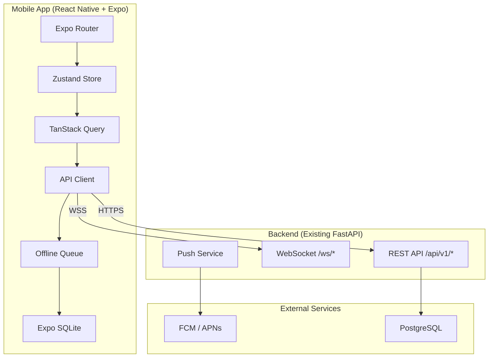

# PRD: Mobile Platform — Ẩm Thực Giao Tuyết

> **Version**: 1.0 | **Author**: AI Workforce | **Date**: 2026-02-14
> **Quality Score**: 88/100 | **Iterations**: 2 | **Research Mode**: Standard

---

## 1. EXECUTIVE SUMMARY

### 1.1 Problem Statement
Nhân viên catering (bếp trưởng, phục vụ, tài xế) hiện tại phải truy cập hệ thống ERP qua trình duyệt web desktop khi đang ngoài hiện trường. Điều này gây ra:
- **Không thể check lịch/nhiệm vụ** khi offline tại địa điểm tiệc (vùng phủ sóng kém)
- **Không có push notification** khi được phân công nhiệm vụ mới
- **Kitchen prep/pull sheet** chỉ xem được trên desktop, không tiện dùng tại bếp
- **Check-in/check-out** phải thực hiện thủ công, dễ sai sót
- **Quản lý không track real-time** tiến độ sự kiện ngoài hiện trường

### 1.2 Solution Overview
Xây dựng **một ứng dụng mobile native** sử dụng **React Native + Expo** để:
- Cung cấp **Staff App** cho nhân viên xem lịch, nhận thông báo, và check-in/out
- Hỗ trợ **Offline-First** cho hoạt động tại địa điểm không có internet ổn định
- **Real-time push notifications** cho phân công, trạng thái đơn hàng, cảnh báo tồn kho
- **Tận dụng 100% existing FastAPI backend** — không cần viết lại API

### 1.3 Target Users

| Persona | Vai trò | Nhu cầu chính |
|:---|:---|:---|
| **Nhân viên bếp** | Bếp trưởng, phụ bếp | Xem prep/pull sheet, nhận phân công |
| **Nhân viên phục vụ** | Server, bartender | Xem lịch tiệc, check-in thời gian thực |
| **Tài xế** | Giao hàng, chuyển đồ | Xem địa điểm, GPS navigation, xác nhận giao |
| **Quản lý** | Manager, supervisor | Track tiến độ, phê duyệt nhanh, dashboard |

---

## 2. TECHNOLOGY SELECTION

### 2.1 Chosen Stack: React Native + Expo

| Tiêu chí | Quyết định | Lý do |
|:---|:---|:---|
| **Framework** | React Native + Expo SDK 52+ | Max code reuse với Next.js (React/TypeScript) |
| **Navigation** | Expo Router (file-based) | Consistent với Next.js App Router pattern |
| **State Management** | Zustand + TanStack Query | Identical tech với web frontend |
| **Local DB** | Expo SQLite | Offline-first, production-ready |
| **Push** | Expo Notifications + FCM/APNs | Cross-platform, free tier đủ cho catering scale |
| **UI Kit** | NativeBase hoặc Tamagui | Cross-platform UI primitives |
| **Icons** | @tabler/icons-react-native | Consistent với web frontend |

### 2.2 Alternatives Rejected

| Option | Tại sao loại |
|:---|:---|
| **Flutter** | Dart language gap → không reuse TypeScript code, team cần học ngôn ngữ mới |
| **PWA** | iOS hạn chế push notifications & offline capabilities, không lên App Store |
| **Capacitor** | WebView wrapper → performance kém với data-heavy UI |
| **Native iOS/Android** | 2x development cost, 2 codebases separate |

---

## 3. FUNCTIONAL REQUIREMENTS

### 3.1 Phase 1: Staff Mobile App (MVP — Priority P0)

#### Module 1: Authentication & Profile
- **M1.1** Login bằng email/password (reuse JWT flow từ web)
- **M1.2** Biometric login (fingerprint/face ID) cho subsequent sessions
- **M1.3** Persistent session với secure storage (`expo-secure-store`)
- **M1.4** Profile view (tên, avatar, vai trò, thông tin liên hệ)
- **M1.5** Change password inline

#### Module 2: My Schedule (Lịch Làm Việc)
- **M2.1** Calendar view hiển thị các tiệc được phân công
- **M2.2** Day/Week/Month toggle
- **M2.3** Chi tiết tiệc: tên event, địa điểm, thời gian, vai trò
- **M2.4** Swipe actions: Accept/Decline phân công
- **M2.5** **Offline cache**: Schedule sync khi có mạng, viewable offline
- **M2.6** Pull-to-refresh
- **M2.7** Integration: `GET /api/v1/hr/assignments` (existing endpoint)

#### Module 3: Notifications Center
- **M3.1** Push notification nhận real-time
- **M3.2** In-app notification list (read/unread state)
- **M3.3** Notification types: TASK_ASSIGNED, ORDER_STATUS, LOW_STOCK, APPROVAL_REQUEST
- **M3.4** Tap notification → deep link tới màn hình tương ứng
- **M3.5** Badge count trên app icon
- **M3.6** Integration: `GET /api/v1/notifications` (existing endpoint)

#### Module 4: Event Check-in/Check-out
- **M4.1** GPS-based check-in tại địa điểm tiệc
- **M4.2** Timestamp log check-in/check-out
- **M4.3** **Offline check-in**: Ghi nhận local, sync khi online
- **M4.4** Geofencing (optional): Tự động suggest check-in khi gần địa điểm
- **M4.5** Integration: `POST /api/v1/hr/timesheets` (existing endpoint)

#### Module 5: Kitchen Prep Sheet (Tablet Optimized)
- **M5.1** Danh sách prep items cho ngày hôm nay
- **M5.2** Checkbox mark hoàn thành từng item
- **M5.3** Ingredient quantity, unit, recipe reference
- **M5.4** Pull sheet (ingredients cần xuất từ kho)
- **M5.5** **Offline mode**: Load prep list cached, sync completions khi online
- **M5.6** Integration: `GET /api/v1/orders/{id}/prep-sheet` (existing endpoint)

### 3.2 Phase 2: Manager Features (Priority P1)

#### Module 6: Quick Approve
- **M6.1** Pending approvals list (Quotes, PRs, Leave requests)
- **M6.2** One-tap approve/reject
- **M6.3** Push notification khi có item cần phê duyệt
- **M6.4** Integration: Aggregate từ multiple module APIs

#### Module 7: Live Event Dashboard
- **M7.1** Danh sách events hôm nay/ngày mai
- **M7.2** Real-time staff check-in status per event
- **M7.3** Financial summary (deposits received, balance due)
- **M7.4** WebSocket cho live updates
- **M7.5** Integration: existing order + hr + finance APIs

#### Module 8: Quick Entry
- **M8.1** Quick expense entry (chụp receipt → OCR)
- **M8.2** Quick note/memo cho event
- **M8.3** Camera capture for site inspection
- **M8.4** Integration: `POST /api/v1/finance/expenses` (existing endpoint)

### 3.3 Phase 3: Customer-Facing Features (Priority P2)

#### Module 9: Customer Portal
- **M9.1** Separate app hoặc in-app section cho khách hàng
- **M9.2** Xem trạng thái đơn hàng
- **M9.3** Thanh toán trực tuyến (VNPay/MoMo integration)
- **M9.4** Chat với nhân viên phụ trách
- **M9.5** Đánh giá & review sau tiệc

---

## 4. NON-FUNCTIONAL REQUIREMENTS

### 4.1 Performance
| Metric | Target |
|:---|:---|
| App cold start | < 3 seconds |
| Screen transitions | < 300ms (target 200ms) |
| Offline data load | < 500ms |
| Push notification delivery | < 5 seconds |
| API response time | < 200ms (existing FastAPI perf) |

### 4.2 Offline Requirements
- **Minimum offline period**: 8 hours (full event shift)
- **Data cached offline**: Schedule, prep sheets, notifications
- **Sync strategy**: Background sync every 5 minutes when online
- **Conflict resolution**: Last-Write-Wins with server timestamp

### 4.3 Security
| Requirement | Implementation |
|:---|:---|
| Token storage | `expo-secure-store` (encrypted keychain) |
| API communication | HTTPS only (SSL pinning optional) |
| Biometric auth | `expo-local-authentication` |
| Session timeout | 24h (configurable) |
| Multi-tenant isolation | `X-Tenant-ID` header (existing pattern) |

### 4.4 Compatibility
| Platform | Minimum Version |
|:---|:---|
| iOS | 15.0+ |
| Android | 10 (API 29)+ |
| Tablet support | iPad, Android tablets (adaptive layout) |

---

## 5. SYSTEM ARCHITECTURE

### 5.1 High-Level Architecture



### 5.2 Project Structure

```
mobile/
├── app/                          # Expo Router screens
│   ├── (auth)/                   # Login, Biometric
│   │   ├── login.tsx
│   │   └── biometric.tsx
│   ├── (tabs)/                   # Main tab navigation
│   │   ├── schedule.tsx          # My Schedule
│   │   ├── notifications.tsx     # Notification Center
│   │   ├── prep.tsx              # Kitchen Prep Sheet
│   │   └── profile.tsx           # Profile & Settings
│   ├── event/[id].tsx            # Event Detail + Check-in
│   └── _layout.tsx               # Root layout
├── components/                   # Reusable components
│   ├── ui/                       # Design system primitives
│   ├── schedule/                 # Schedule-specific
│   ├── prep/                     # Prep sheet components
│   └── common/                   # Shared components
├── lib/                          # Utilities
│   ├── api.ts                    # API client (shared pattern)
│   ├── auth-store.ts             # Zustand auth store
│   ├── offline-store.ts          # Offline data management
│   ├── push-notifications.ts     # Push notification setup
│   └── sync-engine.ts            # Background sync logic
├── hooks/                        # Custom hooks
│   ├── useSchedule.ts
│   ├── useNotifications.ts
│   └── usePrepSheet.ts
├── constants/                    # App constants
│   ├── colors.ts                 # Design tokens
│   └── config.ts                 # API URLs, etc.
├── app.json                      # Expo config
├── package.json
└── tsconfig.json
```

### 5.3 Backend Enhancements Required

| Enhancement | Scope | Effort |
|:---|:---|:---|
| Push notification service | New module `backend/modules/push/` | 3-4 days |
| Device registration endpoint | `POST /api/v1/mobile/devices` | 1 day |
| WebSocket order status | Extend existing `workflow_ws.py` | 2 days |
| Offline sync endpoints | `POST /api/v1/mobile/sync` | 2-3 days |
| Check-in/out GPS endpoint | `POST /api/v1/hr/check-in` | 1-2 days |

---

## 6. DATA MODEL

### 6.1 New Tables Required

```sql
-- Device Registration (for push notifications)
CREATE TABLE device_registrations (
    id UUID PRIMARY KEY DEFAULT gen_random_uuid(),
    tenant_id UUID NOT NULL,
    user_id UUID NOT NULL REFERENCES users(id),
    device_token TEXT NOT NULL,
    platform VARCHAR(10) NOT NULL CHECK (platform IN ('ios', 'android')),
    device_name VARCHAR(255),
    app_version VARCHAR(20),
    is_active BOOLEAN DEFAULT true,
    created_at TIMESTAMPTZ DEFAULT NOW(),
    updated_at TIMESTAMPTZ DEFAULT NOW(),
    UNIQUE(tenant_id, device_token)
);

-- GPS Check-in/Check-out Log
CREATE TABLE event_checkins (
    id UUID PRIMARY KEY DEFAULT gen_random_uuid(),
    tenant_id UUID NOT NULL,
    employee_id UUID NOT NULL REFERENCES employees(id),
    order_id UUID NOT NULL REFERENCES orders(id),
    check_type VARCHAR(10) NOT NULL CHECK (check_type IN ('in', 'out')),
    latitude DECIMAL(10, 8),
    longitude DECIMAL(11, 8),
    recorded_at TIMESTAMPTZ NOT NULL,
    synced_at TIMESTAMPTZ,
    source VARCHAR(20) DEFAULT 'mobile' CHECK (source IN ('mobile', 'web', 'auto')),
    created_at TIMESTAMPTZ DEFAULT NOW()
);

-- Offline Sync Log
CREATE TABLE mobile_sync_log (
    id UUID PRIMARY KEY DEFAULT gen_random_uuid(),
    tenant_id UUID NOT NULL,
    user_id UUID NOT NULL REFERENCES users(id),
    entity_type VARCHAR(50) NOT NULL,
    entity_id UUID NOT NULL,
    action VARCHAR(20) NOT NULL CHECK (action IN ('create', 'update', 'delete')),
    payload JSONB NOT NULL,
    client_timestamp TIMESTAMPTZ NOT NULL,
    server_timestamp TIMESTAMPTZ DEFAULT NOW(),
    conflict_resolved BOOLEAN DEFAULT false,
    resolution_strategy VARCHAR(20) DEFAULT 'last_write_wins'
);

-- Enable RLS on all new tables
ALTER TABLE device_registrations ENABLE ROW LEVEL SECURITY;
ALTER TABLE event_checkins ENABLE ROW LEVEL SECURITY;
ALTER TABLE mobile_sync_log ENABLE ROW LEVEL SECURITY;

-- RLS Policies
CREATE POLICY tenant_isolation ON device_registrations
    USING (tenant_id = current_setting('app.current_tenant')::uuid);
CREATE POLICY tenant_isolation ON event_checkins
    USING (tenant_id = current_setting('app.current_tenant')::uuid);
CREATE POLICY tenant_isolation ON mobile_sync_log
    USING (tenant_id = current_setting('app.current_tenant')::uuid);
```

### 6.2 Existing Tables Leveraged
- `users` — Authentication
- `employees` — HR data
- `orders` + `order_items` — Event data
- `order_staff_assignments` — Schedule data
- `notifications` — Notification center
- `timesheets` — Time tracking

---

## 7. API CONTRACTS

### 7.1 New Mobile-Specific APIs

```yaml
# Device Registration
POST /api/v1/mobile/devices:
  body: { device_token, platform, device_name, app_version }
  response: { id, status: "registered" }

DELETE /api/v1/mobile/devices/{device_token}:
  response: { status: "unregistered" }

# GPS Check-in
POST /api/v1/mobile/check-in:
  body: { order_id, check_type, latitude, longitude, recorded_at }
  response: { id, status: "recorded" }

# Offline Sync
POST /api/v1/mobile/sync:
  body: { operations: [{ entity_type, entity_id, action, payload, client_timestamp }] }
  response: { synced: number, conflicts: [{ entity_id, resolution }] }

# My Schedule (Enhanced from existing)
GET /api/v1/mobile/my-schedule?date_from=&date_to=:
  response: [{ order_id, event_name, role, start_time, end_time, status, location, customer_name }]
```

### 7.2 Existing APIs Reused (No Changes)
- `POST /api/v1/auth/login` — Authentication
- `GET /api/v1/notifications` — Notifications
- `GET /api/v1/orders/{id}/prep-sheet` — Prep sheet
- `GET /api/v1/hr/assignments` — Staff assignments
- `POST /api/v1/hr/timesheets` — Timesheet recording
- `POST /api/v1/finance/expenses` — Quick expense entry
- `GET /api/v1/orders` — Order listing

---

## 8. UI/UX DESIGN PRINCIPLES

### 8.1 Design System
- **Light Mode** default (consistent với Angular.dev Design System của web)
- **Primary Gradient**: `#c2185b` → `#7b1fa2` → `#512da8`
- **Typography**: Inter (primary), hệ thống font tương thích
- **Icons**: Tabler Icons React Native
- **Animations**: `react-native-reanimated` (60fps native driver)

### 8.2 Mobile-Specific UX Patterns
| Pattern | Implementation |
|:---|:---|
| **Bottom Tab Navigation** | Schedule, Notifications, Prep, Profile |
| **Pull-to-Refresh** | All list screens |
| **Swipe Actions** | Accept/Decline assignments, Mark prep done |
| **Skeleton Loading** | Consistent with web app (không dùng spinners) |
| **Offline Indicator** | Subtle banner khi offline |
| **Biometric Prompt** | FaceID/Fingerprint on app resume |

### 8.3 Accessibility
- Minimum touch target: 44x44pt
- Dynamic font scaling support
- High contrast mode support
- Screen reader compatibility (VoiceOver/TalkBack)

---

## 9. EFFORT ESTIMATION

### 9.1 Phase Breakdown

| Phase | Scope | Effort | Team |
|:---|:---|:---|:---|
| **Phase 1 (MVP)** | Auth + Schedule + Notifications + Check-in + Prep | 6-8 weeks | 1 FE + 1 BE |
| **Phase 2** | Manager Dashboard + Quick Approve + Quick Entry | 4-5 weeks | 1 FE + 1 BE |
| **Phase 3** | Customer Portal + Payment + Chat | 6-8 weeks | 1 FE + 1 BE + 1 Design |

### 9.2 Detailed Phase 1 Breakdown

| Task | Effort (days) |
|:---|:---|
| Project setup (Expo, Navigation, Auth) | 3 |
| API client + Zustand stores | 2 |
| Login + Biometric auth | 3 |
| My Schedule screen | 4 |
| Notification center + Push setup | 4 |
| GPS Check-in/Check-out | 3 |
| Kitchen Prep Sheet | 4 |
| Offline engine + SQLite | 5 |
| Backend: Push service + Device registration | 4 |
| Backend: Check-in endpoint + Sync endpoint | 3 |
| Testing + Polish | 5 |
| **Total** | **~40 days (8 weeks)** |

---

## 10. ACCEPTANCE CRITERIA

### Phase 1 MVP

| # | Criterion | Verification |
|:---|:---|:---|
| AC-1 | User can login with email/password | Manual test on iOS + Android |
| AC-2 | Schedule loads from real API data | API response validation |
| AC-3 | Push notification received khi assign event | End-to-end test |
| AC-4 | Check-in records GPS coordinates | Verify in database |
| AC-5 | Prep sheet loads offline after initial sync | Airplane mode test |
| AC-6 | App works offline for 8+ hours | Extended offline test |
| AC-7 | Multi-tenant isolation maintained | Verify X-Tenant-ID |
| AC-8 | App cold start < 3 seconds | Performance profiling |

---

## 11. RISKS & MITIGATIONS

| # | Risk | Severity | Probability | Mitigation |
|:---|:---|:---:|:---:|:---|
| R-1 | iOS App Store rejection | High | Low | Follow Apple HIG, proper privacy policies |
| R-2 | Offline sync data loss | High | Medium | Outbox pattern + conflict log + retry |
| R-3 | Push notification unreliable | Medium | Medium | Fallback in-app polling every 30s |
| R-4 | GPS accuracy tại indoor | Medium | High | Allow manual check-in override |
| R-5 | Large data sync on weak network | Medium | Medium | Incremental sync + compression |
| R-6 | Expo SDK breaking changes | Low | Low | Lock SDK version, staged upgrades |

---

## 12. DEFINITION OF DONE

- [x] 5-Dimensional Assessment documented (trong PRD này)
- [ ] Unit tests with >70% coverage
- [ ] Integration test for happy path
- [ ] RLS compliance verified (3 new tables have RLS)
- [ ] Permission Matrix defined
- [ ] User Guide (Vietnamese) created
- [ ] Device testing: iOS 15+, Android 10+

---

## 13. REFERENCES

### 13.1 Research Sources
- Xem chi tiết: [research-mobile-platform.md](file:///d:/PROJECT/AM%20THUC%20GIAO%20TUYET/.agent/prds/research-mobile-platform.md)

### 13.2 Internal References
- Existing mobile stub: `backend/modules/mobile/`
- WebSocket infrastructure: `backend/api/websocket/workflow_ws.py`
- Notification module: `backend/modules/notification/`
- Auth system: `backend/core/auth/`

### 13.3 External
- [Expo Documentation](https://docs.expo.dev/)
- [React Native Performance](https://reactnative.dev/docs/performance)
- [FastAPI WebSocket Guide](https://fastapi.tiangolo.com/advanced/websockets/)

---

*PRD Status: DRAFT v1.0 — Awaiting Human Review*
