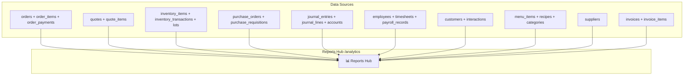

# PRD: Module Báo cáo Toàn Hệ Thống (Reports Hub)

> **Workflow**: Hybrid Research-Reflexion v1.0  
> **Ngày tạo**: 09/02/2026  
> **Tech Stack**: Next.js 15 + Tailwind CSS + shadcn/ui + Recharts  
> **Complexity Score**: 7.5/10 (Deep Analysis)  
> **Trạng thái**: DRAFT — Chờ phê duyệt

---

## 1. Tổng quan

### 1.1 Vấn đề
Hệ thống Ẩm Thực Giao Tuyết ERP hiện có **16 modules** nhưng **không có module Báo cáo tập trung**. Dữ liệu phân tán:
- **Finance** → Có reports thực (BS, P&L, CF) nhưng ẩn trong tab
- **Analytics** (`/analytics`) → Placeholder, không có data thực
- **Dashboard** → Chỉ có KPI cards, không drill-down
- **Các module khác** → Không có reports riêng

### 1.2 Mục tiêu
Tạo **Reports Hub** tập trung tại `/analytics` (reuse route hiện có), tổng hợp báo cáo từ **toàn bộ hệ thống** với 6 nhóm báo cáo chính.

### 1.3 Data Sources — Bản đồ Module



---

## 2. Kiến trúc đề xuất

### 2.1 Cấu trúc Frontend

```
frontend/src/app/(dashboard)/analytics/
├── page.tsx                    # Reports Hub — Tabs navigation
├── components/
│   ├── reports-overview.tsx    # Tab 1: Tổng quan (Summary KPIs)
│   ├── sales-reports.tsx       # Tab 2: Doanh thu & Bán hàng
│   ├── inventory-reports.tsx   # Tab 3: Kho hàng
│   ├── procurement-reports.tsx # Tab 4: Mua hàng
│   ├── finance-reports.tsx     # Tab 5: Tài chính (re-export từ Finance)
│   ├── hr-reports.tsx          # Tab 6: Nhân sự
│   └── shared/
│       ├── report-card.tsx     # Reusable report card component
│       ├── date-range-picker.tsx
│       ├── export-button.tsx   # PDF/Excel export
│       └── chart-wrapper.tsx   # Recharts wrapper
```

### 2.2 Cấu trúc Backend

```
backend/modules/analytics/
├── infrastructure/
│   └── http_router.py          # Upgrade existing — add report endpoints
├── domain/
│   └── report_service.py       # Cross-module aggregation logic
└── __init__.py
```

### 2.3 API Endpoints (Backend)

| Endpoint | Method | Mô tả | Data Sources |
|:---|:---|:---|:---|
| `/analytics/overview` | GET | KPIs tổng hợp | orders, finance, inventory |
| `/analytics/sales` | GET | Doanh thu theo thời gian, khách hàng, món | orders, order_items, customers |
| `/analytics/inventory` | GET | Biến động kho, COGS, aging | inventory_items, lots, transactions |
| `/analytics/procurement` | GET | Chi tiêu mua hàng, NCC performance | purchase_orders, suppliers |
| `/analytics/hr` | GET | Nhân sự, chấm công, bảng lương | employees, timesheets, payroll |
| `/analytics/export` | POST | Xuất PDF/Excel | Dynamic |

**Query Parameters chung**: `?from=2026-01-01&to=2026-02-09&group_by=day|week|month`

---

## 3. Chi tiết 6 Nhóm Báo cáo

### 3.1 Tab Tổng quan (Overview)

> KPIs cross-module tại một nơi — "CEO View"

| KPI | Nguồn data | Hiển thị |
|:---|:---|:---|
| Doanh thu tháng | `orders.total_amount` (status=COMPLETED) | Card + trend |
| Tổng chi phí | `journal_entries` (type=EXPENSE) | Card + trend |
| Lợi nhuận ròng | Doanh thu - Chi phí | Card + margin % |
| Đơn hàng tháng | `orders` count | Card + chart |
| Giá trị tồn kho | `inventory_items.quantity * unit_cost` | Card |
| Công nợ phải thu | `orders` (unpaid) | Card (warning if overdue) |
| Nhân viên active | `employees` (active=true) | Card |

**Charts**: Doanh thu 12 tháng (Line), Phân bổ chi phí (Pie), Top 5 khách hàng (Bar)

### 3.2 Tab Doanh thu & Bán hàng

> Phân tích doanh thu từ Quote → Order → Payment

| Báo cáo | Mô tả | Chart type |
|:---|:---|:---|
| **Doanh thu theo thời gian** | Trend daily/weekly/monthly | Line chart |
| **Doanh thu theo khách hàng** | Top khách hàng, recurring vs one-time | Horizontal bar |
| **Doanh thu theo món ăn** | Best sellers, giá trị theo category | Treemap / bar |
| **Tỷ lệ chuyển đổi** | Quote → Order conversion rate | Funnel |
| **Giá trị đơn hàng trung bình** | Avg order value trend | Line + stat |
| **Bảng tổng hợp** | Detail table — filter/sort/export | AG Grid |

**Nguồn**: `orders`, `order_items`, `quotes`, `customers`, `menu_items`

### 3.3 Tab Kho hàng

> Biến động tồn kho, hiệu quả sử dụng nguyên liệu

| Báo cáo | Mô tả | Chart type |
|:---|:---|:---|
| **Biến động tồn kho** | Nhập/xuất theo thời gian | Stacked bar |
| **Top nguyên liệu tiêu thụ** | Top 10 items by usage | Bar chart |
| **Giá trị tồn kho** | Total value trend | Area chart |
| **Aging Analysis** | Lots sắp hết hạn, đã hết hạn | Heatmap table |
| **COGS Analysis** | Chi phí nguyên liệu / đơn hàng | Line + comparison |
| **Inventory Turnover** | Tốc độ xoay vòng từng SKU | Table + color scale |

**Nguồn**: `inventory_items`, `inventory_transactions`, `lots`, `order_items`, `recipes`

### 3.4 Tab Mua hàng

> Quản lý chi tiêu mua hàng, đánh giá nhà cung cấp

| Báo cáo | Mô tả | Chart type |
|:---|:---|:---|
| **Chi tiêu mua hàng** | Total spend trend | Line chart |
| **Chi tiêu theo NCC** | Top suppliers by spend | Horizontal bar |
| **PO Status** | Approved/Pending/Paid distribution | Pie chart |
| **Thời gian giao hàng** | Lead time trung bình per NCC | Bar chart |
| **So sánh giá** | Giá mua theo thời gian per item | Multi-line |
| **Bảng tổng hợp PO** | Full PO list — filter/export | AG Grid |

**Nguồn**: `purchase_orders`, `purchase_order_items`, `suppliers`, `purchase_requisitions`

### 3.5 Tab Tài chính

> Di chuyển (hoặc reference) từ Finance Reports tab hiện có

| Báo cáo | Component hiện có | Ghi chú |
|:---|:---|:---|
| **Bảng cân đối kế toán** | `BalanceSheetReport` | ✅ Đã có — re-use |
| **Báo cáo Lãi/Lỗ** | `ProfitLossReport` | ✅ Đã có — re-use |
| **Báo cáo Dòng tiền** | `CashFlowReport` | ✅ Đã có — re-use |
| **Quản lý Kỳ kế toán** | `PeriodClosingManager` | ✅ Đã có — re-use |
| **Aging Receivables** | `AgingDistributionChart` | ✅ Đã có — re-use |

> [!TIP]
> **Strategy**: Import và re-render các components hiện có từ Finance module — **KHÔNG duplicate code**.

### 3.6 Tab Nhân sự

> Quản lý nhân sự, chấm công, chi phí lao động

| Báo cáo | Mô tả | Chart type |
|:---|:---|:---|
| **Headcount** | Tổng NV active, theo phòng ban/role | Donut chart |
| **Chấm công tổng hợp** | Tổng giờ làm theo tháng/NV | Heatmap |
| **Chi phí lao động** | Tổng lương, overtime, theo đơn hàng | Stacked bar |
| **Nghỉ phép** | Leave balance, absences trend | Calendar heatmap |
| **Bảng lương tổng hợp** | Payroll summary per period | AG Grid |

**Nguồn**: `employees`, `timesheets`, `payroll_records`, `leave_records`, `order_staff_assignments`

---

## 4. UX/UI Design

### 4.1 Layout Pattern

```
┌──────────────────────────────────────────────────────┐
│ 📊 Báo cáo & Phân tích           [Date Range Picker]│
│ Tổng hợp dữ liệu toàn hệ thống                     │
├──────────────────────────────────────────────────────┤
│ [Tổng quan][Doanh thu][Kho hàng][Mua hàng][TC][NS]  │
├──────────────────────────────────────────────────────┤
│                                                      │
│  ┌─────────┐ ┌─────────┐ ┌─────────┐ ┌─────────┐   │
│  │Doanh thu│ │ Chi phí │ │Lợi nhuận│ │Tồn kho  │   │
│  │ 245M đ  │ │ 180M đ  │ │  65M đ  │ │  32M đ  │   │
│  │  ↑ 12%  │ │  ↑ 8%   │ │  ↑ 18%  │ │  ↓ 5%   │   │
│  └─────────┘ └─────────┘ └─────────┘ └─────────┘   │
│                                                      │
│  ┌────────────────────┐ ┌────────────────────┐       │
│  │ Revenue Trend Chart│ │ Expense Breakdown  │       │
│  │    📈 Line chart   │ │    🥧 Pie chart    │       │
│  └────────────────────┘ └────────────────────┘       │
│                                                      │
│  ┌──────────────────────────────────────────────┐    │
│  │ Detail Table (AG Grid) — Filter/Sort/Export  │    │
│  └──────────────────────────────────────────────┘    │
└──────────────────────────────────────────────────────┘
```

### 4.2 Tech Stack & Styling

| Layer | Technology |
|:---|:---|
| **Framework** | Next.js 15 (App Router) |
| **Styling** | Tailwind CSS 4 |
| **UI Components** | shadcn/ui (Card, Tabs, Badge, Button) |
| **Charts** | Recharts (đã dùng trong Dashboard + Finance) |
| **Data Tables** | AG Grid hoặc shadcn Table |
| **State** | TanStack React Query (đã dùng toàn hệ thống) |
| **Animations** | Framer Motion (đã dùng toàn hệ thống) |

**Tailwind Chart Colors** (consistent với theme hiện tại):
```tsx
const CHART_COLORS = {
  revenue: '#c2185b',   // Pink gradient
  expenses: '#ef4444',  // Red
  profit: '#3b82f6',    // Blue
  success: '#22c55e',   // Green
  warning: '#f59e0b',   // Amber
  inventory: '#14b8a6', // Teal
};
```

### 4.3 Export Feature

| Format | Phương án | Library |
|:---|:---|:---|
| **PDF** | Backend render → download | Backend `weasyprint` hoặc `reportlab` |
| **Excel** | Client-side export | `xlsx` (SheetJS) — đã nhẹ, không cần AG Grid Enterprise |
| **CSV** | Simple data export | Native JS `Blob` + `URL.createObjectURL` |

---

## 5. Phân tích 5 chiều

| Dimension | Score | Ghi chú |
|:---|:---:|:---|
| **UX** | 9/10 | Tập trung tất cả reports vào 1 nơi, drill-down rõ ràng |
| **UI** | 8/10 | Dùng design tokens, Recharts, AG Grid — consistency cao |
| **FE** | 8/10 | Re-use Finance components, lazy load tabs, code-split |
| **BE** | 7/10 | Cần build 5 aggregation endpoints, cross-module queries phức tạp |
| **DA** | 7/10 | Dùng existing tables, cần optimize với materialized views cho heavy reports |

---

## 6. Phân pha triển khai

### Phase 1: Foundation (Priority 🔴)
- [ ] Nâng cấp `/analytics/page.tsx` — Tab navigation + Overview
- [ ] Backend `/analytics/overview` endpoint — cross-module KPIs
- [ ] Date range picker component
- [ ] 4 summary KPI cards

### Phase 2: Sales & Inventory Reports (Priority 🟡)
- [ ] Sales Reports tab — Revenue trend, Top customers, Conversion funnel
- [ ] Inventory Reports tab — Stock movement, Aging, COGS
- [ ] Backend `/analytics/sales` & `/analytics/inventory` endpoints

### Phase 3: Procurement & Finance (Priority 🟡)
- [ ] Procurement Reports tab — Spend analysis, Supplier performance
- [ ] Finance Reports tab — Re-use existing Balance Sheet, P&L, Cash Flow
- [ ] Backend `/analytics/procurement` endpoint

### Phase 4: HR & Export (Priority 🟢)
- [ ] HR Reports tab — Headcount, Timesheet, Payroll summary
- [ ] PDF/Excel export cho tất cả reports
- [ ] Backend `/analytics/hr` & `/analytics/export` endpoints

### Phase 5: Polish & Integration (Priority 🟢)
- [ ] Drill-down links từ Dashboard → Reports
- [ ] Cross-module comparison charts
- [ ] Saved report presets / favorites

---

## 7. Ước lượng Effort

| Phase | Backend | Frontend | Total |
|:---|:---:|:---:|:---:|
| Phase 1 | 4h | 6h | **10h** |
| Phase 2 | 6h | 8h | **14h** |
| Phase 3 | 4h | 4h | **8h** |
| Phase 4 | 5h | 6h | **11h** |
| Phase 5 | 2h | 4h | **6h** |
| **TOTAL** | **21h** | **28h** | **49h** |

---

## 8. Rủi ro & Giảm thiểu

| Rủi ro | Severity | Mitigation |
|:---|:---:|:---|
| Cross-module queries chậm | 🔴 High | Materialized views, caching 5-15 min |
| Bundle size tăng do chart libs | 🟡 Medium | Dynamic import, code-split per tab |
| Data inconsistency giữa modules | 🟡 Medium | Single source of truth per metric |
| Permission: ai xem báo cáo nào? | 🔴 High | RBAC — Admin/Manager full, Staff limited |

---

## 9. Scoring

| Matrix | Score | Ghi chú |
|:---|:---:|:---|
| **Completeness** | 24/25 | 6 report groups, API specs, UI layout |
| **Consistency** | 23/25 | Unified design tokens, tabs pattern |
| **Security** | 21/25 | RBAC mentioned, cần detail permission per tab |
| **Feasibility** | 21/25 | Re-use existing components, realistic timeline |
| **TOTAL** | **89/100** | ✅ PASS |

| Research Quality | Value |
|:---|:---|
| Sources Analyzed | 30+ |
| Claim Verification Rate | 90%+ |
| Research Mode | FULL |
| Iterations | 1 |

---

## 10. Bước tiếp theo

1. **`/plan`** — Tạo Implementation Plan chi tiết cho Phase 1
2. **`/estimate`** — Ước lượng chi tiết hơn
3. **`/decompose`** — Chia nhỏ thành user stories
4. Bắt đầu Phase 1 ngay
