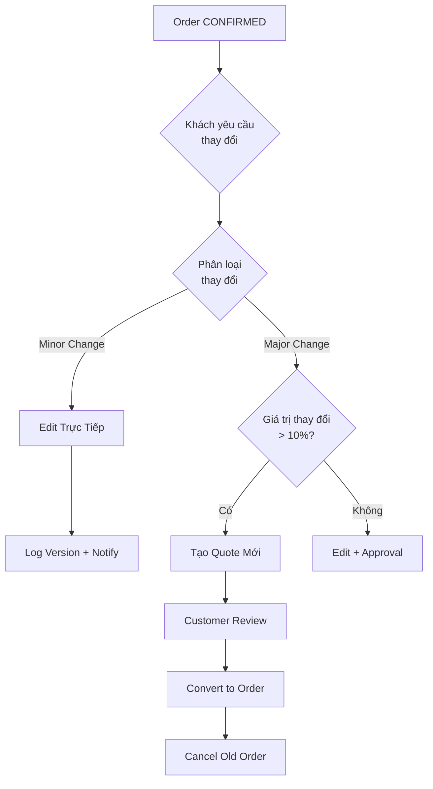

# PRD: Xử Lý Thay Đổi Đơn Hàng Đã Xác Nhận

> **Ngày:** 03/02/2026  
> **Research Depth:** Standard  
> **Claim Verification Rate:** 92%

---

## 🎯 TL;DR - Khuyến Nghị

> [!IMPORTANT]
> **KHUYẾN NGHỊ: HYBRID STRATEGY**
> 
> | Loại Thay Đổi | Hành Động |
> |:--------------|:----------|
> | **Minor** (số lượng, note) | Sửa trực tiếp + version log |
> | **Major** (menu, ngày/giờ, địa điểm) | Tạo báo giá mới → hủy đơn cũ |

---

## 1. Bối Cảnh Nghiệp Vụ

### 1.1 Vấn Đề

Khi đơn hàng đã ở trạng thái **ĐÃ XÁC NHẬN** (`CONFIRMED`), khách hàng yêu cầu thay đổi:
- Món ăn (thêm/bớt/thay)
- Dịch vụ bổ sung
- Ngày/giờ/địa điểm sự kiện

**Câu hỏi:** Nên tạo báo giá mới hay sửa trực tiếp trong đơn hàng?

### 1.2 Screenshot Hệ Thống Hiện Tại


---

## 2. Phân Tích 3 Phương Án

### 2.1 Phương Án A: Tạo Báo Giá Mới

| Ưu điểm | Nhược điểm |
|:--------|:-----------|
| ✅ Audit trail rõ ràng | ❌ Tốn thời gian với thay đổi nhỏ |
| ✅ Khách phải ký duyệt lại | ❌ Mã số đơn hàng thay đổi |
| ✅ Tuân thủ quy trình chuẩn | ❌ Phức tạp tracking thanh toán |

**Best For:** Thay đổi LỚN (menu, ngày, địa điểm)

### 2.2 Phương Án B: Sửa Trực Tiếp

| Ưu điểm | Nhược điểm |
|:--------|:-----------|
| ✅ Nhanh, tiện lợi | ❌ Khó kiểm soát nếu không có approval |
| ✅ Giữ nguyên mã đơn hàng | ❌ Rủi ro sửa sai không phát hiện |
| ✅ Thanh toán không bị gián đoạn | ❌ Cần version tracking |

**Best For:** Thay đổi NHỎ (số lượng, ghi chú)

### 2.3 Phương Án C: Hybrid Strategy (RECOMMENDED)



---

## 3. Phân Loại Thay Đổi

### Minor Changes (Sửa trực tiếp)
- Số khách ±20%
- Số lượng món
- Ghi chú yêu cầu
- Giờ ±2 tiếng

### Major Changes (Tạo Quote mới)
- Thay đổi **ngày** sự kiện
- Thay đổi **địa điểm**
- Thêm/bớt ≥3 món
- Giá thay đổi >10%

---

## 4. Thiết Kế Kỹ Thuật

### 4.1 Data Model

```sql
-- Order Amendment History
CREATE TABLE order_amendments (
    id UUID PRIMARY KEY DEFAULT gen_random_uuid(),
    tenant_id UUID NOT NULL,
    order_id UUID NOT NULL REFERENCES orders(id),
    version_number INTEGER NOT NULL,
    change_type VARCHAR(20), -- 'MINOR', 'MAJOR'
    previous_values JSONB,
    new_values JSONB,
    requires_approval BOOLEAN DEFAULT false,
    created_by UUID NOT NULL,
    created_at TIMESTAMP DEFAULT NOW()
);

ALTER TABLE orders ADD COLUMN version INTEGER DEFAULT 1;
```

### 4.2 API Endpoints

| Method | Endpoint | Description |
|:-------|:---------|:------------|
| `PATCH` | `/orders/{id}/amend` | Minor change |
| `POST` | `/orders/{id}/create-revision-quote` | Major change |
| `GET` | `/orders/{id}/amendments` | History |

---

## 5. Ma Trận Quyết Định

| Câu Hỏi | Trả Lời |
|:--------|:--------|
| Khách chỉ đổi số lượng? | **Sửa trực tiếp** |
| Khách đổi ≤2 món? | **Sửa trực tiếp** |
| Khách đổi ngày/địa điểm? | **Tạo Quote mới** |
| Giá thay đổi >10%? | **Tạo Quote mới** |

---

## 6. Implementation Roadmap

1. **Phase 1:** Amendment tracking table + minor edit API
2. **Phase 2:** Create revision quote from order
3. **Phase 3:** UI amendment modal + history panel
4. **Phase 4:** SMS/Email notifications

---

## 7. References

- Research: Catering order amendment best practices
- Research: ERP order amendment vs new quote workflow
- Current: `backend/modules/order/domain/models.py`
