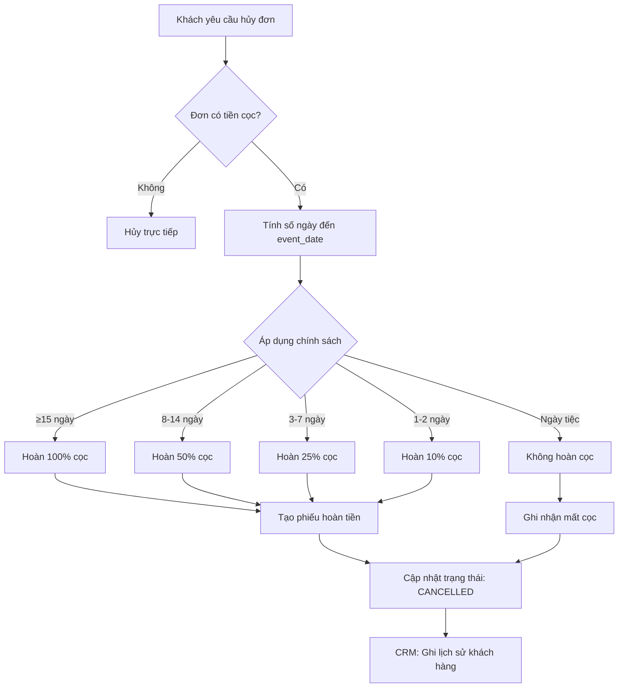

# PRD: Hủy Đơn Hàng Có Tiền Cọc (Order Cancellation with Deposit)

> **Module**: Order Management
> **Priority**: High  
> **Complexity Score**: 7/10 (Finance + Business Logic + Legal Compliance)
> **Created**: 2026-02-03

---

## 1. Vấn Đề Nghiệp Vụ

### 1.1 Tình Huống
Khách hàng đã đặt tiệc và đã chuyển tiền cọc (deposit), nhưng muốn hủy đơn hàng.

### 1.2 Câu Hỏi Cần Trả Lời
- Có hoàn tiền cọc không?
- Hoàn bao nhiêu phần trăm?
- Khi nào được hoàn đầy đủ? Khi nào mất cọc?
- Quy trình xử lý như thế nào trong hệ thống?

---

## 2. Nghiên Cứu & Chuẩn Ngành

### 2.1 Thông Lệ Quốc Tế về Cancellation Policy

| Thời Điểm Hủy | Mức Hoàn Cọc | Lý Do |
|---------------|--------------|-------|
| ≥ 30 ngày trước tiệc | 100% hoàn cọc (hoặc trừ phí admin nhỏ) | Đủ thời gian tìm khách mới |
| 15-29 ngày | 50-75% hoàn cọc | Một phần nguyên liệu đã đặt |
| 7-14 ngày | 25-50% hoàn cọc | Đã chuẩn bị, khó tìm khách thay thế |
| < 7 ngày | 0% (mất cọc hoàn toàn) | Chi phí đã phát sinh, không thể cancel |

### 2.2 Pháp Lý Việt Nam (Bộ Luật Dân Sự 2015)

> **Điều 328**: Nếu bên đặt cọc từ chối việc giao kết, thực hiện hợp đồng thì tài sản đặt cọc thuộc về bên nhận đặt cọc.

**Ý nghĩa thực tế**:
- Nếu khách hủy không có lý do chính đáng → Nhà hàng **có quyền giữ cọc**
- Nếu khách báo sớm và nhà hàng chưa phát sinh chi phí lớn → Thường thương lượng hoàn một phần / giữ lại cho booking sau
- **Force Majeure** (Điều 351): Thiên tai, dịch bệnh, bất khả kháng → Hai bên thương lượng không bên nào chịu trách nhiệm

### 2.3 Khuyến Nghị cho Ẩm Thực Giao Tuyết

Dựa trên quy mô dịch vụ catering và thông lệ tại Việt Nam:

| Thời Điểm Hủy | Mức Hoàn Cọc | Ghi Chú |
|---------------|--------------|---------|
| ≥ 15 ngày | **100%** hoàn cọc | Có thể trừ phí xử lý 5% |
| 8-14 ngày | **50%** hoàn cọc | Đã phát sinh chi phí chuẩn bị |
| 3-7 ngày | **25%** hoàn cọc | Chi phí nhân sự + nguyên liệu |
| 1-2 ngày | **10%** hoàn cọc (thiện chí) | Gần như toàn bộ chi phí đã phát sinh |
| Ngày tiệc | **0%** (mất cọc) | Theo Điều 328 BLDS |

---

## 3. Đề Xuất Luồng Nghiệp Vụ

### 3.1 Các Bước Xử Lý Hủy Đơn Có Cọc



### 3.2 Trạng Thái Hủy Đặc Biệt

| Status | Mô Tả | Điều Kiện |
|--------|-------|-----------|
| `CANCELLED_FULL_REFUND` | Hủy - Hoàn tiền đầy đủ | ≥15 ngày, hoặc lỗi từ nhà hàng |
| `CANCELLED_PARTIAL_REFUND` | Hủy - Hoàn tiền một phần | 3-14 ngày trước tiệc |
| `CANCELLED_NO_REFUND` | Hủy - Không hoàn tiền | <3 ngày hoặc theo thỏa thuận |
| `CANCELLED_FORCE_MAJEURE` | Hủy - Bất khả kháng | Thiên tai, dịch bệnh |

---

## 4. Thay Đổi Kỹ Thuật

### 4.1 Database Schema

```sql
-- Bảng lưu chính sách hủy (cấu hình theo tenant)
CREATE TABLE cancellation_policies (
    id UUID PRIMARY KEY DEFAULT gen_random_uuid(),
    tenant_id UUID NOT NULL REFERENCES tenants(id),
    min_days_before_event INT NOT NULL,
    max_days_before_event INT,
    refund_percentage DECIMAL(5,2) NOT NULL,
    is_active BOOLEAN DEFAULT TRUE,
    created_at TIMESTAMPTZ DEFAULT NOW()
);

-- Mở rộng bảng orders
ALTER TABLE orders ADD COLUMN cancellation_type VARCHAR(30);
ALTER TABLE orders ADD COLUMN refund_amount DECIMAL(15,2) DEFAULT 0;
ALTER TABLE orders ADD COLUMN cancelled_at TIMESTAMPTZ;
ALTER TABLE orders ADD COLUMN cancelled_by UUID;
```

### 4.2 Backend API

```python
# POST /orders/{order_id}/cancel-with-refund
class CancelOrderRequest(BaseModel):
    cancel_reason: str
    cancellation_type: Optional[str]
    refund_amount_override: Optional[Decimal]
    force_majeure: bool = False

class CancelOrderResponse(BaseModel):
    order_id: UUID
    previous_status: str
    new_status: str
    paid_amount: Decimal
    refund_amount: Decimal
    retained_amount: Decimal
    cancellation_type: str
    days_before_event: int
    policy_applied: str
```

### 4.3 Công Thức Tính Hoàn Tiền

```python
def calculate_refund(order: Order, force_majeure: bool = False) -> RefundResult:
    if force_majeure:
        return RefundResult(
            refund_amount=order.paid_amount,
            refund_percentage=100,
            cancellation_type="FORCE_MAJEURE"
        )
    
    today = date.today()
    days_before = (order.event_date - today).days
    
    policy = get_policy_for_days(order.tenant_id, days_before)
    
    refund_pct = policy.refund_percentage
    refund_amount = order.paid_amount * (refund_pct / 100)
    
    if refund_pct == 100:
        cancel_type = "FULL_REFUND"
    elif refund_pct > 0:
        cancel_type = "PARTIAL_REFUND"
    else:
        cancel_type = "NO_REFUND"
    
    return RefundResult(
        refund_amount=refund_amount,
        refund_percentage=refund_pct,
        retained_amount=order.paid_amount - refund_amount,
        cancellation_type=cancel_type,
        days_before_event=days_before
    )
```

---

## 5. UI/UX Flow

### 5.1 Cancel Order Modal (Enhanced)

Khi user click "Hủy đơn" trên đơn có paid_amount > 0:

```
┌─────────────────────────────────────────────────┐
│  ⚠️ HỦY ĐƠN HÀNG #DH-2026247458                 │
├─────────────────────────────────────────────────┤
│  📅 Ngày tiệc: 15/02/2026                       │
│  📆 Còn: 12 ngày                                │
│                                                 │
│  💰 Thông tin thanh toán:                       │
│  ├── Đã thanh toán:     5,000,000 đ             │
│  ├── Hoàn lại (50%):    2,500,000 đ             │
│  └── Giữ lại:           2,500,000 đ             │
│                                                 │
│  📋 Chính sách áp dụng:                         │
│  "Hủy trong vòng 8-14 ngày: hoàn 50% tiền cọc"  │
│                                                 │
│  📝 Lý do hủy: *                                │
│  ┌─────────────────────────────────────────┐    │
│  │ Khách thay đổi kế hoạch                 │    │
│  └─────────────────────────────────────────┘    │
│                                                 │
│  ☐ Bất khả kháng (Force Majeure)                │
│                                                 │
│  ┌──────────┐  ┌────────────────────────┐      │
│  │   Đóng   │  │ ✓ Xác nhận hủy đơn     │      │
│  └──────────┘  └────────────────────────┘      │
└─────────────────────────────────────────────────┘
```

---

## 6. Acceptance Criteria

### 6.1 Happy Path
- [ ] Khi hủy đơn có cọc, hiển thị modal với thông tin hoàn tiền
- [ ] Tự động tính số tiền hoàn dựa trên ngày còn lại
- [ ] Lưu cancel_reason, refund_amount, cancellation_type
- [ ] Cập nhật status thành CANCELLED

### 6.2 Edge Cases
- [ ] Đơn chưa có thanh toán → Hủy thẳng, không popup refund
- [ ] event_date < today → Không cho hủy (đã qua ngày tiệc)
- [ ] Force Majeure checkbox → Hoàn 100% bất kể timing
- [ ] Admin override → Cho phép nhập refund_amount thủ công

---

## 7. Quyết Định Cần Xác Nhận

> [!IMPORTANT]
> Cần xác nhận trước khi implement:

1. **Chính sách mặc định**: Bạn có đồng ý với các mức % hoàn tiền đề xuất (100/50/25/10/0) không?

2. **Force Majeure**: Ai có quyền tick checkbox "Bất khả kháng"? (Tất cả nhân viên / Chỉ admin)

3. **Phí xử lý**: Có thu phí xử lý 5% khi hoàn 100% không?

4. **Integration**: Có cần tự động tạo phiếu chi (Payment Out) sau khi hủy không?
