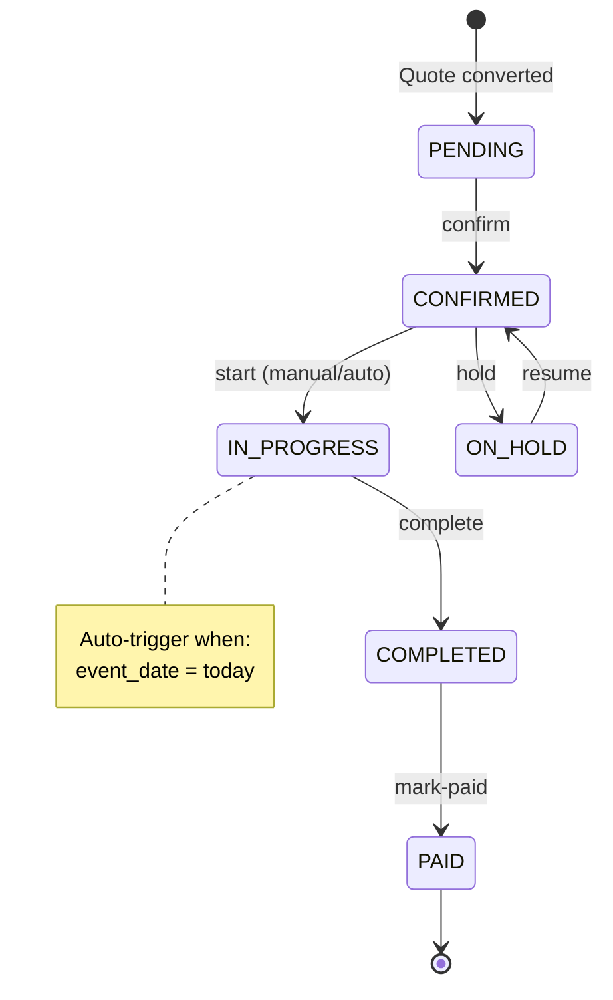

# PRD: Order Status Transition (CONFIRMED → IN_PROGRESS)

> **Version**: 1.0  
> **Date**: 03/02/2026  
> **Author**: AI Workforce  
> **Status**: Draft - Pending Review

---

## 1. Problem Statement

Hiện tại trong hệ thống Order Management, **không có logic để chuyển đơn hàng từ CONFIRMED sang IN_PROGRESS**. Điều này gây ra:

1. **Stepper UI không chính xác** - Đơn hàng luôn "kẹt" ở bước 2 cho đến khi hoàn thành
2. **Không theo dõi được trạng thái thực tế** - Không biết đơn nào đang được thực hiện
3. **Thiếu trigger cho workflow** - Không có sự kiện để thông báo cho bếp/nhân viên

### Current State
```
PENDING → confirm → CONFIRMED → ??? → complete → COMPLETED → mark-paid → PAID
                                 ↑
                          MISSING TRANSITION
```

---

## 2. Proposed Solution

### 2.1 Hybrid Approach (Recommended)

| Trigger | Mô tả | Độ ưu tiên |
|---------|-------|-----------|
| **Auto (Primary)** | Tự động chuyển khi `event_date = today` và status = CONFIRMED | ⭐⭐⭐ |
| **Manual (Backup)** | Button "Bắt đầu thực hiện" cho Manager/Admin | ⭐⭐ |

### 2.2 Business Rules

1. **Auto-Transition Timing**:
   - Chạy kiểm tra khi user mở Order List hoặc Order Detail
   - Hoặc khi có request từ Dashboard "Đơn hôm nay"
   
2. **Eligibility Criteria**:
   ```python
   can_start = (
       order.status == 'CONFIRMED' and
       order.event_date == today() and
       order.event_date is not None
   )
   ```

3. **Manual Override**:
   - Admin/Manager có thể chuyển trạng thái thủ công
   - Cho phép "bắt đầu sớm" nếu cần chuẩn bị trước

---

## 3. User Stories

### US-1: Auto-Start Orders
```
AS A manager
I WANT orders to automatically move to IN_PROGRESS on event day
SO THAT I can see which orders need attention today
```

**Acceptance Criteria**:
- [ ] Orders with `event_date = today` auto-update to IN_PROGRESS
- [ ] Status change triggers on page load (not polling)
- [ ] Audit trail records the transition with reason "Auto-started (event day)"

### US-2: Manual Start
```
AS A manager  
I WANT to manually start an order before event day
SO THAT I can begin preparation early for large events
```

**Acceptance Criteria**:
- [ ] "Bắt đầu thực hiện" button visible for CONFIRMED orders
- [ ] Confirmation modal before action
- [ ] Audit trail records manual action with user info

### US-3: Dashboard Indicator
```
AS A user
I WANT to see a badge showing "X đơn cần thực hiện hôm nay"
SO THAT I know my workload at a glance
```

---

## 4. Technical Specification

### 4.1 Backend API

#### New Endpoint: `POST /orders/{order_id}/start`
```python
@router.post("/{order_id}/start", response_model=Order)
async def start_order(order_id: UUID, ...):
    """
    Start order execution (CONFIRMED → IN_PROGRESS)
    - Manual trigger by user
    - Adds started_at timestamp
    """
    if order.status != 'CONFIRMED':
        raise HTTPException(400, "Chỉ có thể bắt đầu đơn hàng đã xác nhận")
    
    order.status = 'IN_PROGRESS'
    order.started_at = datetime.now(timezone.utc)
    # ... commit
```

#### Auto-Start Logic in List/Detail Endpoints
```python
# In get_orders() and get_order()
async def auto_start_due_orders(db, tenant_id):
    """Check and auto-start orders where event_date = today"""
    today = date.today()
    
    result = await db.execute(
        update(OrderModel)
        .where(
            OrderModel.tenant_id == tenant_id,
            OrderModel.status == 'CONFIRMED',
            func.date(OrderModel.event_date) == today
        )
        .values(
            status='IN_PROGRESS',
            started_at=datetime.now(timezone.utc),
            updated_at=datetime.now(timezone.utc)
        )
        .returning(OrderModel.id)
    )
    
    auto_started_ids = result.scalars().all()
    if auto_started_ids:
        logger.info(f"Auto-started {len(auto_started_ids)} orders for today")
```

### 4.2 Database Changes

#### Add `started_at` to orders table
```sql
ALTER TABLE orders ADD COLUMN started_at TIMESTAMP WITH TIME ZONE;
```

### 4.3 Frontend Changes

#### Order Detail Page
```tsx
{order.status === 'CONFIRMED' && (
    <Button
        onClick={() => handleAction('start')}
        className="bg-purple-600 hover:bg-purple-700"
    >
        <IconPlayerPlay className="h-4 w-4 mr-1" />
        Bắt đầu thực hiện
    </Button>
)}
```

#### Update OrderAction type
```typescript
type OrderAction = 'confirm' | 'start' | 'complete' | 'cancel' | 'hold' | 'resume' | 'mark-paid';
```

---

## 5. State Diagram



---

## 6. Permission Matrix

| Role | start (manual) | auto-start |
|------|---------------|------------|
| Admin | ✅ | ✅ (on load) |
| Manager | ✅ | ✅ (on load) |
| Staff | ❌ | ✅ (view only) |

---

## 7. Implementation Checklist

- [ ] **Database**: Add `started_at` column
- [ ] **Backend**: Add `POST /orders/{id}/start` endpoint  
- [ ] **Backend**: Add auto-start logic to list/detail endpoints
- [ ] **Frontend**: Add "Bắt đầu thực hiện" button
- [ ] **Frontend**: Update OrderAction hook
- [ ] **Frontend**: Update stepper styling for IN_PROGRESS
- [ ] **Testing**: Browser test for manual start
- [ ] **Testing**: Verify auto-start logic
- [ ] **Docs**: Update user guide

---

## 8. Risks & Mitigations

| Risk | Impact | Mitigation |
|------|--------|------------|
| Performance (auto-check on every load) | Medium | Batch update query, not per-order |
| Timezone mismatch | High | Use Vietnam timezone (UTC+7) for date comparison |
| Orders started too early | Low | Show warning if starting before event day |

---

## 9. Success Metrics

- **Adoption**: 100% of orders correctly transition to IN_PROGRESS on event day
- **UX**: Stepper accurately reflects order progress
- **Efficiency**: Reduce manual status updates by 80%
