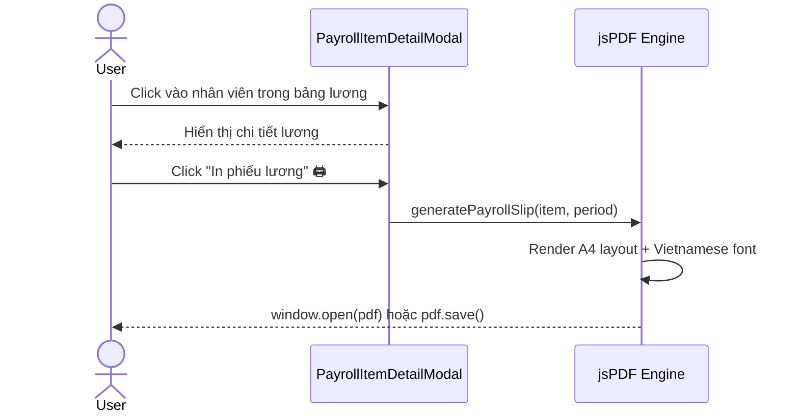

# PRD: In Phiếu Lương Cá Nhân (Individual Payroll Slip)

## 1. Bối cảnh & Mục tiêu

**Vấn đề:** Hiện tại `PayrollItemDetailModal` hiển thị chi tiết lương nhân viên nhưng không có chức năng in/xuất PDF phiếu lương riêng cho từng nhân viên để ký nhận.

**Căn cứ pháp lý:** Khoản 3 Điều 95 Bộ luật Lao động 2019 — mỗi lần trả lương, NSDLĐ phải cung cấp bảng kê trả lương ghi rõ: lương cơ bản, lương OT, lương đêm, các khoản khấu trừ.

> [!IMPORTANT]
> **Mục tiêu:** Tạo PDF phiếu lương A4 chuyên nghiệp cho **1 nhân viên**, in ra để NV ký nhận trực tiếp.

---

## 2. Mockup Layout (A4 Portrait)

```
┌───────────────────────────────────────────────────────┐
│  [LOGO]  ẨM THỰC GIAO TUYẾT                         │
│  Địa chỉ: ...              ĐT: ...                   │
│─────────────────────────────────────────────────────── │
│          PHIẾU LƯƠNG THÁNG 02/2026                    │
│          Kỳ: 01/02/2026 — 28/02/2026                  │
│───────────────────────────────────────────────────────│
│  Họ tên:     Lê Văn Tài                              │
│  Chức vụ:    Driver          Loại: Toàn thời gian     │
│───────────────────────────────────────────────────────│
│                                                       │
│  I. GIỜ LÀM VIỆC                                     │
│  ┌─────────┬───────┬────────┬────┬──────┬─────┐      │
│  │ Thường  │ OT    │ C.Tuần │ Lễ │ Đêm  │Tổng │      │
│  │ 7.3h    │ 0.0h  │ 0.0h   │0.0h│ 0.0h │7.3h │      │
│  └─────────┴───────┴────────┴────┴──────┴─────┘      │
│                                                       │
│  II. THU NHẬP                                         │
│  Lương cơ bản (× 100%)          280.385 đ             │
│  Tăng ca (× 150%)                     0 đ             │
│  Cuối tuần (× 200%)                   0 đ             │
│  Ngày lễ (× 300%)                     0 đ             │
│  Đêm (+30%)                           0 đ             │
│  ─────────────────────────────────────────             │
│  Phụ cấp ăn                     500.000 đ             │
│  Phụ cấp đi lại                 300.000 đ             │
│  Thưởng                               0 đ             │
│  ─────────────────────────────────────────             │
│  TỔNG THU NHẬP                1.080.385 đ             │
│                                                       │
│  III. KHẤU TRỪ                                        │
│  BHXH, BHYT, BHTN               -86.431 đ            │
│  Tạm ứng                              0 đ             │
│  ─────────────────────────────────────────             │
│  TỔNG KHẤU TRỪ                  -86.431 đ            │
│                                                       │
│  ═══════════════════════════════════════════          │
│  ★ THỰC NHẬN:                   993.954 đ             │
│  (Bằng chữ: Chín trăm chín mươi ba nghìn...)         │
│  ═══════════════════════════════════════════          │
│                                                       │
│  Ngày ... tháng ... năm 2026                          │
│                                                       │
│  NGƯỜI LẬP BẢNG         NGƯỜI NHẬN LƯƠNG              │
│  (Ký, ghi rõ họ tên)    (Ký, ghi rõ họ tên)          │
│                                                       │
│                                                       │
│  _______________         _______________               │
│                                                       │
│  📋 Luật LĐ VN: TT 100% | OT 150% | CT 200%         │
│                   Lễ 300% | Đêm +30%                  │
└───────────────────────────────────────────────────────┘
```

---

## 3. Data Model (đã có sẵn 100%)

Tất cả data cần thiết đã có trong `PayrollItemResponse`:

| Field | Mô tả | Available? |
|-------|--------|:----------:|
| `employee_name` | Họ tên | ✅ |
| `employee_role` | Chức vụ | ✅ |
| `is_fulltime` | Toàn thời gian/Part-time | ✅ |
| `regular_hours` / `overtime_hours` / `weekend_hours` / `holiday_hours` / `night_hours` | Giờ làm việc | ✅ |
| `regular_pay` / `overtime_pay` / `weekend_pay` / `holiday_pay` / `night_pay` | Thu nhập | ✅ |
| `allowance_meal` / `allowance_transport` / `bonus` | Phụ cấp | ✅ |
| `gross_salary` | Tổng thu nhập | ✅ |
| `deduction_social_ins` / `deduction_advance` | Khấu trừ | ✅ |
| `total_deductions` | Tổng khấu trừ | ✅ |
| `net_salary` | Thực nhận | ✅ |

> [!NOTE]
> **Không cần thay đổi backend.** Tất cả data đã sẵn sàng trong frontend.

---

## 4. Proposed Changes

### [MODIFY] [PayrollItemDetailModal.tsx](file:///d:/PROJECT/AM%20THUC%20GIAO%20TUYET/frontend/src/app/(dashboard)/hr/components/PayrollItemDetailModal.tsx)

1. **Thêm nút "In phiếu lương"** vào `DialogHeader`
2. **Tạo function `printPayrollSlip(item, periodName)`** sử dụng jsPDF trực tiếp:
   - Branded header (logo + tên công ty)
   - Tiêu đề: `PHIẾU LƯƠNG THÁNG MM/YYYY`
   - Thông tin NV (tên, chức vụ, loại HĐ)
   - Bảng giờ làm việc (5 loại + tổng)
   - Bảng thu nhập (5 loại pay + 3 phụ cấp + tổng)
   - Bảng khấu trừ (BHXH + tạm ứng + tổng)
   - **Thực nhận (bold, highlight)**
   - **Số tiền bằng chữ** (Vietnamese)
   - Khu vực chữ ký: 2 cột (Người lập / Người nhận lương)
   - Footer: tham chiếu luật LĐ VN

### [NEW] Helper: `numberToVietnameseWords(n: number): string`
- Chuyển đổi số → chữ tiếng Việt (ví dụ: 993.954 → "Chín trăm chín mươi ba nghìn chín trăm năm mươi tư đồng")
- Đặt trong file tiện ích chung hoặc inline

### Dependencies
- `jsPDF` — đã cài sẵn ✅
- `Roboto font` (Vietnamese diacritics) — đã có trong `use-report-export.ts` ✅

---

## 5. UX Flow



---

## 6. Verification Plan

### Manual Verification
1. Mở PayrollItemDetailModal → thấy nút "In phiếu lương"
2. Click "In phiếu lương" → PDF mở/tải về
3. Kiểm tra PDF: header, thông tin NV, giờ, thu nhập, khấu trừ, thực nhận
4. Kiểm tra chữ ký: 2 khu vực với đường kẻ
5. Kiểm tra Vietnamese diacritics hiển thị đúng
6. In thử trên A4 → layout vừa vặn

---

## 7. Complexity Assessment

| Dimension | Score | Notes |
|-----------|:-----:|-------|
| UX Impact | 3/10 | Simple print action from existing modal |
| Cross-Module | 1/10 | Self-contained, no external dependencies |
| Security | 2/10 | Uses existing permission system |
| Data Complexity | 2/10 | All data already available |
| Integration | 2/10 | Reuses existing jsPDF + Roboto font |
| **Weighted Total** | **2.3** | **Standard mode — 1 iteration** |
