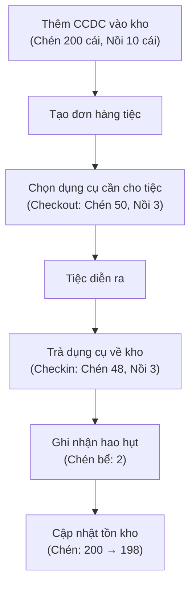
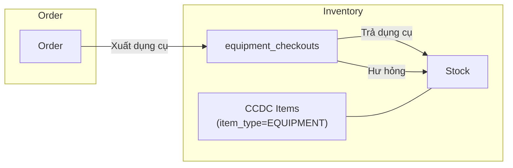

# PRD: Quản Lý Tài Sản Cố Định & Công Cụ Dụng Cụ (CCDC)
## Module: Inventory — Ẩm Thực Giao Tuyết Catering ERP

**Version**: 1.0  
**Date**: 2026-02-23  
**Status**: Draft — Chờ User Review

---

## 1. Bối Cảnh & Vấn Đề

### 1.1 Hiện trạng
Module Inventory hiện chỉ quản lý **nguyên vật liệu** (raw materials) — thực phẩm tiêu hao với FIFO/Lot tracking. Tuy nhiên, doanh nghiệp catering sử dụng một lượng lớn **dụng cụ phục vụ** (chén, đĩa, nồi, muỗng, đũa, khay, ly…) cần được:
- Theo dõi số lượng tồn kho
- Xuất/nhập theo từng đơn hàng (tiệc)
- Kiểm tra tình trạng (hư, mất, hao mòn)
- Kiểm kê định kỳ

### 1.2 Phân loại tài sản trong dịch vụ tiệc

| Loại | Ví dụ | Đặc điểm |
| :--- | :--- | :--- |
| **Nguyên liệu** (đã có) | Cá, thịt, rau, gia vị | Tiêu hao 1 lần, FIFO |
| **CCDC / Smallware** (cần thêm) | Chén, đĩa, ly, muỗng, đũa, khay | Tái sử dụng, hao mòn dần, số lượng lớn |
| **TSCĐ / Equipment** (phase sau) | Nồi công nghiệp, xe vận chuyển, tủ lạnh | Giá trị cao, khấu hao theo năm |

> [!IMPORTANT]
> **Scope PRD này**: Tập trung vào **CCDC (Công cụ Dụng cụ)** — dụng cụ phục vụ tiệc tái sử dụng. TSCĐ lớn (khấu hao, tài chính) sẽ là phase sau.

---

## 2. Giải Pháp Đề Xuất

### 2.1 Tổng quan kiến trúc

Mở rộng module Inventory hiện tại bằng cách thêm `item_type` vào `inventory_items`:

```
item_type = "MATERIAL" (mặc định, giữ nguyên hành vi cũ)
           | "EQUIPMENT" (CCDC — dụng cụ phục vụ)
```

Thêm bảng mới `equipment_checkouts` để theo dõi xuất/trả dụng cụ theo đơn hàng.

### 2.2 User Flow chính



---

## 3. Yêu Cầu Chi Tiết

### 3.1 Database Schema

#### Thay đổi bảng hiện có

```sql
-- Migration: Add item_type to inventory_items
ALTER TABLE inventory_items 
ADD COLUMN item_type VARCHAR(20) DEFAULT 'MATERIAL' NOT NULL;

-- Thêm fields cho EQUIPMENT
ALTER TABLE inventory_items 
ADD COLUMN condition_status VARCHAR(20) DEFAULT 'GOOD',
ADD COLUMN purchase_date DATE NULL,
ADD COLUMN warranty_months INTEGER DEFAULT 0,
ADD COLUMN reusable BOOLEAN DEFAULT FALSE;

COMMENT ON COLUMN inventory_items.item_type IS 'MATERIAL=Nguyên liệu, EQUIPMENT=CCDC/Dụng cụ';
COMMENT ON COLUMN inventory_items.condition_status IS 'GOOD, FAIR, POOR, DAMAGED';
```

#### Bảng mới: `equipment_checkouts`

```sql
CREATE TABLE equipment_checkouts (
    id UUID PRIMARY KEY DEFAULT gen_random_uuid(),
    tenant_id UUID NOT NULL,
    
    -- Liên kết
    item_id UUID NOT NULL REFERENCES inventory_items(id),
    order_id UUID NULL,  -- Liên kết với đơn hàng (nullable cho checkout không theo order)
    warehouse_id UUID NOT NULL REFERENCES warehouses(id),
    
    -- Số lượng
    checkout_qty INTEGER NOT NULL,        -- Số lượng xuất
    checkin_qty INTEGER DEFAULT 0,        -- Số lượng đã trả
    damaged_qty INTEGER DEFAULT 0,        -- Số lượng hư/mất
    
    -- Thời gian
    checkout_date TIMESTAMP WITH TIME ZONE NOT NULL DEFAULT NOW(),
    expected_return_date TIMESTAMP WITH TIME ZONE NULL,
    actual_return_date TIMESTAMP WITH TIME ZONE NULL,
    
    -- Trạng thái
    status VARCHAR(20) NOT NULL DEFAULT 'CHECKED_OUT',
    -- CHECKED_OUT | PARTIALLY_RETURNED | RETURNED | OVERDUE
    
    notes TEXT NULL,
    performed_by UUID NULL,
    
    created_at TIMESTAMP WITH TIME ZONE DEFAULT NOW(),
    updated_at TIMESTAMP WITH TIME ZONE DEFAULT NOW()
);

-- RLS
ALTER TABLE equipment_checkouts ENABLE ROW LEVEL SECURITY;
CREATE POLICY tenant_isolation ON equipment_checkouts
    USING (tenant_id = (current_setting('app.current_tenant')::UUID));

-- Index
CREATE INDEX idx_equip_checkout_order ON equipment_checkouts(order_id);
CREATE INDEX idx_equip_checkout_item ON equipment_checkouts(item_id);
CREATE INDEX idx_equip_checkout_status ON equipment_checkouts(tenant_id, status);
```

### 3.2 Backend API

| Endpoint | Method | Mô tả |
| :--- | :---: | :--- |
| `/inventory/items?item_type=EQUIPMENT` | GET | Lọc danh sách CCDC |
| `/inventory/items` | POST | Tạo item mới (có thể là CCDC) |
| `/inventory/equipment/checkouts` | GET | Danh sách checkout đang mở |
| `/inventory/equipment/checkouts` | POST | Xuất dụng cụ cho tiệc |
| `/inventory/equipment/checkouts/{id}/checkin` | PUT | Nhận trả dụng cụ |
| `/inventory/equipment/stats` | GET | Dashboard: tổng CCDC, đang cho mượn, hư hỏng |
| `/inventory/equipment/overdue` | GET | Danh sách quá hạn trả |

#### Ví dụ: POST Checkout
```json
{
    "order_id": "uuid-of-order",
    "items": [
        {"item_id": "uuid-chen", "quantity": 50},
        {"item_id": "uuid-noi", "quantity": 3}
    ],
    "expected_return_date": "2026-02-24T18:00:00+07:00",
    "notes": "Tiệc cưới Nguyễn Văn A"
}
```

#### Ví dụ: PUT Checkin
```json
{
    "returns": [
        {"item_id": "uuid-chen", "returned_qty": 48, "damaged_qty": 2, "damage_notes": "Bể do vận chuyển"},
        {"item_id": "uuid-noi", "returned_qty": 3, "damaged_qty": 0}
    ]
}
```

### 3.3 Frontend UI

#### Tab mới trong Inventory

Thêm tab **"Dụng cụ"** (CCDC) bên cạnh các tab hiện có:

```
[Sản phẩm] [Phân tích] [Giao dịch] [Lots] [Cảnh báo] [📦 Dụng cụ]
```

#### Card thống kê (4 KPI cards)
| Card | Giá trị | Style |
| :--- | :--- | :--- |
| Tổng CCDC | Số loại dụng cụ | Primary |
| Hiện có | Tổng số lượng tồn kho | Success |
| Đang cho mượn | Tổng checkout chưa trả | Warning |
| Hư hỏng tháng này | Tổng damaged_qty tháng | Error |

#### Bảng danh sách CCDC
Hiển thị tất cả items có `item_type = 'EQUIPMENT'`:

| Tên | SKU | Tồn kho | Đang mượn | Tình trạng | Thao tác |
| :--- | :--- | ---: | ---: | :--- | :--- |
| Chén sứ trắng | CCDC-001 | 198 | 50 | Tốt | 👁 |

#### Bảng Checkout/Checkin
Quản lý lịch sử xuất/trả theo đơn hàng:

| Đơn hàng | Ngày xuất | Ngày trả dự kiến | Đã trả | Hư hỏng | Trạng thái |
| :--- | :--- | :--- | ---: | ---: | :--- |
| DH-230226001 | 23/02/2026 | 24/02/2026 | 48/50 | 2 | Đã trả |

#### Tích hợp Order Detail
Trong trang chi tiết đơn hàng, thêm section **"Dụng cụ"** hiển thị:
- Danh sách dụng cụ đã xuất cho tiệc
- Nút "Xuất dụng cụ" (tạo checkout)
- Nút "Nhận trả" (checkin)

### 3.4 Business Rules

| ID | Rule | Severity |
| :--- | :--- | :---: |
| BR-EQ01 | Không được checkout vượt số lượng tồn kho | CRITICAL |
| BR-EQ02 | `checkin_qty + damaged_qty ≤ checkout_qty` | CRITICAL |
| BR-EQ03 | Checkout quá hạn 24h → Thông báo cảnh báo | MEDIUM |
| BR-EQ04 | Khi damaged_qty > 0 → Giảm stock tương ứng | HIGH |
| BR-EQ05 | Items EQUIPMENT không tham gia FIFO/Lot tracking | HIGH |
| BR-EQ06 | Items EQUIPMENT không bị auto-deduct khi Order COMPLETED | HIGH |

---

## 4. Integration Map



### 4.1 Order Integration
- Order detail page hiển thị dụng cụ đã checkout
- Khi order CANCELLED → tự động checkin tất cả CCDC chưa trả
- Khi order COMPLETED → nhắc nhở checkin nếu chưa trả

### 4.2 Finance Integration (Phase sau)
- TSCĐ: khấu hao tự động, ghi nhận Journal entry
- CCDC hư hỏng: ghi nhận chi phí tổn thất

---

## 5. Phân Quyền (Permission Matrix)

### Module Access
| Module | admin | manager | chef | sales | staff |
| :--- | :---: | :---: | :---: | :---: | :---: |
| **Inventory/CCDC** | ✅ | ✅ | ✅ | ⬜ | ⬜ |

### Action Permissions
| Action | admin | manager | chef |
| :--- | :---: | :---: | :---: |
| View CCDC List | ✅ | ✅ | ✅ |
| Create CCDC Item | ✅ | ✅ | ⬜ |
| Edit CCDC Item | ✅ | ✅ | ⬜ |
| Delete CCDC Item | ✅ | ⬜ | ⬜ |
| Checkout Equipment | ✅ | ✅ | ✅ |
| Checkin Equipment | ✅ | ✅ | ✅ |
| View Checkout History | ✅ | ✅ | ✅ |
| Report Damage | ✅ | ✅ | ✅ |

---

## 6. Kế Hoạch Thực Hiện

### Phase 1: Core CCDC (PRD này)
1. Migration: thêm `item_type`, `condition_status` vào `inventory_items`
2. Migration: tạo bảng `equipment_checkouts`
3. Backend: CRUD endpoints cho CCDC items + Checkout/Checkin
4. Frontend: Tab "Dụng cụ" trong Inventory page
5. Frontend: Checkout/Checkin modals

### Phase 2: Order Integration
6. Order detail: section dụng cụ
7. Auto-checkin reminder khi order COMPLETED
8. Order cancelled → auto-checkin

### Phase 3: Advanced (Future)
9. TSCĐ lớn: khấu hao, tài chính
10. Barcode/QR scanning
11. Kiểm kê định kỳ (audit cycle)
12. Báo cáo hao mòn theo thời gian

---

## 7. Verification Plan

### Automated Tests
- Unit test: Checkout/Checkin business logic
- API test: CRUD endpoints + validation rules
- `next build` — no compilation errors

### Browser Tests
- [ ] Tab "Dụng cụ" hiển thị đúng trong Inventory page
- [ ] Tạo CCDC item với `item_type = EQUIPMENT`
- [ ] Checkout dụng cụ cho đơn hàng
- [ ] Checkin — ghi nhận hư hỏng → stock giảm
- [ ] Cảnh báo khi checkout vượt tồn kho

---

## 8. Research Sources

### External Sources (Verified ≥2)
- Restaurant fixed asset tracking best practices (cpcongroup.com, safetyculture.com)
- Catering smallware management (restaurant365.com, saveinparadise.com)
- Event equipment check-in/check-out systems (curate.co, reservety.com)
- Vietnamese ERP CCDC standards (fast.com.vn, misa.vn, absofterp.vn)

### Internal Context
- [Inventory KI](file:///C:/Users/nguye/.gemini/antigravity/knowledge/inventory_management_module/artifacts/overview.md)
- [Business Flows Config](file:///d:/PROJECT/AM%20THUC%20GIAO%20TUYET/.agent/config/business-flows.yaml)
- [Permission Matrix](file:///d:/PROJECT/AM%20THUC%20GIAO%20TUYET/.agent/permission-matrix.md)
