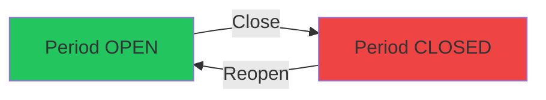

# PRD: Quản Lý Kỳ Kế Toán (Accounting Period Management)

> **Workflow**: Hybrid Research-Reflexion PRD v1.0
> **Date**: 2026-02-06
> **Quality Score**: Draft v1
> **Research Mode**: FULL (3 external sources + codebase analysis)

---

## 1. Executive Summary

### 1.1 Problem Statement
Module Quản lý Kỳ Kế Toán hiện tại hoạt động với các chức năng cơ bản (Open/Close/Reopen), nhưng thiếu nhiều best practices theo tiêu chuẩn ngành để đảm bảo tính toàn vẹn dữ liệu tài chính và tự động hóa quy trình.

### 1.2 Proposed Solution
Nâng cấp module với các tính năng:
- **Pre-Close Validation Checklist** (kiểm tra trước khi đóng kỳ)
- **Multi-Phase Close Workflow** (đóng kỳ theo giai đoạn)
- **Period Lock/Unlock by Module** (khóa riêng từng module)
- **Auto-Period Generation** (tự động tạo kỳ theo lịch)
- **Close Dashboard & Progress Tracking** (dashboard theo dõi tiến độ)

---

## 2. Research Synthesis

### 2.1 Industry Best Practices (Verified Claims)

| Claim | Sources | Confidence |
|:------|:-------:|:----------:|
| Establish comprehensive closing checklist with owners & deadlines | 5+ sources | ✅ HIGH |
| Reconcile accounts regularly, not just at period-end | 4+ sources | ✅ HIGH |
| Lock sub-modules before closing General Ledger | Oracle, NetSuite, Infor | ✅ HIGH |
| Leverage ERP automation for recurring entries | 4+ sources | ✅ HIGH |
| Continuous/rolling close approach reduces month-end burden | 3+ sources | ✅ HIGH |
| Post-close review process for improvement | 3+ sources | ✅ HIGH |

### 2.2 Current State Analysis



**Existing Features:**
- ✅ JIT Period Provisioning (auto-create monthly period)
- ✅ Period Close/Reopen workflow
- ✅ Duplicate cleanup mechanism
- ✅ Period status display (OPEN/CLOSED)
- ✅ Closing balance snapshots (debit/credit totals)

**Identified Gaps:**

| Gap ID | Description | Priority | Industry Reference |
|:------:|:------------|:--------:|:-------------------|
| GAP-1 | No pre-close validation checklist | 🔴 HIGH | NetSuite, Oracle |
| GAP-2 | No module-level locking (AR/AP/Inventory close separately) | 🟡 MEDIUM | Dynamics 365, Infor |
| GAP-3 | No close progress tracking dashboard | 🟡 MEDIUM | HighRadius |
| GAP-4 | No automated period generation scheduler | 🟢 LOW | All ERPs |
| GAP-5 | No post-close audit trail/notes | 🟡 MEDIUM | Compliance standard |

---

## 3. Proposed Features

### 3.1 Feature: Pre-Close Validation Checklist (GAP-1)

> **Priority**: 🔴 HIGH | **Effort**: 3 days

**User Story:**
> Là kế toán trưởng, tôi muốn hệ thống tự động kiểm tra các điều kiện cần thiết trước khi đóng kỳ, để đảm bảo không bỏ sót bước quan trọng nào.

**Acceptance Criteria:**
- [ ] AC-1: Hiển thị checklist validation khi user click "Đóng kỳ"
- [ ] AC-2: Kiểm tra tự động: Tất cả journals đã POSTED
- [ ] AC-3: Kiểm tra tự động: Không còn draft transactions
- [ ] AC-4: Kiểm tra tự động: Bank reconciliation hoàn tất (if applicable)
- [ ] AC-5: Hiển thị warning items (không block) và blocking items (phải fix)
- [ ] AC-6: Cho phép proceed với warning nhưng block với critical items

**Technical Spec:**

```typescript
// Frontend: Pre-close validation modal
interface PreCloseValidation {
  passed: boolean;
  checks: ValidationCheck[];
}

interface ValidationCheck {
  id: string;
  name: string;            // "Journals đã posted"
  status: 'PASS' | 'WARN' | 'FAIL';
  severity: 'INFO' | 'WARNING' | 'CRITICAL';
  details?: string;        // "2 journals chưa posted"
  actionUrl?: string;      // Link to fix
}
```

```python
# Backend: GET /finance/periods/{id}/pre-close-validation
async def get_pre_close_validation(period_id: UUID):
    checks = []
    
    # Check 1: All journals posted
    draft_count = await count_draft_journals(period_id)
    checks.append({
        "id": "journals_posted",
        "name": "Tất cả bút toán đã được duyệt",
        "status": "PASS" if draft_count == 0 else "FAIL",
        "severity": "CRITICAL",
        "details": f"{draft_count} bút toán chưa duyệt" if draft_count > 0 else None
    })
    
    # Check 2: Debit = Credit balance
    # Check 3: No pending receivables
    # Check 4: No pending payables
    
    return {"passed": all(c["status"] != "FAIL" for c in checks), "checks": checks}
```

---

### 3.2 Feature: Close Progress Dashboard (GAP-3)

> **Priority**: 🟡 MEDIUM | **Effort**: 2 days

**User Story:**
> Là kế toán trưởng, tôi muốn theo dõi tiến độ đóng kỳ trên dashboard để biết còn bao nhiêu bước cần hoàn thành.

**Acceptance Criteria:**
- [ ] AC-1: Hiển thị progress bar (e.g., 5/8 steps completed)
- [ ] AC-2: Show checklist items với status (Done/Pending/In-Progress)
- [ ] AC-3: Cho phép manually check off items
- [ ] AC-4: Persist checklist state trong database

**UI Mockup:**
```
┌─ Tiến độ đóng kỳ Tháng 02/2026 ─────────────────┐
│ ████████████░░░░░░ 62.5% (5/8 hoàn thành)       │
├─────────────────────────────────────────────────┤
│ ✅ Đối soát ngân hàng                           │
│ ✅ Duyệt bút toán chờ                           │
│ ✅ Đóng module Công nợ phải thu                 │
│ ✅ Đóng module Công nợ phải trả                 │
│ ✅ Kiểm tra cân đối                             │
│ ⏳ Tính khấu hao tài sản                        │
│ ⬜ Tạo báo cáo tài chính                        │
│ ⬜ Phê duyệt cuối cùng                          │
└─────────────────────────────────────────────────┘
```

---

### 3.3 Feature: Post-Close Audit Notes (GAP-5)

> **Priority**: 🟡 MEDIUM | **Effort**: 1 day

**User Story:**
> Là kế toán, tôi muốn ghi chú lý do khi mở lại kỳ đã đóng để có audit trail rõ ràng.

**Acceptance Criteria:**
- [ ] AC-1: Bắt buộc nhập lý do khi Reopen period
- [ ] AC-2: Lưu audit log với timestamp, user, reason
- [ ] AC-3: Hiển thị history trong period detail

**Current State:**
- ✅ Reopen already requires reason (backend has `reason` parameter)
- ❌ No UI prompt for reason (currently hardcoded)
- ❌ No audit history display

---

## 4. Data Model Changes

### 4.1 New Table: `period_close_checklist`

```sql
CREATE TABLE period_close_checklist (
    id UUID PRIMARY KEY DEFAULT gen_random_uuid(),
    tenant_id UUID NOT NULL REFERENCES tenants(id),
    period_id UUID NOT NULL REFERENCES accounting_periods(id),
    check_name VARCHAR(100) NOT NULL,
    check_order INT NOT NULL,
    is_completed BOOLEAN DEFAULT FALSE,
    completed_by UUID REFERENCES users(id),
    completed_at TIMESTAMP WITH TIME ZONE,
    notes TEXT,
    created_at TIMESTAMP WITH TIME ZONE DEFAULT NOW(),
    updated_at TIMESTAMP WITH TIME ZONE DEFAULT NOW()
);

-- RLS Policy
ALTER TABLE period_close_checklist ENABLE ROW LEVEL SECURITY;
CREATE POLICY tenant_isolation ON period_close_checklist
    USING (tenant_id = current_setting('app.current_tenant')::uuid);
```

### 4.2 New Table: `period_audit_log`

```sql
CREATE TABLE period_audit_log (
    id UUID PRIMARY KEY DEFAULT gen_random_uuid(),
    tenant_id UUID NOT NULL REFERENCES tenants(id),
    period_id UUID NOT NULL REFERENCES accounting_periods(id),
    action VARCHAR(50) NOT NULL, -- 'CLOSE', 'REOPEN', 'LOCK_MODULE'
    performed_by UUID REFERENCES users(id),
    performed_at TIMESTAMP WITH TIME ZONE DEFAULT NOW(),
    reason TEXT,
    metadata JSONB DEFAULT '{}'
);
```

---

## 5. API Changes

### 5.1 New Endpoints

| Method | Endpoint | Description |
|:------:|:---------|:------------|
| GET | `/finance/periods/{id}/pre-close-validation` | Get validation checks before closing |
| GET | `/finance/periods/{id}/checklist` | Get close checklist items |
| PATCH | `/finance/periods/{id}/checklist/{item_id}` | Update checklist item status |
| GET | `/finance/periods/{id}/audit-log` | Get period audit history |

### 5.2 Modified Endpoints

| Endpoint | Change |
|:---------|:-------|
| `POST /periods/{id}/close` | Add pre-validation check, create audit log |
| `POST /periods/{id}/reopen` | Require reason in request body, create audit log |

---

## 6. UI Changes

### 6.1 Period Closing Manager Enhancements

| Component | Change |
|:----------|:-------|
| `PeriodClosingManager` | Add "Xem tiến độ" button for each period |
| Close Period Modal | Replace simple confirm with validation checklist |
| Reopen Period Modal | Add required reason textarea |
| Period Detail Panel | Add audit history accordion |

---

## 7. Implementation Roadmap

### Phase 1: Pre-Close Validation (Week 1)
- [ ] Backend: `GET /periods/{id}/pre-close-validation`
- [ ] Frontend: PreCloseValidationModal component
- [ ] Integration: Hook into Close Period flow

### Phase 2: Audit Trail (Week 1)
- [ ] Database: Create `period_audit_log` table
- [ ] Backend: Log actions in close/reopen
- [ ] Frontend: Reopen modal with reason

### Phase 3: Close Dashboard (Week 2)
- [ ] Database: Create `period_close_checklist` table
- [ ] Backend: Checklist CRUD APIs
- [ ] Frontend: CloseDashboard component

---

## 8. Verification Plan

### 8.1 Automated Tests
```bash
# Backend unit tests
cd backend && pytest tests/finance/test_periods.py -v

# Frontend component tests  
cd frontend && npm test -- --testPathPattern=period-closing
```

### 8.2 Browser Tests
1. Navigate to Finance > Báo cáo > Quản lý kỳ kế toán
2. Click "Đóng kỳ" trên period OPEN
3. Verify pre-close validation modal appears
4. Check all items show correct status
5. Attempt close with CRITICAL item failing → should be blocked
6. Fix issues and close successfully
7. Verify audit log entry created

### 8.3 Manual Verification
- [ ] Reopen period prompts for reason
- [ ] Audit log displays history correctly
- [ ] Checklist items persist across sessions

---

## 9. Risk Assessment

| Risk | Likelihood | Impact | Mitigation |
|:-----|:----------:|:------:|:-----------|
| Pre-close checks too slow | Medium | High | Add caching, async validation |
| Users bypass checklist | Low | Medium | Make checklist mandatory for managers |
| Audit log grows large | Low | Low | Implement retention policy |

---

## 10. Success Metrics

| Metric | Current | Target |
|:-------|:-------:|:------:|
| Time to close period | ~30 min manual | ~10 min with validation |
| Period reopen without reason | 100% | 0% |
| Close errors caught before close | Unknown | 90%+ |

---

## Appendix: Research Sources

| Source | URL | Claim Used |
|:-------|:----|:-----------|
| NetSuite | netsuite.com | Continuous close, module locking |
| Oracle | oracle.com | Period close workflow, integrity reports |
| Microsoft D365 | microsoft.com | Close schedules, financial templates |
| HighRadius | highradius.com | Automation, progress tracking |
| Tipalti | tipalti.com | Reconciliation best practices |

---

**Version History:**
- v1.0 (2026-02-06): Initial draft with Hybrid Research synthesis
