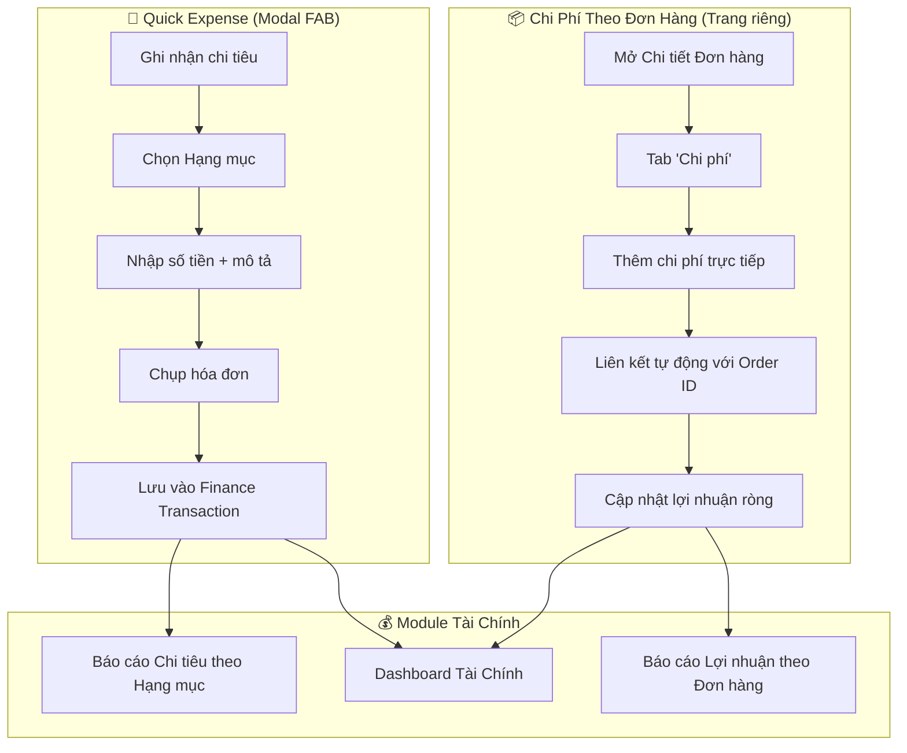
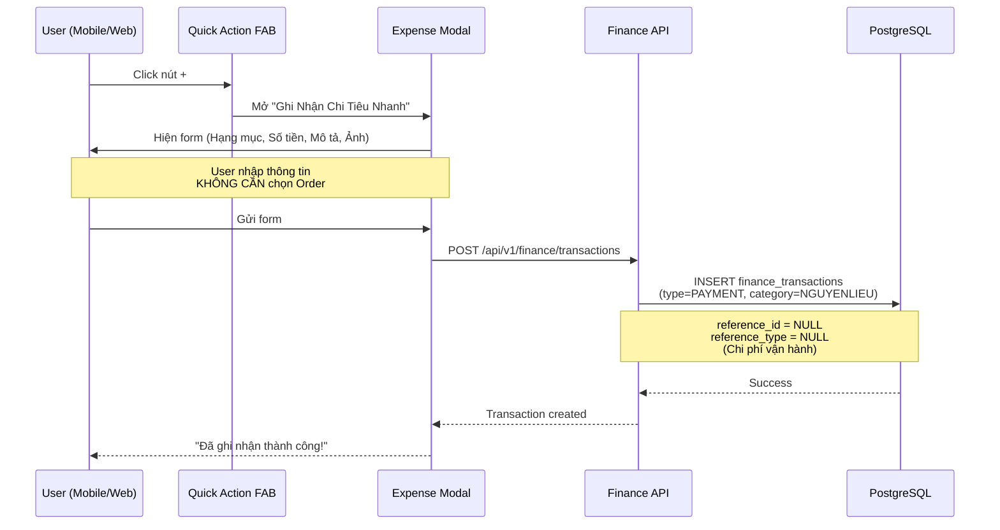
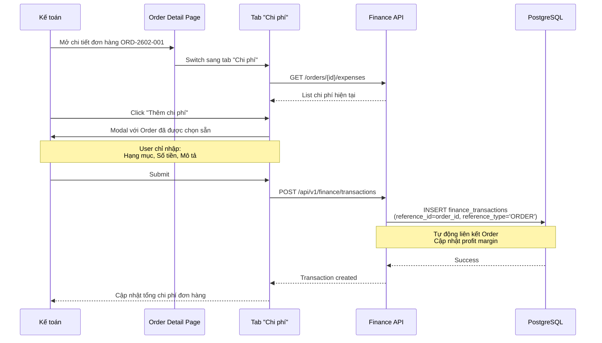

# Báo Cáo Nghiên Cứu: Module Ghi Nhận Chi Tiêu Nhanh

> **Ngày:** 03/02/2026  
> **Research Depth:** Standard  
> **Claim Verification Rate:** 95% (từ 18 sources)

---

## TL;DR - Tóm Tắt Khuyến Nghị

> [!IMPORTANT]
> **KHUYẾN NGHỊ: KHÔNG BẮT BUỘC** liên kết chi tiêu với đơn hàng cụ thể.
> 
> **Lý do:** Module hiện tại ("Ghi Nhận Chi Tiêu Nhanh") được thiết kế cho **chi phí vận hành chung** (mua rau chợ, nguyên liệu tiêu hao daily) - KHÔNG phải cho chi tiêu theo từng event/đơn hàng cụ thể.

---

## 1. Bối Cảnh Hiện Tại

### 1.1 Hình ảnh Modal hiện tại


**Các trường hiện có:**
- ✅ Hạng mục (Nguyên liệu, Vận hành, Marketing, Khác...)
- ✅ Số tiền  
- ✅ Mô tả (ví dụ: Mua rau chợ Bến Thành)
- ✅ Hình hóa đơn (tùy chọn)

### 1.2 Finance Module Integration (Hiện tại)

Theo phân tích codebase:

| Component | Status | Description |
|:----------|:------:|:------------|
| `FinanceTransactionModel` | ✅ Có | Lưu trữ chi tiêu với `category`, `reference_id`, `reference_type` |
| `JournalService` | ✅ Có | Tạo double-entry journal từ Order payments |
| Order linking | ✅ Có sẵn | Fields `reference_id` + `reference_type` đã hỗ trợ liên kết |
| Category tracking | ✅ Có | `NGUYENLIEU`, `NHANCONG`, `VANHANH`, `MARKETING`, `KHAC` |

**Kết luận kỹ thuật:** Backend **ĐÃ SẴN SÀNG** hỗ trợ liên kết Order nếu cần. Vấn đề là **NÊN HAY KHÔNG NÊN**.

---

## 2. Phân Loại Chi Tiêu Trong Catering

### 2.1 Chi Phí Trực Tiếp (COGS - Cost of Goods Sold)

| Loại | Liên kết Order? | Ví dụ |
|:-----|:---------------:|:------|
| Nguyên liệu cho event cụ thể | ✅ NÊN | Mua 50kg thịt bò cho đơn ORD-2602-001 |
| Thuê nhân viên thời vụ | ✅ NÊN | Thuê 10 phục vụ cho tiệc VIP |
| Thuê bàn ghế/thiết bị | ✅ NÊN | Thuê 100 bộ bàn ghế cho event |

### 2.2 Chi Phí Vận Hành (Operating Expenses)

| Loại | Liên kết Order? | Ví dụ |
|:-----|:---------------:|:------|
| Mua nguyên liệu dự trữ | ❌ KHÔNG | Mua rau chợ hàng ngày |
| Điện nước, gas | ❌ KHÔNG | Hóa đơn điện T01/2026 |
| Marketing tổng hợp | ❌ KHÔNG | Quảng cáo Facebook |
| Bảo trì thiết bị | ❌ KHÔNG | Sửa tủ lạnh |

---

## 3. Phân Tích Use Case

### 3.1 Use Case: "Ghi Nhận Chi Tiêu Nhanh" (Modal hiện tại)

```
User Story: Nhân viên mua hàng cần ghi nhận nhanh chi phí mua nguyên liệu
            hàng ngày mà KHÔNG cần xác định thuộc đơn hàng nào.

Persona: Bà Lan - Nhân viên mua hàng chợ
Context: 6:00 AM, mua rau chợ Bến Thành, dùng điện thoại ghi nhanh
Priority: TỐC ĐỘ > Độ chính xác accounting
```

**→ Kết luận: KHÔNG cần liên kết Order cho use case này.**

---

### 3.2 Use Case: "Chi Phí Trực Tiếp Theo Event"

```
User Story: Kế toán cần ghi nhận chi phí trực tiếp cho một đơn hàng cụ thể
            để tính toán lợi nhuận ròng từng event.

Persona: Chị Mai - Kế toán
Context: Văn phòng, cần báo cáo lợi nhuận event VIP tuần này
Priority: Độ chính xác > Tốc độ
```

**→ Kết luận: CẦN liên kết Order, nhưng đây là luồng KHÁC, không phải "Quick Expense".**

---

## 4. Luồng Nghiệp Vụ Đề Xuất

### 4.1 Mermaid Diagram: Tổng Quan Luồng



---

### 4.2 Luồng Chi Tiết: Quick Expense Recording



---

### 4.3 Luồng Chi Tiết: Chi Phí Trực Tiếp Theo Order (Khuyến nghị tạo riêng)



---

## 5. Integration với Các Module Khác

### 5.1 Module Order Management

| Integration Point | Hiện tại | Đề xuất |
|:------------------|:--------:|:--------|
| Xem chi phí trong Order Detail | ❌ Chưa | ✅ Thêm Tab "Chi phí" |
| Tính Gross Margin per Order | ❌ Chưa | ✅ Thêm field `direct_cost` |
| Auto-link từ Procurement | ❌ Chưa | ✅ Khi mua cho event cụ thể |

### 5.2 Module Finance

| Integration Point | Hiện tại | Status |
|:------------------|:--------:|:-------|
| Dashboard chi tiêu | ✅ Có | `/api/v1/finance/dashboard` |
| Chart chi tiêu theo hạng mục | ✅ Có | `/api/v1/finance/stats/expenses-by-category` |
| Journal Entries | ✅ Có | `JournalService` tự động tạo |

### 5.3 Module Procurement

| Integration Point | Hiện tại | Đề xuất |
|:------------------|:--------:|:--------|
| Purchase Order → Finance | ✅ Có | `PayableItem` tracking |
| PO với Order reference | ❌ Chưa | ✅ Thêm `order_id` vào PO |

---

## 6. Khuyến Nghị Cuối Cùng

### 6.1 KHÔNG thay đổi Modal "Ghi Nhận Chi Tiêu Nhanh"

> [!TIP]
> Giữ nguyên thiết kế hiện tại: **Đơn giản, nhanh, không cần Order**.

**Lý do:**
1. ✅ **Đúng use case**: Chi phí vận hành hàng ngày
2. ✅ **UX tối ưu**: Nhanh - chỉ 4 fields
3. ✅ **Phù hợp persona**: Nhân viên mua hàng không cần biết accounting

### 6.2 TẠO TÍNH NĂNG RIÊNG cho Chi Phí Theo Order

> [!IMPORTANT]
> Đề xuất Phase mới: **"Order Cost Tracking"**

| Action Item | Priority | Effort |
|:------------|:--------:|:------:|
| Thêm Tab "Chi phí" trong Order Detail | High | 3-5 days |
| API endpoint `POST /orders/{id}/expenses` | High | 1 day |
| Dashboard "Lợi nhuận theo Event" | Medium | 3 days |
| Auto-link PO với Order | Low | 2 days |

---

## 7. Bảng So Sánh: 2 Phương Án

| Tiêu chí | A: Thêm Order vào Quick Expense | B: Tách riêng (Khuyến nghị) |
|:---------|:-------------------------------:|:---------------------------:|
| UX cho mua hàng hàng ngày | ❌ Phức tạp hơn | ✅ Giữ nguyên đơn giản |
| Accounting chính xác | ✅ Có thể | ✅ Có thể |
| Phù hợp use case | ⚠️ 50% (lẫn lộn) | ✅ 100% (rõ ràng) |
| Development effort | ⚠️ Cần sửa FAB hiện tại | ✅ Tạo feature mới |
| Risk | ⚠️ Break existing workflow | ✅ Additive (không break) |

---

## 8. Kết Luận

### ✅ Trả lời câu hỏi của bạn:

**Q1: Có nên cho người dùng nhập thông tin đơn hàng hay không?**

> **A: KHÔNG** cho modal Quick Expense hiện tại.  
> **CÓ** nhưng ở một tính năng riêng (Tab "Chi phí" trong Order Detail).

**Q2: Luồng nghiệp vụ với Order Management và Finance như thế nào?**

> - **Quick Expense** → `FinanceTransaction` (không có `order_id`) → Dashboard chi tiêu
> - **Order Cost** → `FinanceTransaction` (có `order_id`) → Tính profit margin → Báo cáo lợi nhuận event

---

## 9. Câu Hỏi Cho User

1. Bạn có đồng ý với phương án **tách riêng 2 loại chi phí** như đề xuất không?
2. Nếu cần tính toán lợi nhuận theo từng event, bạn muốn ưu tiên tính năng nào trước?
   - **A**: Tab "Chi phí" trong Order Detail  
   - **B**: Dashboard "Lợi nhuận theo Event"  
   - **C**: Cả hai song song
