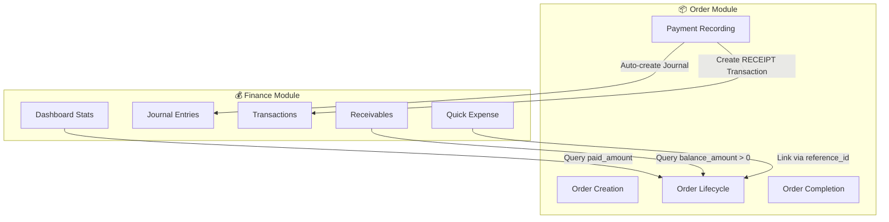
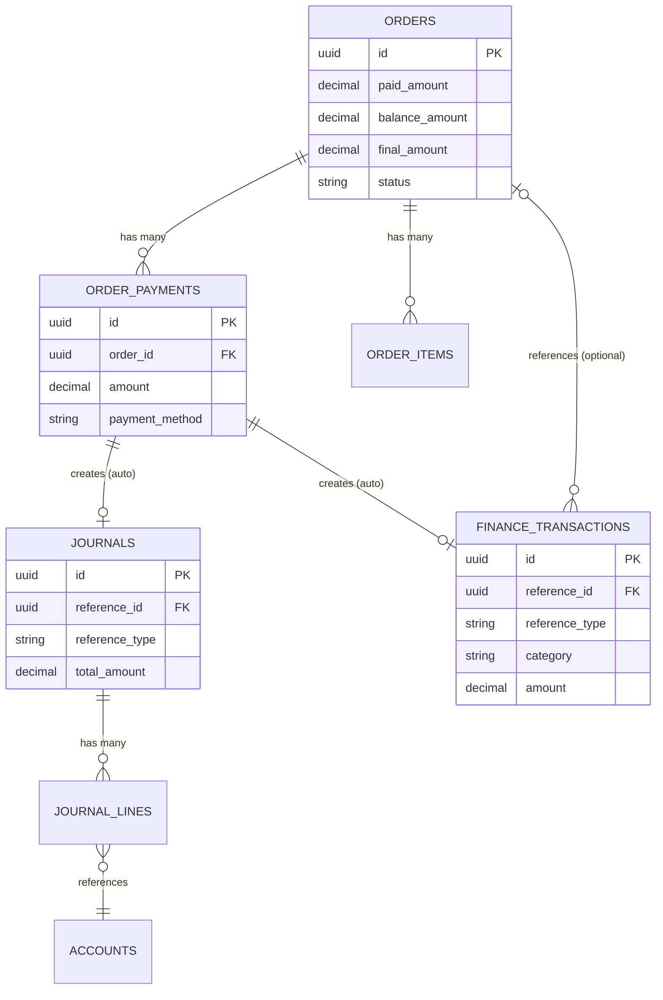
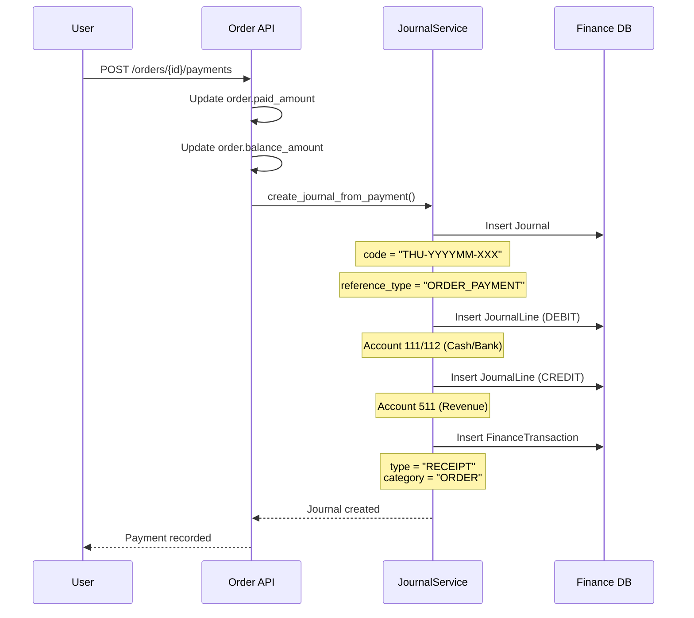
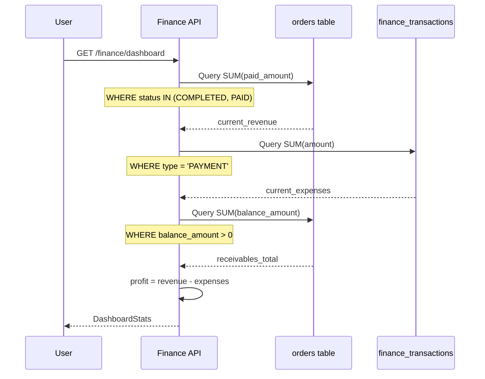
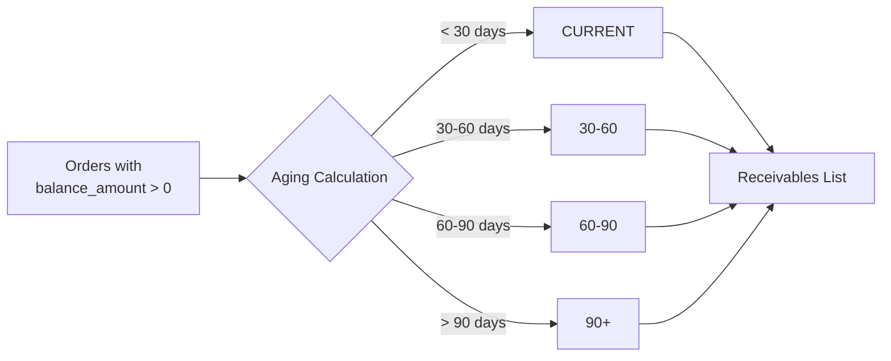
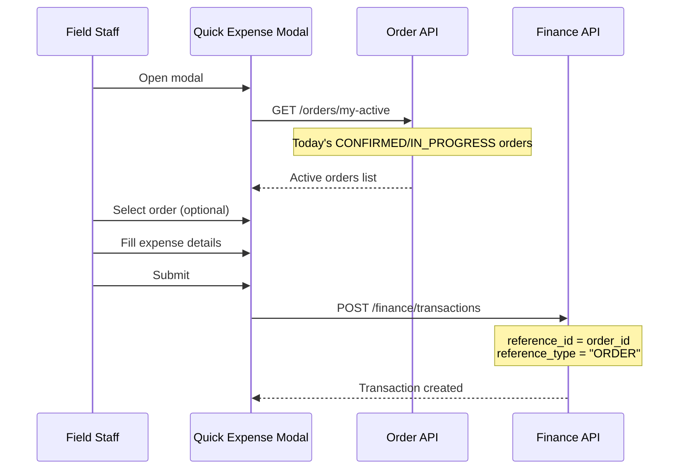

# Research Report: Order-Finance Business Flow Integration

> **Document Type**: Business Flow Analysis
> **Version**: 1.0
> **Date**: 2026-02-03
> **Module Scope**: Order Management ↔ Finance

---

## Executive Summary

Báo cáo này phân tích luồng nghiệp vụ giữa module **Order Management** và **Finance** trong hệ thống Catering ERP. Hai module này có mối quan hệ **bidirectional (2 chiều)** với các điểm tích hợp quan trọng tại:
1. **Payment Recording** → Auto Journal Creation
2. **Revenue Tracking** ← Order Data Aggregation
3. **Receivables Management** ← Order Balance Tracking
4. **Field Expense Linking** → Order Cost Attribution

---

## 1. High-Level Architecture



---

## 2. Data Model Relationships

### 2.1 Order Module Tables

| Table | Key Fields | Finance Integration |
|:------|:-----------|:--------------------|
| `orders` | `paid_amount`, `balance_amount`, `final_amount`, `status` | Source for Revenue & Receivables |
| `order_payments` | `amount`, `payment_method`, `order_id` | Triggers Journal/Transaction creation |
| `order_items` | `quantity`, `unit_price`, `total_price` | Cost basis calculation |

### 2.2 Finance Module Tables

| Table | Key Fields | Order Integration |
|:------|:-----------|:-----------------|
| `finance_transactions` | `reference_id`, `reference_type`, `category` | Links to Order via `ORDER` reference |
| `journals` | `reference_id`, `reference_type` | Links to Order via `ORDER_PAYMENT` |
| `journal_lines` | `account_id`, `debit`, `credit` | Double-entry for order payments |
| `accounts` | `code`, `type` | Chart of Accounts (COA) |

### 2.3 Entity Relationship Diagram



---

## 3. Business Flow Details

### 3.1 Flow 1: Order Payment → Finance Journal (Auto-Integration)

> **Trigger**: Khi thêm thanh toán vào đơn hàng
> **Result**: Tự động tạo Journal Entry + Finance Transaction



**Code Reference**: [add_payment](file:///d:/PROJECT/AM%20THUC%20GIAO%20TUYET/backend/modules/order/infrastructure/http_router.py#L582-L639)

**Double-Entry Logic**:
| Payment Method | Debit Account | Credit Account |
|:---------------|:--------------|:---------------|
| CASH, TIEN_MAT | 111 - Tiền mặt | 511 - Doanh thu |
| TRANSFER, CARD | 112 - Tiền gửi NH | 511 - Doanh thu |

---

### 3.2 Flow 2: Finance Dashboard ← Order Data Aggregation

> **Trigger**: User mở Finance Dashboard
> **Result**: Hiển thị Revenue, Profit, Receivables từ Order data



**Key Metrics Calculated**:
- **Revenue**: `SUM(orders.paid_amount)` for COMPLETED/PAID orders
- **Expenses**: `SUM(finance_transactions.amount)` for PAYMENT type
- **Profit**: Revenue - Expenses
- **Receivables**: `SUM(orders.balance_amount)` where balance > 0

**Code Reference**: [get_dashboard_stats](file:///d:/PROJECT/AM%20THUC%20GIAO%20TUYET/backend/modules/finance/infrastructure/http_router.py#L62-L186)

---

### 3.3 Flow 3: Accounts Receivable ← Order Balance Tracking

> **Trigger**: User xem danh sách Công nợ phải thu
> **Result**: Hiển thị các đơn hàng chưa thanh toán đủ với aging buckets



**API**: `GET /finance/receivables`

**Response fields per order**:
- `order_id`, `order_code`, `customer_name`, `customer_phone`
- `final_amount`, `paid_amount`, `balance_amount`
- `event_date`, `status`, `aging_bucket`

**Code Reference**: [list_receivables](file:///d:/PROJECT/AM%20THUC%20GIAO%20TUYET/backend/modules/finance/infrastructure/http_router.py#L475-L523)

---

### 3.4 Flow 4: Quick Expense → Order Cost Attribution (New)

> **Trigger**: User ghi nhận chi tiêu nhanh tại hiện trường
> **Result**: Chi tiêu được link với đơn hàng cụ thể (optional)



**Code References**:
- [get_my_active_orders](file:///d:/PROJECT/AM%20THUC%20GIAO%20TUYET/backend/modules/order/infrastructure/http_router.py#L33-L71)
- [create_transaction](file:///d:/PROJECT/AM%20THUC%20GIAO%20TUYET/backend/modules/finance/infrastructure/http_router.py#L430-L457)

---

### 3.5 Flow 5: Overdue Order Tracking

> **Trigger**: Finance cần theo dõi đơn hàng quá hạn thanh toán
> **Result**: Danh sách đơn hàng với `balance > 0` và `event_date` đã qua

**API**: `GET /orders/overdue?days_threshold=3`

**Response includes**:
- Order details (code, customer, amounts)
- `days_overdue`: Số ngày quá hạn
- `priority`: HIGH (>14 days) / MEDIUM (7-14) / LOW (<7)

**Code Reference**: [get_overdue_orders](file:///d:/PROJECT/AM%20THUC%20GIAO%20TUYET/backend/modules/order/infrastructure/http_router.py#L162-L228)

---

## 4. API Integration Map

### 4.1 Order → Finance (Outbound)

| Order Event | Finance Action | Endpoint | Auto/Manual |
|:------------|:---------------|:---------|:------------|
| Payment added | Create Journal + Transaction | JournalService | **Auto** |
| Order completed | Update receivables view | N/A (query-based) | **Auto** |
| Order cancelled | No action (manual adjustment if needed) | N/A | Manual |

### 4.2 Finance → Order (Inbound Query)

| Finance Feature | Order Data Used | Query |
|:----------------|:----------------|:------|
| Dashboard Revenue | `orders.paid_amount` | `status IN (COMPLETED, PAID)` |
| Receivables List | `orders.balance_amount` | `balance_amount > 0` |
| Recent Transactions | `order_payments` | `JOIN order_payments` |
| Quick Expense | `orders.id, code, customer_name` | `my-active` endpoint |

---

## 5. Chart of Accounts Integration

**Standard Accounts Used**:

| Code | Account Name | Type | Usage |
|:-----|:-------------|:-----|:------|
| 111 | Tiền mặt | ASSET | Cash payments |
| 112 | Tiền gửi ngân hàng | ASSET | Bank transfers |
| 131 | Phải thu khách hàng | ASSET | Receivables (future) |
| 331 | Phải trả người bán | LIABILITY | Payables (procurement) |
| 511 | Doanh thu bán hàng | REVENUE | Order revenue |
| 642 | Chi phí tiền lương | EXPENSE | Payroll |

---

## 6. Gap Analysis & Recommendations

### 6.1 Current Gaps

| Gap ID | Description | Impact | Priority |
|:-------|:------------|:-------|:---------|
| GAP-01 | Expense linked to Order không cập nhật `order.cost` | Không có Order P&L | High |
| GAP-02 | Refund/Return chưa có flow ngược | Cần điều chỉnh thủ công | Medium |
| GAP-03 | Receivables aging không tự động alert | Bỏ sót công nợ | Medium |
| GAP-04 | Deposit/Advance payment chưa tách biệt | Hạch toán không chính xác | Low |

### 6.2 Recommendations

#### R1: Order Cost Tracking (GAP-01 Fix)
- Thêm field `expenses_amount` vào `orders` table
- Khi tạo expense với `reference_type = 'ORDER'`:
  - Cập nhật `order.expenses_amount += expense.amount`
  - Tính `order.profit = paid_amount - expenses_amount`

#### R2: Automated Receivables Alerts (GAP-03 Fix)
- Tạo scheduled job kiểm tra `overdue > 7 days`
- Push notification/email cho Finance team

#### R3: Order P&L Report
- Endpoint mới: `GET /orders/{id}/pnl`
- Response: `{ revenue, expenses, profit, margin_percent }`

---

## 7. Summary

### Integration Points Matrix

| Integration | Direction | Trigger | Automation Level |
|:------------|:----------|:--------|:-----------------|
| Payment → Journal | Order → Finance | Payment created | ✅ Fully Auto |
| Revenue Stats | Finance ← Order | Dashboard load | ✅ Query-based |
| Receivables | Finance ← Order | Report load | ✅ Query-based |
| Expense → Order | Finance → Order | User selection | ⚠️ Partial (record only) |
| Overdue Tracking | Order → Finance | Report load | ✅ Query-based |

### Data Flow Summary

```
┌────────────────────────────────────────────────────────────────┐
│                    ORDER MODULE                                 │
│  ┌──────────────────────────────────────────────────────────┐  │
│  │ orders: paid_amount, balance_amount, final_amount        │  │
│  └──────────────────────────────────────────────────────────┘  │
│                          │                                      │
│                          ▼                                      │
│  ┌──────────────────────────────────────────────────────────┐  │
│  │ order_payments ──────────────────────────────────────────│──│──┐
│  └──────────────────────────────────────────────────────────┘  │  │
└────────────────────────────────────────────────────────────────┘  │
                                                                    │
                    ┌───────────────────────────────────────────────┘
                    │ JournalService.create_journal_from_payment()
                    ▼
┌────────────────────────────────────────────────────────────────┐
│                    FINANCE MODULE                               │
│  ┌──────────────────────────────────────────────────────────┐  │
│  │ journals + journal_lines (Double-Entry)                  │  │
│  └──────────────────────────────────────────────────────────┘  │
│                          │                                      │
│  ┌──────────────────────────────────────────────────────────┐  │
│  │ finance_transactions (reference_id → order_id)           │  │
│  └──────────────────────────────────────────────────────────┘  │
│                          │                                      │
│                          ▼                                      │
│  ┌──────────────────────────────────────────────────────────┐  │
│  │ Dashboard: Revenue | Expenses | Profit | Receivables     │  │
│  └──────────────────────────────────────────────────────────┘  │
└────────────────────────────────────────────────────────────────┘
```

---

## Appendix A: Code References

| Component | File Path |
|:----------|:----------|
| Order Router | `backend/modules/order/infrastructure/http_router.py` |
| Finance Router | `backend/modules/finance/infrastructure/http_router.py` |
| Journal Service | `backend/modules/finance/services/journal_service.py` |
| Order Models | `backend/modules/order/domain/models.py` |
| Finance Models | `backend/modules/finance/domain/models.py` |

---

*Generated by AI Workforce Research Agent*
*Workflow: `/research-prd` v2.1*
