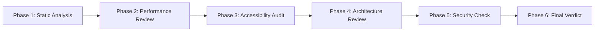

# /frontend-quality-gate Workflow

> **Trigger**: Khi cần comprehensive quality gate cho frontend trước release.
> **Skills**: ALL Vercel Skills + existing QA skills
> **Output**: Complete Quality Report với Go/No-Go decision.

// turbo-all

---

## Pre-Requisites

| Variable | Description | Example |
| :--- | :--- | :--- |
| `{target_path}` | Đường dẫn tới frontend code | `src/` |
| `{platform}` | web, mobile, hoặc both | `web` |
| `{release_type}` | major, minor, patch | `minor` |

---

## Overview: Quality Gate Phases



| Phase | Skill/Workflow Used | Weight |
| :--- | :--- | :---: |
| 1. Static Analysis | ESLint, TypeScript | 0.15 |
| 2. Performance Review | `react-best-practices` | 0.25 |
| 3. Accessibility Audit | `web-design-guidelines` | 0.20 |
| 4. Architecture Review | `composition-patterns` | 0.15 |
| 5. Security Check | Existing QA | 0.15 |
| 6. Mobile Review (if applicable) | `react-native-skills` | 0.10 |

---

## Phase 1: Static Analysis (15%)

### 1.1 TypeScript Strict Check

```powershell
# // turbo - Run TypeScript with strict mode
cd frontend && npx tsc --noEmit --strict 2>&1 | Tee-Object -Variable tsOutput
```

**Metrics**:
| Metric | Value | Threshold |
| :--- | :---: | :---: |
| Type Errors | | 0 |
| any usage | | <5 |
| Implicit any | | 0 |

### 1.2 ESLint Check

```powershell
# // turbo - Run ESLint
cd frontend && npx eslint "{target_path}/**/*.{ts,tsx}" --format json > .debug/eslint-gate.json
```

**Metrics**:
| Severity | Count | Threshold |
| :--- | :---: | :---: |
| Errors | | 0 |
| Warnings | | <20 |

### 1.3 Phase 1 Score

```
Phase 1 Score = (TypeErrors == 0 && ESLintErrors == 0) ? 10 : 0
Weight: 0.15
```

---

## Phase 2: Performance Review (25%)

> **Skill**: `vercel-react-best-practices` (57 rules)

### 2.1 Load Skill

```
Read: .agent/skills/react-best-practices/SKILL.md
Read: .agent/skills/react-best-practices/AGENTS.md
```

### 2.2 Run Performance Checks

> Thực hiện theo `/react-perf-review` workflow

**Key Checks**:
- [ ] Eliminating Waterfalls (CRITICAL)
- [ ] Bundle Size Optimization (CRITICAL)
- [ ] Server-Side Performance (HIGH)
- [ ] Re-render Optimization (MEDIUM)

### 2.3 Phase 2 Score

| Category | Score (1-10) |
| :--- | :---: |
| Waterfalls | |
| Bundle Size | |
| Server Performance | |
| Re-renders | |
| **Average** | **/10** |

```
Phase 2 Score = Average of all categories
Weight: 0.25
```

---

## Phase 3: Accessibility Audit (20%)

> **Skill**: `web-design-guidelines` (100+ rules)

### 3.1 Fetch Latest Guidelines

```
WebFetch: https://raw.githubusercontent.com/vercel-labs/web-interface-guidelines/main/command.md
```

### 3.2 Run Accessibility Checks

> Thực hiện theo `/ui-accessibility-audit` workflow

**Key Checks**:
- [ ] Focus States visible
- [ ] Forms properly labeled
- [ ] Animations respect prefers-reduced-motion
- [ ] No anti-patterns detected

### 3.3 Anti-Pattern Detection

```powershell
# // turbo - Scan anti-patterns
$antiPatterns = @(
  "outline-none",
  "transition:\s*all",
  "user-scalable=no",
  "aria-label.*missing"
)
$results = Select-String -Path "{target_path}/**/*.tsx" -Pattern ($antiPatterns -join "|") -AllMatches
Write-Output "Anti-patterns found: $($results.Count)"
```

### 3.4 Phase 3 Score

| Category | Issues | Score (1-10) |
| :--- | :---: | :---: |
| Focus States | | |
| Forms | | |
| Animation | | |
| Anti-patterns | | |
| **Average** | | **/10** |

```
Phase 3 Score = Average of all categories
Weight: 0.20
```

---

## Phase 4: Architecture Review (15%)

> **Skill**: `vercel-composition-patterns`

### 4.1 Load Skill

```
Read: .agent/skills/composition-patterns/SKILL.md
Read: .agent/skills/composition-patterns/AGENTS.md
```

### 4.2 Run Architecture Checks

**Key Checks**:
- [ ] No boolean prop proliferation
- [ ] Compound components được sử dụng
- [ ] State properly lifted
- [ ] Children over render props

### 4.3 Component Complexity Analysis

```powershell
# // turbo - Find components with many props
Select-String -Path "{target_path}/**/*.tsx" -Pattern "interface.*Props" -Context 0,20 |
  ForEach-Object { 
    $propCount = ($_.Context.PostContext -match ":").Count
    if ($propCount -gt 10) {
      Write-Output "$($_.Filename): $propCount props"
    }
  }
```

### 4.4 Phase 4 Score

| Category | Score (1-10) |
| :--- | :---: |
| Component Design | |
| State Management | |
| Prop Patterns | |
| **Average** | **/10** |

```
Phase 4 Score = Average of all categories
Weight: 0.15
```

---

## Phase 5: Security Check (15%)

> **Reference**: Existing QA workflow security checks

### 5.1 Frontend Security Scan

```powershell
# // turbo - Check for security issues
$securityPatterns = @(
  "dangerouslySetInnerHTML",
  "eval\(",
  "localStorage\.getItem.*password",
  "document\.cookie"
)
Select-String -Path "{target_path}/**/*.tsx" -Pattern ($securityPatterns -join "|") -AllMatches
```

### 5.2 Dependency Vulnerability Check

```powershell
# // turbo - Run npm audit
cd frontend && npm audit --json > .debug/npm-audit.json
```

### 5.3 Phase 5 Score

| Category | Issues | Score (1-10) |
| :--- | :---: | :---: |
| XSS Prevention | | |
| Sensitive Data | | |
| Dependencies | | |
| **Average** | | **/10** |

```
Phase 5 Score = Average of all categories
Weight: 0.15
```

---

## Phase 6: Mobile Review (10%) - Optional

> **Skill**: `vercel-react-native-skills` (if platform includes mobile)

### 6.1 Conditional Execution

```
IF {platform} == "mobile" OR {platform} == "both":
  Execute /react-native-review workflow
ELSE:
  Skip Phase 6 (Score = N/A, redistribute weight)
```

### 6.2 Phase 6 Score

| Category | Score (1-10) |
| :--- | :---: |
| List Performance | |
| Animation | |
| UI Patterns | |
| **Average** | **/10** |

---

## Final Verdict Calculation

### Score Summary

| Phase | Weight | Score | Weighted Score |
| :--- | :---: | :---: | :---: |
| 1. Static Analysis | 0.15 | /10 | |
| 2. Performance | 0.25 | /10 | |
| 3. Accessibility | 0.20 | /10 | |
| 4. Architecture | 0.15 | /10 | |
| 5. Security | 0.15 | /10 | |
| 6. Mobile (optional) | 0.10 | /10 | |
| **TOTAL** | 1.00 | | **/10** |

### Decision Matrix

| Final Score | Verdict | Action |
| :---: | :--- | :--- |
| ≥ 8.5 | ✅ **GO** | Ready for release |
| 7.0 - 8.4 | ⚠️ **CONDITIONAL GO** | Fix high-priority items first |
| 5.0 - 6.9 | 🟡 **HOLD** | Significant improvements needed |
| < 5.0 | ❌ **NO GO** | Major issues, block release |

### Blocking Criteria (Auto NO-GO)

Bất kể total score, nếu bất kỳ điều kiện sau thì **NO-GO**:

| Criterion | Threshold |
| :--- | :---: |
| TypeScript Errors | > 0 |
| ESLint Errors | > 0 |
| Security Vulnerabilities (High) | > 0 |
| Accessibility Critical Issues | > 0 |
| Performance CRITICAL violations | > 3 |

---

## Generate Final Report

### Report Template

```markdown
# Frontend Quality Gate Report

**Date**: {date}
**Target**: {target_path}
**Platform**: {platform}
**Release Type**: {release_type}

---

## Executive Summary

| Metric | Value |
| :--- | :---: |
| **Final Score** | /10 |
| **Verdict** | GO / CONDITIONAL GO / HOLD / NO GO |
| **Blocking Issues** | |
| **High Priority Issues** | |

---

## Phase Scores

| Phase | Score | Status |
| :--- | :---: | :---: |
| Static Analysis | /10 | ✅/❌ |
| Performance | /10 | ✅/❌ |
| Accessibility | /10 | ✅/❌ |
| Architecture | /10 | ✅/❌ |
| Security | /10 | ✅/❌ |
| Mobile | /10 | ✅/❌/N/A |

---

## Issues Summary

### Blocking Issues (Must Fix)
1. ...

### High Priority (Should Fix)
1. ...

### Medium Priority (Nice to Have)
1. ...

---

## Recommendations

1. ...
2. ...
3. ...

---

## Sign-off

- [ ] QA Review Complete
- [ ] Tech Lead Approved
- [ ] Ready for Deployment
```

### Save Report

```powershell
# // turbo - Save report
$date = Get-Date -Format "yyyyMMdd"
$releaseType = "{release_type}"
New-Item -Path ".reports/quality-gate/$date-$releaseType-gate.md" -ItemType File -Force
```

---

## Output Files

| File | Location | Description |
| :--- | :--- | :--- |
| Quality Gate Report | `.reports/quality-gate/{date}-{release}-gate.md` | Full report |
| Summary JSON | `.reports/quality-gate/{date}-{release}-summary.json` | CI integration |
| Phase Reports | `.reports/quality-gate/phases/` | Individual phase reports |

---

## Quick Reference

### Trigger Command
```
/frontend-quality-gate {path} --platform web --release minor
/frontend-quality-gate src/ --platform both --release major
```

### Related Workflows
| Workflow | When to Use |
| :--- | :--- |
| `/react-perf-review` | Deep dive performance |
| `/ui-accessibility-audit` | Deep dive accessibility |
| `/react-native-review` | Deep dive mobile |
| `/qa-review` | Backend quality gate |
