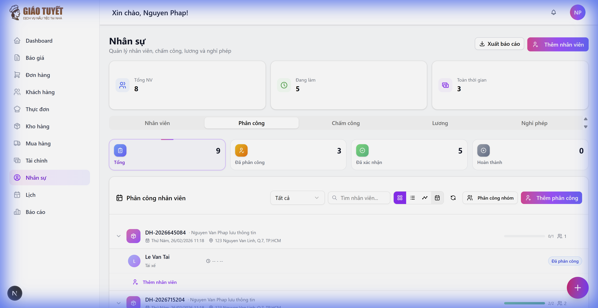

# 📋 Hướng dẫn sử dụng: Tab Phân Công Nhân Viên

> **Module**: Nhân sự (HR) → Tab Phân công
> **Phiên bản**: v2.0 (Sprint 2)
> **Cập nhật**: 21/02/2026

---

## 1. Giới thiệu

Tab **Phân công** cho phép quản lý việc phân công nhân viên vào các đơn hàng/sự kiện. Phiên bản mới hỗ trợ **4 chế độ xem** linh hoạt, phân công nhóm, và thống kê trực quan.

### Tính năng chính:
- 📊 **Thẻ thống kê** (Stats Cards) — tổng quan nhanh số lượng phân công theo trạng thái
- 📁 **Xem theo nhóm** — nhóm phân công theo đơn hàng/sự kiện
- 📋 **Xem danh sách** — danh sách chi tiết với cập nhật trạng thái inline
- ⏱️ **Xem timeline** (Gantt) — biểu đồ thời gian theo ngày
- 📅 **Xem lịch** — tổng quan phân công theo tháng
- 👥 **Phân công nhóm** — phân công nhiều nhân viên cùng lúc

---

## 2. Truy cập Module

1. Đăng nhập hệ thống tại `localhost:3000`
2. Click **Nhân sự** ở thanh sidebar bên trái
3. Click tab **Phân công** ở thanh điều hướng phía trên

---

## 3. Thẻ thống kê (Stats Cards)

Ở phía trên cùng, 4 thẻ thống kê hiển thị:

| Thẻ | Ý nghĩa | Click để lọc |
| :--- | :--- | :---: |
| **Tổng cộng** | Tổng số phân công | ✅ |
| **Đã phân công** | Trạng thái ASSIGNED | ✅ |
| **Đã xác nhận** | Trạng thái CONFIRMED | ✅ |
| **Hoàn thành** | Trạng thái COMPLETED | ✅ |

> 💡 **Mẹo**: Click vào thẻ để lọc nhanh danh sách theo trạng thái tương ứng.

---

## 4. Các chế độ xem

### 4.1. Xem theo nhóm (Grouped View) — Mặc định

Phân công được **nhóm theo đơn hàng**. Mỗi nhóm hiển thị:
- Mã đơn hàng + tên khách hàng
- Số nhân viên đã phân công
- Nút mở rộng/thu gọn
- Nút "Thêm nhân viên" để phân công nhanh

### 4.2. Xem danh sách (List View)

Mỗi dòng hiển thị:
- **Hàng 1**: Tên nhân viên + Vai trò (badge)
- **Hàng 2**: Mã đơn hàng + Tên khách hàng
- **Hàng 3**: Giờ bắt đầu - kết thúc + Ngày
- **Trạng thái inline**: Dropdown thay đổi trạng thái trực tiếp trên dòng
- **Hover actions**: Di chuột để hiện nút Sửa / Xóa

> 💡 **Mẹo**: Thay đổi trạng thái trực tiếp bằng dropdown mà không cần mở modal sửa.

### 4.3. Xem Timeline (Gantt View)

Hiển thị dạng biểu đồ Gantt theo ngày:
- **Trục ngang**: Thời gian từ 06:00 đến 22:00
- **Trục dọc**: Nhân viên, nhóm theo đơn hàng
- **Thanh màu**: Mỗi phân công là 1 thanh, màu theo trạng thái
- **Điều hướng ngày**: Nút ◀ ▶ và "Hôm nay"
- **Tooltip**: Hover để xem thông tin chi tiết
- **Click**: Click vào thanh để sửa phân công

### 4.4. Xem lịch (Calendar View)

Hiển thị phân công trên lịch tháng:
- Mỗi ô ngày hiển thị danh sách phân công
- Điều hướng tháng bằng nút ◀ ▶

### Chuyển đổi chế độ xem

Sử dụng **4 nút icon** ở thanh công cụ:

| Vị trí | Icon | Chế độ xem |
| :---: | :--- | :--- |
| 1 | Grid | Nhóm theo đơn hàng |
| 2 | List | Danh sách |
| 3 | Timeline | Biểu đồ thời gian |
| 4 | Calendar | Lịch |

---

## 5. Tạo phân công mới

### 5.1. Phân công đơn lẻ

1. Click nút **"Thêm phân công"** (góc phải, thanh công cụ)
2. Trong modal:
   - Chọn **Đơn hàng** (tìm kiếm nhanh bằng combobox)
   - Chọn **Nhân viên**
   - Chọn **Vai trò** (tùy chọn — nếu khác vai trò mặc định)
   - Nhập **Giờ bắt đầu / kết thúc**
   - Ghi chú (tùy chọn)
3. Click **"Tạo phân công"**

> ⚠️ Hệ thống sẽ **cảnh báo xung đột** nếu nhân viên đã có ca trùng giờ.

### 5.2. Phân công nhóm (Batch)

1. Click nút **"Phân công nhóm"** ở thanh công cụ
2. Trong modal:
   - Chọn đơn hàng
   - Chọn **nhiều nhân viên** cùng lúc
   - Thiết lập giờ làm và vai trò
3. Click **"Phân công"** để tạo tất cả cùng lúc

---

## 6. Sửa / Hủy phân công

### Sửa phân công
- **Cách 1**: Di chuột qua dòng phân công → Click icon ✏️ (Sửa)
- **Cách 2**: Trong Timeline, click vào thanh phân công
- Chỉnh sửa thông tin trong modal → Click **"Cập nhật"**

### Hủy phân công
- Di chuột qua dòng phân công → Click icon 🗑️ (Xóa)
- Xác nhận trong dialog

### Cập nhật trạng thái nhanh
- **List View**: Dùng dropdown trạng thái trực tiếp trên mỗi dòng
- **Grouped View**: Click nút ✅ để xác nhận nhanh

---

## 7. Bộ lọc & Tìm kiếm

| Công cụ | Vị trí | Chức năng |
| :--- | :--- | :--- |
| **Trạng thái** | Dropdown trái | Lọc theo trạng thái (Tất cả, Đã phân công, ...) |
| **Tìm kiếm** | Ô search | Tìm theo tên nhân viên |
| **Stats Cards** | Trên cùng | Click để lọc nhanh |

---

## 8. Trạng thái phân công

| Trạng thái | Mô tả | Màu |
| :--- | :--- | :--- |
| **Đã phân công** | Mới tạo, chờ xác nhận | 🔵 Xanh dương |
| **Đã xác nhận** | Nhân viên đã xác nhận | 🟢 Xanh lá |
| **Đã check-in** | Nhân viên đã bắt đầu | 🟣 Tím |
| **Hoàn thành** | Đã hoàn thành ca | ⚪ Xám |
| **Đã hủy** | Phân công bị hủy | 🔴 Đỏ |

---

## 9. FAQ

### Q: Làm sao chuyển đổi giữa các chế độ xem?
**A**: Sử dụng 4 nút icon ở thanh công cụ (Grid, List, Timeline, Calendar). Chế độ xem mặc định là "Nhóm theo đơn hàng".

### Q: Có thể phân công nhiều nhân viên cùng lúc không?
**A**: Có! Sử dụng nút **"Phân công nhóm"** để mở modal phân công nhóm. Chọn đơn hàng, sau đó chọn nhiều nhân viên và thiết lập giờ làm.

### Q: Tôi muốn xem ai làm gì trong ngày hôm nay?
**A**: Chuyển sang chế độ xem **Timeline** (Gantt). Sử dụng nút "Hôm nay" để xem phân công trong ngày, hiển thị dạng thanh thời gian trực quan.

### Q: Hệ thống có cảnh báo khi phân công trùng ca không?
**A**: Có. Khi tạo/sửa phân công, nếu nhân viên đã có ca trùng giờ, hệ thống sẽ hiển thị cảnh báo xung đột kèm biểu đồ so sánh.

### Q: Làm sao thay đổi trạng thái nhanh?
**A**: Trong chế độ **Danh sách**, mỗi dòng có dropdown trạng thái. Click dropdown và chọn trạng thái mới — cập nhật ngay lập tức.

---

## 10. Liên hệ hỗ trợ

Nếu gặp vấn đề, liên hệ quản trị viên hoặc báo lỗi qua hệ thống ticketing.
