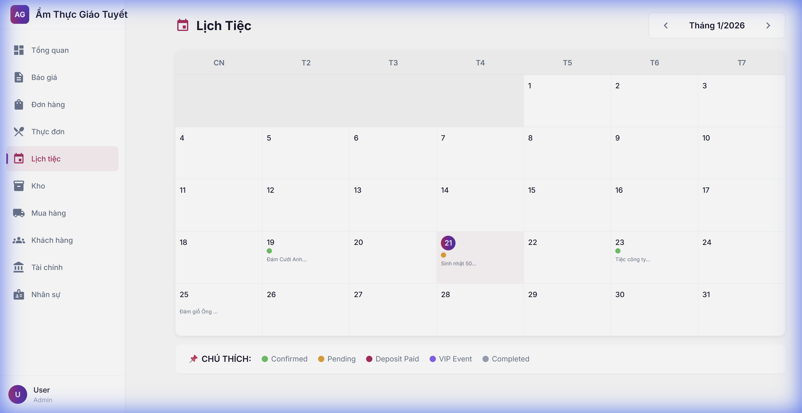
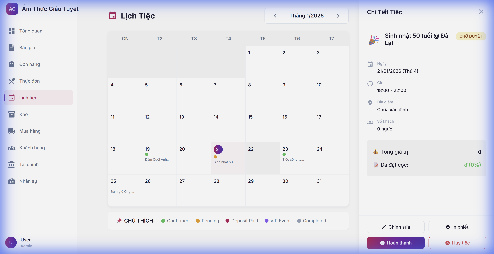

# Hướng Dẫn Sử Dụng: Lịch Tiệc

> **Phiên bản**: 1.0
> **Ngày cập nhật**: 21/01/2026
> **Ngôn ngữ**: Tiếng Việt

---

## 1. Giới Thiệu
Module **Lịch Tiệc** giúp quản lý và theo dõi toàn bộ các sự kiện, tiệc cưới, sinh nhật một cách trực quan trên giao diện lịch tháng.

## 2. Hướng Dẫn Sử Dụng

### 2.1. Xem Lịch Tiệc
Truy cập menu **Lịch tiệc** từ thanh điều hướng bên trái.
Giao diện lịch hiển thị:
- Các sự kiện trong tháng hiện tại.
- Trạng thái sự kiện được mã hóa bằng màu sắc (Confirmed, Pending, VIP...).
- Điều hướng nhanh giữa các tháng.

### 2.2. Xem Chi Tiết Sự Kiện
Nhấn vào bất kỳ ngày nào có sự kiện (Có chấm màu hoặc tên sự kiện) để mở bảng chi tiết.

Thông tin chi tiết bao gồm:
- **Thời gian & Địa điểm**: Ngày giờ tổ chức, Sảnh tiệc.
- **Khách mời**: Số lượng khách dự kiến.
- **Thực đơn**: Tên menu, số món và đơn giá.
- **Thanh toán**: Tổng giá trị và số tiền đã cọc.

### 2.3. Các Thao Tác Nhanh
Tại bảng chi tiết sự kiện, bạn có thể thực hiện:
- **Chỉnh sửa**: Cập nhật thông tin tiệc.
- **In phiếu**: In phiếu báo tiệc/hợp đồng.
- **Hoàn thành**: Đánh dấu tiệc đã tổ chức xong.
- **Hủy tiệc**: Hủy sự kiện (Lưu ý: Không thể hoàn tác).

---

## 3. Câu Hỏi Thường Gặp (FAQ)

### Q1: Làm sao để tạo sự kiện mới?
**A**: Hiện tại Lịch tiệc chỉ hiển thị các đơn hàng/báo giá đã chốt ngày. Để thêm sự kiện, vui lòng tạo mới trong module **Báo giá** hoặc **Đơn hàng**.

### Q2: Chấm màu trên lịch có ý nghĩa gì?
**A**:
- 🟢 **Xanh lá**: Đã xác nhận (Confirmed)
- 🟡 **Vàng**: Chờ duyệt (Pending)
- 🟣 **Tím**: Tiệc VIP
- 🔘 **Xám**: Đã hoàn thành

---

## 4. Liên Hệ Hỗ Trợ
Nếu gặp lỗi hiển thị icon hoặc dữ liệu, vui lòng liên hệ IT: `admin@amthucgiaotuyet.com`
