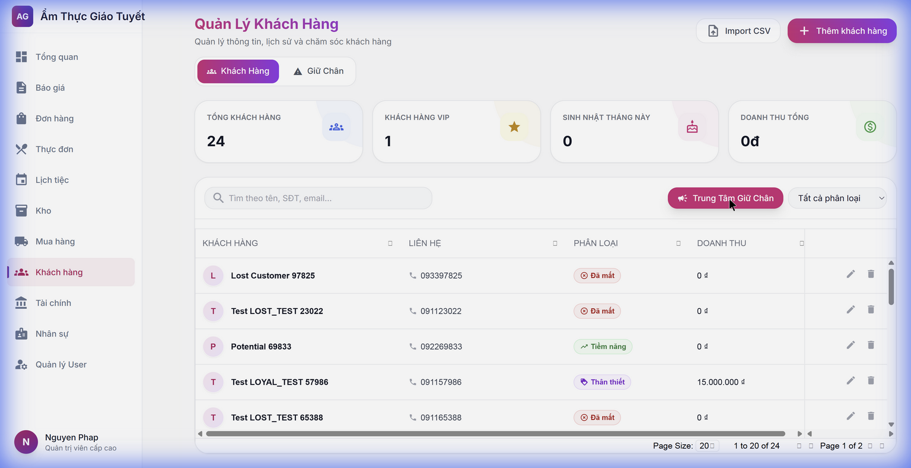
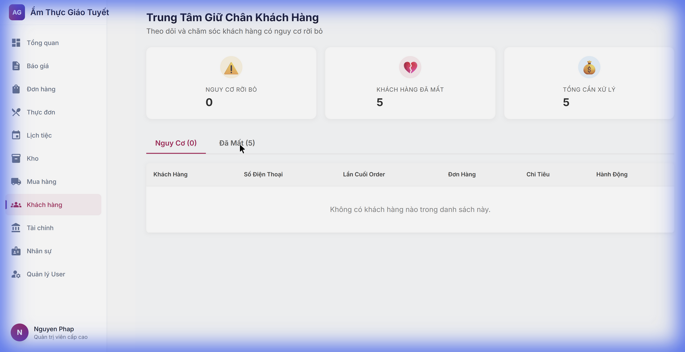
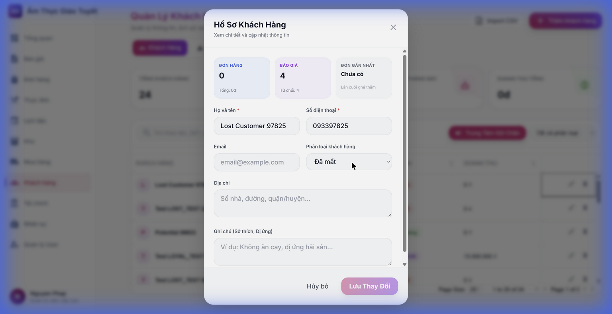

# Hướng dẫn sử dụng CRM Advance
> **Module:** Quản lý Khách hàng Nâng cao  
> **Ngày cập nhật:** 23/01/2026

## 1. Tổng quan

Module **CRM Advance** cung cấp các công cụ quản lý khách hàng chuyên nghiệp, bao gồm:
- Danh sách khách hàng với phân loại tự động
- Trung tâm giữ chân khách hàng
- Hồ sơ chi tiết từng khách hàng

---

## 2. Truy cập Module

**Bước 1:** Đăng nhập vào hệ thống

**Bước 2:** Từ menu bên trái, click vào **"Khách hàng"**

---

## 3. Danh sách Khách hàng

Màn hình chính hiển thị danh sách tất cả khách hàng với các thông tin:

| Cột | Mô tả |
|-----|-------|
| **Khách hàng** | Họ tên và địa chỉ |
| **Liên hệ** | SĐT và Email |
| **Phân loại** | VIP / Thân thiết / Tiềm năng / Nguy cơ rời bỏ / Đã mất |
| **Doanh thu** | Tổng tiền chi tiêu |

### Thống kê nhanh
- **Tổng khách hàng:** Hiển thị trên đầu trang
- **Khách VIP:** Số lượng khách hàng VIP
- **Sinh nhật tháng này:** Khách hàng có sinh nhật
- **Doanh thu tổng:** Tổng doanh thu từ tất cả khách

---

## 4. Trung tâm Giữ chân Khách hàng

Click nút **"Trung Tâm Giữ Chân"** để xem:

### Tab Nguy cơ rời bỏ
- Khách hàng không quay lại trong thời gian dài
- Có nguy cơ mất khách

### Tab Đã mất
- Khách hàng đã không liên hệ > 6 tháng
- Cần chiến dịch win-back

### Hành động
- **Gửi Ưu Đãi:** Gửi voucher/khuyến mãi để thu hút khách quay lại
- **Gọi điện:** Liên hệ trực tiếp chăm sóc

---

## 5. Hồ sơ Khách hàng

Click icon **✏️ Sửa** trên hàng khách hàng để mở hồ sơ chi tiết:

### Thống kê hoạt động
- **Đơn hàng:** Số lượng đơn đã đặt
- **Báo giá:** Số lượng báo giá
- **Đơn gần nhất:** Thời gian đặt cuối cùng

### Thông tin cá nhân
- Họ tên, SĐT, Email
- Phân loại khách hàng
- Địa chỉ
- Ghi chú (sở thích, dị ứng)

---

## 6. FAQ - Câu hỏi thường gặp

### Q: Làm sao để thêm khách hàng mới?
**A:** Click nút **"+ Thêm khách hàng"** ở góc phải màn hình.

### Q: Khách hàng được phân loại tự động như thế nào?
**A:** Hệ thống dựa vào:
- Số lần đặt hàng
- Tổng chi tiêu
- Thời gian giao dịch gần nhất

### Q: Tìm kiếm khách hàng như thế nào?
**A:** Nhập tên, SĐT hoặc email vào ô tìm kiếm ở đầu danh sách.

---

## 7. Tips sử dụng hiệu quả

✅ Kiểm tra **Trung tâm giữ chân** định kỳ hàng tuần

✅ Cập nhật ghi chú khách hàng sau mỗi đơn hàng

✅ Gửi ưu đãi sinh nhật cho khách VIP và Thân thiết

---

*© 2026 Ẩm Thực Giáo Tuyết - Catering ERP System*
