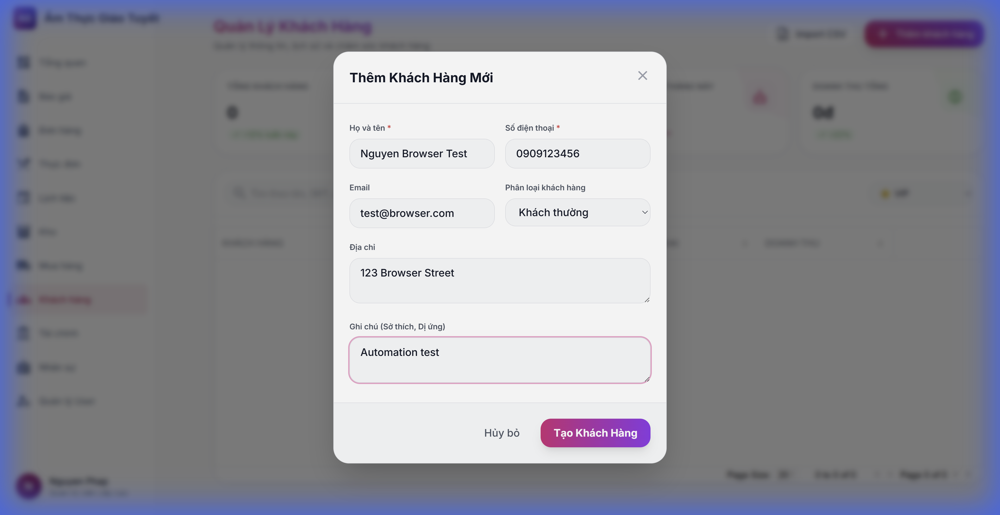
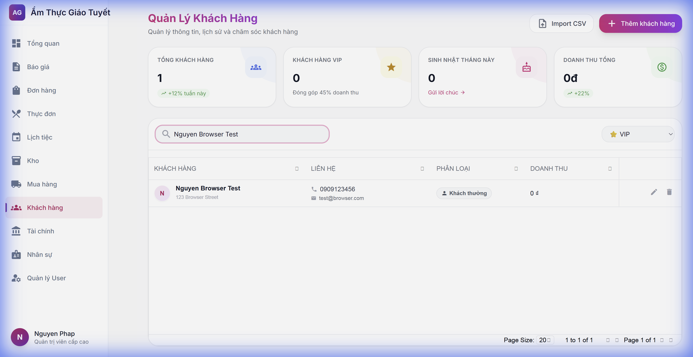
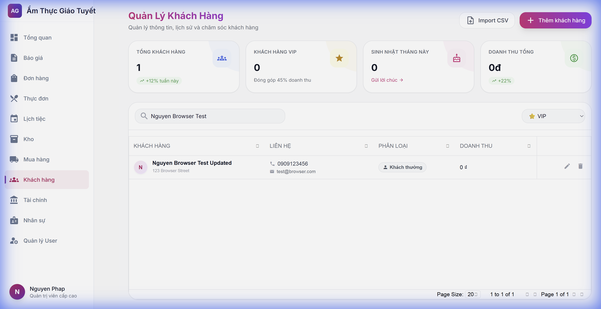
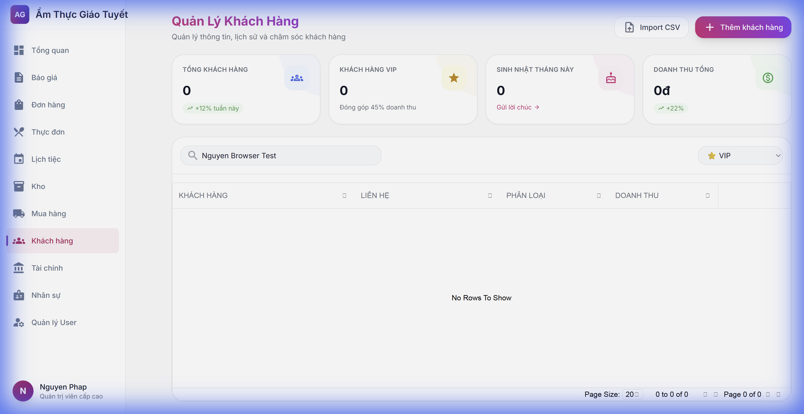

# Hướng Dẫn Sử Dụng: Quản Lý Khách Hàng (CRM)

> **Phiên bản**: 1.0  
> **Ngày cập nhật**: 22/01/2026  
> **Ngôn ngữ**: Tiếng Việt

---

## 1. Giới Thiệu

### Mô tả
Module CRM giúp quản lý toàn bộ thông tin khách hàng, phân loại khách hàng (VIP, Doanh nghiệp) và theo dõi lịch sử tương tác. Giúp doanh nghiệp thấu hiểu khách hàng và tối ưu hóa quy trình chăm sóc.

### Ai sử dụng?
- **Admin/Manager**: Quản lý toàn bộ khách hàng, xem báo cáo, cấu hình.
- **Sales**: Thêm mới, cập nhật thông tin khách hàng tiềm năng.

---

## 2. Hướng Dẫn Sử Dụng

### 2.1. Truy cập module
1. Đăng nhập vào hệ thống.
2. Từ menu bên trái, chọn **Khách hàng** (Icon: `groups`).
3. Màn hình chính của module sẽ hiển thị với các chỉ số KPI quan trọng.

---

### 2.2. Thêm khách hàng mới

**Bước 1**: Nhấn nút **Thêm khách hàng** ở góc trên bên phải.

**Bước 2**: Điền đầy đủ thông tin vào form:
- **Họ và tên**: Bắt buộc.
- **Số điện thoại**: 10 số, bắt buộc.
- **Phân loại**: Chọn VIP, Doanh nghiệp hoặc Khách thường.
- **Ghi chú**: Sở thích, dị ứng (quan trọng cho Catering).

**Bước 3**: Nhấn **Tạo Khách Hàng**.

---

### 2.3. Tìm kiếm và Chỉnh sửa

**Bước 1**: Nhập tên hoặc số điện thoại vào ô tìm kiếm ở trên cùng.

**Bước 2**: Nhấn nút **Edit** (hình bút chì) ở dòng khách hàng cần sửa.

**Bước 3**: Cập nhật thông tin và nhấn **Lưu Thay Đổi**.

---

### 2.4. Xóa khách hàng

**Bước 1**: Nhấn nút **Delete** (hình thùng rác) ở dòng khách hàng cần xóa.

**Bước 2**: Xác nhận hộp thoại cảnh báo. Khách hàng sẽ bị xóa hoàn toàn khỏi hệ thống.

---

## 3. Lưu Ý Quan Trọng

> [!WARNING]
> Việc xóa khách hàng sẽ xóa toàn bộ lịch sử tương tác liên quan. Hãy cân nhắc trước khi thực hiện.

> [!TIP]
> Hãy nhập kỹ phần **Ghi chú** (Sở thích/Dị ứng) để Bếp có thể chuẩn bị món ăn phù hợp nhất cho khách VIP.

---

## 4. Câu Hỏi Thường Gặp (FAQ)

### Q1: Làm sao để khách hàng trở thành VIP?
**A**: Hiện tại bạn cần chọn thủ công phân loại là VIP. Trong tương lai, hệ thống sẽ tự động nâng hạng dựa trên doanh thu.

### Q2: Tôi có thể import danh sách khách hàng từ Excel không?
**A**: Tính năng Import CSV đang phát triển (đã có nút nhưng chưa hoạt động).

---

## 5. Liên Hệ Hỗ Trợ

Nếu bạn gặp vấn đề, vui lòng liên hệ:
- **Email**: support@amthucgiaotuyet.com
- **Hotline**: 0909-123-456

---

*Tài liệu này được tạo tự động bởi AI Workforce.*
