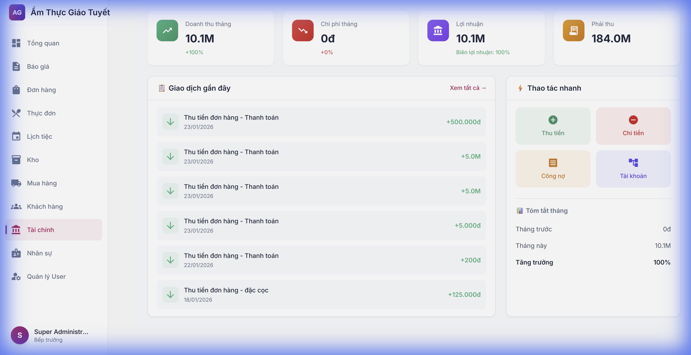
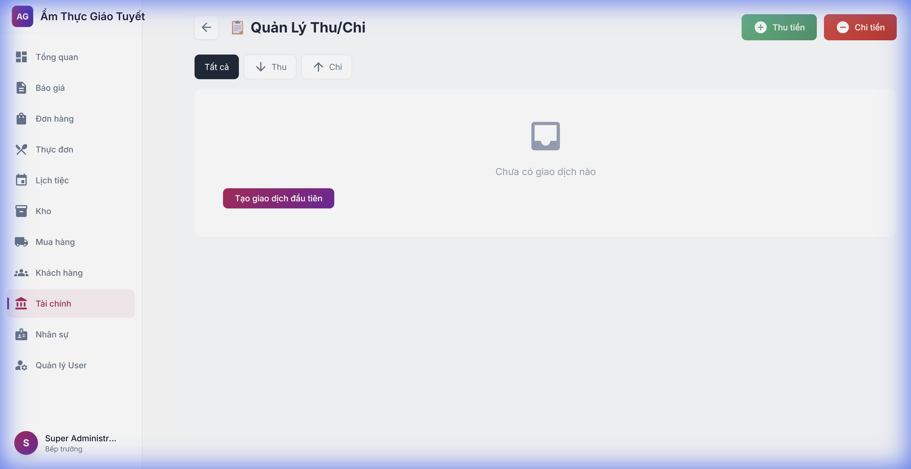
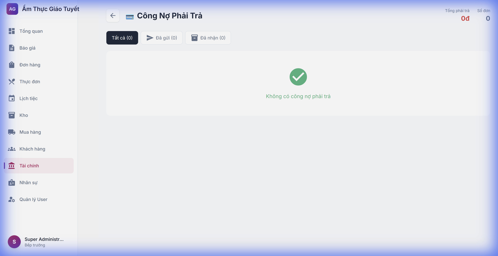
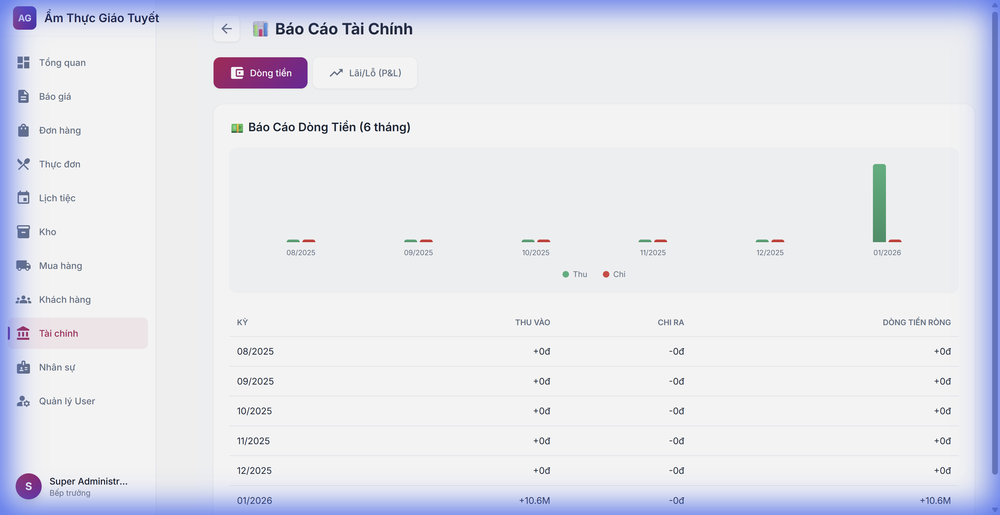

# Hướng Dẫn Sử Dụng Module Tài Chính

**Phiên bản:** 1.0  
**Cập nhật:** 23/01/2026  
**Đối tượng:** Kế toán, Quản lý, Admin

---

## 1. Tổng Quan

Module Tài Chính giúp bạn:
- ✅ Theo dõi doanh thu và chi phí
- ✅ Quản lý thu/chi tiền hàng ngày  
- ✅ Theo dõi công nợ phải thu/trả
- ✅ Xem báo cáo Dòng tiền và Lãi/Lỗ

---

## 2. Truy Cập Module

**Bước 1:** Đăng nhập hệ thống  
**Bước 2:** Click **"Tài chính"** trong menu bên trái

---

## 3. Dashboard Tổng Quan

Dashboard hiển thị 4 chỉ số chính:

| Chỉ số | Mô tả |
|:-------|:------|
| **Doanh thu tháng** | Tổng tiền đã thu từ đơn hàng |
| **Chi phí tháng** | Tổng tiền đã chi |
| **Lợi nhuận** | Doanh thu - Chi phí |
| **Phải thu** | Công nợ khách hàng chưa thanh toán |

### 3.1 Giao Dịch Gần Đây
Hiển thị 10 giao dịch mới nhất bao gồm:
- Thu tiền từ đơn hàng
- Chi tiền (nếu có)

### 3.2 Thao Tác Nhanh
- 💵 **Thu tiền**: Ghi nhận tiền khách hàng thanh toán
- 💸 **Chi tiền**: Ghi nhận chi phí
- 📋 **Công nợ**: Xem danh sách công nợ phải thu
- 🏦 **Tài khoản**: Quản lý hệ thống tài khoản

---

## 4. Quản Lý Thu/Chi

**Đường dẫn:** Tài chính → Giao dịch (hoặc click vào "Xem tất cả →")

### 4.1 Tạo Phiếu Thu
1. Click nút **"Thu tiền"** (màu xanh)
2. Nhập thông tin:
   - **Số tiền**: Số tiền thu
   - **Phương thức**: Tiền mặt / Chuyển khoản / Thẻ
   - **Ngày giao dịch**: Ngày thu tiền
   - **Danh mục**: Đơn hàng / Khác
   - **Mô tả**: Ghi chú thêm
3. Click **"Lưu"**

### 4.2 Tạo Phiếu Chi
1. Click nút **"Chi tiền"** (màu đỏ)
2. Điền thông tin tương tự phiếu thu
3. Chọn danh mục: Mua hàng / Lương / Vận hành / Khác
4. Click **"Lưu"**

### 4.3 Lọc Giao Dịch
Sử dụng các nút lọc:
- **Tất cả**: Hiển thị tất cả giao dịch
- **Thu**: Chỉ hiển thị phiếu thu
- **Chi**: Chỉ hiển thị phiếu chi

---

## 5. Công Nợ Phải Thu

**Đường dẫn:** Tài chính → Công nợ

### 5.1 Hiểu Về Aging Buckets

| Bucket | Ý nghĩa |
|:-------|:--------|
| **Hiện tại** | Đơn hàng mới, chưa đến hạn |
| **30-60 ngày** | Quá hạn 30-60 ngày |
| **60-90 ngày** | Quá hạn 60-90 ngày |
| **90+ ngày** | Nợ xấu, cần theo dõi đặc biệt |

### 5.2 Xem Chi Tiết Đơn Hàng
Click vào mã đơn hàng để xem chi tiết và lịch sử thanh toán.

---

## 6. Công Nợ Phải Trả

**Đường dẫn:** Tài chính → Công nợ phải trả

Hiển thị danh sách đơn mua hàng (PO) chưa thanh toán cho nhà cung cấp.

### 6.1 Thông Tin Hiển Thị
- Tên nhà cung cấp
- Mã PO
- Số tiền phải trả
- Số ngày chưa thanh toán

---

## 7. Báo Cáo Tài Chính

**Đường dẫn:** Tài chính → Báo cáo

### 7.1 Báo Cáo Dòng Tiền
- Hiển thị Thu/Chi theo tháng (6 tháng gần nhất)
- Biểu đồ cột trực quan
- Bảng chi tiết từng tháng

### 7.2 Báo Cáo Lãi/Lỗ (P&L)
Click tab **"Lãi/Lỗ"** để xem:

| Khoản mục | Mô tả |
|:----------|:------|
| **Doanh thu** | Tổng tiền thu từ đơn hàng |
| **Giá vốn (COGS)** | Chi phí nguyên liệu |
| **Lợi nhuận gộp** | Doanh thu - COGS |
| **Chi phí vận hành** | Lương, điện nước, v.v. |
| **Lợi nhuận ròng** | Lợi nhuận gộp - Chi phí vận hành |

---

## 8. FAQ - Câu Hỏi Thường Gặp

### Q: Làm sao để cập nhật số liệu Dashboard?
**A:** Dashboard tự động cập nhật khi bạn tải lại trang (F5).

### Q: Tại sao Doanh thu hiển thị 0?
**A:** Có thể tháng này chưa có đơn hàng nào được thanh toán. Kiểm tra module Đơn hàng.

### Q: Làm sao để xóa giao dịch nhập sai?
**A:** Hiện tại cần liên hệ Admin. Tính năng xóa sẽ được bổ sung sau.

### Q: Báo cáo có thể xuất Excel không?
**A:** Tính năng đang phát triển, sẽ có trong phiên bản tiếp theo.

---

## 9. Liên Hệ Hỗ Trợ

Nếu gặp vấn đề, vui lòng liên hệ:
- **Email:** support@giaotuyetcatering.vn
- **Hotline:** 0123-456-789
