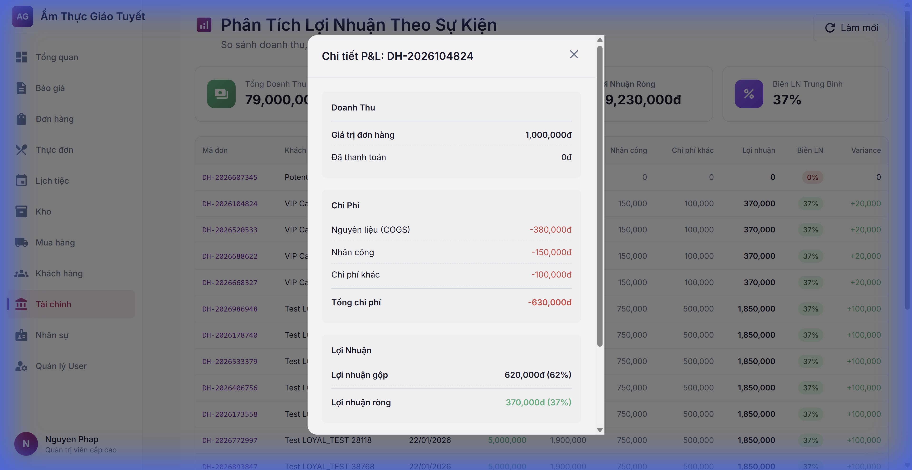
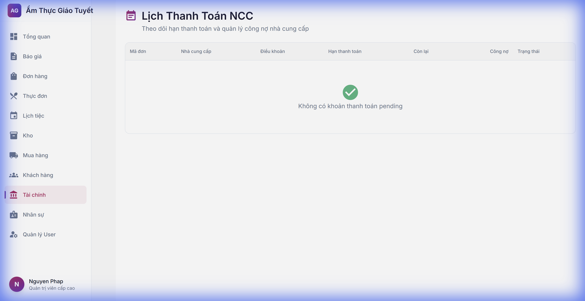
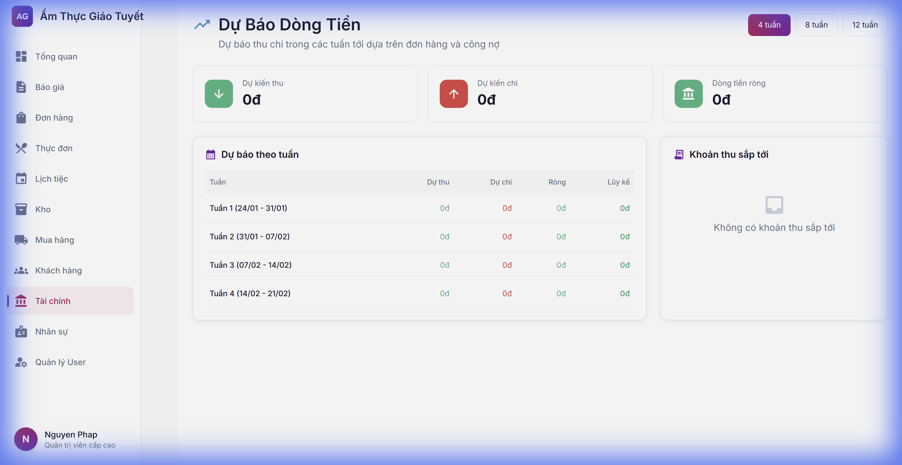

# Hướng Dẫn Module Tài Chính - Tính Năng Nâng Cao

**Ngày cập nhật:** 24/01/2026  
**Phiên bản:** 2.0 (Phase 5)

---

## Giới Thiệu

Module Tài chính Phase 5 bổ sung các tính năng phân tích nâng cao:
- **Phân tích Lợi nhuận theo đơn hàng** - Báo cáo P&L chi tiết
- **Lịch thanh toán NCC** - Quản lý hạn thanh toán nhà cung cấp
- **Dự báo dòng tiền** - Dự báo thu chi theo tuần

---

## 1. Phân Tích Lợi Nhuận Đơn Hàng

### Truy cập
**Tài chính** → **Phân tích lợi nhuận** hoặc truy cập `/finance/profitability`

### Màn hình chính

### Thông tin hiển thị

| Thẻ | Ý nghĩa |
|:----|:--------|
| **Tổng doanh thu** | Tổng giá trị tất cả đơn hàng |
| **Tổng chi phí** | COGS + Nhân công + Chi phí khác |
| **Lợi nhuận ròng** | Doanh thu - Chi phí |
| **Biên LN trung bình** | Tỷ lệ lợi nhuận % |

### Xem chi tiết đơn hàng
1. Click vào dòng đơn hàng trong bảng
2. Modal hiển thị Chi tiết P&L:
   - Doanh thu (giá trị đơn hàng)
   - Nguyên liệu (COGS)
   - Nhân công
   - Chi phí khác
   - **Lợi nhuận gộp** và **Lợi nhuận ròng**

---

## 2. Lịch Thanh Toán Nhà Cung Cấp

### Truy cập
**Tài chính** → **Lịch thanh toán** hoặc truy cập `/finance/payment-schedule`

### Màn hình chính

### Thông tin hiển thị

| Thẻ | Ý nghĩa |
|:----|:--------|
| **Tổng đơn** | Số đơn mua hàng đang pending |
| **Quá hạn** | Số đơn đã quá hạn thanh toán |
| **Sắp đến hạn** | Số đơn còn ≤7 ngày |
| **Tổng còn nợ** | Tổng số tiền cần thanh toán |

### Trạng thái thanh toán

| Trạng thái | Badge | Ý nghĩa |
|:-----------|:------|:--------|
| **Trong hạn** | 🟢 Xanh | Còn >7 ngày |
| **Sắp đến hạn** | 🟡 Vàng | Còn ≤7 ngày |
| **Quá hạn** | 🔴 Đỏ | Đã quá hạn |

### Điều khoản thanh toán
- **IMMEDIATE**: Thanh toán ngay
- **NET15**: Thanh toán trong 15 ngày
- **NET30**: Thanh toán trong 30 ngày (mặc định)
- **NET60, NET90**: Thanh toán dài hạn

---

## 3. Dự Báo Dòng Tiền

### Truy cập
**Tài chính** → **Dự báo** hoặc truy cập `/finance/forecast`

### Màn hình chính

### Chức năng

#### Chọn khoảng thời gian
Click các nút **4 tuần**, **8 tuần**, hoặc **12 tuần** để điều chỉnh phạm vi dự báo.

#### Thông tin dự báo

| Cột | Ý nghĩa |
|:----|:--------|
| **Dự thu** | Tiền dự kiến thu từ đơn hàng |
| **Dự chi** | Tiền dự kiến trả nhà cung cấp |
| **Ròng** | Dự thu - Dự chi |
| **Lũy kế** | Tổng cộng dồn qua các tuần |

#### Khoản thu sắp tới
Hiển thị 5 đơn hàng có ngày sự kiện sắp tới với số tiền còn phải thu.

---

## FAQ

### Q: Làm sao để biết đơn hàng nào có lợi nhuận cao nhất?
**A:** Vào **Phân tích lợi nhuận**, các đơn hàng được sắp xếp theo **Biên LN** giảm dần. Đơn trên cùng có biên lợi nhuận cao nhất.

### Q: Hệ thống tính chi phí nhân công như thế nào?
**A:** Dựa trên timesheet đã approve của nhân viên được phân công cho sự kiện. Nếu chưa có timesheet, hệ thống ước tính 15% doanh thu.

### Q: Tại sao dự báo dòng tiền hiển thị 0đ?
**A:** Dự báo dựa trên đơn hàng CONFIRMED có ngày sự kiện trong tương lai. Nếu không có đơn hàng nào, giá trị sẽ là 0.

---

## Liên hệ hỗ trợ
📞 Hotline: 1900-xxxx  
📧 Email: support@example.com
