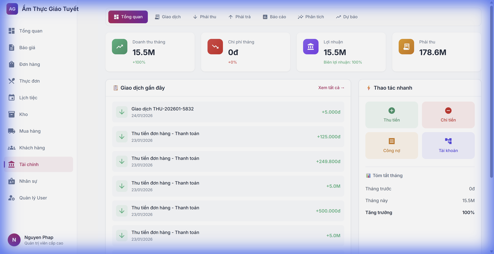
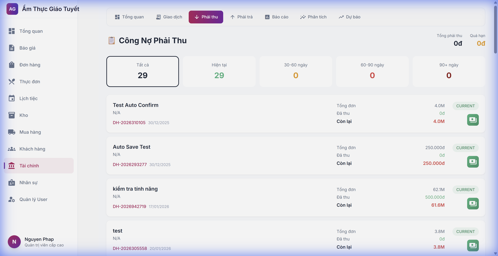

# Hướng Dẫn Cải Tiến Giao Diện Module Tài Chính

**Ngày cập nhật:** 24/01/2026  
**Phiên bản:** UI/UX Phase C Complete

---

## Giới Thiệu

Module Tài chính đã được cải tiến giao diện với các thay đổi sau:
- **Navigation mới** - Tab điều hướng ngang trong module
- **Card styles** - Giao diện thẻ KPI đẹp hơn với hover effects
- **Empty states** - Trạng thái trống hiển thị đẹp và nhất quán

---

## 1. Điều Hướng Mới

### Thanh Tab Điều Hướng

Thanh tab ngang xuất hiện ở đầu mỗi trang Finance:

| Tab | Chức năng |
|:----|:----------|
| **Tổng quan** | Dashboard tài chính |
| **Giao dịch** | Danh sách thu/chi |
| **Phải thu** | Công nợ khách hàng |
| **Phải trả** | Công nợ nhà cung cấp |
| **Báo cáo** | Cash flow & P&L |
| **Phân tích** | Lợi nhuận đơn hàng |
| **Dự báo** | Dòng tiền tương lai |

### Cách sử dụng
Click vào tab để chuyển đổi giữa các trang. Tab đang active sẽ hiển thị màu tím gradient.

---

## 2. Thẻ KPI Cải Tiến

### Hiệu ứng hover
Khi di chuột qua thẻ KPI, thẻ sẽ:
- Nâng lên nhẹ (translateY -2px)
- Đổ bóng đậm hơn
- Animation mượt 0.2s

### Icon màu gradient
Mỗi loại KPI có icon riêng với gradient tương ứng:
- 🟢 **Doanh thu** - Xanh lá gradient
- 🔴 **Chi phí** - Đỏ gradient  
- 🟣 **Lợi nhuận** - Tím gradient
- 🟠 **Công nợ** - Cam gradient

---

## 3. Trạng Thái Trống

Khi trang không có dữ liệu, sẽ hiển thị:
- Icon lớn màu nhạt
- Message giải thích
- Subtitle (nếu có)

---

## FAQ

### Q: Tab điều hướng hiển thị ở đâu?
**A:** Hiện tại tab hiển thị trên Dashboard và Receivables. Các trang khác sẽ được cập nhật dần.

### Q: Làm sao để biết đang ở trang nào?
**A:** Tab đang active sẽ có nền tím gradient, dễ nhận biết.

---

## Liên hệ hỗ trợ
📞 Hotline: 1900-xxxx  
📧 Email: support@example.com
