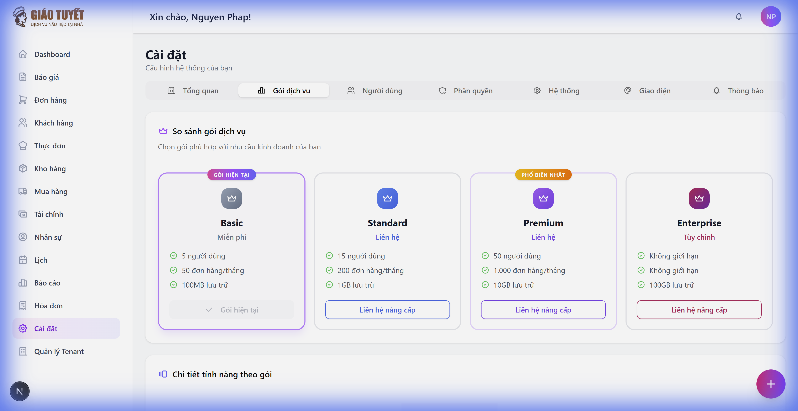
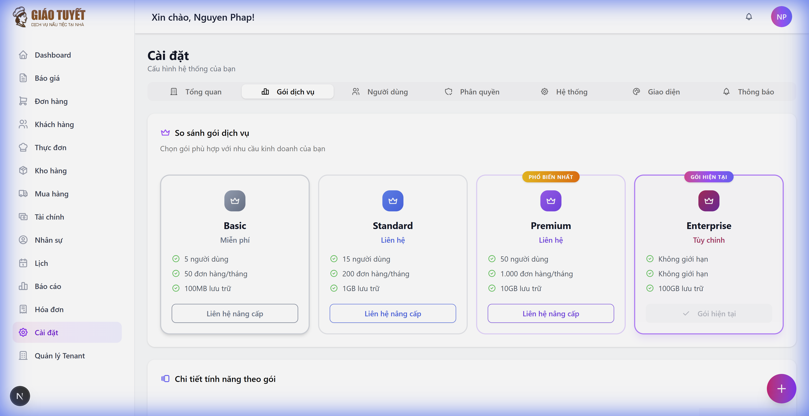

# 📦 Hướng dẫn sử dụng: Gói dịch vụ & Quản lý thuê bao

> **Ngày cập nhật:** 10/02/2026
> **Module:** Cài đặt → Tab "Gói dịch vụ"
> **Đối tượng:** Admin / Quản lý hệ thống

---

## 1. Giới thiệu

Tab **"Gói dịch vụ"** trong trang **Cài đặt** cho phép bạn:

- Xem gói hiện tại của hệ thống
- So sánh các gói dịch vụ (Basic, Standard, Premium, Enterprise)
- Theo dõi mức sử dụng tài nguyên (người dùng, đơn hàng, lưu trữ)
- Liên hệ nâng cấp khi cần

---

## 2. Truy cập

1. Từ menu bên trái, chọn **Cài đặt** (⚙)
2. Click vào tab **"Gói dịch vụ"** trên thanh tab phía trên

---

## 3. Các thành phần chính

### 3.1 So sánh gói dịch vụ

Bảng so sánh hiển thị 4 gói dịch vụ:

| Gói | Người dùng | Đơn hàng/tháng | Lưu trữ | Giá |
|:----|:-----------|:---------------|:---------|:----|
| **Basic** | 5 | 50 | 100MB | Miễn phí |
| **Standard** | 15 | 200 | 1GB | Liên hệ |
| **Premium** | 50 | 1.000 | 10GB | Liên hệ |
| **Enterprise** | Không giới hạn | Không giới hạn | 100GB | Tùy chỉnh |

- **Badge "GÓI HIỆN TẠI"**: Hiển thị trên card của gói bạn đang sử dụng
- **Badge "PHỔ BIẾN NHẤT"**: Gợi ý gói được khuyên dùng (Premium)



### 3.2 Chi tiết tính năng theo gói

Bảng so sánh chi tiết 14 tính năng chính:

| Tính năng | Basic | Standard | Premium | Enterprise |
|:----------|:-----:|:--------:|:-------:|:----------:|
| Quản lý đơn hàng | ✓ | ✓ | ✓ | ✓ |
| Quản lý menu | ✓ | ✓ | ✓ | ✓ |
| Quản lý kho | ✓ | ✓ | ✓ | ✓ |
| Báo giá | ✓ | ✓ | ✓ | ✓ |
| Quản lý nhân sự | — | ✓ | ✓ | ✓ |
| CRM & Khách hàng | — | ✓ | ✓ | ✓ |
| Mua hàng | — | — | ✓ | ✓ |
| Tài chính & Kế toán | — | — | ✓ | ✓ |
| Hóa đơn | — | — | ✓ | ✓ |
| Báo cáo nâng cao | — | — | ✓ | ✓ |
| Lịch & Lịch trình | — | — | ✓ | ✓ |
| Quản lý nhà cung cấp | — | — | — | ✓ |
| API tích hợp | — | — | — | ✓ |
| Hỗ trợ ưu tiên 24/7 | — | — | — | ✓ |

### 3.3 Mức sử dụng tài nguyên

Hiển thị 3 thanh tiến trình:
- **Người dùng**: Số tài khoản đang sử dụng / giới hạn
- **Đơn hàng tháng này**: Số đơn hàng trong tháng / giới hạn
- **Dung lượng lưu trữ**: Dung lượng đã dùng / giới hạn

Mã màu:
- 🟢 **Xanh** (< 70%): An toàn
- 🟡 **Vàng** (70-90%): Cảnh báo
- 🔴 **Đỏ** (> 90%): Cần nâng cấp

---

## 4. Hướng dẫn nâng cấp gói

### Cách 1: Qua giao diện (dành cho khách hàng)
1. Truy cập tab **"Gói dịch vụ"**
2. Chọn gói muốn nâng cấp
3. Click nút **"Liên hệ nâng cấp"**
4. Gửi yêu cầu và đợi admin xử lý

### Cách 2: Qua API (dành cho quản trị viên)
Admin có thể cập nhật gói trực tiếp qua API:

```bash
# Bước 1: Đăng nhập lấy token
POST /api/v1/auth/login
Body: username=email&password=matkhau

# Bước 2: Cập nhật gói
PUT /api/v1/tenants/me
Headers: Authorization: Bearer {token}, X-Tenant-ID: {tenant_id}
Body:
{
  "plan": "enterprise",
  "plan_details": {
    "max_users": 9999,
    "max_orders_per_month": 9999,
    "storage_mb": 102400
  }
}
```

### Cách 3: Qua trang Quản lý Tenant (Super Admin)
1. Truy cập menu **"Quản lý Tenant"**
2. Chọn tenant cần cập nhật
3. Thay đổi gói trong thông tin tenant



---

## 5. FAQ

### Q: Plan thay đổi có cần khởi động lại hệ thống không?
**A:** Không. Thay đổi plan có hiệu lực ngay lập tức, chỉ cần refresh trang.

### Q: Nâng cấp plan có mất dữ liệu không?
**A:** Không. Nâng cấp chỉ thay đổi giới hạn tài nguyên, tất cả dữ liệu hiện có được giữ nguyên.

### Q: Hạ cấp plan có được không?
**A:** Được, nhưng nếu dữ liệu hiện tại vượt giới hạn của gói thấp hơn (VD: 20 users → Basic 5 users), cần giảm dữ liệu trước.

### Q: Enterprise có giới hạn thực sự không?
**A:** Gói Enterprise đặt giới hạn rất cao (9.999 users, 9.999 orders/tháng, 100GB). Thực tế sử dụng được coi là "không giới hạn" cho hầu hết doanh nghiệp.

### Q: Làm sao biết khi nào cần nâng cấp?
**A:** Theo dõi phần "Mức sử dụng tài nguyên". Khi thanh tiến trình chuyển vàng (>70%) hoặc đỏ (>90%), đó là lúc nên nâng cấp.
