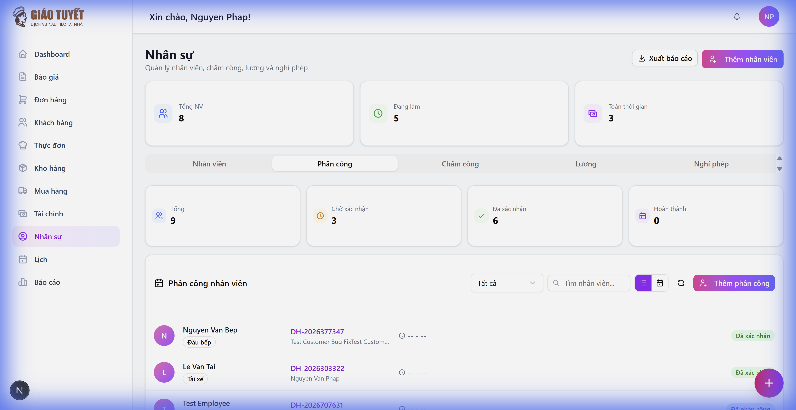
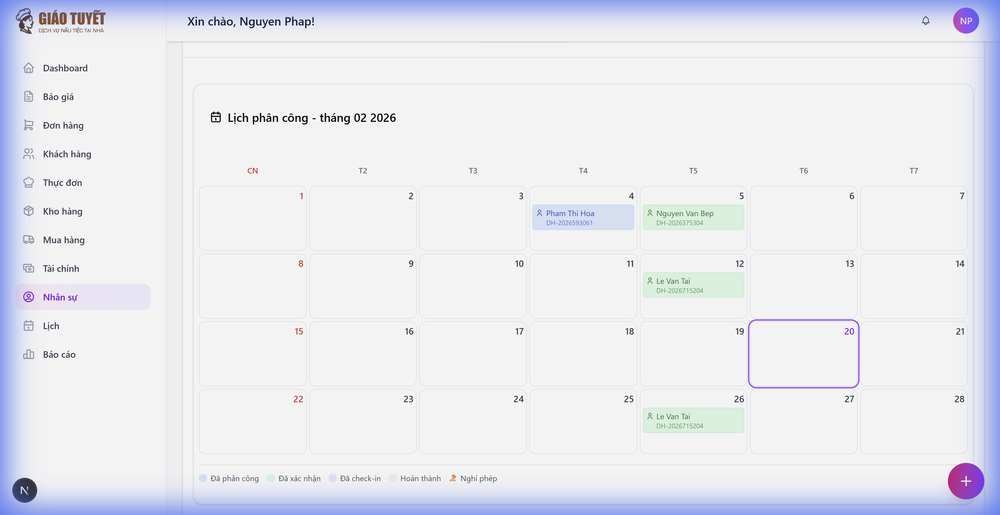

# 📋 Hướng dẫn: Phân công nhân viên

> Module **Nhân sự → Phân công** giúp quản lý việc phân công nhân viên vào các đơn hàng/sự kiện.

---

## 1. Truy cập

Từ sidebar, chọn **Nhân sự** → click tab **Phân công**.

---

## 2. Tổng quan giao diện

### Thẻ thống kê
- **Tổng**: Tổng số phân công
- **Chờ xác nhận**: Phân công mới, chưa xác nhận
- **Đã xác nhận**: Nhân viên đã xác nhận tham gia
- **Hoàn thành**: Đã hoàn tất công việc

### Thanh công cụ
- **Bộ lọc trạng thái**: Lọc theo Tất cả / Đã phân công / Đã xác nhận / Hoàn thành
- **Tìm kiếm**: Gõ tên nhân viên để tìm nhanh
- **Chế độ xem**: Chuyển đổi giữa Danh sách và Lịch
- **Thêm phân công**: Tạo phân công mới

---

## 3. Tạo phân công mới

1. Click nút **Thêm phân công** (góc phải)
2. Chọn **Đơn hàng** từ danh sách (hỗ trợ tìm kiếm)
3. Chọn **Nhân viên**
4. Chọn **Vai trò** (Đầu bếp, Phục vụ, Tài xế...)
5. Nhập **Thời gian bắt đầu** và **kết thúc**
6. Click **Tạo phân công**

> ⚡ Hệ thống tự động kiểm tra **xung đột lịch** — nếu nhân viên đã có phân công trùng giờ, sẽ cảnh báo.

---

## 4. Sửa phân công

1. Di chuột vào dòng phân công → hiện nút hành động
2. Click biểu tượng ✏️ **Sửa**
3. Chỉnh sửa vai trò, thời gian, ghi chú
4. Click **Cập nhật**

> ℹ️ Đơn hàng và nhân viên **không thể thay đổi** khi sửa — chỉ sửa được vai trò, thời gian, ghi chú.

---

## 5. Hủy phân công

1. Di chuột vào dòng → click biểu tượng 🗑️ **Hủy**
2. Xác nhận trong popup
3. Phân công sẽ chuyển sang trạng thái **Đã hủy**

> ⚠️ Khi hủy, hệ thống tự động **gỡ nhân viên** khỏi đơn hàng tương ứng.

---

## 6. Xem lịch phân công

Click biểu tượng 📅 trên thanh công cụ để chuyển sang chế độ **Lịch**.

### Tính năng lịch:
- **Badge màu**: Xanh lam = Đã phân công, Xanh lá = Đã xác nhận
- **Mã đơn hàng**: Hiển thị bên dưới tên nhân viên
- **Tooltip chi tiết**: Di chuột vào badge xem đầy đủ (tên, mã đơn, khách hàng, vai trò, giờ)
- **Hôm nay**: Viền tím nổi bật
- **Điều hướng**: Mũi tên ◀ ▶ chuyển tháng

---

## 7. Đồng bộ dữ liệu

Mọi thay đổi tại tab Phân công đều **tự động đồng bộ** với module Đơn hàng:

| Hành động | Đồng bộ |
|:---|:---|
| Tạo phân công | → Thêm nhân viên vào đơn hàng |
| Sửa vai trò | → Cập nhật vai trò trong đơn hàng |
| Hủy phân công | → Gỡ nhân viên khỏi đơn hàng |

---

## FAQ

**Q: Tại sao không tìm thấy nhân viên trong danh sách?**
A: Chỉ nhân viên có trạng thái **Đang làm** mới hiển thị. Kiểm tra tab Nhân viên.

**Q: Có thể phân công 1 nhân viên cho nhiều đơn hàng cùng ngày không?**
A: Có, nếu không trùng giờ. Hệ thống sẽ cảnh báo nếu phát hiện xung đột.

**Q: Sửa phân công có ảnh hưởng đơn hàng không?**
A: Có — vai trò sẽ được đồng bộ sang đơn hàng tương ứng.

---

*Cập nhật: 20/02/2026*
