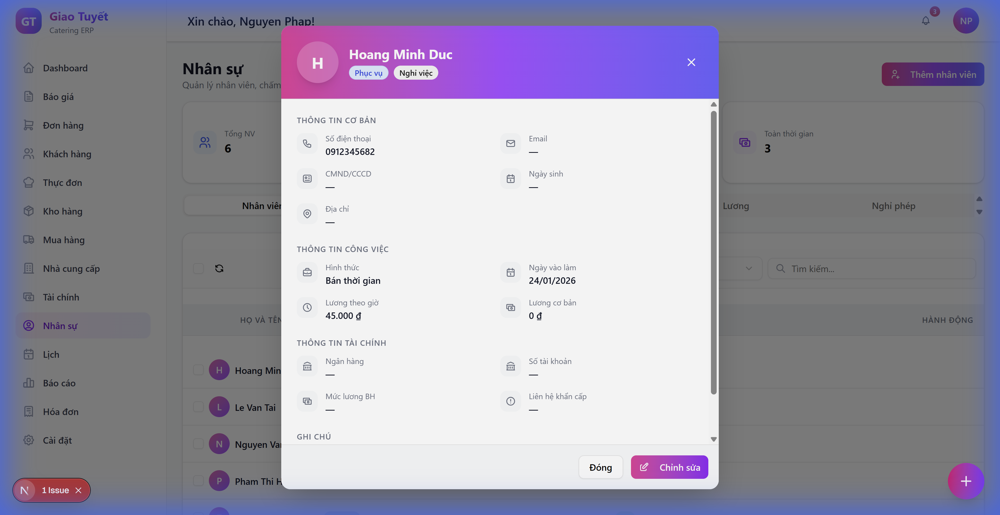
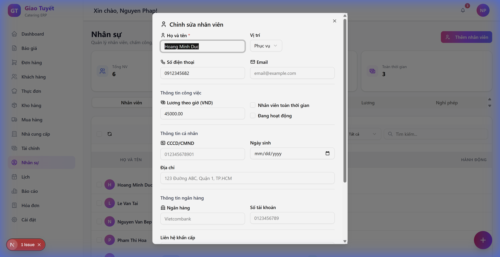

# Hướng dẫn sử dụng: Xem chi tiết nhân viên

> **Module**: Nhân sự (HR)  
> **Cập nhật**: 04/02/2026

---

## 1. Giới thiệu

**Xem chi tiết nhân viên** cho phép bạn xem toàn bộ thông tin của một nhân viên trong một popup modal rõ ràng, được phân chia theo từng nhóm thông tin:

- Thông tin cơ bản (Họ tên, SĐT, Email, CMND, Ngày sinh, Địa chỉ)
- Thông tin công việc (Hình thức làm việc, Ngày vào làm, Lương theo giờ, Lương cơ bản)
- Thông tin tài chính (Ngân hàng, Số tài khoản, Mức lương BHXH, Liên hệ khẩn cấp)
- Phụ cấp (Ăn trưa, Đi lại, Điện thoại, Khác) - nếu có
- Ghi chú

---

## 2. Cách sử dụng

### Bước 1: Truy cập module Nhân sự

Click vào menu **Nhân sự** trong thanh sidebar bên trái.

### Bước 2: Click vào tên nhân viên

Trong danh sách nhân viên, click vào **tên nhân viên** (text màu đen có hiệu ứng underline khi hover).

> ⚠️ **Lưu ý**: Click vào tên, không phải checkbox bên trái.

### Bước 3: Xem thông tin

Modal chi tiết sẽ mở ra với các section thông tin:

### Bước 4: Chỉnh sửa (nếu cần)

Click nút **"Chỉnh sửa"** (màu gradient tím-hồng) ở cuối modal để mở form chỉnh sửa.

### Bước 5: Đóng modal

Click nút **"Đóng"** hoặc click ra ngoài vùng modal để đóng.

---

## 3. FAQ

### Q: Tại sao một số thông tin hiển thị dấu "—"?

**A**: Dấu "—" nghĩa là thông tin đó chưa được nhập vào hệ thống. Bạn có thể click "Chỉnh sửa" để bổ sung.

### Q: Tôi có thể xóa nhân viên từ modal chi tiết không?

**A**: Không. Để xóa nhân viên, quay lại danh sách, click menu 3 chấm và chọn "Xóa".

### Q: Tại sao không thấy section "Phụ cấp"?

**A**: Section này chỉ hiển thị khi nhân viên có ít nhất 1 loại phụ cấp được cấu hình.

---

## 4. Liên quan

- [Hướng dẫn cấu hình lương](./hr-payroll-config-guide.md)
- [Hướng dẫn phân công nhân viên](./hr-staff-assignment-guide.md)
