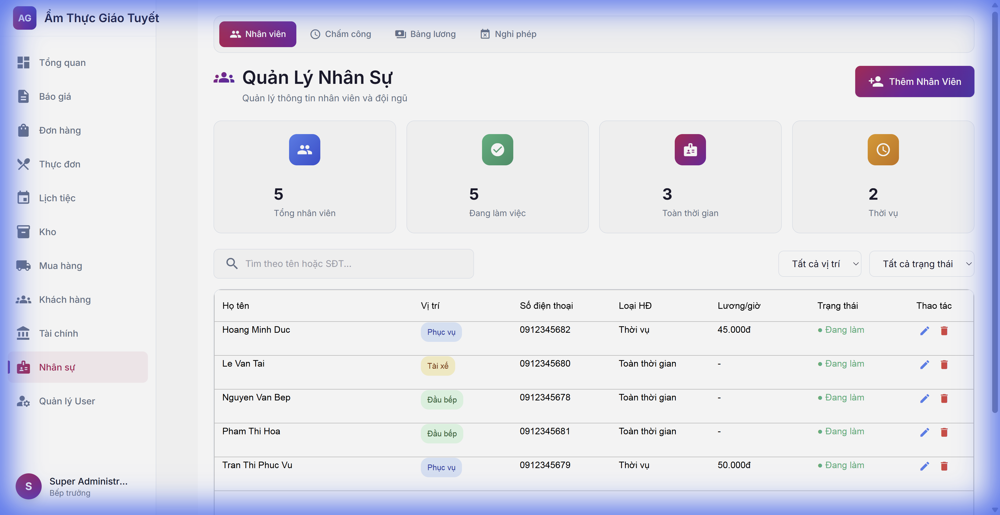
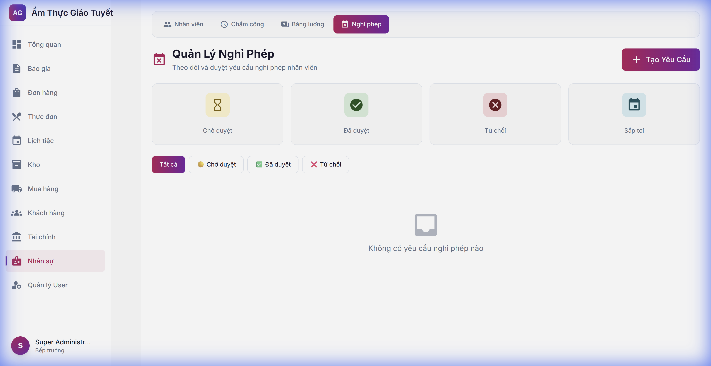
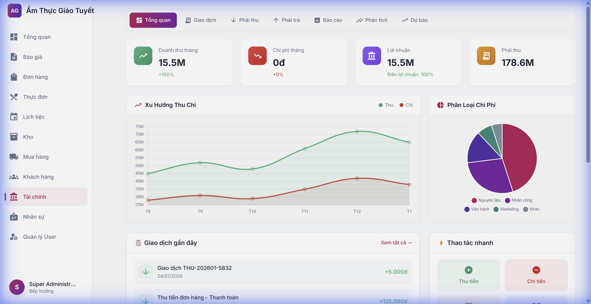
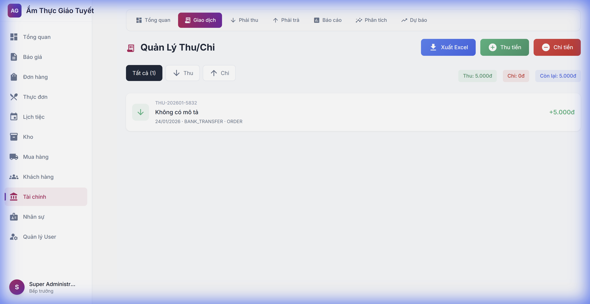

# Hướng Dẫn Sử Dụng: HR & Finance UI Improvements

**Ngày cập nhật:** 24/01/2026  
**Phiên bản:** 1.1

---

## Tổng Quan

Cập nhật giao diện người dùng cho 2 module:
- **HR Module**: Thêm thanh điều hướng phụ và giao diện Quản lý Nghỉ phép
- **Finance Module**: Thêm biểu đồ phân tích và nút Xuất Excel

---

## 1. Module HR

### 1.1 Thanh Điều Hướng Phụ (Subnav)

Mọi trang trong HR đều có thanh navigation với 4 tabs:

| Tab | Mô tả |
|:----|:------|
| **Nhân viên** | Danh sách nhân viên |
| **Chấm công** | Báo cáo chấm công |
| **Bảng lương** | Kỳ lương và thanh toán |
| **Nghỉ phép** | Quản lý nghỉ phép *(MỚI)* |

### 1.2 Quản Lý Nghỉ Phép

Giao diện mới cho phép:
- Xem thống kê: Chờ duyệt, Đã duyệt, Từ chối, Sắp tới
- Lọc yêu cầu theo trạng thái
- Tạo yêu cầu nghỉ phép mới
- Duyệt/Từ chối yêu cầu (cho Manager)

#### Các bước tạo yêu cầu nghỉ phép:
1. Nhấn nút **"Tạo Yêu Cầu"** (màu hồng)
2. Chọn nhân viên và loại nghỉ phép
3. Điền ngày bắt đầu, kết thúc và lý do
4. Nhấn **"Gửi Yêu Cầu"**

---

## 2. Module Finance

### 2.1 Biểu Đồ Phân Tích

Dashboard Finance giờ có 2 biểu đồ:

| Biểu đồ | Mô tả |
|:--------|:------|
| **Xu Hướng Thu Chi** | Line chart theo thời gian |
| **Phân Loại Chi Phí** | Pie chart tỷ lệ chi phí |

### 2.2 Xuất Excel

Trang Giao dịch giờ có nút **"Xuất Excel"**:

1. Vào **Tài chính → Giao dịch**
2. Nhấn nút **"Xuất Excel"** (màu xanh)
3. File CSV sẽ tự động tải về

Ngoài ra còn có:
- **Quick Stats**: Tổng Thu, Tổng Chi, Còn lại
- **Bộ lọc**: Tất cả / Thu / Chi

---

## Câu Hỏi Thường Gặp (FAQ)

**Q: Sao biểu đồ không hiển thị dữ liệu thực?**
A: Biểu đồ cần API `/api/v1/finance/stats/monthly`. Nếu API chưa có, sẽ hiển thị dữ liệu mẫu.

**Q: Làm sao duyệt yêu cầu nghỉ phép?**
A: Vào HR → Nghỉ phép → Click nút ✓ (duyệt) hoặc ✗ (từ chối) bên cạnh yêu cầu.

**Q: File Excel có tiếng Việt bị lỗi font?**
A: File là CSV UTF-8. Khi mở bằng Excel, chọn UTF-8 encoding.

---

## Liên Hệ Hỗ Trợ

Nếu gặp vấn đề, liên hệ bộ phận IT.
