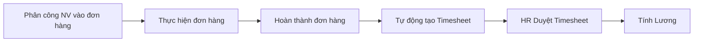
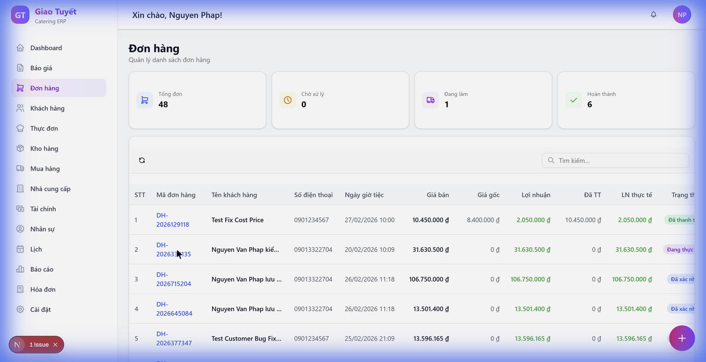
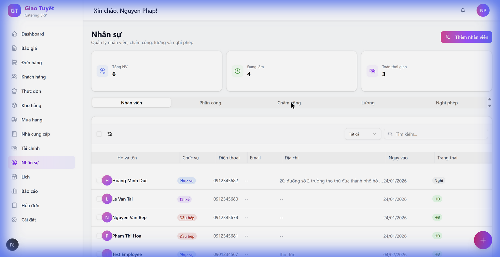

# Hướng dẫn Tích hợp HR-Order (Chấm công tự động)

**Ngày cập nhật:** 05/02/2026

---

## 📋 Giới thiệu

Tính năng **Tích hợp HR-Order** cho phép hệ thống **tự động tạo bảng chấm công** cho nhân viên được phân công khi đơn hàng hoàn thành. Điều này giúp:

- ✅ Giảm công việc manual cho HR
- ✅ Đảm bảo không bỏ sót chấm công cho nhân viên
- ✅ Tính toán chi phí nhân công chính xác hơn

---

## 🔄 Luồng hoạt động

---

## 📖 Hướng dẫn Sử dụng

### Bước 1: Phân công Nhân viên vào Đơn hàng

1. Mở **Đơn hàng** → Click vào đơn hàng cần phân công
2. Trong trang chi tiết đơn hàng, click nút **"Phân công nhân viên"**
3. Chọn nhân viên và vai trò (Phục vụ, Bếp, Lái xe...)
4. Click **Lưu**

---

### Bước 2: Hoàn thành Đơn hàng

Khi sự kiện kết thúc:

1. Vào **Đơn hàng** → Chọn đơn hàng đã thực hiện xong
2. Click **"Hoàn thành"** (Complete)
3. Hệ thống sẽ **tự động tạo Timesheet** cho tất cả nhân viên được phân công

> [!TIP]
> Sau khi hoàn thành đơn hàng, hệ thống sẽ tự động tạo timesheet với:
> - Ngày làm việc = Ngày sự kiện
> - Số giờ mặc định = 8 giờ
> - Trạng thái = Chờ duyệt (PENDING)

---

### Bước 3: HR Duyệt Timesheet

1. Vào **HR** → Tab **"Chấm công"**
2. Lọc theo **"Chờ duyệt"** (Pending)
3. Kiểm tra thông tin:
   - Tên nhân viên
   - Ngày làm việc
   - Số giờ
   - Nguồn: "Tự động từ đơn hàng"
4. Điều chỉnh số giờ nếu cần
5. Click **"Duyệt"** hoặc **"Từ chối"**

---

## ❓ Câu hỏi Thường gặp (FAQ)

### Q: Timesheet tự động có thể chỉnh sửa được không?
**A:** Có. HR có thể điều chỉnh số giờ, ghi chú trước khi duyệt.

### Q: Nếu hoàn thành đơn hàng nhưng không có nhân viên được phân công?
**A:** Hệ thống sẽ không tạo timesheet nào. Đây là hành vi bình thường.

### Q: Làm sao biết timesheet nào được tạo tự động?
**A:** Cột **"Nguồn"** sẽ hiển thị **"Tự động từ đơn hàng"** (AUTO_ORDER) thay vì "Thủ công" (MANUAL).

### Q: Timesheet bị trùng khi hoàn thành đơn hàng nhiều lần?
**A:** Không. Hệ thống kiểm tra và không tạo trùng timesheet cho cùng nhân viên + đơn hàng.

---

## 📞 Hỗ trợ

Nếu gặp vấn đề, vui lòng liên hệ:
- **Email:** support@amthucgiatuyet.com
- **Hotline:** 1900-xxxx
