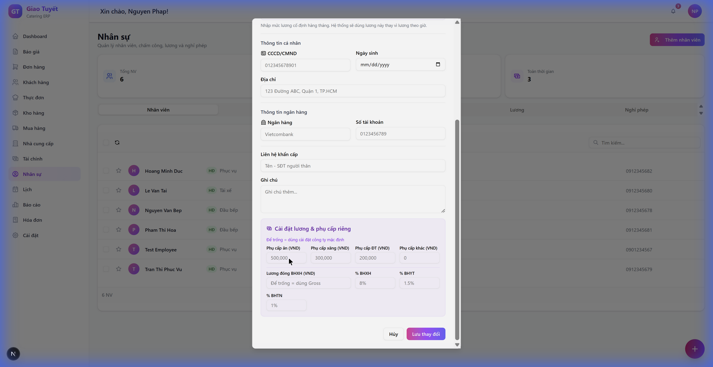

# Hướng dẫn: Cài đặt lương & phụ cấp riêng cho từng nhân viên

> **Ngày cập nhật**: 04/02/2026  
> **Module**: Nhân sự / Lương

---

## 1. Giới thiệu

Tính năng **Cài đặt lương & phụ cấp riêng** cho phép bạn thiết lập các mức phụ cấp, mức lương đóng BHXH, và tỷ lệ bảo hiểm **riêng biệt cho từng nhân viên toàn thời gian**.

Nếu để trống, hệ thống sẽ sử dụng **cài đặt công ty mặc định** (trong "Cài đặt lương" ở tab Lương).

---

## 2. Truy cập tính năng

1. Vào module **Nhân sự** từ sidebar
2. Nhấn nút **"Chỉnh sửa"** trên nhân viên cần cấu hình
3. Đảm bảo nhân viên là **Toàn thời gian** (toggle "Nhân viên toàn thời gian" phải bật)
4. Cuộn xuống để thấy section **"Cài đặt lương & phụ cấp riêng"** (nền tím)

---

## 3. Các trường cấu hình

### 3.1 Phụ cấp (VND/tháng)

| Trường | Mô tả | Giá trị mặc định |
|:-------|:------|:-----------------|
| **Phụ cấp ăn** | Tiền ăn trưa hàng tháng | 500,000 đ |
| **Phụ cấp xăng** | Hỗ trợ đi lại | 300,000 đ |
| **Phụ cấp ĐT** | Điện thoại/liên lạc | 200,000 đ |
| **Phụ cấp khác** | Các khoản phụ cấp khác | 0 đ |

### 3.2 Bảo hiểm

| Trường | Mô tả | Giá trị mặc định |
|:-------|:------|:-----------------|
| **Lương đóng BHXH** | Mức lương làm cơ sở tính bảo hiểm | Bằng Gross |
| **% BHXH** | Tỷ lệ bảo hiểm xã hội | 8% |
| **% BHYT** | Tỷ lệ bảo hiểm y tế | 1.5% |
| **% BHTN** | Tỷ lệ bảo hiểm thất nghiệp | 1% |

---

## 4. Ví dụ sử dụng

### Trường hợp 1: Nhân viên có phụ cấp đặc biệt

Nhân viên bếp trưởng được hỗ trợ phụ cấp ăn cao hơn:
- Nhập **600,000** vào "Phụ cấp ăn"
- Các trường khác để trống → dùng mặc định

### Trường hợp 2: Nhân viên đóng BHXH theo mức cơ bản

Nhân viên có lương cao nhưng chỉ đóng BHXH theo mức tối thiểu:
- Nhập **4,680,000** vào "Lương đóng BHXH" (lương tối thiểu vùng I năm 2026)

### Trường hợp 3: Nhân viên không đóng bảo hiểm

Nhân viên thử việc chưa đủ điều kiện đóng bảo hiểm:
- Nhập **0** vào các trường % BHXH, % BHYT, % BHTN

---

## 5. Lưu ý quan trọng

> [!IMPORTANT]
> - Chỉ hiển thị cho nhân viên **Toàn thời gian**
> - Để trống = dùng cài đặt công ty mặc định
> - Thay đổi sẽ áp dụng cho các kỳ lương **tính từ lần tính lương tiếp theo**

---

## 6. FAQ

**Q: Tôi không thấy section này?**  
A: Đảm bảo nhân viên đã bật toggle "Nhân viên toàn thời gian" và cuộn xuống cuối modal.

**Q: Thay đổi có ảnh hưởng đến lương đã tính không?**  
A: Không. Chỉ áp dụng cho các kỳ lương tính sau khi thay đổi.

**Q: Cài đặt công ty mặc định ở đâu?**  
A: Vào module Nhân sự → Tab **Lương** → Nhấn nút **"Cài đặt lương"**.
