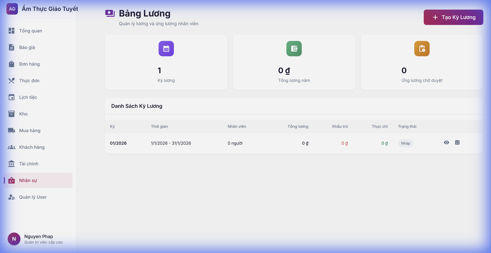
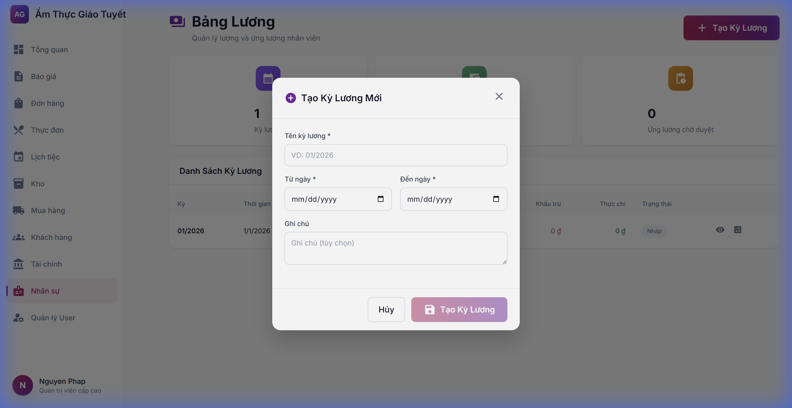

# Hướng Dẫn Sử Dụng: Quản Lý Lương & Nghỉ Phép

> **Phiên bản**: 1.0  
> **Ngày cập nhật**: 24/01/2026  
> **Ngôn ngữ**: Tiếng Việt

---

## 1. Giới Thiệu

### Mô tả
Module Quản Lý Lương (Payroll) và Nghỉ Phép (Leave) giúp doanh nghiệp:
- Tính lương tự động theo Luật Lao động Việt Nam
- Quản lý ứng lương nhân viên
- Theo dõi nghỉ phép và số ngày phép còn lại

### Ai sử dụng?
| Vai trò | Quyền hạn |
|:--------|:----------|
| **Quản lý HR** | Toàn quyền: tạo kỳ lương, duyệt, xem tất cả |
| **Kế toán** | Tính lương, xuất bảng lương, tích hợp tài chính |
| **Nhân viên** | Xem phiếu lương cá nhân, yêu cầu nghỉ phép |

---

## 2. Hướng Dẫn Sử Dụng

### 2.1. Truy cập module
1. Đăng nhập vào hệ thống
2. Từ menu bên trái, chọn **Nhân sự**
3. Chọn **Bảng Lương** hoặc truy cập `/hr/payroll`



---

### 2.2. Tạo Kỳ Lương Mới

**Bước 1**: Nhấn nút **"+ Tạo Kỳ Lương"** ở góc phải màn hình

**Bước 2**: Điền thông tin trong popup:
- **Tên kỳ lương**: VD: `01/2026`, `02/2026`
- **Từ ngày**: Ngày đầu tháng
- **Đến ngày**: Ngày cuối tháng
- **Ghi chú**: Tùy chọn

**Bước 3**: Nhấn **"Tạo Kỳ Lương"**



---

### 2.3. Tính Lương

**Bước 1**: Trong danh sách kỳ lương, tìm kỳ có trạng thái **"Nháp"**

**Bước 2**: Nhấn biểu tượng **máy tính** (Tính lương)

**Bước 3**: Hệ thống sẽ tự động:
- Lấy dữ liệu từ bảng chấm công (Timesheets)
- Tính giờ thường, OT, cuối tuần, ngày lễ
- Áp dụng hệ số theo Luật Lao động VN:

| Loại giờ | Hệ số |
|:---------|:------|
| Giờ thường (≤8h/ngày) | 100% |
| OT ngày thường (>8h) | 150% |
| Cuối tuần | 200% |
| Ngày lễ | 300% |
| Ca đêm (22h-6h) | +30% |

**Bước 4**: Sau khi tính xong, trạng thái chuyển thành **"Đã tính"**

---

### 2.4. Duyệt Bảng Lương

**Bước 1**: Tìm kỳ lương có trạng thái **"Đã tính"**

**Bước 2**: Nhấn biểu tượng **check màu xanh** (Duyệt)

**Bước 3**: Xác nhận duyệt

> [!IMPORTANT]
> Sau khi duyệt, bảng lương không thể chỉnh sửa!

---

### 2.5. Quản Lý Ứng Lương

**Tạo yêu cầu ứng lương**:
1. API: `POST /api/v1/hr/payroll/advances`
2. Điền: nhân viên, số tiền, lý do
3. Trạng thái: Chờ duyệt → Đã duyệt → Đã chi → Đã khấu trừ

**Quy trình**:
```
Nhân viên yêu cầu → Manager duyệt → Kế toán chi tiền → Tự động khấu trừ lương kỳ sau
```

---

### 2.6. Quản Lý Nghỉ Phép

**5 loại nghỉ phép hỗ trợ**:

| Code | Tên | Số ngày/năm | Có lương |
|:-----|:----|:------------|:---------|
| ANNUAL | Nghỉ phép năm | 12 | ✅ |
| SICK | Nghỉ ốm | 30 | ✅ |
| PERSONAL | Việc riêng | 3 | ❌ |
| MARRIAGE | Kết hôn | 3 | ✅ |
| BEREAVEMENT | Tang chế | 3 | ✅ |

**Tạo yêu cầu nghỉ phép**:
1. API: `POST /api/v1/hr/leave/requests`
2. Chọn nhân viên, loại phép, ngày bắt đầu/kết thúc
3. Hệ thống tự tính số ngày (trừ T7/CN)
4. Tự động trừ vào số ngày phép còn lại

---

## 3. Lưu Ý Quan Trọng

> [!WARNING]
> **Bảo mật dữ liệu lương**: Chỉ HR và Kế toán mới được xem toàn bộ bảng lương. Nhân viên chỉ xem được phiếu lương cá nhân.

> [!TIP]
> **Mẹo**: Luôn kiểm tra bảng chấm công trước khi tính lương để đảm bảo dữ liệu chính xác.

> [!CAUTION]
> **Hệ số OT**: Đảm bảo đã nhập đúng ngày lễ trong bảng `vietnam_holidays` để tính đúng hệ số 300%.

---

## 4. Câu Hỏi Thường Gặp (FAQ)

### Q1: Làm sao tính lại lương nếu phát hiện sai?
**A**: Nếu kỳ lương chưa duyệt, nhấn "Tính lương" lại. Hệ thống sẽ xóa dữ liệu cũ và tính mới.

### Q2: Ứng lương được khấu trừ khi nào?
**A**: Tự động khấu trừ khi tính lương kỳ tiếp theo. Số tiền ứng lương sẽ hiển thị trong cột "Khấu trừ".

### Q3: Nhân viên Partime có nghỉ phép không?
**A**: Chỉ có loại nghỉ **Việc riêng** (không lương). Các loại khác chỉ dành cho Fulltime.

### Q4: Làm sao tích hợp với module Tài chính?
**A**: Sau khi duyệt bảng lương, gọi API:
```
POST /api/v1/finance/auto-entries/from-payroll/{period_id}
```
Hệ thống sẽ tự tạo giao dịch chi phí lương.

---

## 5. API Reference

### Payroll Endpoints
| Method | Endpoint | Mô tả |
|:-------|:---------|:------|
| POST | `/payroll/periods` | Tạo kỳ lương |
| GET | `/payroll/periods` | Danh sách kỳ lương |
| POST | `/payroll/periods/{id}/calculate` | Tính lương |
| POST | `/payroll/periods/{id}/approve` | Duyệt |
| GET | `/payroll/periods/{id}/items` | Chi tiết |

### Leave Endpoints
| Method | Endpoint | Mô tả |
|:-------|:---------|:------|
| GET | `/leave/types` | Danh sách loại phép |
| GET | `/leave/balances/{employee_id}` | Số ngày còn lại |
| POST | `/leave/requests` | Tạo yêu cầu |
| PUT | `/leave/requests/{id}/approve` | Duyệt |

---

## 6. Liên Hệ Hỗ Trợ

Nếu bạn gặp vấn đề, vui lòng liên hệ:
- **IT Support**: Nhấn nút Chat trong ứng dụng
- **Email**: hr@amthucgiatuyet.vn

---

*Tài liệu này được tạo tự động bởi AI Workforce - 24/01/2026*
