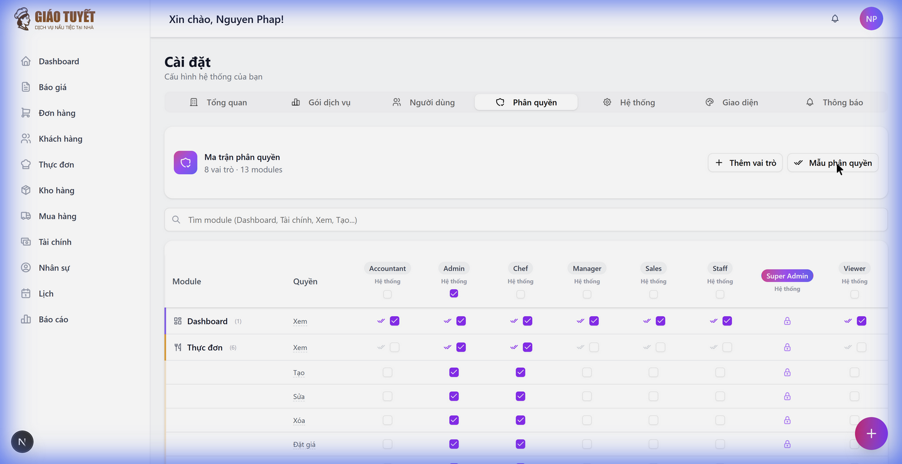
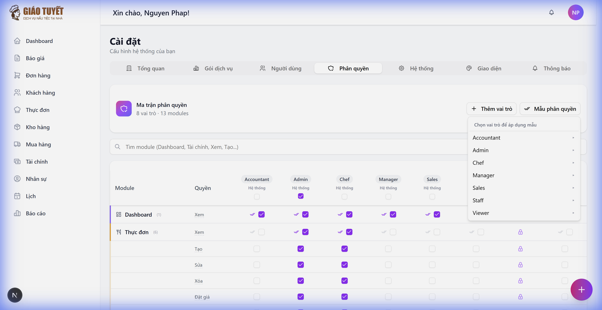

# Hướng Dẫn: Phân Quyền Module Nhân Sự (HR)

> **Phiên bản**: 2.0  
> **Ngày cập nhật**: 25/02/2026  
> **Module**: Nhân sự (HR)  
> **Loại**: Hướng dẫn quản trị viên

---

## 1. Giới Thiệu

### Mô tả
Module Nhân sự được bảo vệ bởi **hệ thống phân quyền 2 lớp**:

1. **Module-level**: Chỉ các role `super_admin`, `admin`, `manager`, `accountant` mới thấy và truy cập module HR
2. **Action-level**: Mỗi endpoint được kiểm tra quyền cụ thể — tổng cộng **15 hành động** (xem, tạo, sửa, xóa, duyệt, lương, nghỉ phép...)

### Ai sử dụng?
- **Super Admin**: Toàn quyền trên tất cả module
- **Admin**: Quản lý toàn bộ nhân sự, bao gồm tuyển dụng, lương, nghỉ phép
- **Manager**: Quản lý đội ngũ trực tiếp — chấm công, phân công, nghỉ phép (không xem lương)
- **Accountant**: Xem thông tin lương và xử lý bảng lương (không quản lý nhân sự)

### Tính năng mới (v2.0)
| Tính năng | Mô tả |
| :--- | :--- |
| ⚠️ **Cảnh báo SoD** | Tự động cảnh báo khi bật quyền xung đột (VD: tính lương + duyệt lương cùng role) |
| 📋 **Mẫu phân quyền** | Áp dụng nhanh bộ quyền có sẵn cho vai trò (Quản lý HR, Kế toán Lương, Trưởng ca) |
| 📝 **Chi tiết lưu thay đổi** | Khi lưu, hiển thị cụ thể: role nào thay đổi, +bao nhiêu/-bao nhiêu quyền |

---

## 2. Bảng Phân Quyền Chi Tiết

### 2.1 Nhân viên
| Hành động | super_admin | admin | manager | accountant |
| :--- | :---: | :---: | :---: | :---: |
| Xem danh sách nhân viên | ✅ | ✅ | ✅ | ✅ |
| Xem chi tiết nhân viên | ✅ | ✅ | ✅ | ❌ |
| Tạo nhân viên mới | ✅ | ✅ | ✅ | ❌ |
| Sửa thông tin nhân viên | ✅ | ✅ | ✅ | ❌ |
| Xóa nhân viên | ✅ | ✅ | ❌ | ❌ |
| Xem thông tin lương | ✅ | ✅ | ❌ | ✅ |

### 2.2 Chấm Công
| Hành động | super_admin | admin | manager | accountant |
| :--- | :---: | :---: | :---: | :---: |
| Xem chấm công | ✅ | ✅ | ✅ | ✅ |
| Check-in/Check-out | ✅ | ✅ | ✅ | ❌ |
| Duyệt chấm công | ✅ | ✅ | ✅ | ❌ |
| Từ chối chấm công | ✅ | ✅ | ✅ | ❌ |

### 2.3 Nghỉ Phép
| Hành động | super_admin | admin | manager | accountant |
| :--- | :---: | :---: | :---: | :---: |
| Xem nghỉ phép | ✅ | ✅ | ✅ | ❌ |
| Duyệt/Từ chối đơn | ✅ | ✅ | ✅ | ❌ |

### 2.4 Lương (Payroll)
| Hành động | super_admin | admin | manager | accountant |
| :--- | :---: | :---: | :---: | :---: |
| Xem bảng lương | ✅ | ✅ | ❌ | ✅ |
| Tính lương | ✅ | ✅ | ❌ | ❌ |
| Duyệt lương | ✅ | ✅ | ❌ | ❌ |
| Mở lại kỳ lương | ✅ | ✅ | ❌ | ❌ |

> [!WARNING]
> **Mở lại kỳ lương** là hành động rủi ro cao — sẽ xóa tất cả dữ liệu lương đã tính và bút toán tài chính liên quan. Có audit log ghi nhận mọi lần mở lại.

---

## 3. Self-Service (Nhân Viên Tự Phục Vụ)

Các chức năng sau **không cần quyền đặc biệt**, chỉ cần đăng nhập:

| Chức năng | Mô tả |
| :--- | :--- |
| Xem phiếu lương cá nhân | Nhân viên tự xem lương của mình |
| Xem số ngày nghỉ còn lại | Kiểm tra balance nghỉ phép |
| Xem đơn nghỉ phép cá nhân | Theo dõi trạng thái đơn |
| Hủy đơn nghỉ phép | Chỉ được hủy đơn ở trạng thái PENDING |
| Xem thông báo | Xem và đánh dấu đã đọc |

---

## 4. Cách Quản Lý Phân Quyền

### 4.1. Truy cập trang Phân quyền
1. Đăng nhập vào hệ thống
2. Vào **Cài đặt** từ menu bên trái
3. Chọn tab **Phân quyền**

---

### 4.2. Bật/Tắt quyền cho Role
1. Tìm module **Nhân sự** trong bảng (sử dụng thanh tìm kiếm nếu cần)
2. Tick/Untick checkbox cho từng quyền theo role
3. Nhấn nút **Lưu thay đổi** (gradient tím) để áp dụng

> [!TIP]
> Toast thông báo sẽ hiển thị chi tiết: vai trò nào thay đổi, +bao nhiêu/-bao nhiêu quyền

---

### 4.3. Sử dụng Mẫu Phân Quyền (Mới!)

Thay vì tick từng checkbox, bạn có thể áp dụng nhanh bộ quyền có sẵn:

1. Nhấn nút **✔✔ Mẫu phân quyền** ở góc phải header
2. Chọn **vai trò** muốn áp dụng mẫu
3. Chọn **mẫu** phù hợp:

| Mẫu | Mô tả | Quyền bao gồm |
| :--- | :--- | :--- |
| 👤 **Quản lý HR** | Quản lý nhân sự toàn bộ | Xem, Tạo, Sửa, Xóa, Chi tiết, Chấm công, Duyệt, Từ chối, Nghỉ phép |
| 💰 **Kế toán Lương** | Xử lý bảng lương | Xem, Xem lương, Xem bảng lương, Tính lương + Tài chính |
| 📋 **Trưởng ca** | Chấm công & phân công | Xem, Chi tiết, Chấm công, Duyệt, Từ chối, Nghỉ phép + Lịch |

> [!IMPORTANT]
> Mẫu sẽ **thay thế toàn bộ** quyền hiện tại của role. Hãy nhấn **Lưu** để áp dụng hoặc **Hoàn tác** để quay về trạng thái cũ.

---

### 4.4. Cảnh Báo Tách Biệt Nhiệm Vụ (SoD)

Hệ thống tự động cảnh báo khi bạn bật các quyền **xung đột** cho cùng một vai trò:

| Quyền A | Quyền B | Rủi ro |
| :--- | :--- | :--- |
| Tính lương | Duyệt lương | Một người vừa tính vừa duyệt → không có kiểm soát chéo |
| Tạo nhân viên | Duyệt lương | Một người vừa tạo nhân sự vừa duyệt lương → rủi ro gian lận |
| Đăng bút toán | Đảo bút toán | Một người vừa đăng vừa đảo → rủi ro gian lận tài chính |

> Khi bật quyền xung đột, toast cảnh báo màu vàng sẽ xuất hiện trong 5 giây. Đây là **cảnh báo** (warning), không phải chặn (block) — bạn vẫn có thể lưu nếu cần thiết.

---

## 5. Lưu Ý Quan Trọng

> [!WARNING]
> **Mở lại kỳ lương (reopen_payroll)** là hành động nhạy cảm nhất trong module HR. Chỉ cấp cho `super_admin` và `admin`. Mỗi lần mở lại đều được ghi vào **Audit Log** (có thể xem tại trang Lương → Log kiểm tra).

> [!TIP]
> **Mẹo bảo mật**: Sử dụng mẫu "Kế toán Lương" cho vai trò accountant — mẫu này đã thiết kế theo nguyên tắc **PoLP** (Principle of Least Privilege), chỉ cấp đúng quyền cần thiết.

---

## 6. Câu Hỏi Thường Gặp (FAQ)

### Q1: Vì sao accountant không thể tạo nhân viên?
**A**: Theo thiết kế bảo mật, kế toán chỉ cần xem thông tin lương và bảng lương. Việc quản lý nhân viên là trách nhiệm của manager và admin.

### Q2: Nhân viên bình thường có xem được HR không?
**A**: Nhân viên chỉ thấy các mục self-service (phiếu lương cá nhân, đơn nghỉ phép cá nhân). Họ không thể truy cập trang HR chính.

### Q3: Làm sao thêm quyền mới cho một role?
**A**: Vào **Cài đặt** > **Phân quyền** > Tìm module **Nhân sự** > Tick quyền mong muốn > **Lưu thay đổi**.

### Q4: Kế toán có thể duyệt lương không?
**A**: Không. Chỉ `super_admin` và `admin` có quyền duyệt lương. Kế toán chỉ được xem bảng lương — đây là thiết kế SoD để tách biệt nhiệm vụ.

### Q5: Tôi muốn nhanh chóng cấu hình quyền cho role mới — làm thế nào?
**A**: Sử dụng nút **Mẫu phân quyền** > chọn vai trò > chọn mẫu phù hợp (Quản lý HR, Kế toán Lương, hoặc Trưởng ca). Quyền sẽ tự động được tick, bạn chỉ cần nhấn **Lưu**.

### Q6: Cảnh báo SoD có nghĩa là tôi không được bật quyền đó?
**A**: Không. Cảnh báo SoD chỉ là **lời nhắc** rằng việc cấp cả 2 quyền cho cùng 1 role có thể gây rủi ro. Bạn vẫn có thể lưu nếu có lý do chính đáng.

---

## 7. Liên Hệ Hỗ Trợ

Nếu bạn gặp vấn đề, vui lòng liên hệ:
- **Email**: support@giaotuyetcatering.com

---

*Tài liệu này được tạo tự động bởi AI Workforce. Phiên bản 2.0 — cập nhật 25/02/2026.*
