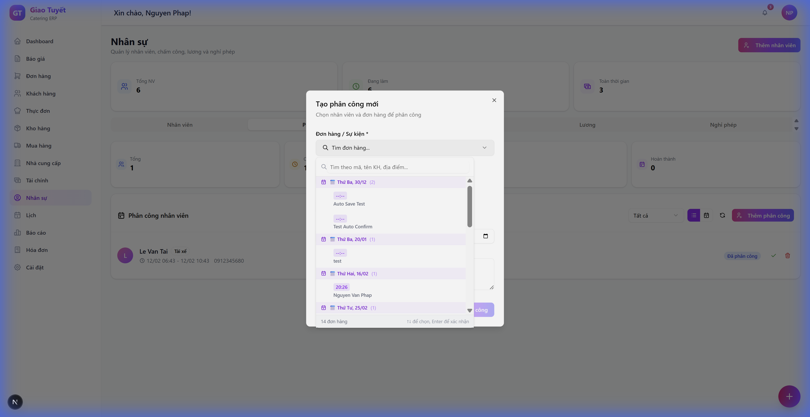
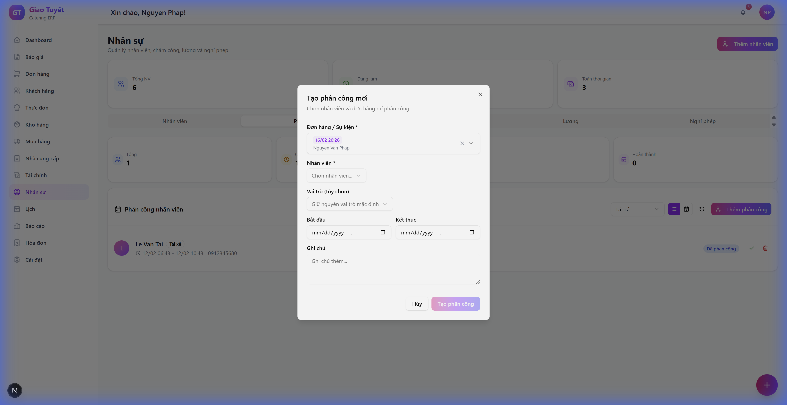

# Hướng dẫn: Phân công nhân viên cho đơn hàng

> **Ngày cập nhật**: 04/02/2026  
> **Module**: Nhân sự / Phân công
> **Version**: 3.0 - Searchable Combobox

---

## 1. Giới thiệu

Module **Phân công nhân viên** cho phép quản lý phân công nhân viên vào các đơn hàng/sự kiện. Phiên bản mới với **tìm kiếm thông minh**:
- ✨ Tìm kiếm theo mã đơn, tên khách hàng, địa điểm
- 📅 Nhóm đơn hàng theo ngày (Hôm nay, Ngày mai...)
- 🏷️ Hiển thị đầy đủ ngày/giờ/địa điểm

---

## 2. Truy cập

1. **Đăng nhập** vào hệ thống
2. Click **"Nhân sự"** ở sidebar bên trái
3. Chọn tab **"Phân công"**

---

## 3. Tạo phân công mới

### Bước 1: Mở form
Click nút **"Thêm phân công"** (nút tím gradient phía trên bên phải)

### Bước 2: Tìm và chọn đơn hàng

**Mở dropdown tìm kiếm:**

**Tìm kiếm nhanh theo từ khóa:**

**Đơn hàng đã chọn hiển thị:**

**Cách sử dụng:**
- Gõ từ khóa để tìm (tên khách hàng, mã đơn, địa điểm)
- Click vào đơn hàng để chọn
- Click **X** để xóa lựa chọn

### Bước 3: Chọn nhân viên
Chọn nhân viên từ dropdown (chỉ hiển thị nhân viên đang hoạt động)

### Bước 4: Điền thông tin
- **Vai trò**: Phục vụ, Đầu bếp, Tài xế...
- **Thời gian**: Bắt đầu - Kết thúc
- **Ghi chú** (tùy chọn)

### Bước 5: Lưu
Click **"Tạo phân công"**

---

## 4. FAQ

**Q: Làm sao tìm đơn hàng nhanh?**  
A: Gõ tên khách hoặc mã đơn vào ô tìm kiếm

**Q: Đơn hàng nào hiển thị trong dropdown?**  
A: Chỉ đơn hàng có trạng thái **CONFIRMED** trở lên

**Q: Ý nghĩa các header màu tím?**  
A: Nhóm đơn hàng theo ngày (📅 Hôm nay, 📅 Ngày mai, 📅 dd/MM)

---

## 5. Changelog

| Version | Ngày | Thay đổi |
| :--- | :--- | :--- |
| 3.0 | 04/02/2026 | Tìm kiếm thông minh (Searchable Combobox) |
| 2.0 | 04/02/2026 | Nhóm theo ngày + Rich display |
| 1.0 | - | Format cơ bản (mã + tên) |
