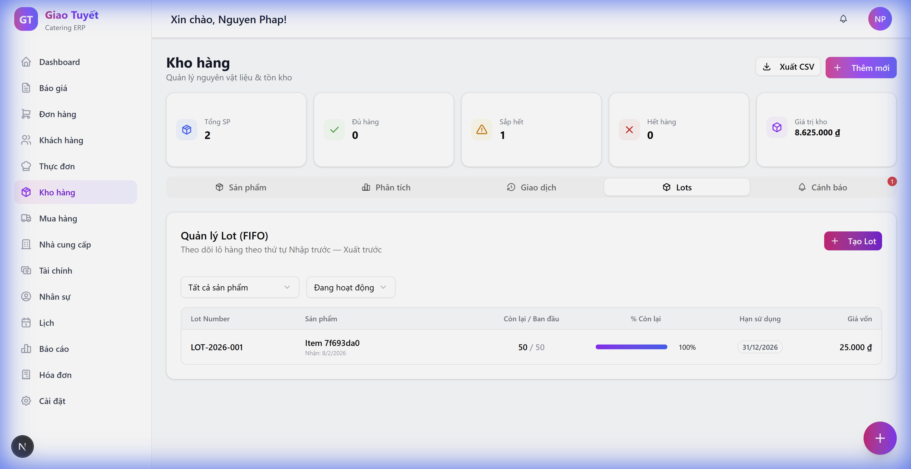
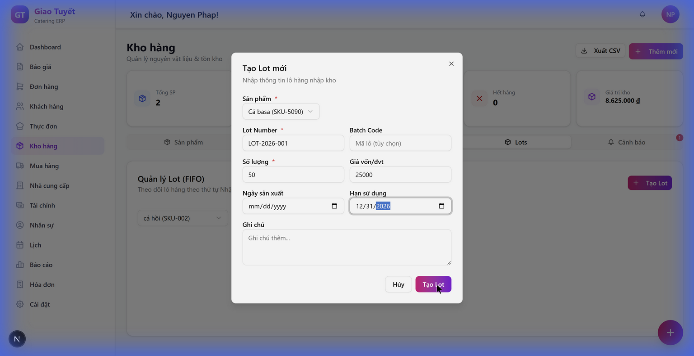
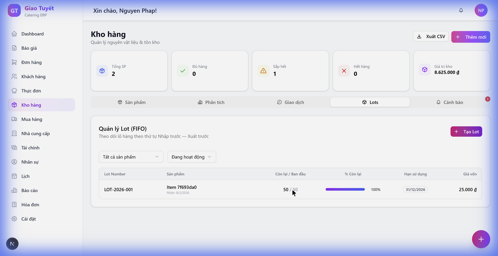

# Hướng dẫn sử dụng: Quản lý Lot & FIFO — Module Kho hàng

> **Phiên bản**: 1.0  
> **Ngày cập nhật**: 08/02/2026  
> **Module**: Kho hàng → Tab Lots

---

## 1. Giới thiệu

Tính năng **Quản lý Lot (FIFO)** cho phép bạn theo dõi từng lô hàng nhập kho theo nguyên tắc **"Nhập trước — Xuất trước" (First-In, First-Out)**. Điều này giúp:

- ✅ Kiểm soát hạn sử dụng nguyên vật liệu
- ✅ Tối ưu hóa việc xuất kho (ưu tiên hàng cũ trước)
- ✅ Truy xuất nguồn gốc từng lô hàng
- ✅ Tính giá vốn chính xác theo lô

---

## 2. Truy cập

1. Từ menu bên trái, chọn **Kho hàng**
2. Click vào tab **Lots** trên thanh tab

---

## 3. Chức năng chính

### 3.1. Xem danh sách Lot

Bảng danh sách hiển thị các thông tin:

| Cột | Mô tả |
|---|---|
| **Lot Number** | Mã lô hàng (dạng font mono) |
| **Sản phẩm** | Tên nguyên vật liệu + ngày nhận |
| **Còn lại / Ban đầu** | Số lượng còn lại so với ban đầu |
| **% Còn lại** | Thanh progress bar trực quan |
| **Hạn sử dụng** | Badge hiển thị: xanh (còn hạn), vàng (sắp hết), đỏ (hết hạn) |
| **Giá vốn** | Đơn giá nhập kho/đơn vị tính |

### 3.2. Lọc Lot

Sử dụng 2 bộ lọc phía trên bảng:

- **Lọc theo sản phẩm**: Chọn nguyên vật liệu cụ thể hoặc "Tất cả sản phẩm"
- **Lọc theo trạng thái**: 
  - `Đang hoạt động` — Lot còn hàng
  - `Đã hết` — Lot đã xuất hết
  - `Hết hạn` — Lot đã quá hạn sử dụng

---

### 3.3. Tạo Lot mới

1. Nhấn nút **+ Tạo Lot** (góc phải trên)
2. Điền thông tin trong dialog:

| Trường | Bắt buộc | Mô tả |
|---|:---:|---|
| Sản phẩm | ✅ | Chọn nguyên vật liệu từ dropdown |
| Lot Number | ✅ | Mã lô (VD: LOT-2026-001) |
| Batch Code | — | Mã lô sản xuất (tùy chọn) |
| Số lượng | ✅ | Số lượng nhập kho |
| Giá vốn/đvt | — | Đơn giá nhập |
| Ngày sản xuất | — | Ngày sản xuất của lô |
| Hạn sử dụng | — | Ngày hết hạn |
| Ghi chú | — | Thông tin bổ sung |

3. Nhấn **Tạo Lot** để hoàn tất

> **💡 Mẹo**: Lot Number nên theo quy tắc đặt tên thống nhất, ví dụ: `LOT-{năm}-{số thứ tự}`

---

### 3.4. Xem đề xuất FIFO

Khi bạn click vào một lot trong bảng, hệ thống sẽ hiển thị **Panel Đề xuất FIFO** phía dưới:

1. **Thông tin tổng quan**: Tổng số lượng khả dụng và số lượng lot
2. **Nhập số lượng cần xuất**: Gõ số lượng vào ô "Số lượng cần xuất"
3. **Xem phân bổ FIFO**: Hệ thống tự động tính toán:
   - Xuất từ lot nào (theo thứ tự FIFO)
   - Mỗi lot lấy bao nhiêu
   - Badge xanh "Đủ hàng ✓" hoặc đỏ "Thiếu X" nếu không đủ

> **📌 Lưu ý**: FIFO ưu tiên lot nhập sớm nhất, giúp giảm thiểu hàng tồn quá hạn.

---

## 4. Câu hỏi thường gặp (FAQ)

### Q: Lot khác gì với giao dịch kho?
**A:** Giao dịch kho ghi nhận mỗi lần nhập/xuất. Lot là một "lô hàng" cụ thể, có thể được xuất nhiều lần qua nhiều giao dịch. Lot giúp truy xuất nguồn gốc và quản lý hạn sử dụng.

### Q: FIFO hoạt động như thế nào?
**A:** Khi cần xuất một số lượng, hệ thống tự động ưu tiên lấy từ lot nhập sớm nhất. Nếu lot đó không đủ, sẽ lấy thêm từ lot kế tiếp.

### Q: Lot có tự động được tạo khi nhập kho không?
**A:** Hiện tại cần tạo Lot thủ công qua nút "Tạo Lot". Trong tương lai sẽ tích hợp tự động tạo lot khi nhập kho từ module Mua hàng.

### Q: Làm sao biết lot nào sắp hết hạn?
**A:** Trong bảng Lots, các lot sắp hết hạn (≤7 ngày) được đánh dấu badge vàng, và lot đã hết hạn badge đỏ. Ngoài ra tab "Cảnh báo" cũng hiển thị thông tin lot sắp hết hạn.

### Q: Có thể xóa hoặc sửa Lot không?
**A:** Hiện tại chưa hỗ trợ xóa/sửa Lot trực tiếp để đảm bảo tính toàn vẹn dữ liệu. Liên hệ quản trị viên nếu cần điều chỉnh.

---

## 5. Hỗ trợ

Nếu gặp vấn đề, vui lòng liên hệ quản trị viên hệ thống.
