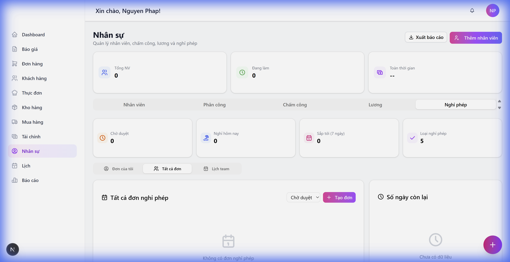
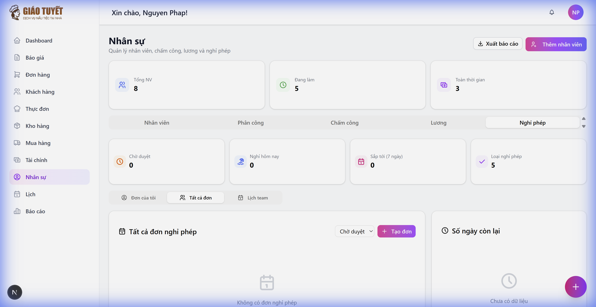
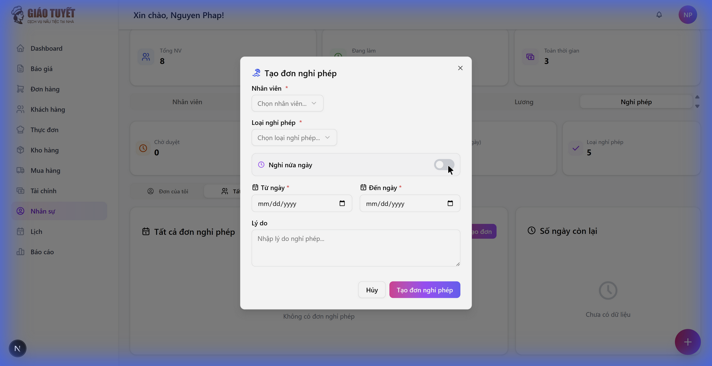

# Hướng Dẫn Sử Dụng: Nghỉ Phép — Phase 2

> **Phiên bản**: 2.0  
> **Ngày cập nhật**: 22/02/2026  
> **Ngôn ngữ**: Tiếng Việt

---

## 1. Giới Thiệu

### Mô tả
Phase 2 của module Nghỉ Phép bổ sung 3 tính năng mới:
- **Lịch Team**: Xem tổng quan lịch nghỉ của toàn bộ nhân viên theo tháng
- **Kiểm tra trùng lịch**: Tự động cảnh báo khi đơn nghỉ bị trùng với đơn đã có
- **Tích hợp ngày lễ**: Ngày lễ được tự động trừ khỏi tổng số ngày nghỉ

### Ai sử dụng?
- **HR Admin**: Xem lịch team, quản lý đơn nghỉ, xem thống kê toàn bộ
- **Nhân viên**: Tạo đơn nghỉ phép với cảnh báo trùng lịch tự động

---

## 2. Hướng Dẫn Sử Dụng

### 2.1. Truy cập module
1. Đăng nhập vào hệ thống
2. Từ menu bên trái, chọn **Nhân sự**
3. Chọn tab **Nghỉ phép** (tab cuối cùng)
4. Bạn sẽ thấy thanh chuyển đổi 3 tab: **Đơn của tôi** | **Tất cả đơn** | **Lịch team**

---

### 2.2. Lịch Team (Team Calendar)

Tính năng Lịch Team cho phép xem tổng quan lịch nghỉ phép của toàn bộ nhân viên theo tháng.

**Bước 1**: Nhấn vào tab **Lịch team** trên thanh chuyển đổi

**Bước 2**: Xem lịch tháng hiện tại. Mỗi nhân viên có một màu riêng hiển thị dưới dạng chấm tròn vào các ngày nghỉ

**Bước 3**: Di chuột vào chấm tròn nhân viên để xem chi tiết:
- Loại nghỉ phép
- Trạng thái (Đã duyệt / Chờ duyệt)
- Nghỉ nửa ngày (sáng/chiều) nếu có

**Bước 4**: Sử dụng nút **◀ ▶** để chuyển tháng, hoặc nhấn **Hôm nay** để quay về tháng hiện tại

**Chú thích**:
- 🔴 Ngày lễ: hiển thị với dải đỏ phía trên
- ⏳ Đơn chờ duyệt: chấm tròn có viền nét đứt
- Bảng chú thích (Legend) ở cuối hiển thị khi nhiều nhân viên

---

### 2.3. Kiểm Tra Trùng Lịch (Overlap Detection)

Khi tạo đơn nghỉ phép mới, hệ thống tự động kiểm tra và cảnh báo nếu có đơn nghỉ trùng lịch.

**Bước 1**: Nhấn nút **+ Tạo đơn** để mở form tạo đơn nghỉ phép

**Bước 2**: Chọn **Nhân viên** và **Loại nghỉ phép**

**Bước 3**: Chọn **Ngày bắt đầu** và **Ngày kết thúc**

**Bước 4**: Nếu có trùng lịch, hệ thống sẽ hiển thị **cảnh báo vàng** phía dưới ô "Số ngày nghỉ", bao gồm:
- Danh sách đơn nghỉ bị trùng
- Loại nghỉ phép, ngày, số ngày, và trạng thái của đơn trùng

> [!NOTE]  
> Cảnh báo trùng lịch chỉ mang tính **tham khảo (advisory)**. Bạn vẫn có thể tạo đơn nếu cần. Hệ thống không chặn việc tạo đơn trùng lịch.

---

### 2.4. Tích Hợp Ngày Lễ (Holiday Integration)

Khi tạo đơn nghỉ phép **nhiều ngày** (không phải nửa ngày), hệ thống tự động:
- Trừ **thứ 7 và Chủ nhật** khỏi tổng số ngày nghỉ
- Trừ **ngày lễ chính thức** (Tết Nguyên Đán, 30/4, 1/5, 2/9, v.v.)

**Ví dụ**: Nghỉ từ thứ 2 đến thứ 6, nhưng trong tuần đó có 1 ngày lễ → Tổng chỉ tính 4 ngày thay vì 5.

---

## 3. Lưu Ý Quan Trọng

> [!WARNING]
> Cảnh báo trùng lịch chỉ kiểm tra đơn nghỉ có trạng thái **Đã duyệt** hoặc **Chờ duyệt**. Đơn đã bị từ chối không được tính.

> [!TIP]
> Sử dụng **Lịch team** trước khi tạo đơn nghỉ để xem nhanh ai đang nghỉ, tránh trùng lịch với đồng nghiệp.

---

## 4. Câu Hỏi Thường Gặp (FAQ)

### Q1: Tôi không thấy tab "Lịch team"?
**A**: Tab "Lịch team" chỉ hiển thị cho **HR Admin**. Nhân viên thường chỉ thấy tab "Đơn của tôi".

### Q2: Cảnh báo trùng lịch có chặn tạo đơn không?
**A**: Không. Cảnh báo chỉ mang tính tham khảo. Bạn vẫn có thể tạo đơn nghỉ nếu cần thiết.

### Q3: Ngày lễ được lấy từ đâu?
**A**: Ngày lễ được quản lý trong bảng `vietnam_holidays` trong hệ thống. Liên hệ admin để cập nhật nếu có thay đổi.

### Q4: Chấm tròn trên lịch team có ý nghĩa gì?
**A**: Mỗi nhân viên có một màu riêng. Chấm tròn đặc = đã duyệt. Chấm có viền nét đứt = đang chờ duyệt. Di chuột vào để xem chi tiết.

---

## 5. Liên Hệ Hỗ Trợ

Nếu bạn gặp vấn đề, vui lòng liên hệ:
- **Email**: support@giaotuyet.vn
- **Hotline**: 1900-xxxx

---

*Tài liệu này được tạo tự động bởi AI Workforce — 22/02/2026*
