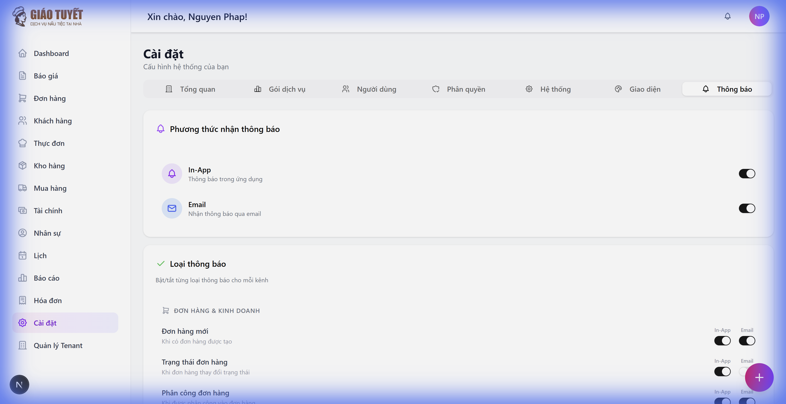
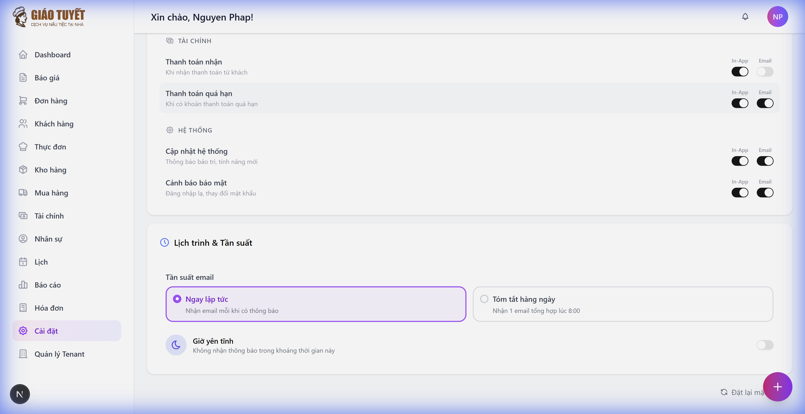
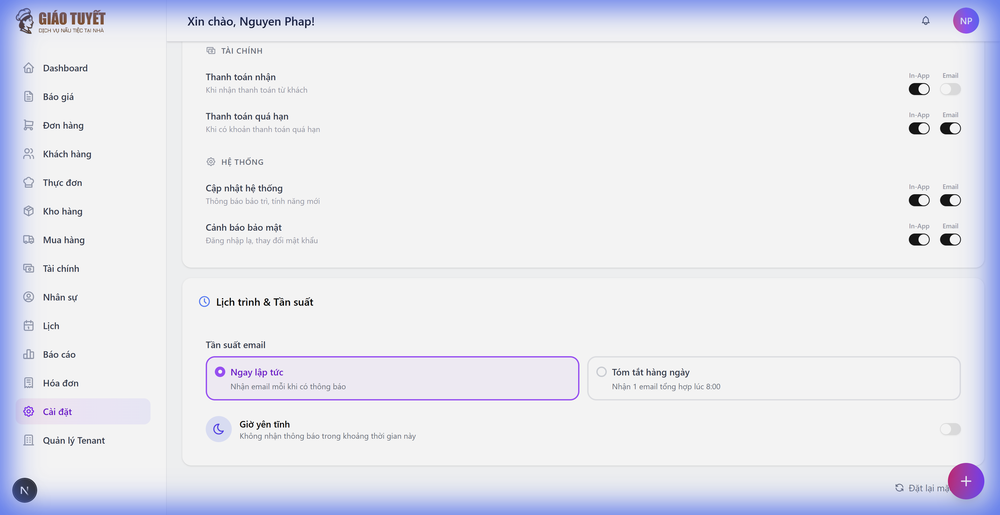

# 📢 Hướng dẫn Cài đặt Thông báo

> **Module**: Cài đặt > Tab Thông báo
> **Cập nhật**: 11/02/2026
> **Dành cho**: Tất cả người dùng

---

## 1. Giới thiệu

Tab **Thông báo** trong phần Cài đặt cho phép bạn tùy chỉnh cách nhận thông báo từ hệ thống. Bạn có thể:

- **Bật/tắt kênh thông báo** (In-App, Email)
- **Tùy chỉnh từng loại thông báo** theo danh mục (Đơn hàng, Kho hàng, Nhân sự, Tài chính, Hệ thống)
- **Cài đặt tần suất email** (Ngay lập tức hoặc Tóm tắt hàng ngày)
- **Thiết lập "Giờ yên tĩnh"** để tạm dừng thông báo vào ban đêm
- **Đặt lại mặc định** khi cần

---

## 2. Truy cập

1. Nhấn **Cài đặt** ở sidebar bên trái
2. Chọn tab **Thông báo** ở thanh tab phía trên

---

## 3. Hướng dẫn sử dụng

### 3.1 Phương thức nhận thông báo

Ở phần đầu tiên, bạn sẽ thấy 2 kênh thông báo:

| Kênh | Mô tả |
|:-----|:-------|
| **In-App** | Thông báo hiển thị trực tiếp trong ứng dụng (biểu tượng 🔔) |
| **Email** | Thông báo gửi qua email đến địa chỉ đăng nhập |

- **Bật/tắt**: Nhấn nút gạt bên phải mỗi kênh
- Khi tắt một kênh → tất cả thông báo qua kênh đó sẽ bị tạm dừng

### 3.2 Tùy chỉnh theo danh mục

Hệ thống phân chia thông báo thành 5 nhóm:

| Nhóm | Các loại thông báo |
|:-----|:-------------------|
| **Đơn hàng & Kinh doanh** | Đơn hàng mới, Cập nhật trạng thái, Phân công nhân viên |
| **Kho hàng** | Hàng tồn kho thấp, Nhập hàng |
| **Nhân sự** | Đơn nghỉ phép, Ca làm việc, Bảng lương |
| **Tài chính** | Thanh toán nhận, Thanh toán quá hạn |
| **Hệ thống** | Cập nhật hệ thống, Cảnh báo bảo mật |

Mỗi loại thông báo có 2 nút toggle riêng cho **In-App** và **Email**:
- **Bật**: Nhận thông báo qua kênh đó
- **Tắt**: Không nhận thông báo qua kênh đó

> **Lưu ý**: Nếu bạn tắt kênh chung (ví dụ tắt Email ở phần 3.1), tất cả toggle Email ở phần này sẽ bị vô hiệu hóa (màu mờ).

### 3.3 Lịch trình & Tần suất

#### Tần suất email
- **Ngay lập tức**: Nhận email ngay khi có thông báo mới
- **Tóm tắt hàng ngày**: Nhận 1 email tổng hợp mỗi ngày lúc 8:00 sáng

#### Giờ yên tĩnh
Bật tính năng này để **tạm dừng thông báo** trong khoảng thời gian nhất định (ví dụ: 22:00 - 07:00).

- Nhập giờ bắt đầu và kết thúc
- Trong khung giờ yên tĩnh, chỉ **thông báo bảo mật quan trọng** mới được gửi

### 3.4 Đặt lại mặc định

Nhấn nút **"Đặt lại mặc định"** ở góc dưới phải để khôi phục tất cả cài đặt thông báo về trạng thái ban đầu.

> ⚠️ Thao tác này sẽ đặt lại **toàn bộ** preferences về mặc định. Không thể hoàn tác.

---

## 4. FAQ (Câu hỏi thường gặp)

### Q: Tôi tắt Email nhưng vẫn nhận được email?
**A**: Kiểm tra xem bạn đã tắt kênh Email ở phần "Phương thức nhận thông báo" (toggle chính) chưa. Nếu chỉ tắt từng loại, các loại khác vẫn gửi email.

### Q: Giờ yên tĩnh có chặn hoàn toàn không?
**A**: Không. Các thông báo **bảo mật quan trọng** (ví dụ: cảnh báo đăng nhập lạ) vẫn được gửi ngay cả trong giờ yên tĩnh.

### Q: Tôi muốn nhận tất cả thông báo, làm sao?
**A**: Nhấn **"Đặt lại mặc định"** — hệ thống sẽ bật tất cả thông báo về trạng thái mặc định.

### Q: Thay đổi có lưu tự động không?
**A**: Có. Mỗi khi bạn bật/tắt một toggle, thay đổi được lưu ngay lập tức. Bạn không cần nhấn nút "Lưu".

---

## 5. Ghi chú kỹ thuật

- Thay đổi được lưu **tức thì** (optimistic update) — UI cập nhật ngay, rollback nếu lỗi
- Giờ yên tĩnh hỗ trợ **khung giờ qua đêm** (ví dụ: 22:00 → 07:00)
- Mỗi tenant có preferences riêng biệt (multi-tenant safe)
