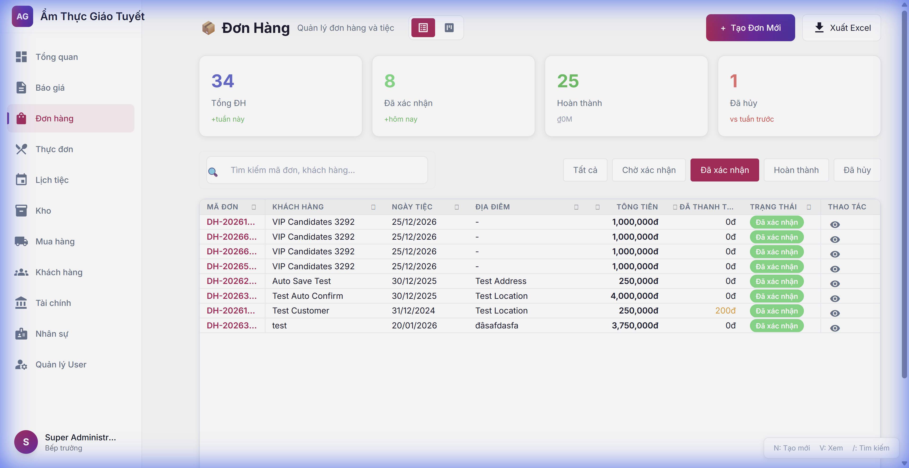

# Hướng Dẫn Sử Dụng Module Đơn Hàng

> **Ngày cập nhật:** 23/01/2026  
> **Module:** Đơn Hàng (Orders)  
> **URL:** http://localhost:4500/orders

---

## 1. Giới Thiệu

Module Đơn Hàng cho phép quản lý toàn bộ đơn hàng và tiệc của công ty.

### Chức năng chính:
- Xem danh sách đơn hàng
- Tạo đơn hàng mới
- Theo dõi trạng thái đơn hàng
- Lọc theo trạng thái
- Xuất Excel (đang phát triển)

---

## 2. Giao Diện Chính

### 2.1 Các thành phần giao diện

| Thành phần | Mô tả |
|------------|-------|
| **KPI Cards** | Hiển thị thống kê: Tổng ĐH, Đã xác nhận, Hoàn thành, Đã hủy |
| **Search Box** | Tìm kiếm theo mã đơn hoặc tên khách hàng |
| **Filter Tabs** | Lọc theo trạng thái đơn hàng |
| **Bảng dữ liệu** | Danh sách đơn hàng với phân trang |
| **View Switcher** | Chuyển đổi giữa chế độ Danh sách và Kanban |

---

## 3. Hướng Dẫn Sử Dụng

### 3.1 Xem danh sách đơn hàng
1. Vào menu **Đơn hàng** ở sidebar
2. Bảng dữ liệu hiển thị tất cả đơn hàng
3. Click vào dòng để xem chi tiết

### 3.2 Lọc đơn hàng theo trạng thái
1. Click vào tab trạng thái mong muốn (VD: "Đã xác nhận")
2. Bảng sẽ tự động lọc và hiển thị đơn hàng theo trạng thái đã chọn

### 3.3 Tạo đơn hàng mới
1. Click nút **+ Tạo Đơn Mới** (góc phải trên)
2. Điền thông tin đơn hàng
3. Lưu đơn hàng

### 3.4 Phím tắt

| Phím | Chức năng |
|------|-----------|
| `N` | Tạo đơn mới |
| `V` | Xem đơn đầu tiên |
| `/` | Focus vào ô tìm kiếm |

---

## 4. Trạng Thái Đơn Hàng

| Trạng thái | Màu | Mô tả |
|------------|-----|-------|
| Chờ xác nhận | 🟡 Vàng | Đơn mới tạo, chờ xác nhận |
| Đã xác nhận | 🟢 Xanh lá | Đơn đã được duyệt |
| Hoàn thành | 🔵 Xanh dương | Tiệc đã hoàn thành |
| Đã hủy | 🔴 Đỏ | Đơn đã bị hủy |

---

## 5. FAQ

**Q: Làm sao để tìm đơn hàng cũ?**  
A: Sử dụng ô tìm kiếm, nhập mã đơn hoặc tên khách hàng.

**Q: Có thể xem đơn hàng dạng Kanban không?**  
A: Có, click vào icon Kanban ở góc phải header.

**Q: Làm sao xuất danh sách đơn hàng?**  
A: Click nút "Xuất Excel" (chức năng đang phát triển).
