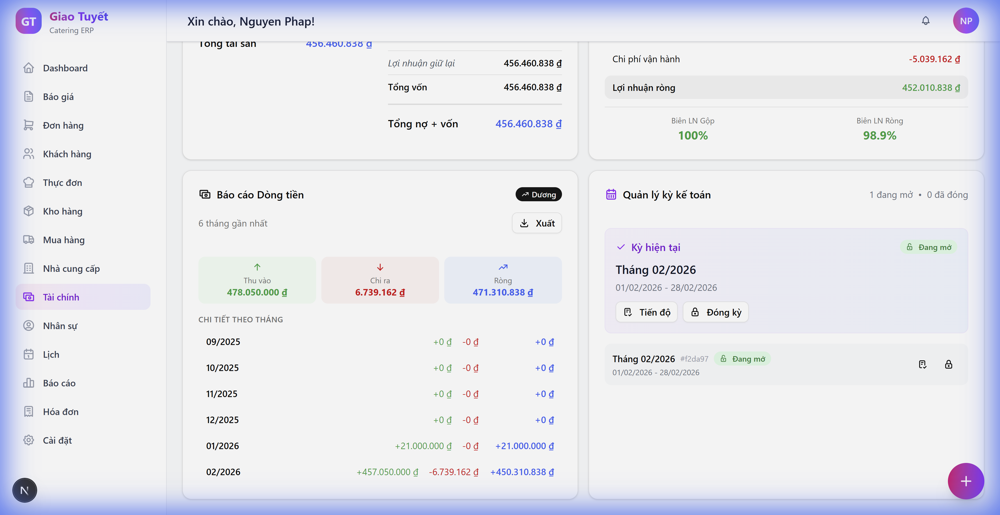
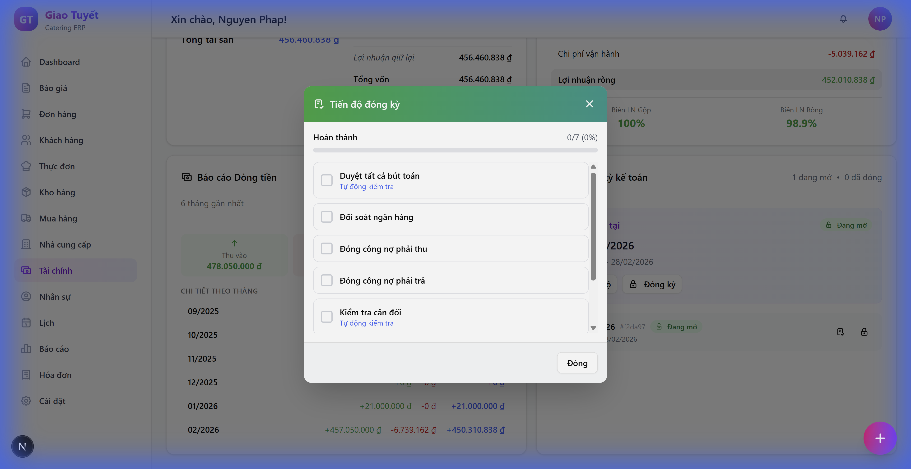

# Hướng Dẫn Sử Dụng: Quản Lý Kỳ Kế Toán

> **Phiên bản**: 1.0  
> **Ngày cập nhật**: 06/02/2026  
> **Ngôn ngữ**: Tiếng Việt

---

## 1. Giới Thiệu

### Mô tả
Module **Quản lý Kỳ Kế toán** cho phép theo dõi và quản lý các kỳ kế toán (tháng/quý/năm) với quy trình đóng kỳ chuyên nghiệp theo tiêu chuẩn ngành. Tính năng chính bao gồm:
- Checklist tiến độ đóng kỳ
- Kiểm tra validation trước khi đóng
- Yêu cầu lý do khi mở lại kỳ đã đóng
- Lưu vết kiểm toán (Audit Trail)

### Ai sử dụng?
- **Kế toán trưởng**: Quyền đóng/mở kỳ kế toán
- **Kế toán viên**: Xem tiến độ và thực hiện checklist items

---

## 2. Hướng Dẫn Sử Dụng

### 2.1. Truy cập module
1. Đăng nhập vào hệ thống
2. Từ menu bên trái, chọn **Tài chính**
3. Chọn tab **Báo cáo**
4. Cuộn xuống phần **Quản lý kỳ kế toán**

---

### 2.2. Xem Tiến độ Đóng Kỳ

Mỗi kỳ kế toán có checklist 7 bước cần hoàn thành trước khi đóng kỳ.

**Bước 1**: Tìm kỳ kế toán với trạng thái **Đang mở** (badge màu xanh)

**Bước 2**: Click nút **📋 Tiến độ** (icon checklist) bên phải kỳ

**Bước 3**: Modal "Tiến độ đóng kỳ" sẽ hiển thị với:
- Progress bar hiển thị phần trăm hoàn thành
- Danh sách 7 checklist items

**Bước 4**: Click vào từng item để đánh dấu hoàn thành

> [!TIP]  
> Các item có nhãn **"Tự động kiểm tra"** (màu tím) sẽ được hệ thống tự động verify khi đóng kỳ.

---

### 2.3. Đóng Kỳ Kế Toán

**Bước 1**: Hoàn thành tất cả manual items trong checklist

**Bước 2**: Click nút **🔒 Đóng kỳ** (icon khóa)

**Bước 3**: Hệ thống sẽ hiển thị modal **Kiểm tra trước khi đóng kỳ** với các validation:
- ✅ Tất cả bút toán đã duyệt
- ✅ Đối soát ngân hàng hoàn tất
- ✅ Công nợ phải thu/phải trả đã đóng
- ✅ Cân đối kế toán cân bằng

**Bước 4**: Nếu tất cả checks PASS → Click **Đóng kỳ**

> [!WARNING]  
> Nếu có item FAIL (màu đỏ, nhãn "Lỗi"), bạn **không thể** đóng kỳ cho đến khi sửa xong.

---

### 2.4. Mở Lại Kỳ Đã Đóng

Trong trường hợp cần điều chỉnh bút toán sau khi đã đóng kỳ:

**Bước 1**: Tìm kỳ có trạng thái **Đã đóng** (badge màu xám)

**Bước 2**: Click nút **🔓 Mở lại** (icon mở khóa)

**Bước 3**: Nhập **lý do mở lại** (bắt buộc) để lưu vào lịch sử kiểm toán

**Bước 4**: Click **Mở lại kỳ**

> [!CAUTION]  
> Mọi hành động mở lại kỳ sẽ được ghi lại trong Audit Log với timestamp và tên người thực hiện.

---

## 3. Lưu Ý Quan Trọng

> [!WARNING]  
> **Không nên** mở lại kỳ đã đóng trừ khi thật sự cần thiết. Mỗi lần mở lại đều được ghi vào lịch sử kiểm toán và sẽ được kiểm tra khi audit.

> [!TIP]  
> Thực hiện các bước đối soát và kiểm tra **liên tục trong tháng**, không nên để dồn đến cuối kỳ. Điều này giúp đóng kỳ nhanh hơn và giảm lỗi.

---

## 4. Câu Hỏi Thường Gặp (FAQ)

### Q1: Tại sao tôi không thể đóng kỳ?
**A**: Kiểm tra modal "Kiểm tra trước khi đóng kỳ". Nếu có item màu đỏ (FAIL), bạn cần sửa các vấn đề được liệt kê trước.

### Q2: Checklist items có nghĩa gì?
**A**: Đây là danh sách các bước chuẩn cần hoàn thành theo quy trình đóng kỳ kế toán. Các item "Tự động kiểm tra" sẽ được hệ thống verify, còn lại cần bạn tự đánh dấu.

### Q3: Tôi quên lý do mở lại kỳ thì sao?
**A**: Bạn có thể xem lại lịch sử trong phần Audit Log của kỳ đó (chức năng sẽ được cập nhật).

### Q4: Có thể đóng nhiều kỳ cùng lúc không?
**A**: Không. Mỗi kỳ cần được đóng tuần tự từ cũ đến mới để đảm bảo tính toàn vẹn số liệu.

---

## 5. Liên Hệ Hỗ Trợ

Nếu bạn gặp vấn đề, vui lòng liên hệ:
- **Email**: support@giaotuyetcatering.com
- **Hotline**: 1900-8080

---

*Tài liệu này được tạo tự động bởi AI Workforce.*
